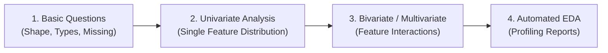
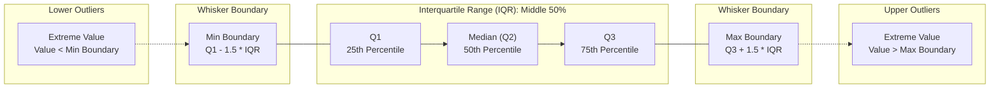
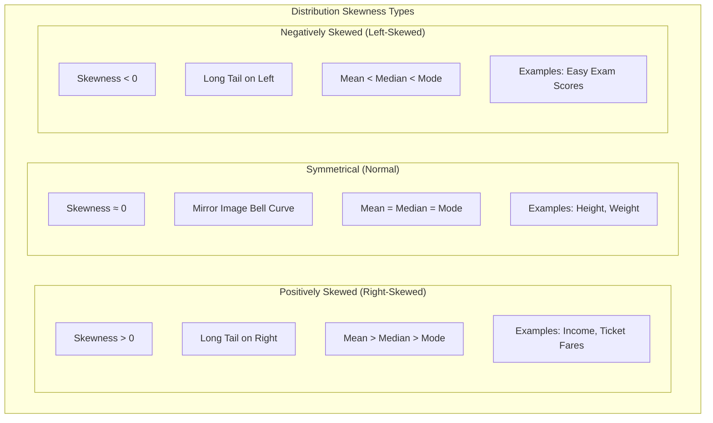

*Inspired by:* [YouTube](https://www.youtube.com/watch?v=4HyTlbHUKSw)

In the previous post, we covered the foundational questions you must ask whenever you receive a new dataset to inspect its size, data types, missing values, duplicates, and correlation. Once you have established this high-level baseline, the next logical phase in Exploratory Data Analysis (EDA) is to dive deep into individual variables. This phase is called **Univariate Data Analysis**.

To maintain a structured workflow, recall our four-step data understanding framework:



1. **Asking Basic Questions**: Inspecting dataset metadata, shape, data types, and initial sample records.
2. **Univariate Data Analysis** (This post): Analyzing the distribution, central tendency, spread, and frequency of every feature independently.
3. **Bivariate and Multivariate Data Analysis**: Exploring relationships, dependencies, and interactions across multiple features simultaneously.
4. **Automated EDA**: Generating comprehensive profiling reports using automated tools.

---

## What is Univariate Data Analysis?

The term **Univariate** originates from two words:
* **Uni**: Meaning single.
* **Variate**: Meaning variable or feature column.

Univariate analysis is the process of inspecting each feature in your dataset independently. You ignore relationships between columns for a moment and focus entirely on understanding one variable at a time: its range, most frequent values, distribution shape, presence of outliers, and potential data quality anomalies.

Before generating any visualization or statistical summary, you must answer one fundamental question for each column: **What is the nature of this data type?**

---

## Identifying Data Types: Categorical vs. Numerical

Data features broadly fall into two main categories:

### 1. Categorical Data
Categorical data consists of discrete values representing groups, categories, or labels. 
* **Examples**: Gender, passenger class, nationality, payment status, embarked port, or survival indicator (0 or 1).
* **Goal of Univariate Analysis**: Determine the frequency count and percentage proportion of each category.

### 2. Numerical Data
Numerical data consists of quantitative measurement values (continuous or discrete numbers).
* **Examples**: Age, salary, ticket fare, height, weight, or battery capacity.
* **Goal of Univariate Analysis**: Determine data distribution, range (min/max), central measures (mean/median), dispersion (variance/standard deviation), skewness, and outliers.

---

## Analyzing Categorical Features

When examining categorical columns, visual charts provide an immediate understanding of class balances and frequencies.

### 1. Frequency Count Plot (`sns.countplot`)
A **Count Plot** displays the total number of occurrences (frequency) for each unique category in a column.

```python
import seaborn as sns
import matplotlib.pyplot as plt

# Visualizing frequency counts of a categorical feature
sns.countplot(x=df['Survived'])
plt.title("Distribution of Survival Status")
plt.xlabel("Survived (0 = No, 1 = Yes)")
plt.ylabel("Count")
plt.show()
```

<MdxImage src="/images/ch12-countplot-survived.png" alt="Count plot of the Survived column showing counts of 0 and 1" className="w-full h-auto" />

If you analyze passenger classes or embarkation ports, `sns.countplot` highlights majority and minority classes immediately:

```python
# Frequency count across passenger classes
sns.countplot(x=df['Pclass'])
plt.show()
```

<MdxImage src="/images/ch12-countplot-pclass.png" alt="Count plot of the Pclass column showing passenger counts per class" className="w-full h-auto" />

### 2. Tabular Value Counts (`df['col'].value_counts()`)
If you want exact numerical totals instead of a chart, Pandas provides the `.value_counts()` method:

```python
# Output frequency table
df['Survived'].value_counts()
```

You can also plot a bar chart directly from Pandas:

```python
df['Pclass'].value_counts().plot(kind='bar')
plt.title("Passenger Count per Class")
plt.xlabel("Class")
plt.ylabel("Frequency")
plt.show()
```

<MdxImage src="/images/ch12-valuecounts-bar-pclass.png" alt="Bar chart of passenger count per class generated from value_counts" className="w-full h-auto" />

### 3. Proportional Distribution with Pie Charts (`kind='pie'`)
While bar charts excel at showing raw counts, **Pie Charts** are effective for displaying proportional percentages of a categorical feature relative to the whole dataset.

```python
# Pie chart with exact percentage annotations
df['Survived'].value_counts().plot(
    kind='pie', 
    autopct='%.2f%%', 
    labels=['Died', 'Survived'],
    colors=['#ff9999', '#66b3ff']
)
plt.title("Survival Percentage Breakdown")
plt.ylabel("") # Remove default ylabel
plt.show()
```

<MdxImage src="/images/ch12-piechart-survived.png" alt="Pie chart showing the percentage breakdown of survived versus died passengers" className="w-full h-auto" />

Pie charts work best when the number of unique categories is small (for example, binary flags or top 3 to 5 categories). If a column contains dozens of distinct categories, a bar chart or horizontal count plot is far easier to read.

---

## Analyzing Numerical Features

Numerical features contain continuous variation, which requires specialized statistical tools to analyze spread and distribution shapes.

### 1. Histograms (`plt.hist` / `sns.histplot`)
A **Histogram** groups continuous numerical data into non-overlapping intervals called **bins** and counts how many data points fall into each bin.

```python
# Plotting a basic histogram for Age distribution
plt.hist(df['Age'], bins=20, edgecolor='black')
plt.title("Age Distribution Histogram")
plt.xlabel("Age")
plt.ylabel("Frequency")
plt.show()
```

<MdxImage src="/images/ch12-histogram-age.png" alt="Histogram of the Age column with 20 bins" className="w-full h-auto" />

#### The Impact of Bin Selection
The `bins` parameter controls the resolution of your histogram:
* **Too Few Bins (e.g., `bins=5`)**: Over-aggregates the data, hiding underlying distribution spikes or bimodal patterns.
* **Too Many Bins (e.g., `bins=80`)**: Creates noisy, jagged bars where individual sample fluctuations obscure the general trend.

Adjusting `bins` allows you to balance detail with smooth visualization of data density.

### 2. Distribution Plot & Probability Density Function (`sns.distplot` / `sns.kdeplot`)
While histograms rely on discrete bar intervals, a **Kernel Density Estimation (KDE)** plot overlays a smooth continuous curve over the histogram.

```python
# Distribution plot combining histogram and KDE curve
sns.histplot(df['Age'], kde=True)
plt.title("Age Distribution with KDE Curve")
plt.xlabel("Age")
plt.ylabel("Density")
plt.show()
```

<MdxImage src="/images/ch12-kde-age.png" alt="Histogram of Age overlaid with a smooth KDE curve" className="w-full h-auto" />

#### Understanding the Probability Density Function (PDF)
The KDE curve represents the **Probability Density Function (PDF)** of the numerical variable:
* The **Y-axis** represents the probability density.
* The **X-axis** represents the feature value.
* The total area under the PDF curve equals 1.0 (100%).

Using the PDF, you can estimate the probability of picking a sample within a given range by looking at the relative height and curve shape at that value.

### 3. Box Plot and the 5-Number Summary (`sns.boxplot`)
A **Box Plot** (or box-and-whisker plot) provides a compact, highly informative summary of a numerical feature's spread, symmetry, and extreme outliers.

```python
# Visualizing numerical spread and outliers with a Box Plot
sns.boxplot(x=df['Age'])
plt.title("Box Plot of Age")
plt.show()
```

<MdxImage src="/images/ch12-boxplot-age.png" alt="Box plot of Age showing the 5-number summary and outliers" className="w-full h-auto" />

#### Mathematical Anatomy of the 5-Number Summary
A box plot visually encodes five key descriptive statistics:

1. **25th Percentile (Q1)**: The first quartile value below which 25% of the data lies.
2. **50th Percentile (Q2 / Median)**: The middle value dividing the sorted dataset into two equal halves.
3. **75th Percentile (Q3)**: The third quartile value below which 75% of the data lies.
4. **Interquartile Range (IQR)**: The distance between the 3rd and 1st quartiles:
   `IQR = Q3 - Q1`
5. **Calculated Minimum Whisker Boundary**:
   `Min Boundary = Q1 - (1.5 * IQR)`
6. **Calculated Maximum Whisker Boundary**:
   `Max Boundary = Q3 + (1.5 * IQR)`

#### Visualizing Box Plot Anatomy and Outliers



> **Identifying Outliers:** Any data point that falls **below Min Boundary** or **above Max Boundary** is mathematically identified as an **outlier**. In a box plot, these extreme values are plotted as individual points past the whisker ends.

### 4. Descriptive Summary Metrics
In addition to visual plots, you can extract exact statistical values directly using Pandas methods:

```python
print("Minimum:", df['Age'].min())
print("Maximum:", df['Age'].max())
print("Mean:", df['Age'].mean())
print("Median:", df['Age'].median())
print("Standard Deviation:", df['Age'].std())
print("Variance:", df['Age'].var())
```

<MdxImage src="/images/ch12-output-descriptive-stats.png" alt="Console output showing the minimum, maximum, mean, median, standard deviation, and variance of the Age column" className="w-full h-auto" />

---

## Understanding Skewness (`df['col'].skew()`)

When analyzing numerical distributions, another critical property to evaluate is **Skewness**. Skewness measures the degree of asymmetry of a distribution around its mean.

You can compute the skewness value in Pandas using:

```python
df['Age'].skew()
```

<MdxImage src="/images/ch12-output-skew-value.png" alt="Console output showing the computed skewness value of the Age column" className="w-full h-auto" />

### Types of Skewness



<MdxImage src="/images/ch12-skewness-comparison.png" alt="Three histograms comparing positively skewed, symmetrical, and negatively skewed distributions with mean and median marked" className="w-full h-auto" />

#### 1. Symmetrical Distribution (Normal Distribution)
* **Skewness Value**: Approximately 0 (`~ 0`)
* **Properties**: The left and right sides of the distribution are mirror images. 
* **Relationship**: **Mean** = **Median** = **Mode**

#### 2. Positively Skewed Distribution (Right-Skewed)
* **Skewness Value**: Greater than 0 (`> 0`)
* **Properties**: The tail of the distribution extends further towards the right (higher values). 
* **Relationship**: **Mean** &gt; **Median** &gt; **Mode**
* **Real-World Example**: Individual income or salary distributions. Most people earn within a modest range, while a small number of ultra-high earners stretch the long right tail. Ticket fares also exhibit heavy positive skewness.

#### 3. Negatively Skewed Distribution (Left-Skewed)
* **Skewness Value**: Less than 0 (`< 0`)
* **Properties**: The tail of the distribution extends further towards the left (lower values).
* **Relationship**: **Mean** &lt; **Median** &lt; **Mode**
* **Real-World Example**: Student marks in an unusually easy examination, where most students score close to 100%, and a small number of low scores stretch the left tail.

---

## Summary Cheat Sheet

<div className="overflow-x-auto my-8">
  <table className="w-full text-left border-collapse">
    <thead>
      <tr className="border-b border-black/10 dark:border-white/10 text-amber-600 dark:text-amber-400">
        <th className="py-3 px-4 font-bold">Feature Type</th>
        <th className="py-3 px-4 font-bold">Plot / Method</th>
        <th className="py-3 px-4 font-bold">Primary Function / Insight</th>
      </tr>
    </thead>
    <tbody className="divide-y divide-black/5 dark:divide-white/5">
      <tr>
        <td className="py-3 px-4 font-semibold">Categorical</td>
        <td className="py-3 px-4"><code>sns.countplot()</code></td>
        <td className="py-3 px-4">Displays raw sample counts across categories.</td>
      </tr>
      <tr>
        <td className="py-3 px-4 font-semibold">Categorical</td>
        <td className="py-3 px-4"><code>df['col'].value_counts()</code></td>
        <td className="py-3 px-4">Computes tabular category frequencies.</td>
      </tr>
      <tr>
        <td className="py-3 px-4 font-semibold">Categorical</td>
        <td className="py-3 px-4"><code>df['col'].value_counts().plot(kind='pie')</code></td>
        <td className="py-3 px-4">Visualizes category proportions as percentages.</td>
      </tr>
      <tr>
        <td className="py-3 px-4 font-semibold">Numerical</td>
        <td className="py-3 px-4"><code>plt.hist()</code> / <code>sns.histplot()</code></td>
        <td className="py-3 px-4">Shows frequency distribution across range bins.</td>
      </tr>
      <tr>
        <td className="py-3 px-4 font-semibold">Numerical</td>
        <td className="py-3 px-4"><code>sns.kdeplot()</code> / <code>sns.distplot()</code></td>
        <td className="py-3 px-4">Estimates Probability Density Function (PDF) curve.</td>
      </tr>
      <tr>
        <td className="py-3 px-4 font-semibold">Numerical</td>
        <td className="py-3 px-4"><code>sns.boxplot()</code></td>
        <td className="py-3 px-4">Reveals 5-number summary (Q1, Q2, Q3, IQR) &amp; outliers.</td>
      </tr>
      <tr>
        <td className="py-3 px-4 font-semibold">Numerical</td>
        <td className="py-3 px-4"><code>df['col'].skew()</code></td>
        <td className="py-3 px-4">Measures asymmetry (Positive vs. Negative skewness).</td>
      </tr>
    </tbody>
  </table>
</div>

---

## What's Next?

Now that we know how to inspect each categorical and numerical feature individually through Univariate Data Analysis, the next step is to explore how two or more features interact with one another. 

In the next post, we will cover **Bivariate and Multivariate Data Analysis**, exploring scatter plots, pair plots, stacked bar charts, and heatmaps to uncover relationships between input features and target variables.
