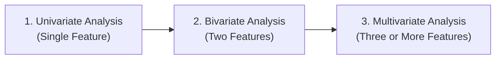
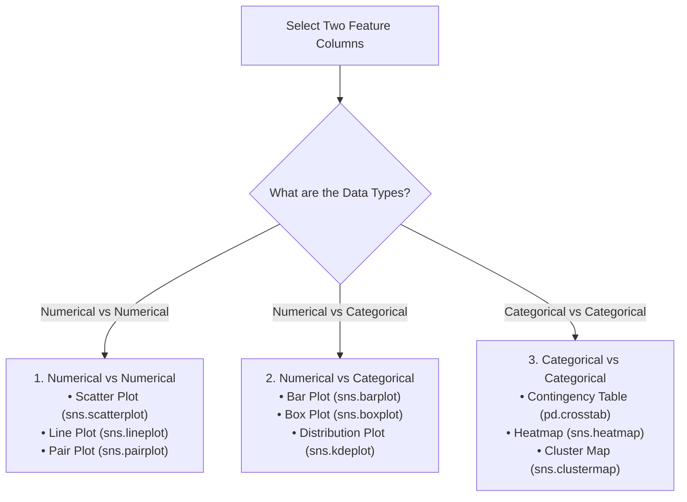
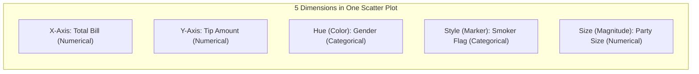
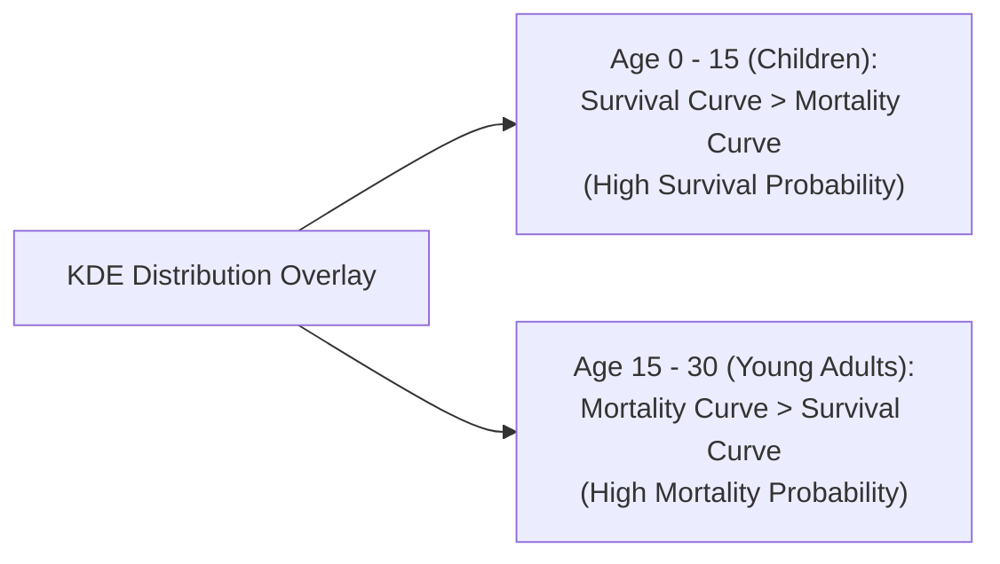
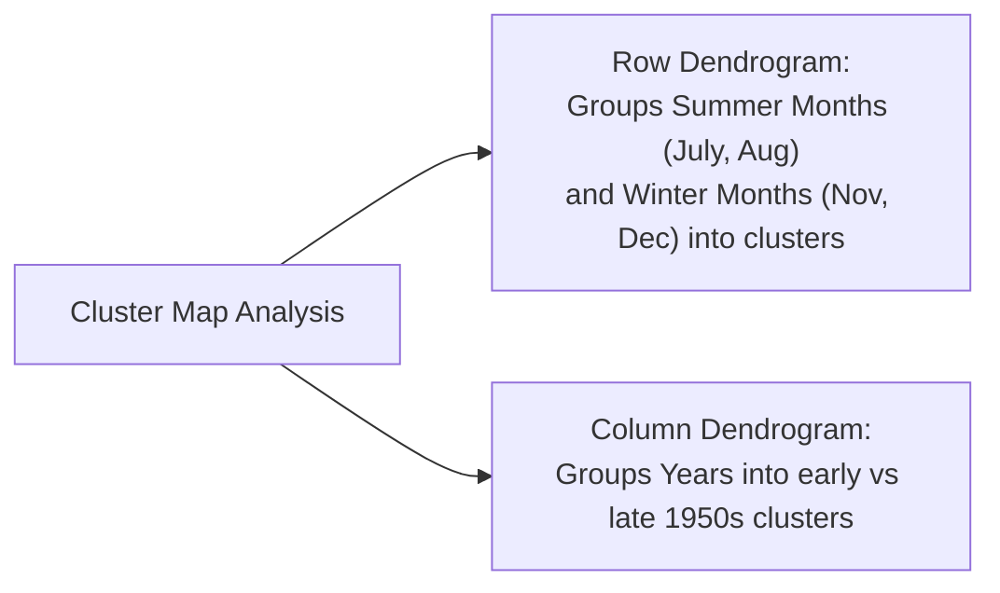
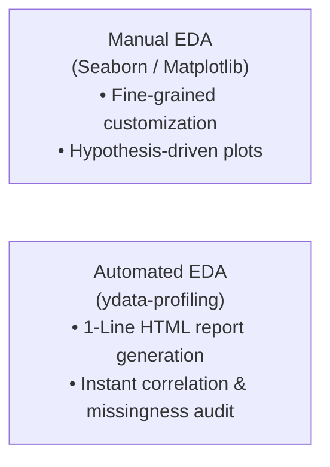

*Video Reference:* [YouTube](https://www.youtube.com/watch?v=6D3VtEfCw7w)

In the previous post, we explored Univariate Data Analysis, examining the distribution, central tendency, spread, and skewness of individual variables in isolation. 

While univariate analysis is essential for identifying data types and outliers in single columns, real-world data science problems require understanding how multiple variables interact with one another. 

In this post, we step into **Bivariate and Multivariate Data Analysis**, learning how to explore relationships, uncover correlations, and identify complex multi-variable patterns using Python libraries (`pandas` and `seaborn`).

---

## Bivariate vs. Multivariate Analysis

Exploratory Data Analysis (EDA) evolves across three levels of dimensionality:



* **Bivariate Analysis**: The simultaneous analysis of exactly **two** variables to determine if there is a relationship, correlation, or dependency between them.
* **Multivariate Analysis**: The simultaneous analysis of **three or more** variables to uncover multi-dimensional patterns, conditional groupings, and feature interactions.

---

## The Feature Combination Matrix

When analyzing relationships between two columns, the choice of visualization and statistical plot depends strictly on the **data types** of both variables:



Let us examine each combination in detail using four classic real-world datasets:
1. `tips`: Restaurant tipping and bill data.
2. `titanic`: Passenger metadata and survival outcomes.
3. `flights`: Monthly US airline passenger volume over time.
4. `iris`: Botanical flower measurements (`sepal_length`, `petal_length`, `species`).

---

## Combination 1: Numerical vs. Numerical Features

When both variables contain continuous quantitative values, our primary objective is to inspect correlation, linear trends, and point clustering.

### 1. Scatter Plot (`sns.scatterplot`)

A **Scatter Plot** maps two numerical features along the X and Y axes. Each data point on the graph represents a single sample observation.

```python
import seaborn as sns
import matplotlib.pyplot as plt

# Loading the tips dataset
tips = sns.load_dataset('tips')

# Basic Bivariate Scatter Plot: Total Bill vs Tip
sns.scatterplot(x='total_bill', y='tip', data=tips)
plt.title("Relationship Between Total Bill and Tip")
plt.xlabel("Total Bill ($)")
plt.ylabel("Tip ($)")
plt.show()
```

#### Key Observation:
The plot reveals a clear **positive linear relationship**: as `total_bill` increases, `tip` increases proportionally. Higher bills generally lead to higher tips.

#### Extending Scatter Plots to Multivariate Analysis
Seaborn allows us to encode additional feature dimensions into a single scatter plot using aesthetics like **hue** (color), **style** (marker shapes), and **size** (marker magnitude):

```python
# Multivariate Scatter Plot displaying 5 feature dimensions simultaneously
sns.scatterplot(
    x='total_bill', 
    y='tip', 
    hue='sex',        # Color by Gender (Male vs Female)
    style='smoker',   # Marker style by Smoking preference
    size='size',      # Marker size by Table Party Size
    data=tips
)
plt.title("Multivariate Analysis of Restaurant Tipping Behavior")
plt.show()
```



By encoding 5 distinct columns into one plot, we immediately observe that extreme outliers (unusually large bills and tips above $40) are predominantly paid by male customers dining in larger parties.

### 2. Line Plot (`sns.lineplot`)

A **Line Plot** connects sequential data points with line segments. Line plots are used specifically when the X-axis variable represents a **time-based or ordered sequence** (years, months, timestamps).

```python
# Loading airline passengers dataset
flights = sns.load_dataset('flights')

# Aggregating total passengers per year
annual_flights = flights.groupby('year')['passengers'].sum().reset_index()

# Plotting time-series trend
sns.lineplot(x='year', y='passengers', data=annual_flights)
plt.title("Annual US Airline Passenger Volume Growth (1949 - 1960)")
plt.xlabel("Year")
plt.ylabel("Total Passengers")
plt.show()
```

#### Key Observation:
Line plots clearly highlight continuous temporal trends, demonstrating steady linear growth in commercial air travel throughout the 1950s.

### 3. Pair Plot (`sns.pairplot`)

When working with multi-column numerical datasets, manually creating individual scatter plots for every pair of features becomes tedious. 

A **Pair Plot** automatically detects all numerical features in a DataFrame and generates a grid matrix of scatter plots for every unique pair:

```python
# Loading Iris dataset
iris = sns.load_dataset('iris')

# Generating Pair Plot matrix color-coded by target species
sns.pairplot(iris, hue='species')
plt.show()
```

#### Grid Anatomy of a Pair Plot:
* **Off-Diagonal Cells**: Display bivariate scatter plots comparing feature row $i$ against feature column $j$.
* **Diagonal Cells**: Because a feature paired with itself cannot form a scatter plot, Seaborn automatically renders univariate KDE or histogram distributions.
* **Class Separability**: Color-coding by `hue='species'` immediately reveals which feature combinations (for example, `petal_length` vs `petal_width`) achieve complete linear separation between flower species.

---

## Combination 2: Numerical vs. Categorical Features

When comparing a continuous numerical variable against discrete categorical categories, our goal is to evaluate central tendencies, group spreads, and distribution differences across categories.

### 1. Bar Plot (`sns.barplot`)

A **Bar Plot** calculates and displays an aggregated statistical metric (by default, the **mean** or average) of a numerical column across discrete categories.

```python
# Loading Titanic dataset
titanic = sns.load_dataset('titanic')

# Average passenger age per ticket class
sns.barplot(x='pclass', y='age', data=titanic)
plt.title("Average Age Across Passenger Classes")
plt.xlabel("Passenger Class (Pclass)")
plt.ylabel("Average Age")
plt.show()
```

#### Understanding Bar Plot Error Bars:
The thin vertical black lines at the top of each bar represent **Confidence Intervals** (or standard error). They indicate the statistical uncertainty surrounding the calculated mean.

#### Multivariate Extension with `hue`:
We can break down categorical comparisons further by adding a secondary categorical variable using `hue`:

```python
# Average ticket fare by passenger class and gender
sns.barplot(x='pclass', y='fare', hue='sex', data=titanic)
plt.title("Average Ticket Fare by Class and Gender")
plt.show()
```

#### Key Insights:
* Passengers in Class 1 paid a drastically higher average fare (~$80+) compared to Class 2 (~$20) and Class 3 (~$13).
* Across all classes, female passengers recorded a higher average ticket fare than male passengers in the same class.

### 2. Box Plot (`sns.boxplot`)

While bar plots show only single aggregated averages, a **Box Plot** compares the full 5-number summary distribution (Q1, Median, Q3, IQR, and extreme outliers) of a numerical feature across discrete categories side-by-side.

```python
# Distribution of Age by Gender and Survival Status
sns.boxplot(x='sex', y='age', hue='survived', data=titanic)
plt.title("Age Distribution by Gender and Survival Status")
plt.xlabel("Gender")
plt.ylabel("Age")
plt.show()
```

#### Key Insights:
* **Male Passengers**: Surviving males recorded a lower median age than non-surviving males, illustrating that young boys were given priority in lifeboats ("women and children first").
* **Female Passengers**: Surviving females spanned a wider age range, with high survival rates extending into older age groups.

### 3. Distribution Overlay Plots (`sns.kdeplot` / `sns.histplot`)

To observe full probability density functions (PDFs) across categorical groups, we overlay KDE curves for different class subsets on the same axes:

```python
# Overlaying age distribution curves for Survived (1) vs Died (0)
sns.kdeplot(titanic[titanic['survived'] == 0]['age'], label='Died (0)', shade=True)
sns.kdeplot(titanic[titanic['survived'] == 1]['age'], label='Survived (1)', shade=True)

plt.title("Age Probability Density Function by Survival Status")
plt.xlabel("Age")
plt.ylabel("Probability Density")
plt.legend()
plt.show()
```



#### Key Analytical Findings:
* For children aged $0$ to $15$, the survival curve (blue) is significantly higher than the mortality curve (red), proving that young children experienced high survival probabilities.
* For adults aged $15$ to $30$, the mortality curve surpasses the survival curve, revealing that young adults suffered the highest mortality rates during the disaster.

---

## Combination 3: Categorical vs. Categorical Features

When evaluating relationships between two discrete categorical variables, we construct contingency tables and frequency matrices.

### 1. Cross-Tabulation & Heatmaps (`pd.crosstab` + `sns.heatmap`)

A **Contingency Table** (or Cross-Tabulation) counts co-occurrences across every combination of categories between two columns using `pd.crosstab()`.

```python
# Generating Contingency Table of Passenger Class vs Survival Status
cross_tab = pd.crosstab(titanic['pclass'], titanic['survived'])
print(cross_tab)
```

#### Raw Contingency Output:
```
survived    0    1
pclass            
1          80  136
2          97   87
3         372  119
```

#### Visualizing Contingency Tables with Heatmaps (`sns.heatmap`)
A **Heatmap** converts frequency count numbers into color intensity gradients, making high-density cells stand out instantly:

```python
# Visualizing Cross-Tabulation with a Heatmap
sns.heatmap(cross_tab, annot=True, fmt='d', cmap='YlGnBu')
plt.title("Passenger Class vs Survival Count Heatmap")
plt.xlabel("Survived (0 = No, 1 = Yes)")
plt.ylabel("Passenger Class")
plt.show()
```

#### Normalizing Contingency Tables to Percentages:
Raw counts can be misleading if category sample sizes are unbalanced. Normalizing by rows computes exact survival percentages per class:

```python
# Normalizing by row index to get percentage proportions
cross_tab_pct = pd.crosstab(titanic['pclass'], titanic['survived'], normalize='index') * 100
print(cross_tab_pct.round(2))
```

#### Percentage Breakdown Table:
* **Class 1**: `62.96%` Survived | `37.04%` Died
* **Class 2**: `47.28%` Survived | `52.72%` Died
* **Class 3**: `24.24%` Survived | `75.76%` Died

Similarly, analyzing `Sex` vs `Survived` reveals that `74.20%` of females survived compared to only `18.89%` of males.

### 2. Cluster Map (`sns.clustermap`)

A **Cluster Map** combines a 2D heatmap with **Hierarchical Clustering (Dendrograms)** along the rows and columns. It automatically reorders rows and columns to group categories with similar behavior together.

```python
# Creating a Pivot Table of Passengers by Month and Year
flight_pivot = flights.pivot_table(index='month', columns='year', values='passengers')

# Generating Cluster Map with Hierarchical Clustering
sns.clustermap(flight_pivot, cmap='Blues')
plt.title("Hierarchical Clustering of Monthly Flight Volumes")
plt.show()
```



#### Key Insights:
* The row dendrogram automatically clusters summer months (`July` and `August`) together at the top due to consistently high travel demand.
* Off-season months (`November`, `December`, `January`, `February`) form a separate cluster with lower passenger counts.

---

## Automated EDA: Accelerating Analysis with Pandas Profiling

While performing manual Exploratory Data Analysis with Seaborn and Matplotlib grants complete control over custom plots and domain hypothesis testing, writing manual visualization code for datasets with dozens or hundreds of columns can be extremely time-consuming.

To accelerate initial data inspection, we can leverage **Pandas Profiling** (now maintained as **YData Profiling**).



### What is Pandas Profiling?

**Pandas Profiling** is an open-source Python library that generates a comprehensive, interactive HTML exploratory report directly from a Pandas DataFrame with a single line of code.

### Automated Insights Generated by Pandas Profiling:

1. **Dataset Overview**: Total variables, sample count, missing value percentages, duplicate rows count, and total memory allocation.
2. **Univariate Variable Analysis**: Per-column descriptive statistics (mean, median, IQR, min/max, skewness, distinct counts) alongside distribution histograms.
3. **Bivariate & Correlation Matrices**: Automatically computes correlation matrices using multiple coefficients:
   * **Pearson Correlation ($r$)**: Linear numerical correlation.
   * **Spearman & Kendall Rank Correlation**: Non-linear ordinal correlation.
   * **Phik ($\phi_k$) Correlation**: Inter-variable correlation handling both numerical and categorical variables simultaneously.
   * **Cramér's V**: Categorical-to-categorical association strength.
4. **Missing Value Diagnostics**: Visual bar charts, matrix maps, and dendrograms illustrating missing data co-occurrences across features.
5. **Automated Warnings & Alerts**: Highlights data quality issues including high collinearity, zero-variance columns, extreme skewness, and high cardinality.

### Python Code Example

```python
# Installation:
# pip install ydata-profiling

import pandas as pd
from ydata_profiling import ProfileReport

# Load dataset
df = pd.read_csv('titanic.csv')

# Generate interactive EDA report
profile = ProfileReport(
    df, 
    title="Titanic Dataset Automated EDA Report", 
    explorative=True
)

# Save report as an interactive HTML file
profile.to_file("titanic_eda_report.html")
```

### Manual EDA vs. Automated Profiling Workflow

* **Use Automated Profiling First**: When you first receive a raw dataset, run `ydata-profiling` to instantly audit data health, missingness, duplicate rows, and high-level correlation matrices.
* **Use Manual EDA Second**: Use Seaborn and Matplotlib to dive deeper into domain-specific questions, target variable relationships, and custom multivariate feature engineering.

---

## Summary Reference Cheat Sheet

<div className="overflow-x-auto my-8">
  <table className="w-full text-left border-collapse">
    <thead>
      <tr className="border-b border-black/10 dark:border-white/10 text-amber-600 dark:text-amber-400">
        <th className="py-3 px-4 font-bold">Combination</th>
        <th className="py-3 px-4 font-bold">Plot / Method</th>
        <th className="py-3 px-4 font-bold">Primary Use Case & Insight</th>
      </tr>
    </thead>
    <tbody className="divide-y divide-black/5 dark:divide-white/5">
      <tr>
        <td className="py-3 px-4 font-semibold">Numerical vs Numerical</td>
        <td className="py-3 px-4"><code>sns.scatterplot()</code></td>
        <td className="py-3 px-4">Visualizes linear trends, correlations, and point clusters.</td>
      </tr>
      <tr>
        <td className="py-3 px-4 font-semibold">Numerical vs Numerical</td>
        <td className="py-3 px-4"><code>sns.lineplot()</code></td>
        <td className="py-3 px-4">Tracks continuous trends over time/sequential order.</td>
      </tr>
      <tr>
        <td className="py-3 px-4 font-semibold">Numerical vs Numerical</td>
        <td className="py-3 px-4"><code>sns.pairplot()</code></td>
        <td className="py-3 px-4">Generates all pairwise scatter plots across a dataset.</td>
      </tr>
      <tr>
        <td className="py-3 px-4 font-semibold">Numerical vs Categorical</td>
        <td className="py-3 px-4"><code>sns.barplot()</code></td>
        <td className="py-3 px-4">Compares aggregated metric averages across categories.</td>
      </tr>
      <tr>
        <td className="py-3 px-4 font-semibold">Numerical vs Categorical</td>
        <td className="py-3 px-4"><code>sns.boxplot()</code></td>
        <td className="py-3 px-4">Compares 5-number summaries &amp; outliers across categories.</td>
      </tr>
      <tr>
        <td className="py-3 px-4 font-semibold">Numerical vs Categorical</td>
        <td className="py-3 px-4"><code>sns.kdeplot()</code></td>
        <td className="py-3 px-4">Overlays probability density curves for group comparison.</td>
      </tr>
      <tr>
        <td className="py-3 px-4 font-semibold">Categorical vs Categorical</td>
        <td className="py-3 px-4"><code>pd.crosstab()</code></td>
        <td className="py-3 px-4">Builds co-occurrence frequency &amp; percentage tables.</td>
      </tr>
      <tr>
        <td className="py-3 px-4 font-semibold">Categorical vs Categorical</td>
        <td className="py-3 px-4"><code>sns.heatmap()</code></td>
        <td className="py-3 px-4">Visualizes contingency counts using color gradients.</td>
      </tr>
      <tr>
        <td className="py-3 px-4 font-semibold">Categorical vs Categorical</td>
        <td className="py-3 px-4"><code>sns.clustermap()</code></td>
        <td className="py-3 px-4">Combines heatmaps with hierarchical clustering trees.</td>
      </tr>
      <tr>
        <td className="py-3 px-4 font-semibold">Automated EDA</td>
        <td className="py-3 px-4"><code>ydata-profiling</code></td>
        <td className="py-3 px-4">Generates a complete interactive HTML EDA report in 1 line.</td>
      </tr>
    </tbody>
  </table>
</div>

---

## What's Next?

Now that we have completed our foundational Exploratory Data Analysis framework, including Univariate Analysis, Bivariate & Multivariate Analysis, and Automated Profiling, we move into the next milestone of the Machine Learning Lifecycle.

In the next post, we begin **Feature Engineering**, starting with an introduction to its core concepts, taxonomy, and four major pillars.

