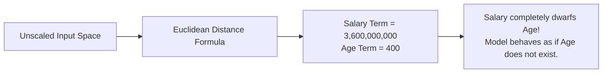
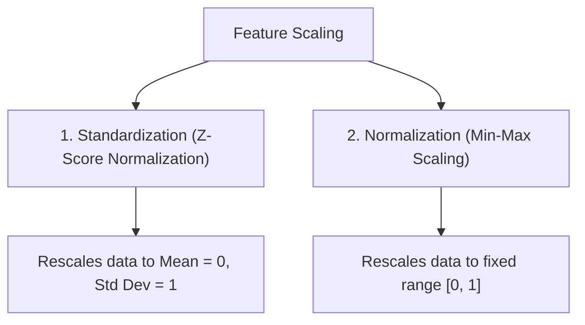
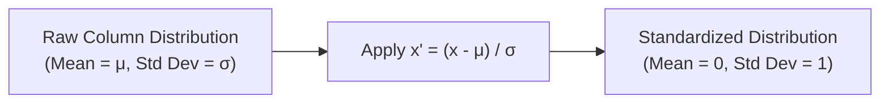
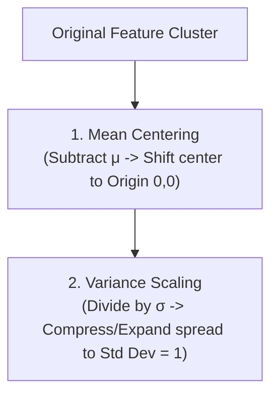
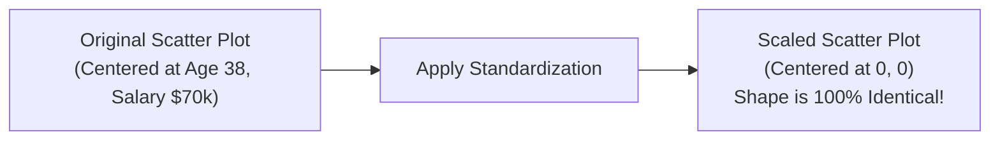
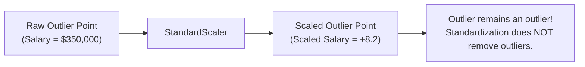
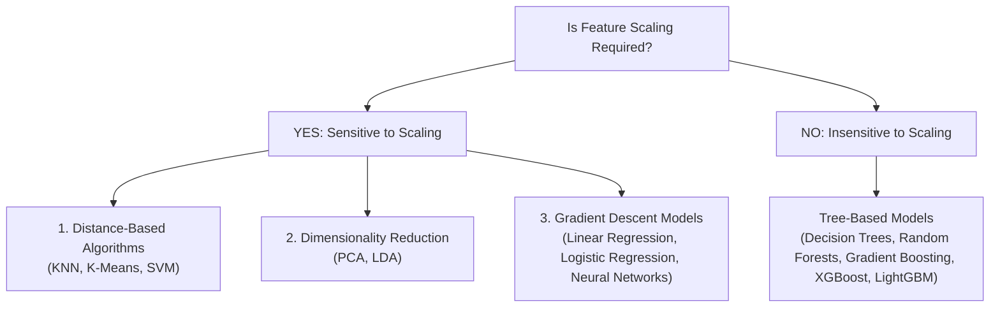

*Video Reference:* [YouTube](https://www.youtube.com/watch?v=1Yw9sC0PNwY)

In the previous post, we introduced Feature Engineering and explored its four major pillars: Feature Transformation, Feature Construction, Feature Selection, and Feature Extraction. 

In this post, we begin our deep dive into **Feature Transformation** by examining one of the most fundamental preprocessing steps before model training: **Feature Scaling**, focusing specifically on **Standardization** (also known as Z-score Normalization).

---

## What is Feature Scaling?

**Feature Scaling** is a data preprocessing technique used to transform independent feature variables ($X$) into a consistent, small numeric range. 

When working with tabular datasets, different features are often measured in completely different units and scales:
* `Age`: Ranging from $18$ to $65$ years.
* `Estimated Salary`: Ranging from $\$15,000$ to $\$150,000$.
* `IQ Score`: Ranging from $80$ to $140$.
* `CGPA`: Ranging from $0.0$ to $10.0$.

If raw, unscaled features are fed directly into machine learning models, features with larger numeric magnitudes will dominate mathematical calculations, regardless of whether they carry more predictive signal.

> **Key Distinction:** Feature scaling is applied strictly to **independent input features ($X$)**, not the target variable ($y$).

---

## Why Do We Need Feature Scaling?

To understand why feature scaling is essential, consider distance-based algorithms such as **K-Nearest Neighbors (KNN)**.

KNN classifies new data points by computing Euclidean distances to neighboring data points in feature space:

```
d = √((x₂ - x₁)² + (y₂ - y₁)²)
```

Suppose we have two passenger records with `Age` and `Estimated Salary`:
* **Passenger A**: `Age` = $20$, `Salary` = $\$20,000$
* **Passenger B**: `Age` = $40$, `Salary` = $\$80,000$

Calculating the squared differences along each feature axis:
* `Age` term: `(40 - 20)² = 400`
* `Salary` term: `(80,000 - 20,000)² = 3,600,000,000`



Because the salary difference is measured in tens of thousands while age difference is measured in tens, the distance calculation is entirely dominated by salary. The model effectively ignores age during nearest-neighbor evaluation.

Feature scaling compresses all features into comparable scales so that every feature contributes proportionally during distance and gradient calculations.

---

## Types of Feature Scaling

Feature scaling broadly divides into two primary techniques:



In this post, we focus entirely on **Standardization**. In the next post, we will cover **Normalization** and compare the two techniques.

---

## What is Standardization?

**Standardization** (also called Z-score Normalization) transforms a feature column such that its resulting distribution has a **Mean ($\mu$) of $0$** and a **Standard Deviation ($\sigma$) of $1$**.

### The Standardization Formula

For every individual feature value $x_i$ in a column, the standardized value $x_i'$ is computed as:

```
x_i' = (x_i - μ) / σ
```

Where:
* $x_i$: The original feature value.
* $\mu$: The mean of the feature column across all sample rows.
* $\sigma$: The standard deviation of the feature column.

### Mathematical Proof of Mean and Standard Deviation

When this transformation is applied to an entire feature column:
1. **New Mean ($\mu$)**: Equal to exactly $0$.
2. **New Standard Deviation ($\sigma$)**: Equal to exactly $1$.



---

## Geometric Intuition of Standardization

Geometrically, standardization performs two sequential transformations on the data distribution in feature space:



1. **Mean Centering**: Subtracting the mean $\mu$ shifts the center of gravity of the data points from its original location to the coordinate origin $(0, 0)$.
2. **Scaling by Standard Deviation**: Dividing by $\sigma$ rescales the spread along each axis. If the original standard deviation was large (for example, $\sigma = 34,000$ for salary), dividing by $\sigma$ compresses the points along that axis. If the original standard deviation was smaller than $1$, dividing expands the points.

After standardization, the entire data cloud is centered at $(0, 0)$ with a uniform unit variance along all feature dimensions.

---

## Implementing Standardization in Python with Scikit-Learn

Let us inspect a practical Python implementation using `scikit-learn` on a Social Network Ads classification dataset containing `Age`, `EstimatedSalary`, and target `Purchased`.

### 1. Train-Test Split (Crucial Rule to Prevent Data Leakage)

> **IMPORTANT:** You MUST perform `train_test_split` BEFORE fitting `StandardScaler`. 

If you apply `StandardScaler.fit()` on the entire dataset prior to splitting, the scaler calculates the mean and standard deviation of the test set as well. This causes **Data Leakage**, where information from the test set leaks into the training pipeline.

```python
import pandas as pd
import numpy as np
from sklearn.model_selection import train_test_split
from sklearn.preprocessing import StandardScaler

# Load dataset
df = pd.read_csv('social_network_ads.csv')
X = df[['Age', 'EstimatedSalary']]
y = df['Purchased']

# Split data into 70% Training and 30% Testing
X_train, X_test, y_train, y_test = train_test_split(
    X, y, test_size=0.3, random_state=42
)
```

### 2. Fitting and Transforming with `StandardScaler`

```python
# Instantiate StandardScaler
scaler = StandardScaler()

# Fit on training data ONLY (calculates μ_train and σ_train)
scaler.fit(X_train)

# Transform both training and testing datasets using learned parameters
X_train_scaled = scaler.transform(X_train)
X_test_scaled = scaler.transform(X_test)
```

Notice the pattern:
* `scaler.fit(X_train)` learns $\mu$ and $\sigma$ from the training data.
* `scaler.transform(X_train)` scales training data.
* `scaler.transform(X_test)` scales test data using training parameters ($\mu$ and $\sigma$). Never call `scaler.fit()` on `X_test`!

### 3. Converting NumPy Output Back to Pandas DataFrame

By default, `StandardScaler.transform()` returns a NumPy `ndarray`. To inspect statistical properties using Pandas `.describe()`, wrap the output back into a DataFrame:

```python
X_train_scaled = pd.DataFrame(X_train_scaled, columns=X_train.columns)
X_test_scaled = pd.DataFrame(X_test_scaled, columns=X_test.columns)

# Inspect statistical summary
print("Unscaled Training Summary:")
print(X_train.describe().round(2))

print("\nScaled Training Summary:")
print(X_train_scaled.describe().round(2))
```

#### Output Summary Comparison

<div className="overflow-x-auto my-8">
  <table className="w-full text-left border-collapse">
    <thead>
      <tr className="border-b border-black/10 dark:border-white/10 text-amber-600 dark:text-amber-400">
        <th className="py-3 px-4 font-bold">Metric</th>
        <th className="py-3 px-4 font-bold">Unscaled Age</th>
        <th className="py-3 px-4 font-bold">Scaled Age</th>
        <th className="py-3 px-4 font-bold">Unscaled Salary</th>
        <th className="py-3 px-4 font-bold">Scaled Salary</th>
      </tr>
    </thead>
    <tbody className="divide-y divide-black/5 dark:divide-white/5">
      <tr>
        <td className="py-3 px-4 font-semibold">Mean (μ)</td>
        <td className="py-3 px-4">37.89</td>
        <td className="py-3 px-4"><strong>0.00</strong></td>
        <td className="py-3 px-4">$69,807.14</td>
        <td className="py-3 px-4"><strong>0.00</strong></td>
      </tr>
      <tr>
        <td className="py-3 px-4 font-semibold">Std Dev (σ)</td>
        <td className="py-3 px-4">10.28</td>
        <td className="py-3 px-4"><strong>1.00</strong></td>
        <td className="py-3 px-4">$34,096.12</td>
        <td className="py-3 px-4"><strong>1.00</strong></td>
      </tr>
    </tbody>
  </table>
</div>

The transformed feature columns verify that mean is exactly $0.00$ and standard deviation is exactly $1.00$.

---

## Effect of Standardization on Data Distributions

A common misconception is that standardization alters the underlying shape of a feature's probability distribution (for example, turning a skewed distribution into a bell curve). **This is false.**

Standardization is a **linear transformation**. It preserves relative point distances and distribution shapes:



1. **Scatter Plot**: The relative positions of data points in a scatter plot before and after scaling are identical. Only the coordinate numbers on the X and Y axes change.
2. **Distribution PDF Plot**: Before scaling, plotting `Age` (0-60) and `Salary` (15k-150k) on the same density plot produces a distorted chart where `Age` appears as a sharp spike and `Salary` looks completely flat. After standardization, both KDE curves share a common X-axis range (-3 to +3), allowing direct visual comparison of feature distributions.

---

## Empirical Impact on Machine Learning Models

Does feature scaling actually improve model performance? Let us evaluate two contrasting algorithms on the same dataset.

### Experiment 1: Logistic Regression (Gradient & Weight-Based Model)

```python
from sklearn.linear_model import LogisticRegression
from sklearn.metrics import accuracy_score

# Model trained on UNSCALED data
clf_unscaled = LogisticRegression()
clf_unscaled.fit(X_train, y_train)
pred_unscaled = clf_unscaled.predict(X_test)

# Model trained on SCALED data
clf_scaled = LogisticRegression()
clf_scaled.fit(X_train_scaled, y_train)
pred_scaled = clf_scaled.predict(X_test_scaled)

print("Accuracy WITHOUT Scaling:", accuracy_score(y_test, pred_unscaled))
print("Accuracy WITH Standardization:", accuracy_score(y_test, pred_scaled))
```

#### Results:
* **Accuracy WITHOUT Scaling**: `65.0%`
* **Accuracy WITH Standardization**: `86.6%`

Standardization yields an immediate **+21.6% accuracy boost**! Logistic Regression uses Gradient Descent to find optimal coefficient weights. Unscaled features create elongated, elliptical loss contours, causing gradient updates to oscillate wildly and converge slowly. Scaled features create circular loss contours, enabling rapid, smooth convergence.

### Experiment 2: Decision Tree Classifier (Tree-Based Model)

```python
from sklearn.tree import DecisionTreeClassifier

# Model trained on UNSCALED data
dt_unscaled = DecisionTreeClassifier(random_state=42)
dt_unscaled.fit(X_train, y_train)
pred_dt_unscaled = dt_unscaled.predict(X_test)

# Model trained on SCALED data
dt_scaled = DecisionTreeClassifier(random_state=42)
dt_scaled.fit(X_train_scaled, y_train)
pred_dt_scaled = dt_scaled.predict(X_test_scaled)

print("Decision Tree Accuracy WITHOUT Scaling:", accuracy_score(y_test, pred_dt_unscaled))
print("Decision Tree Accuracy WITH Standardization:", accuracy_score(y_test, pred_dt_scaled))
```

#### Results:
* **Accuracy WITHOUT Scaling**: `87.5%`
* **Accuracy WITH Standardization**: `87.5%`

Decision Trees show **zero difference** in accuracy! Tree-based algorithms evaluate axis-aligned threshold splits sequentially (for example, `Age > 35` vs `Age_scaled > -0.28`). Monotonic feature scaling does not alter split ordering or tree structure.

---

## Standardization and Outliers

Does Standardization eliminate or fix outliers in your data? **No.**

If a dataset contains extreme outliers (such as an artificial record with `Age` = 5 and `EstimatedSalary` = $350,000$), applying `StandardScaler` shifts the outlier along with the rest of the distribution:



Because mean $\mu$ and standard deviation $\sigma$ are themselves highly sensitive to outliers, extreme values distort both $\mu$ and $\sigma$. If your dataset contains prominent outliers, consider using `RobustScaler` (which uses Median and Interquartile Range) or handle outliers prior to scaling.

---

## When to Use Standardization: Algorithmic Guidelines

Not every algorithm requires feature scaling. Use this taxonomy to guide your workflow:



### 1. Algorithms That REQUIRE Standardization
* **K-Nearest Neighbors (KNN)**: Relies directly on Euclidean distance metrics.
* **K-Means Clustering**: Clusters points by minimizing Euclidean distances to centroids.
* **Support Vector Machines (SVM)**: Distance to decision margin is distorted by unscaled features.
* **Principal Component Analysis (PCA)**: Seeks directions of maximum variance. Unscaled features with large variances dominate principal components artificially.
* **Gradient Descent Algorithms**: Linear Regression, Logistic Regression, and Deep Learning Neural Networks require normalized feature scales for stable gradient optimization.

### 2. Algorithms That DO NOT Require Standardization
* **Decision Trees**
* **Random Forests**
* **Extra Trees**
* **Gradient Boosted Trees (XGBoost, LightGBM, CatBoost)**

While applying standardization to tree-based models does not harm performance, it is computationally unnecessary.

---

## Summary Cheat Sheet

<div className="overflow-x-auto my-8">
  <table className="w-full text-left border-collapse">
    <thead>
      <tr className="border-b border-black/10 dark:border-white/10 text-amber-600 dark:text-amber-400">
        <th className="py-3 px-4 font-bold">Property / Aspect</th>
        <th className="py-3 px-4 font-bold">Standardization (Z-Score Normalization)</th>
      </tr>
    </thead>
    <tbody className="divide-y divide-black/5 dark:divide-white/5">
      <tr>
        <td className="py-3 px-4 font-semibold">Mathematical Formula</td>
        <td className="py-3 px-4"><code>x' = (x - μ) / σ</code></td>
      </tr>
      <tr>
        <td className="py-3 px-4 font-semibold">Transformed Distribution Metrics</td>
        <td className="py-3 px-4">Mean (μ) = <strong>0</strong>, Standard Deviation (σ) = <strong>1</strong></td>
      </tr>
      <tr>
        <td className="py-3 px-4 font-semibold">Geometric Operations</td>
        <td className="py-3 px-4">1. Mean Centering to origin (0,0) &nbsp;|&nbsp; 2. Scaling spread to unit variance</td>
      </tr>
      <tr>
        <td className="py-3 px-4 font-semibold">Effect on Distribution Shape</td>
        <td className="py-3 px-4">Preserves original distribution shape (linear transformation)</td>
      </tr>
      <tr>
        <td className="py-3 px-4 font-semibold">Outlier Sensitivity</td>
        <td className="py-3 px-4">Does NOT remove outliers; scaling is affected by extreme values</td>
      </tr>
      <tr>
        <td className="py-3 px-4 font-semibold">Scikit-Learn Class</td>
        <td className="py-3 px-4"><code>sklearn.preprocessing.StandardScaler</code></td>
      </tr>
      <tr>
        <td className="py-3 px-4 font-semibold">Key Best Practice</td>
        <td className="py-3 px-4">Fit scaler ONLY on <code>X_train</code> to prevent Data Leakage</td>
      </tr>
    </tbody>
  </table>
</div>

---

## What's Next?

In this post, we covered Standardization (Z-score normalization), its mathematical foundation, geometric intuition, and algorithmic sensitivity.

In the next post, we will explore **Normalization (Min-Max Scaling)**, examine how it bounds features strictly between $[0, 1]$, and compare when to choose Standardization versus Normalization in real-world machine learning projects.
