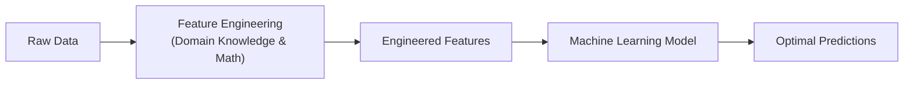
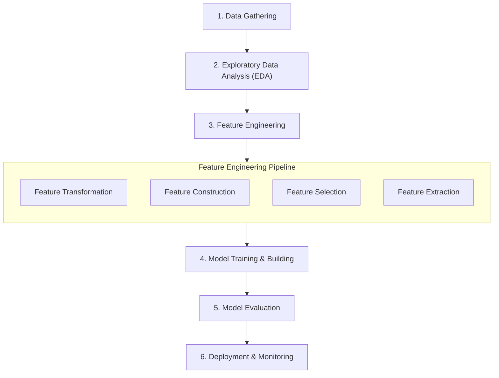
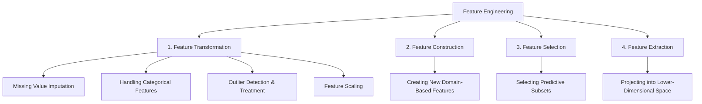
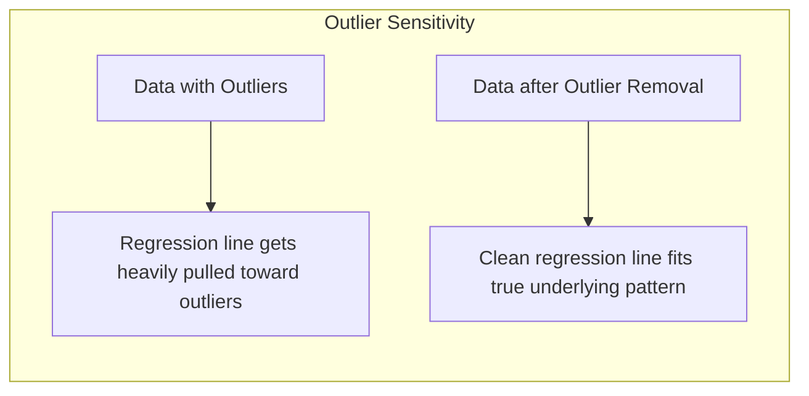
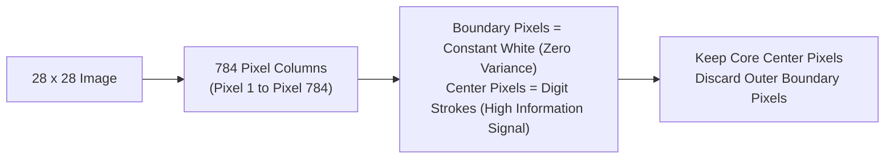
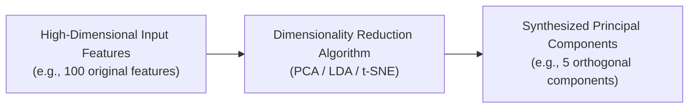

*Video Reference:* [YouTube](https://www.youtube.com/watch?v=sluoVhT0ehg)

In the previous post, we explored Bivariate and Multivariate Data Analysis to examine relationships, correlations, and feature interactions across multiple variables simultaneously. Up to this point in our series, we have covered the fundamentals of Machine Learning, data collection, and exploratory data analysis (EDA). 

Now, we enter one of the most vital phases in the machine learning workflow: **Feature Engineering**.

---

## What is Feature Engineering?

According to Wikipedia, **Feature Engineering** is the process of using domain knowledge to extract or transform features (columns) from raw data. These transformed features enable machine learning algorithms to learn patterns more effectively and deliver significantly higher predictive performance.



When you work with real-world datasets, raw data is almost never in a state that can be fed directly into a machine learning algorithm. Mathematical models expect structured numerical inputs without missing values, outliers, or mismatched scales.

### Feature Engineering: An Art and a Science

Feature engineering is fundamentally an **art** as much as a **science**. 

While programming and algorithms rely on fixed logic, feature engineering depends heavily on domain intuition, creative problem-solving, and empirical experimentation. Two data scientists working on the exact same dataset will often engineer completely different features based on their individual insights.

### The Golden Rule of Feature Engineering

> **Core Philosophy:** A simple algorithm trained on exceptionally well-engineered features will almost always outperform a sophisticated algorithm trained on poor, unrefined features.

Because feature engineering plays such a decisive role in model success, we will dedicate an entire block of upcoming posts to examining every feature engineering technique in granular detail.

---

## Feature Engineering in the Machine Learning Lifecycle

To contextualize where feature engineering fits into the broader machine learning workflow, let us review the end-to-end Machine Learning Lifecycle:



Once raw data is gathered and inspected via EDA, it enters the **Feature Engineering Pipeline**. Only after features are properly engineered do we feed the dataset into machine learning algorithms for training.

---

## The Four Major Pillars of Feature Engineering

Feature engineering can be categorized into four primary sub-types:



---

## Pillar 1: Feature Transformation

**Feature Transformation** involves modifying an existing feature's representation so that machine learning algorithms can interpret it accurately and draw cleaner decision boundaries.

Feature transformation encompasses four major sub-steps:

### 1. Missing Value Imputation
Real-world data collection processes are imperfect, often leaving missing values (`NaN` or `null`) across columns. Popular ML libraries like `scikit-learn` do not accept missing values during model fitting.

* **Removal**: Dropping rows or columns with missing values (viable only when missingness is extremely low or overwhelmingly high).
* **Imputation**: Replacing missing entries using statistical metrics (Mean or Median for numerical features, Mode for categorical features) or advanced techniques (KNN Imputer, Iterative Imputer).
* Imputation is almost always the first operation performed in the feature engineering pipeline.

### 2. Handling Categorical Features
Machine learning algorithms operate on linear algebra equations and numerical matrices. String labels (such as `"Dog"`, `"Cat"`, `"Sheep"`) cannot be multiplied by model weights directly.

* **Encoding**: Converting categorical strings into numerical representations using techniques like **One-Hot Encoding** (creating binary dummy columns) or **Ordinal Encoding** (assigning ordered integer ranks).
* **Discretization (Binning)**: Converting continuous numerical variables into discrete categorical intervals (for example, grouping continuous `Age` values into `"Child"`, `"Teenager"`, and `"Adult"` bins).

### 3. Outlier Detection and Handling
Outliers are extreme data points that deviate dramatically from the rest of the sample distribution. 

Consider an analogy: in a class where most students score around 50%, an extreme score of 98% represents a significant outlier. In machine learning, algorithms like Linear Regression attempt to draw decision boundaries that minimize total error across all points. A small group of extreme outliers can pull the regression line away from the main cluster of data:



To prevent model distortion, we detect outliers using statistical techniques (IQR bounds, Z-scores) and cap or remove them prior to model training.


### 4. Feature Scaling
When features exist on vastly different numeric scales, distance-based algorithms struggle. For instance, consider a dataset containing `Age` (ranging from 0 to 100) and `Salary` (ranging from $10,000 to $1,000,000).

In algorithms relying on Euclidean distance equations:

```
d = √((x₂ - x₁)² + (y₂ - y₁)²)
```

The squared term for `Salary` will dominate the calculation, rendering the `Age` feature mathematically negligible.

To solve this, we apply **Feature Scaling** techniques to bring all features into a comparable range (typically centered around mean 0 with standard deviation 1, or scaled between -1 and 1):
* **Standardization** (`StandardScaler`)
* **Normalization** (`MinMaxScaler`)
* **Robust Scaling** (`RobustScaler`)

---

## Pillar 2: Feature Construction

**Feature Construction** (or Feature Creation) is the process of manually deriving completely new features from existing raw columns based on domain knowledge, logic, and human intuition.

### Real-World Example: Titanic Dataset

In the Titanic dataset, we find two separate columns:
1. `SibSp`: Number of siblings and spouses traveling with the passenger.
2. `Parch`: Number of parents and children traveling with the passenger.

While keeping these columns separate provides raw counts, an experienced data scientist recognizes that both represent family relationships aboard the ship.

We can construct a new synthetic feature called `Family_Size`:

```
Family_Size = SibSp + Parch + 1
```

Furthermore, we can transform `Family_Size` into categorical bins:
* `Family_Size == 1` → `"Alone"`
* `2 <= Family_Size <= 4` → `"Small Family"`
* `Family_Size > 4` → `"Large Family"`

Surviving passenger rates often correlate strongly with broader family structures rather than isolated counts of spouses versus children. Feature construction translates human domain insight into predictive variables.


---

## Pillar 3: Feature Selection

**Feature Selection** is the process of identifying and selecting a subset of the most relevant, highly predictive features from a dataset while discarding noisy or redundant columns.

### Real-World Example: MNIST Handwritten Digits

The MNIST dataset contains images of handwritten digits. Each image is 28 × 28 pixels, yielding **784 individual pixel features** per row when flattened into tabular format:



The outer boundary pixels across all 784 columns remain almost universally white (0 value) across every sample. They contribute zero predictive variance while increasing model training time and memory usage.

By applying **Feature Selection**, we eliminate zero-variance boundary pixels and retain only the central region of pixels where digit strokes actually occur. This speeds up training and reduces the curse of dimensionality.


---

## Pillar 4: Feature Extraction

Unlike Feature Selection (which picks a subset of existing columns), **Feature Extraction** creates an entirely new set of lower-dimensional features by mathematically combining and projecting high-dimensional input space onto new orthogonal axes.

### Real-World Analogy: Real Estate Data

Suppose you have a real estate dataset with two highly correlated columns:
* `Number of Bedrooms`
* `Number of Washrooms`

If you are constrained to select only one feature, discarding either column loses valuable signal. Instead, you can extract a new composite feature: `Total Square Feet Area`. This single synthesized variable captures the joint capacity represented by both original columns.

### Mathematical Projection (PCA & LDA)

In high-dimensional datasets, feature extraction algorithms like **Principal Component Analysis (PCA)** or **Linear Discriminant Analysis (LDA)** rotate coordinate axes to locate new directions of maximum variance:



Feature extraction is especially vital when processing high-dimensional data such as image embeddings, audio signals, and text vectors.


---

## Summary Reference Table

<div className="overflow-x-auto my-8">
  <table className="w-full text-left border-collapse">
    <thead>
      <tr className="border-b border-black/10 dark:border-white/10 text-amber-600 dark:text-amber-400">
        <th className="py-3 px-4 font-bold">Pillar</th>
        <th className="py-3 px-4 font-bold">Core Objective</th>
        <th className="py-3 px-4 font-bold">Key Techniques / Algorithms</th>
        <th className="py-3 px-4 font-bold">Practical Example</th>
      </tr>
    </thead>
    <tbody className="divide-y divide-black/5 dark:divide-white/5">
      <tr>
        <td className="py-3 px-4 font-semibold">1. Transformation</td>
        <td className="py-3 px-4">Modify feature format/distribution for ML compatibility.</td>
        <td className="py-3 px-4">Imputation, Encoding, Scaling, Outlier Treatment</td>
        <td className="py-3 px-4">Scaling Salary ($10k-$1M) and Age (0-100) using <code>StandardScaler</code>.</td>
      </tr>
      <tr>
        <td className="py-3 px-4 font-semibold">2. Construction</td>
        <td className="py-3 px-4">Create new features manually using domain knowledge.</td>
        <td className="py-3 px-4">Domain logic, Binning, Feature ratios/sums</td>
        <td className="py-3 px-4">Combining <code>SibSp</code> and <code>Parch</code> into <code>Family_Size</code>.</td>
      </tr>
      <tr>
        <td className="py-3 px-4 font-semibold">3. Selection</td>
        <td className="py-3 px-4">Select top predictive subset; drop redundant columns.</td>
        <td className="py-3 px-4">Feature Importance, Forward/Backward selection</td>
        <td className="py-3 px-4">Removing zero-variance boundary pixels from MNIST digit images.</td>
      </tr>
      <tr>
        <td className="py-3 px-4 font-semibold">4. Extraction</td>
        <td className="py-3 px-4">Project high-dimensional features into a lower-dimensional space.</td>
        <td className="py-3 px-4">PCA, LDA, t-SNE, UMAP</td>
        <td className="py-3 px-4">Transforming 784 pixel features into 50 principal components using PCA.</td>
      </tr>
    </tbody>
  </table>
</div>

---

## What's Next?

Now that we have established a clear high-level understanding of Feature Engineering and its four primary pillars, we will explore each technique step-by-step in dedicated posts across this series.

In the next post, we will begin our deep dive into **Feature Transformation**, focusing specifically on **Feature Scaling: Standardization vs Normalization**.
