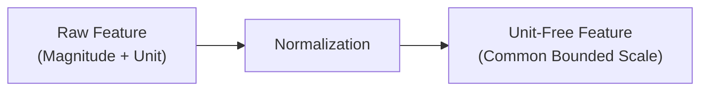
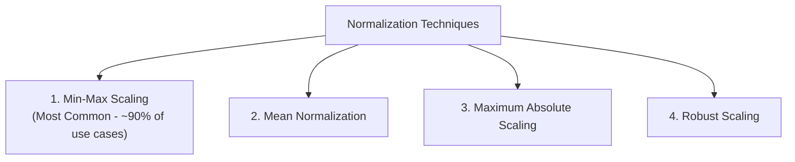
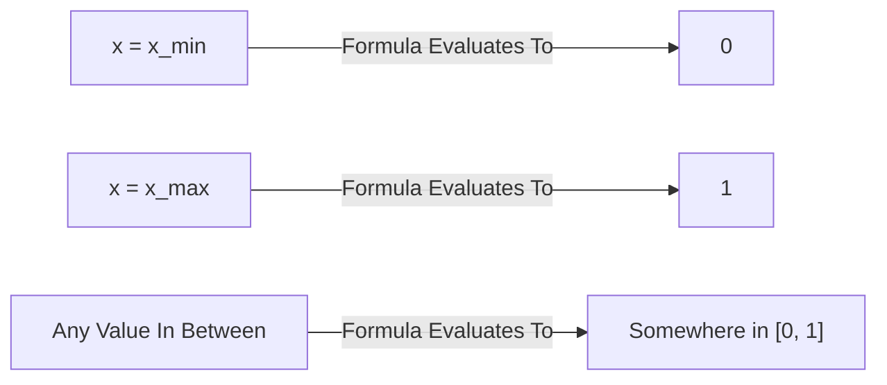
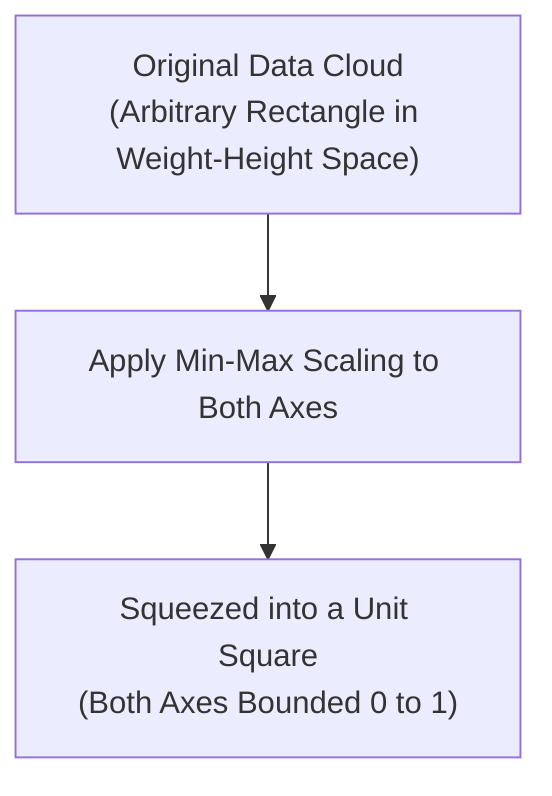
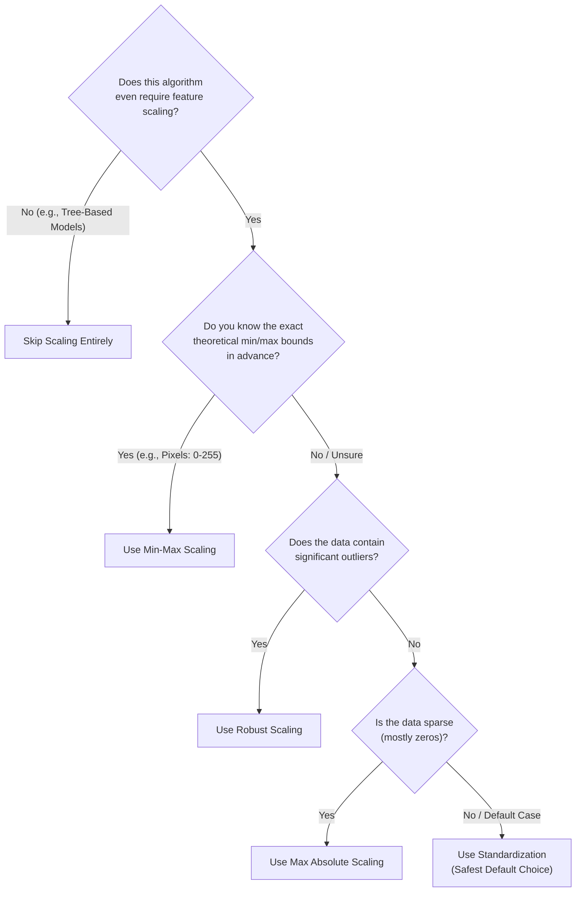

*Inspired by:* [YouTube](https://www.youtube.com/watch?v=eBrGyuA2MIg)

In the previous post, we explored **Standardization (Z-score Normalization)** and saw why bringing features onto a common scale matters for distance-based and gradient-based algorithms.

In this post, we cover the second major feature scaling technique: **Normalization**, most commonly known as **Min-Max Scaling**. We will walk through its formula, its geometric intuition, a hands-on example using the real-world Wine dataset, a few lesser-used normalization variants, and finally a practical decision guide for choosing between Normalization and Standardization.

---

## What is Normalization?

**Normalization** is a data preparation technique applied before feeding features into a machine learning model. Its goal is to change the values of numeric columns in a dataset to use a **common scale**, without distorting differences in the ranges of values or losing information.

> **Core Idea:** Every numerical quantity has two components: a **magnitude** and a **unit** (grams, kilograms, pounds, centimeters, dollars, and so on). When working with multiple numerical features, it is always a good idea to eliminate units and bring every column onto a comparable scale before applying machine learning algorithms. Doing so consistently produces better results.



---

## Types of Normalization Techniques

While `scikit-learn`'s documentation lists several scaling transformers, this post focuses on the four most practically useful normalization techniques:



When someone says "normalize this feature" without further context, they almost always mean **Min-Max Scaling**, so we will focus most of our attention there.

---

## Min-Max Scaling

### The Formula

For every individual feature value `x_i` in a column, the min-max scaled value `x_i'` is computed as:

```
x_i' = (x_i - x_min) / (x_max - x_min)
```

Where:
* `x_i`: The original feature value.
* `x_min`: The minimum value across the entire feature column.
* `x_max`: The maximum value across the entire feature column.

### A Worked Example

Suppose you have a `Weight` column (in kilograms) with the following sample values:

```
Weight = [130, 60, 45, 32, 54, 78]
```

Here, `x_min = 32` and `x_max = 130`. To transform the value `130`:

```
x' = (130 - 32) / (130 - 32) = 98 / 98 = 1.0
```

And to transform the value `32` (the minimum itself):

```
x' = (32 - 32) / (130 - 32) = 0 / 98 = 0.0
```

### Why the Output Always Falls Between 0 and 1



No matter what the original distribution looks like, the smallest value in the column always maps to exactly `0` and the largest value always maps to exactly `1`. Every other value falls somewhere in between. This is the single most important guarantee of Min-Max Scaling.

### Geometric Intuition

Imagine a dataset with exactly two numerical features: `Weight` and `Height`. Before scaling, the data points are scattered across a rectangle whose boundaries are defined by the raw min/max values of each axis.



Min-Max Scaling essentially **picks up the entire data cloud and compresses it into a unit square**: `[0, 1]` on the X-axis and `[0, 1]` on the Y-axis. With three numerical features, the same intuition compresses the data into a **unit cube**. With `n` numerical features, the data gets compressed into an **n-dimensional unit hypercube**. The relative shape and structure of the data cloud does not change, only its scale does.

---

## Implementing Min-Max Scaling in Python with the Wine Dataset

Let us apply Min-Max Scaling to the real-world **Wine dataset**, which contains chemical analysis results of wines grown in the same region of Italy, derived from three different cultivars (`class_0`, `class_1`, `class_2`).

For this example, we will work with just two input columns: `alcohol` and `malic_acid`. Note that `alcohol` values are noticeably larger in magnitude compared to `malic_acid` values.

```python
import pandas as pd
from sklearn.datasets import load_wine

# Load the Wine dataset
wine = load_wine(as_frame=True)
df = wine.frame[['alcohol', 'malic_acid', 'target']]

df.head()
```

<MdxImage src="/images/ch16-wine-head-output.png" alt="DataFrame output showing the first five rows of the Wine dataset with alcohol, malic_acid, and target columns" className="w-full h-auto" />

### Inspecting Feature Distributions Before Scaling

```python
import seaborn as sns
import matplotlib.pyplot as plt

sns.histplot(df['alcohol'], kde=True)
plt.title("Alcohol Distribution (Before Scaling)")
plt.show()

sns.histplot(df['malic_acid'], kde=True)
plt.title("Malic Acid Distribution (Before Scaling)")
plt.show()
```

<MdxImage src="/images/ch16-alcohol-distribution.png" alt="Histogram with KDE curve showing the Alcohol distribution before scaling" className="w-full h-auto" />

<MdxImage src="/images/ch16-malic-acid-distribution.png" alt="Histogram with KDE curve showing the Malic Acid distribution before scaling, with a strong right skew" className="w-full h-auto" />

We can also visualize how the two classes separate using a scatter plot:

```python
sns.scatterplot(x='alcohol', y='malic_acid', hue='target', data=df, palette='deep')
plt.title("Alcohol vs Malic Acid, Colored by Wine Class")
plt.show()
```

<MdxImage src="/images/ch16-scatter-classes.png" alt="Scatter plot of Alcohol versus Malic Acid, colored by wine class, before any scaling is applied" className="w-full h-auto" />

### Train-Test Split Before Scaling (Same Rule as Standardization)

Just like with `StandardScaler`, you must always perform `train_test_split` **before** fitting `MinMaxScaler`, to avoid Data Leakage:

```python
from sklearn.model_selection import train_test_split
from sklearn.preprocessing import MinMaxScaler

X = df[['alcohol', 'malic_acid']]
y = df['target']

X_train, X_test, y_train, y_test = train_test_split(
    X, y, test_size=0.3, random_state=42
)

# Fit MinMaxScaler on the TRAINING data only
scaler = MinMaxScaler()
scaler.fit(X_train)

# Transform both training and testing sets using the learned min/max
X_train_scaled = pd.DataFrame(scaler.transform(X_train), columns=X_train.columns)
X_test_scaled = pd.DataFrame(scaler.transform(X_test), columns=X_test.columns)
```

### Output Summary Comparison

<div className="overflow-x-auto my-8">
  <table className="w-full text-left border-collapse">
    <thead>
      <tr className="border-b border-black/10 dark:border-white/10 text-amber-600 dark:text-amber-400">
        <th className="py-3 px-4 font-bold">Metric</th>
        <th className="py-3 px-4 font-bold">Unscaled Alcohol</th>
        <th className="py-3 px-4 font-bold">Scaled Alcohol</th>
        <th className="py-3 px-4 font-bold">Unscaled Malic Acid</th>
        <th className="py-3 px-4 font-bold">Scaled Malic Acid</th>
      </tr>
    </thead>
    <tbody className="divide-y divide-black/5 dark:divide-white/5">
      <tr>
        <td className="py-3 px-4 font-semibold">Minimum</td>
        <td className="py-3 px-4">11.03</td>
        <td className="py-3 px-4"><strong>0.00</strong></td>
        <td className="py-3 px-4">0.89</td>
        <td className="py-3 px-4"><strong>0.00</strong></td>
      </tr>
      <tr>
        <td className="py-3 px-4 font-semibold">Maximum</td>
        <td className="py-3 px-4">14.83</td>
        <td className="py-3 px-4"><strong>1.00</strong></td>
        <td className="py-3 px-4">5.80</td>
        <td className="py-3 px-4"><strong>1.00</strong></td>
      </tr>
      <tr>
        <td className="py-3 px-4 font-semibold">Mean</td>
        <td className="py-3 px-4">12.96</td>
        <td className="py-3 px-4">0.51</td>
        <td className="py-3 px-4">2.40</td>
        <td className="py-3 px-4">0.31</td>
      </tr>
    </tbody>
  </table>
</div>

The transformed training columns confirm the guarantee: minimum is always exactly `0.00` and maximum is always exactly `1.00`, regardless of the original scale.

### Visualizing the Effect

If you re-plot the scatter plot and the individual distributions after scaling, you will notice:
* **Scatter Plot**: The relative structure between `alcohol` and `malic_acid` looks almost identical, only the axis numbers change, now bounded within `[0, 1]`. This confirms the "squeezed into a unit square" geometric intuition from earlier.

<MdxImage src="/images/ch16-scatter-before-after.png" alt="Side-by-side scatter plots of Alcohol versus Malic Acid before scaling and after Min-Max scaling, showing the same relative structure squeezed into a unit square" className="w-full h-auto" />

* **Distribution Shape**: Unlike Standardization (which is a pure linear shift-and-scale that always preserves distribution shape), Min-Max Scaling can occasionally produce a slightly different-looking density curve, especially near the boundaries, since the entire distribution gets compressed into a fixed `[0, 1]` window.

<MdxImage src="/images/ch16-distribution-before-after.png" alt="KDE plots of Alcohol and Malic Acid before scaling, showing separated raw ranges, and after Min-Max scaling, showing both sharing a common 0 to 1 range" className="w-full h-auto" />

> **Outlier Caveat:** Because Min-Max Scaling forces every value into a fixed `[0, 1]` range, a single extreme outlier can compress all the "normal" data points into a tiny sliver of that range near `0`, while the outlier alone sits near `1`. This is one of the biggest downsides of Min-Max Scaling: it is highly sensitive to outliers.

---

## Other Normalization Techniques

Beyond Min-Max Scaling, a few other normalization variants are worth knowing, even if they are used far less frequently in practice.

### 1. Mean Normalization

```
x_i' = (x_i - mean) / (x_max - x_min)
```

Mean Normalization centers the data around its mean (similar in spirit to Standardization) while still scaling by the range (`x_max - x_min`), typically producing values in approximately `[-1, 1]`. Values below the mean become negative; values above the mean become positive.

`scikit-learn` does **not** provide a dedicated class for Mean Normalization (you would need to implement the formula manually). It is occasionally used in algorithms that require centered data, but in practice, most people substitute Standardization instead, so this technique sees relatively rare real-world usage.

### 2. Maximum Absolute Scaling (MaxAbs Scaling)

```
x_i' = x_i / |x_max|
```

Each value is divided by the maximum absolute value in the column. `scikit-learn` provides this directly as `MaxAbsScaler`.

This technique is specifically useful for **sparse data** (datasets where a large proportion of values are exactly zero, common in text/TF-IDF matrices and certain sparse numerical features). Dividing by the absolute maximum preserves sparsity (zeros remain zero) while still bounding the scale.

### 3. Robust Scaling

```
x_i' = (x_i - x_median) / IQR
```

Where `IQR` (Interquartile Range) is `75th Percentile - 25th Percentile`. `scikit-learn` provides this as `RobustScaler`.

Robust Scaling's biggest strength is exactly what its name suggests: **robustness to outliers**. Because it centers on the median and scales by the IQR (both of which are far less sensitive to extreme values than the mean, min, or max), it is the recommended technique whenever your dataset contains a significant number of outliers.

### Summary of Normalization Variants

<div className="overflow-x-auto my-8">
  <table className="w-full text-left border-collapse">
    <thead>
      <tr className="border-b border-black/10 dark:border-white/10 text-amber-600 dark:text-amber-400">
        <th className="py-3 px-4 font-bold">Technique</th>
        <th className="py-3 px-4 font-bold">Formula</th>
        <th className="py-3 px-4 font-bold">Output Range</th>
        <th className="py-3 px-4 font-bold">Scikit-Learn Class</th>
        <th className="py-3 px-4 font-bold">Best Used When</th>
      </tr>
    </thead>
    <tbody className="divide-y divide-black/5 dark:divide-white/5">
      <tr>
        <td className="py-3 px-4 font-semibold">Min-Max Scaling</td>
        <td className="py-3 px-4"><code>(x - x_min) / (x_max - x_min)</code></td>
        <td className="py-3 px-4">[0, 1]</td>
        <td className="py-3 px-4"><code>MinMaxScaler</code></td>
        <td className="py-3 px-4">Known, fixed theoretical bounds (e.g., image pixels 0-255)</td>
      </tr>
      <tr>
        <td className="py-3 px-4 font-semibold">Mean Normalization</td>
        <td className="py-3 px-4"><code>(x - mean) / (x_max - x_min)</code></td>
        <td className="py-3 px-4">~[-1, 1]</td>
        <td className="py-3 px-4">None (manual implementation)</td>
        <td className="py-3 px-4">Rarely used; Standardization is usually preferred instead</td>
      </tr>
      <tr>
        <td className="py-3 px-4 font-semibold">Max Absolute Scaling</td>
        <td className="py-3 px-4"><code>x / |x_max|</code></td>
        <td className="py-3 px-4">[-1, 1]</td>
        <td className="py-3 px-4"><code>MaxAbsScaler</code></td>
        <td className="py-3 px-4">Sparse data (many zero values)</td>
      </tr>
      <tr>
        <td className="py-3 px-4 font-semibold">Robust Scaling</td>
        <td className="py-3 px-4"><code>(x - median) / IQR</code></td>
        <td className="py-3 px-4">Unbounded</td>
        <td className="py-3 px-4"><code>RobustScaler</code></td>
        <td className="py-3 px-4">Data with a significant number of outliers</td>
      </tr>
    </tbody>
  </table>
</div>

---

## Normalization vs. Standardization: Practical Guidelines

Choosing between Normalization and Standardization confuses a lot of practitioners. Here is a decision process to work through:



### Key Practical Tips

1. **Ask first: does this feature even need scaling?** If you are working purely with tree-based models (Decision Trees, Random Forests, XGBoost), scaling is unnecessary: skip this step entirely.
2. **When in doubt, prefer Standardization.** In most real-world problems, Standardization tends to produce better or equally good results compared to Normalization, and it is used far more frequently in practice.
3. **Use Min-Max Scaling when you already know the fixed bounds of your data.** The classic example is image processing: every color channel value is guaranteed to fall between `0` and `255`. This is exactly why Min-Max Scaling is the default choice when preprocessing images for Convolutional Neural Networks (CNNs).
4. **Use Robust Scaling when your data has known outliers.**
5. **Use Max Absolute Scaling when your data is sparse** (contains a large proportion of zero values).
6. **If you are genuinely unsure, experiment.** Machine learning is fundamentally about running experiments. Try multiple scaling techniques on your specific dataset and algorithm, and empirically compare results: there is no universal answer that works for every dataset.

---

## Summary Cheat Sheet

<div className="overflow-x-auto my-8">
  <table className="w-full text-left border-collapse">
    <thead>
      <tr className="border-b border-black/10 dark:border-white/10 text-amber-600 dark:text-amber-400">
        <th className="py-3 px-4 font-bold">Property / Aspect</th>
        <th className="py-3 px-4 font-bold">Normalization (Min-Max Scaling)</th>
      </tr>
    </thead>
    <tbody className="divide-y divide-black/5 dark:divide-white/5">
      <tr>
        <td className="py-3 px-4 font-semibold">Mathematical Formula</td>
        <td className="py-3 px-4"><code>x' = (x - x_min) / (x_max - x_min)</code></td>
      </tr>
      <tr>
        <td className="py-3 px-4 font-semibold">Output Range</td>
        <td className="py-3 px-4">Strictly bounded between <strong>0</strong> and <strong>1</strong></td>
      </tr>
      <tr>
        <td className="py-3 px-4 font-semibold">Geometric Intuition</td>
        <td className="py-3 px-4">Compresses the entire data cloud into a unit hypercube</td>
      </tr>
      <tr>
        <td className="py-3 px-4 font-semibold">Outlier Sensitivity</td>
        <td className="py-3 px-4">Highly sensitive; a single outlier compresses all other values together</td>
      </tr>
      <tr>
        <td className="py-3 px-4 font-semibold">Scikit-Learn Class</td>
        <td className="py-3 px-4"><code>sklearn.preprocessing.MinMaxScaler</code></td>
      </tr>
      <tr>
        <td className="py-3 px-4 font-semibold">Ideal Use Case</td>
        <td className="py-3 px-4">Data with known, fixed theoretical bounds (e.g., image pixel values)</td>
      </tr>
      <tr>
        <td className="py-3 px-4 font-semibold">Key Best Practice</td>
        <td className="py-3 px-4">Fit scaler ONLY on <code>X_train</code> to prevent Data Leakage</td>
      </tr>
    </tbody>
  </table>
</div>

---

## What's Next?

In this post, we covered Normalization, its Min-Max Scaling formula and geometric intuition, a practical Wine dataset walkthrough, a few lesser-used normalization variants, and a decision framework for choosing between Normalization and Standardization.

With Feature Scaling now complete, we move on to explore other Feature Transformation techniques in the upcoming posts of this series.
