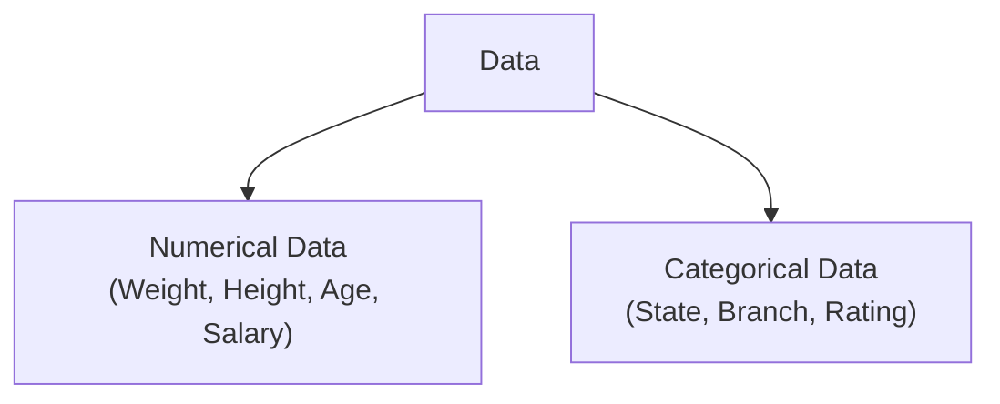
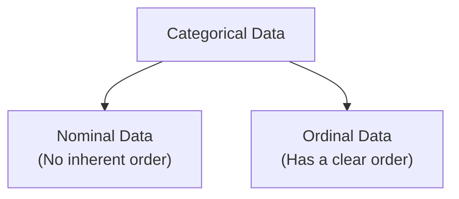
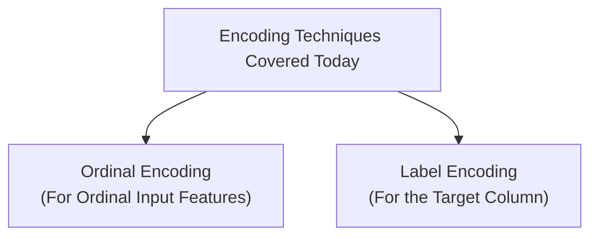
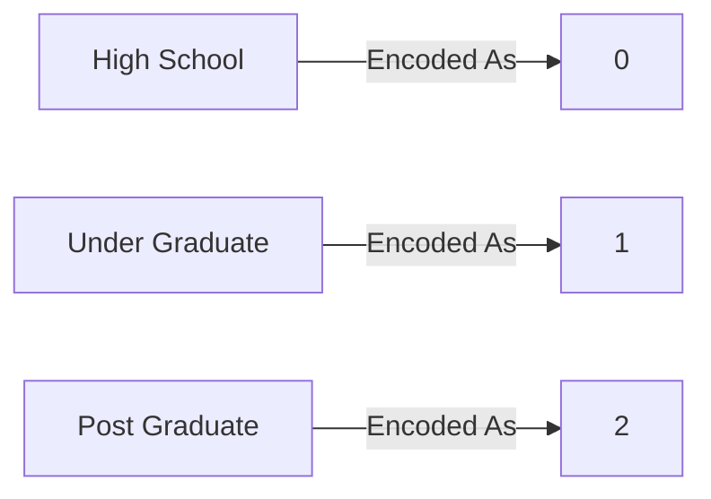

*Inspired by:* [YouTube](https://www.youtube.com/watch?v=w2GglmYHfmM)

In the previous posts, we covered **Feature Scaling** (Standardization and Normalization), one major branch of Feature Transformation. In this post, we move to the second major branch: **Encoding Categorical Data**.

This is a technique you will use in almost every machine learning project, since most real-world datasets contain at least a few categorical columns, and machine learning algorithms only understand numbers. We will cover two encoding techniques in this post: **Ordinal Encoding** and **Label Encoding**.

---

## Numerical vs. Categorical Data

Before jumping into encoding, it helps to recall how data is broadly classified:



* **Numerical Data:** Data that is naturally represented as numbers, like weight, height, or salary.
* **Categorical Data:** Data that represents categories or labels, like nationality, college branch, or a product rating.

Categorical data itself splits further into two subtypes, and this distinction is the key to picking the right encoding technique:



* **Nominal Data:** Categories that have **no relationship or order** between them. For example, `State` (West Bengal, Karnataka, Maharashtra) or `Engineering Branch` (CSE, Mechanical, Civil). You cannot say one state is "greater than" another.
* **Ordinal Data:** Categories that **do have** a clear order or ranking between them. For example, a product `Review` (Poor, Average, Good, Excellent) has an inherent ranking: Excellent is better than Good, which is better than Average, which is better than Poor.

---

## Why Do We Need to Encode Categorical Data?

Categorical data is almost always stored as strings, but machine learning algorithms only accept numbers. So the core problem is: **you must convert every categorical column into numbers before feeding it into a model.**

There are many encoding techniques available, but this post focuses on two of the most fundamental ones:



> **Note:** A third technique, **One-Hot Encoding**, is used for Nominal data. It is important enough to deserve its own dedicated post, so it is **not** covered here. It will be the focus of the next post in this series.

---

## Ordinal Encoding

**Ordinal Encoding** is used to convert **ordinal categorical input features** into numbers, in a way that **preserves the natural order** between categories.

### Worked Example

Suppose your dataset has an `Education` column with the following values:

```
Education = [High School, Under Graduate, Post Graduate]
```

This is clearly categorical, but is it Nominal or Ordinal? Since a `Post Graduate` degree is objectively "higher" than `Under Graduate`, which is "higher" than `High School`, this column has a clear order. That makes it **Ordinal data**, and a perfect candidate for Ordinal Encoding.

The key part of Ordinal Encoding is that **you** must tell the encoder what the correct order is. You specify which category should get the lowest number and which should get the highest, and the encoder does the rest:



> **Why does the order matter?** If you don't explicitly specify the category order, the encoder will assign numbers randomly (typically alphabetically). This could accidentally give `High School` a higher number than `Post Graduate`, which would introduce a **completely wrong relationship** into your data. Machine learning algorithms cannot infer real-world ranking on their own: you must supply it.

---

## Label Encoding

**Label Encoding** works almost identically to Ordinal Encoding under the hood: it converts categorical values into integers starting from `0`. The key difference is **what it is meant to be used on**.

### Ordinal Encoding vs. Label Encoding: The Key Difference

<div className="overflow-x-auto my-8">
  <table className="w-full text-left border-collapse">
    <thead>
      <tr className="border-b border-black/10 dark:border-white/10 text-amber-600 dark:text-amber-400">
        <th className="py-3 px-4 font-bold">Aspect</th>
        <th className="py-3 px-4 font-bold">Ordinal Encoding</th>
        <th className="py-3 px-4 font-bold">Label Encoding</th>
      </tr>
    </thead>
    <tbody className="divide-y divide-black/5 dark:divide-white/5">
      <tr>
        <td className="py-3 px-4 font-semibold">Used On</td>
        <td className="py-3 px-4">Input features (<code>X</code>)</td>
        <td className="py-3 px-4">Target column (<code>y</code>) only</td>
      </tr>
      <tr>
        <td className="py-3 px-4 font-semibold">Category Order</td>
        <td className="py-3 px-4">You explicitly specify the order</td>
        <td className="py-3 px-4">No control; assigned automatically</td>
      </tr>
      <tr>
        <td className="py-3 px-4 font-semibold">Scikit-Learn Class</td>
        <td className="py-3 px-4"><code>OrdinalEncoder</code></td>
        <td className="py-3 px-4"><code>LabelEncoder</code></td>
      </tr>
      <tr>
        <td className="py-3 px-4 font-semibold">Module</td>
        <td className="py-3 px-4"><code>sklearn.preprocessing</code></td>
        <td className="py-3 px-4"><code>sklearn.preprocessing</code></td>
      </tr>
    </tbody>
  </table>
</div>

This distinction is explicitly called out in scikit-learn's own documentation: `LabelEncoder` is meant to **"encode target labels with values between 0 and n_classes-1"**, and its docstring explicitly states it **"should be used to encode target values, i.e. `y`, and not the input `X`."**

For classification problems like predicting whether it will rain, whether a student will be placed, or classifying an image, your target column (`y`) is categorical (e.g., `Yes`/`No`, or class names). This is exactly the situation `LabelEncoder` was designed for. If you need to encode a categorical **input** column instead, always reach for `OrdinalEncoder`, even if that input column happens to be binary.

---

## Hands-On Walkthrough

Let's apply both techniques to a small customer dataset. Imagine we run an e-commerce store, and whenever a customer buys a product, we recommend a related product alongside it. Our dataset captures whether the customer purchased that recommended product as well.

```python
import pandas as pd

data = {
    'age': [30, 45, 22, 38, 50, 27, 33, 41, 29, 36, 48, 25],
    'gender': ['Male', 'Female', 'Female', 'Male', 'Male', 'Female',
               'Male', 'Female', 'Female', 'Male', 'Female', 'Male'],
    'review': ['Good', 'Average', 'Poor', 'Good', 'Average', 'Good',
               'Poor', 'Average', 'Good', 'Poor', 'Good', 'Average'],
    'education': ['Under Graduate', 'Post Graduate', 'High School', 'Under Graduate',
                  'Post Graduate', 'Under Graduate', 'High School', 'Post Graduate',
                  'Under Graduate', 'High School', 'Post Graduate', 'Under Graduate'],
    'purchased': ['Yes', 'No', 'No', 'Yes', 'Yes', 'No',
                  'No', 'Yes', 'Yes', 'No', 'Yes', 'No'],
}
df = pd.DataFrame(data)
df.head()
```

<MdxImage src="/images/ch17-customer-data-head.png" alt="DataFrame output showing the first five rows of the customer dataset with age, gender, review, education, and purchased columns" className="w-full h-auto" />

### Step 1: Identify Each Column's Type

Before writing any encoding code, always classify each column first:

<div className="overflow-x-auto my-8">
  <table className="w-full text-left border-collapse">
    <thead>
      <tr className="border-b border-black/10 dark:border-white/10 text-amber-600 dark:text-amber-400">
        <th className="py-3 px-4 font-bold">Column</th>
        <th className="py-3 px-4 font-bold">Type</th>
        <th className="py-3 px-4 font-bold">Reasoning</th>
      </tr>
    </thead>
    <tbody className="divide-y divide-black/5 dark:divide-white/5">
      <tr>
        <td className="py-3 px-4 font-semibold">gender</td>
        <td className="py-3 px-4">Nominal</td>
        <td className="py-3 px-4">No order between Male and Female</td>
      </tr>
      <tr>
        <td className="py-3 px-4 font-semibold">review</td>
        <td className="py-3 px-4">Ordinal</td>
        <td className="py-3 px-4">Poor &lt; Average &lt; Good</td>
      </tr>
      <tr>
        <td className="py-3 px-4 font-semibold">education</td>
        <td className="py-3 px-4">Ordinal</td>
        <td className="py-3 px-4">High School &lt; Under Graduate &lt; Post Graduate</td>
      </tr>
      <tr>
        <td className="py-3 px-4 font-semibold">purchased</td>
        <td className="py-3 px-4">Target Column</td>
        <td className="py-3 px-4">Categorical output (Yes/No); use Label Encoding</td>
      </tr>
    </tbody>
  </table>
</div>

`gender` needs One-Hot Encoding (covered in the next post), so for this walkthrough we will focus only on `review` and `education` as input features, and `purchased` as the target.

### Step 2: Train-Test Split (Before Encoding)

Just like with feature scaling, you must always split your data **before** fitting any encoder, to avoid Data Leakage:

```python
from sklearn.model_selection import train_test_split

X = df[['review', 'education']]
y = df['purchased']

X_train, X_test, y_train, y_test = train_test_split(
    X, y, test_size=0.25, random_state=42
)
```

### Step 3: Apply Ordinal Encoding to the Input Features

```python
from sklearn.preprocessing import OrdinalEncoder

oe = OrdinalEncoder(categories=[
    ['Poor', 'Average', 'Good'],
    ['High School', 'Under Graduate', 'Post Graduate'],
])

# Fit ONLY on the training data
oe.fit(X_train)

# Transform both training and testing sets
X_train_enc = oe.transform(X_train)
X_test_enc = oe.transform(X_test)
```

The `categories` parameter takes a list of lists: one list per column, in the exact order the columns appear in `X`. Each inner list must be ordered from **lowest** to **highest** rank. This is how you tell the encoder about the real-world order: without it, the mapping would be decided randomly.

Once fit, the encoder exposes the categories it learned via `oe.categories_`:

```python
print(oe.categories_)
```

```
[array(['Poor', 'Average', 'Good'], dtype=object),
 array(['High School', 'Under Graduate', 'Post Graduate'], dtype=object)]
```

### Output: Before vs. After

<div className="overflow-x-auto my-8">
  <table className="w-full text-left border-collapse">
    <thead>
      <tr className="border-b border-black/10 dark:border-white/10 text-amber-600 dark:text-amber-400">
        <th className="py-3 px-4 font-bold">review (raw)</th>
        <th className="py-3 px-4 font-bold">education (raw)</th>
        <th className="py-3 px-4 font-bold">review (encoded)</th>
        <th className="py-3 px-4 font-bold">education (encoded)</th>
      </tr>
    </thead>
    <tbody className="divide-y divide-black/5 dark:divide-white/5">
      <tr>
        <td className="py-3 px-4">Good</td>
        <td className="py-3 px-4">Under Graduate</td>
        <td className="py-3 px-4"><strong>2.0</strong></td>
        <td className="py-3 px-4"><strong>1.0</strong></td>
      </tr>
      <tr>
        <td className="py-3 px-4">Good</td>
        <td className="py-3 px-4">Under Graduate</td>
        <td className="py-3 px-4"><strong>2.0</strong></td>
        <td className="py-3 px-4"><strong>1.0</strong></td>
      </tr>
      <tr>
        <td className="py-3 px-4">Poor</td>
        <td className="py-3 px-4">High School</td>
        <td className="py-3 px-4"><strong>0.0</strong></td>
        <td className="py-3 px-4"><strong>0.0</strong></td>
      </tr>
      <tr>
        <td className="py-3 px-4">Average</td>
        <td className="py-3 px-4">Post Graduate</td>
        <td className="py-3 px-4"><strong>1.0</strong></td>
        <td className="py-3 px-4"><strong>2.0</strong></td>
      </tr>
      <tr>
        <td className="py-3 px-4">Average</td>
        <td className="py-3 px-4">Under Graduate</td>
        <td className="py-3 px-4"><strong>1.0</strong></td>
        <td className="py-3 px-4"><strong>1.0</strong></td>
      </tr>
    </tbody>
  </table>
</div>

Notice how the order is fully preserved: `Poor` always maps to `0.0`, `Average` to `1.0`, and `Good` to `2.0`, exactly as we specified in the `categories` list. The same holds for `education`.

### Step 4: Apply Label Encoding to the Target Column

```python
from sklearn.preprocessing import LabelEncoder

le = LabelEncoder()

# Fit ONLY on the training target
le.fit(y_train)

y_train_enc = le.transform(y_train)
y_test_enc = le.transform(y_test)
```

Notice that `LabelEncoder()` takes **no `categories` parameter**. Unlike `OrdinalEncoder`, you have no control over which class becomes `0` and which becomes `1`: it is decided automatically (alphabetically, by default). This is by design, since a binary or nominal target column has no meaningful order for the encoder to preserve in the first place.

```python
print(le.classes_)
```

```
['No' 'Yes']
```

Because `classes_` is sorted alphabetically, `No` becomes `0` and `Yes` becomes `1`:

<div className="overflow-x-auto my-8">
  <table className="w-full text-left border-collapse">
    <thead>
      <tr className="border-b border-black/10 dark:border-white/10 text-amber-600 dark:text-amber-400">
        <th className="py-3 px-4 font-bold">purchased (raw)</th>
        <th className="py-3 px-4 font-bold">purchased (encoded)</th>
      </tr>
    </thead>
    <tbody className="divide-y divide-black/5 dark:divide-white/5">
      <tr><td className="py-3 px-4">Yes</td><td className="py-3 px-4"><strong>1</strong></td></tr>
      <tr><td className="py-3 px-4">No</td><td className="py-3 px-4"><strong>0</strong></td></tr>
      <tr><td className="py-3 px-4">No</td><td className="py-3 px-4"><strong>0</strong></td></tr>
      <tr><td className="py-3 px-4">No</td><td className="py-3 px-4"><strong>0</strong></td></tr>
      <tr><td className="py-3 px-4">No</td><td className="py-3 px-4"><strong>0</strong></td></tr>
    </tbody>
  </table>
</div>

> **A Common Mistake:** It is tempting to reach for `LabelEncoder` on any categorical column, input or target, since the code looks almost identical to `OrdinalEncoder`. Reading scikit-learn's documentation closely shows this is explicitly discouraged for input features: `LabelEncoder` was purpose-built for target labels only. Always use `OrdinalEncoder` for input columns instead, even when there are only two categories.

---

## The Manual Overhead (And a Preview of What Fixes It)

Notice how many separate steps this required: pull out `review` and `education` for `OrdinalEncoder`, pull out `purchased` separately for `LabelEncoder`, and (if we were handling `gender` here too) pull it out a third time for One-Hot Encoding, before finally combining everything back together.

Doing this manually for every project is tedious and error-prone. A dedicated tool called **`ColumnTransformer`** exists specifically to streamline this: it lets you define separate transformation pipelines for different columns and applies them all in a single step. `ColumnTransformer` has not been covered yet in this series, but it will be the subject of a future post once we've covered all the individual encoding techniques.

---

## Summary Cheat Sheet

<div className="overflow-x-auto my-8">
  <table className="w-full text-left border-collapse">
    <thead>
      <tr className="border-b border-black/10 dark:border-white/10 text-amber-600 dark:text-amber-400">
        <th className="py-3 px-4 font-bold">Property / Aspect</th>
        <th className="py-3 px-4 font-bold">Ordinal Encoding</th>
        <th className="py-3 px-4 font-bold">Label Encoding</th>
      </tr>
    </thead>
    <tbody className="divide-y divide-black/5 dark:divide-white/5">
      <tr>
        <td className="py-3 px-4 font-semibold">Applies To</td>
        <td className="py-3 px-4">Ordinal input features (<code>X</code>)</td>
        <td className="py-3 px-4">Target column (<code>y</code>)</td>
      </tr>
      <tr>
        <td className="py-3 px-4 font-semibold">Order Control</td>
        <td className="py-3 px-4">Manually specified via <code>categories</code></td>
        <td className="py-3 px-4">Automatic (alphabetical by default)</td>
      </tr>
      <tr>
        <td className="py-3 px-4 font-semibold">Scikit-Learn Class</td>
        <td className="py-3 px-4"><code>sklearn.preprocessing.OrdinalEncoder</code></td>
        <td className="py-3 px-4"><code>sklearn.preprocessing.LabelEncoder</code></td>
      </tr>
      <tr>
        <td className="py-3 px-4 font-semibold">Learned Attribute</td>
        <td className="py-3 px-4"><code>categories_</code></td>
        <td className="py-3 px-4"><code>classes_</code></td>
      </tr>
      <tr>
        <td className="py-3 px-4 font-semibold">Key Best Practice</td>
        <td className="py-3 px-4">Fit ONLY on <code>X_train</code> to prevent Data Leakage</td>
        <td className="py-3 px-4">Fit ONLY on <code>y_train</code> to prevent Data Leakage</td>
      </tr>
    </tbody>
  </table>
</div>

---

## What's Next?

In this post, we covered the two types of categorical data (Nominal and Ordinal), Ordinal Encoding for ordered input features, Label Encoding for target columns, the key difference between the two, and a hands-on walkthrough with scikit-learn.

In the next post, we will cover **One-Hot Encoding**, the technique used for Nominal categorical data, which has no inherent order between its categories.
