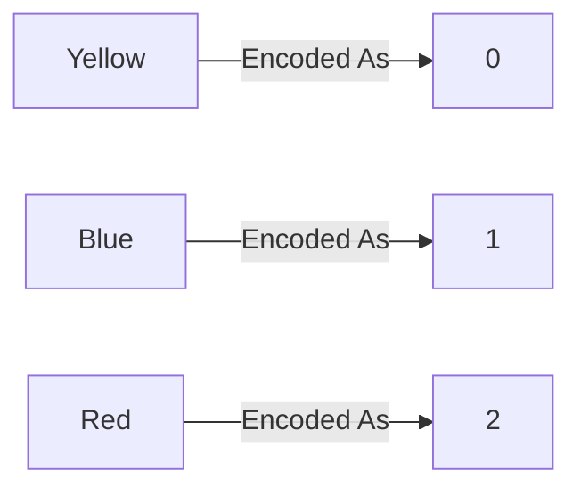

*Video Reference:* [YouTube](https://www.youtube.com/watch?v=U5oCv3JKWKA)

In the previous post, we covered **Ordinal Encoding** and **Label Encoding**, both of which work by assigning an integer to each category. That approach works fine when the categories have a natural order, like `High School < Under Graduate < Post Graduate`. But what happens when the categories have **no order at all**, like a `Color` column with values `Yellow`, `Blue`, and `Red`? In this post, we cover the technique built for exactly that situation: **One-Hot Encoding**.

---

## Why Ordinal Encoding Breaks Down for Nominal Data

Recall from the last post that **Nominal Data** is categorical data with no inherent order between its values. `Color`, `Engineering Branch`, and `State` are all nominal: there is no sense in which `Blue` is "greater than" `Yellow`.

If you naively ran an `Color` column through `OrdinalEncoder` anyway, it would still produce a result:



The problem is that this encoding **invents a ranking that does not exist**. The numbers now imply `Red > Blue > Yellow`, and that `Red` is "twice as far" from `Yellow` as `Blue` is. A machine learning algorithm has no way to know this relationship is fake: it will treat it as real, and that false relationship can distort the model. Nominal data needs an encoding strategy that turns categories into numbers **without** implying any order or magnitude between them.

---

## One-Hot Encoding

**One-Hot Encoding (OHE)** solves this by giving up on the idea of a single number per category entirely. Instead, it creates **one new column per category**, and marks each row with a `1` in the column matching its category and `0` everywhere else.

For our `Color` column with three categories, OHE produces three new columns:

<div className="overflow-x-auto my-8">
  <table className="w-full text-left border-collapse">
    <thead>
      <tr className="border-b border-black/10 dark:border-white/10 text-amber-600 dark:text-amber-400">
        <th className="py-3 px-4 font-bold">color</th>
        <th className="py-3 px-4 font-bold">color_Yellow</th>
        <th className="py-3 px-4 font-bold">color_Blue</th>
        <th className="py-3 px-4 font-bold">color_Red</th>
      </tr>
    </thead>
    <tbody className="divide-y divide-black/5 dark:divide-white/5">
      <tr>
        <td className="py-3 px-4">Yellow</td>
        <td className="py-3 px-4"><strong>1</strong></td>
        <td className="py-3 px-4">0</td>
        <td className="py-3 px-4">0</td>
      </tr>
      <tr>
        <td className="py-3 px-4">Blue</td>
        <td className="py-3 px-4">0</td>
        <td className="py-3 px-4"><strong>1</strong></td>
        <td className="py-3 px-4">0</td>
      </tr>
      <tr>
        <td className="py-3 px-4">Red</td>
        <td className="py-3 px-4">0</td>
        <td className="py-3 px-4">0</td>
        <td className="py-3 px-4"><strong>1</strong></td>
      </tr>
    </tbody>
  </table>
</div>

Each row's category is now represented as a **vector** instead of a single number, and no column is treated as bigger or smaller than another. This is the whole point of one-hot encoding: it converts a nominal column into numbers while staying neutral about any relationship between the categories.

> **Watch the dimensionality.** If a column has `N` distinct categories, one-hot encoding creates `N` new columns. A column with 3 categories is no problem, but a column with 50 categories turns into 50 new columns. This directly increases the width of your dataset and slows down training. We'll cover how to handle this case later in this post.

---

## The Dummy Variable Trap

There is a subtlety with one-hot encoding that is important to understand before using it: once you one-hot encode a column, the new columns it creates (called **dummy variables**) always sum to exactly `1` across every row, since each row belongs to exactly one category. Looking at the table above, `color_Yellow + color_Blue + color_Red` is always `1`, no matter which row you pick.

This means one of the three columns can always be perfectly predicted from the other two: `color_Red = 1 - color_Yellow - color_Blue`. In other words, the columns are not independent of each other; they have a built-in mathematical relationship. This is a specific case of a broader problem called **multicollinearity**, where one input column can be derived from a linear combination of other input columns. Multicollinearity is a problem for models like Linear Regression and Logistic Regression, which assume that input columns are independent of one another.

The fix is simple: **drop one of the dummy columns**. With `N - 1` columns, you can still represent all `N` categories without any loss of information: a row where every remaining dummy column is `0` simply means the dropped category applies.

<div className="overflow-x-auto my-8">
  <table className="w-full text-left border-collapse">
    <thead>
      <tr className="border-b border-black/10 dark:border-white/10 text-amber-600 dark:text-amber-400">
        <th className="py-3 px-4 font-bold">color</th>
        <th className="py-3 px-4 font-bold">color_Blue</th>
        <th className="py-3 px-4 font-bold">color_Red</th>
      </tr>
    </thead>
    <tbody className="divide-y divide-black/5 dark:divide-white/5">
      <tr>
        <td className="py-3 px-4">Yellow</td>
        <td className="py-3 px-4">0</td>
        <td className="py-3 px-4">0</td>
      </tr>
      <tr>
        <td className="py-3 px-4">Blue</td>
        <td className="py-3 px-4"><strong>1</strong></td>
        <td className="py-3 px-4">0</td>
      </tr>
      <tr>
        <td className="py-3 px-4">Red</td>
        <td className="py-3 px-4">0</td>
        <td className="py-3 px-4"><strong>1</strong></td>
      </tr>
    </tbody>
  </table>
</div>

`Yellow` is now represented by both dummy columns being `0`, with no information lost. Falling into this trap by keeping all `N` columns is called the **Dummy Variable Trap**, and it's why most one-hot encoding tools include a built-in option to drop the first category.

---

## Hands-On Walkthrough

Let's apply one-hot encoding to a small used-car dataset, where the goal is to predict a car's `selling_price` from its `brand`, `km_driven`, `fuel` type, and `owner` history.

```python
import pandas as pd

df.head()
```

```
      brand  km_driven    fuel         owner  selling_price
0      Ford      61214  Diesel  Second Owner         634299
1   Hyundai     109179  Diesel   Third Owner         369963
2  Mahindra      55818  Diesel   First Owner         816326
3      Tata      64377  Diesel   First Owner         220313
4     Honda      58525  Diesel  Second Owner         383841
```

```python
df.shape
```

```
(96, 5)
```

### Step 1: Identify Each Column's Type

<div className="overflow-x-auto my-8">
  <table className="w-full text-left border-collapse">
    <thead>
      <tr className="border-b border-black/10 dark:border-white/10 text-amber-600 dark:text-amber-400">
        <th className="py-3 px-4 font-bold">Column</th>
        <th className="py-3 px-4 font-bold">Type</th>
        <th className="py-3 px-4 font-bold">Reasoning</th>
      </tr>
    </thead>
    <tbody className="divide-y divide-black/5 dark:divide-white/5">
      <tr>
        <td className="py-3 px-4 font-semibold">brand</td>
        <td className="py-3 px-4">Nominal (High Cardinality)</td>
        <td className="py-3 px-4">No order between brands; 11 distinct values</td>
      </tr>
      <tr>
        <td className="py-3 px-4 font-semibold">km_driven</td>
        <td className="py-3 px-4">Numerical</td>
        <td className="py-3 px-4">Already a number, no encoding needed</td>
      </tr>
      <tr>
        <td className="py-3 px-4 font-semibold">fuel</td>
        <td className="py-3 px-4">Nominal</td>
        <td className="py-3 px-4">No order between Diesel, Petrol, CNG, LPG</td>
      </tr>
      <tr>
        <td className="py-3 px-4 font-semibold">owner</td>
        <td className="py-3 px-4">Nominal</td>
        <td className="py-3 px-4">No order between First Owner, Second Owner, etc.</td>
      </tr>
      <tr>
        <td className="py-3 px-4 font-semibold">selling_price</td>
        <td className="py-3 px-4">Target Column</td>
        <td className="py-3 px-4">Already numerical (regression target)</td>
      </tr>
    </tbody>
  </table>
</div>

`fuel` and `owner` have a manageable number of categories, so we'll one-hot encode them directly. `brand` has 11 distinct values, some with very few rows, so we'll handle it separately later in this post.

```python
df['fuel'].value_counts()
```

```
fuel
Diesel    46
Petrol    37
CNG        8
LPG        5
Name: count, dtype: int64
```

```python
df['owner'].value_counts()
```

```
owner
First Owner             50
Second Owner            23
Third Owner              11
Fourth & Above Owner      9
Test Drive Car            3
Name: count, dtype: int64
```

### Step 2: One-Hot Encoding with `pd.get_dummies()`

The quickest way to try one-hot encoding is pandas' built-in `get_dummies()` function:

```python
df_ohe = pd.get_dummies(df, columns=['fuel', 'owner'])
df_ohe.shape
```

```
(96, 12)
```

We started with 5 columns. `fuel` (4 categories) and `owner` (5 categories) were removed and replaced with 4 + 5 = 9 new columns, for a net gain of 7 columns:

```python
list(df_ohe.columns)
```

```
['brand', 'km_driven', 'selling_price', 'fuel_CNG', 'fuel_Diesel',
 'fuel_LPG', 'fuel_Petrol', 'owner_First Owner',
 'owner_Fourth & Above Owner', 'owner_Second Owner',
 'owner_Test Drive Car', 'owner_Third Owner']
```

This hasn't dealt with the Dummy Variable Trap yet: all 4 `fuel_*` columns and all 5 `owner_*` columns are still present. `get_dummies()` has a `drop_first` parameter built in for exactly this:

```python
df_ohe_drop = pd.get_dummies(df, columns=['fuel', 'owner'], drop_first=True)
df_ohe_drop.shape
```

```
(96, 10)
```

```python
list(df_ohe_drop.columns)
```

```
['brand', 'km_driven', 'selling_price', 'fuel_Diesel', 'fuel_LPG',
 'fuel_Petrol', 'owner_Fourth & Above Owner', 'owner_Second Owner',
 'owner_Test Drive Car', 'owner_Third Owner']
```

`fuel_CNG` and `owner_First Owner` (the alphabetically first category in each column) were dropped, bringing us down to 10 columns and avoiding multicollinearity between the dummy columns.

> **Why not just use `get_dummies()` everywhere?** It's quick for exploration, but it isn't suited for a real machine learning pipeline. `get_dummies()` doesn't remember anything about the columns it created: it just looks at whatever categories are present in the data you pass it, each time you call it. If you call it separately on your training set and test set, and the test set happens to be missing a category (or has one the training set never saw), you can end up with a **different number of columns** in each, which breaks your model. For a real project, you want an object that learns the categories once and applies that exact same mapping every time: that's what scikit-learn's `OneHotEncoder` class is for.

### Step 3: One-Hot Encoding with scikit-learn's `OneHotEncoder`

Just like with the other encoders, always split your data **before** fitting, to avoid Data Leakage:

```python
from sklearn.model_selection import train_test_split

X = df[['brand', 'km_driven', 'fuel', 'owner']]
y = df['selling_price']

X_train, X_test, y_train, y_test = train_test_split(
    X, y, test_size=0.25, random_state=42
)
X_train.shape
```

```
(72, 4)
```

We only want to encode `fuel` and `owner`, not `brand` or `km_driven`, so we select those two columns explicitly:

```python
import numpy as np
from sklearn.preprocessing import OneHotEncoder

ohe = OneHotEncoder(drop='first', sparse_output=False, dtype=np.int32)

# Fit ONLY on the training data
ohe.fit(X_train[['fuel', 'owner']])

X_train_new = ohe.transform(X_train[['fuel', 'owner']])
X_test_new = ohe.transform(X_test[['fuel', 'owner']])
```

`drop='first'` handles the Dummy Variable Trap the same way `drop_first=True` did above. `sparse_output=False` asks for a plain NumPy array back instead of a sparse matrix, and `dtype=np.int32` keeps the output as integers instead of floats. Once fit, the encoder remembers the categories it learned:

```python
print(ohe.categories_)
```

```
[array(['CNG', 'Diesel', 'LPG', 'Petrol'], dtype=object),
 array(['First Owner', 'Fourth & Above Owner', 'Second Owner',
        'Test Drive Car', 'Third Owner'], dtype=object)]
```

```python
print(ohe.get_feature_names_out(['fuel', 'owner']))
```

```
['fuel_Diesel' 'fuel_LPG' 'fuel_Petrol' 'owner_Fourth & Above Owner'
 'owner_Second Owner' 'owner_Test Drive Car' 'owner_Third Owner']
```

```python
X_train_new.shape
```

```
(72, 7)
```

> **What if the test set has a category the encoder never saw?** By default, `OneHotEncoder` uses `handle_unknown='error'`, so calling `.transform()` on data with a category that wasn't in `X_train` (say, a `fuel` value of `Electric`) raises a `ValueError`. Setting `handle_unknown='ignore'` instead encodes that row as all `0`s across the dummy columns for that feature, the same encoding as the dropped reference category, rather than crashing.

### Step 4: Combining the Encoded Columns Back In

`ohe.transform()` only returns the encoded `fuel` and `owner` columns; it drops everything else. To get a complete input matrix, we have to manually stitch the untouched columns (`brand`, `km_driven`) back together with the newly encoded ones:

```python
X_train_final = np.hstack((X_train[['brand', 'km_driven']].values, X_train_new))
X_train_final.shape
```

```
(72, 9)
```

```python
print(X_train_final[:3])
```

```
[['Tata' 20600 1 0 0 0 0 0 0]
 ['Toyota' 111752 1 0 0 0 0 0 0]
 ['Maruti' 47711 1 0 0 0 0 0 0]]
```

This manual stitching is tedious, and it only gets worse as you add more columns that need different treatment. A dedicated tool called **`ColumnTransformer`** exists specifically to avoid this: it lets you apply different transformers to different columns in a single step, without manually splitting and rejoining anything. It hasn't been covered in this series yet, but it will be, once all the individual encoding techniques have been introduced.

---

## Handling High-Cardinality Columns

Now back to `brand`, the column we skipped earlier. Some real-world nominal columns have far more categories than `fuel` or `owner`, and one-hot encoding every single one of them can blow up your dataset's dimensionality. Our `brand` column has 11 categories, some with plenty of cars and some with very few:

```python
df['brand'].value_counts()
```

```
brand
Maruti      18
Hyundai     16
Ford        12
Mahindra    10
Tata        10
Honda        8
Renault      8
Toyota       6
Volvo        4
Datsun       2
Jaguar       2
Name: count, dtype: int64
```

One-hot encoding all 11 brands as-is would add 11 new columns, most of which would be almost entirely `0` (since brands like `Jaguar` and `Datsun` barely appear in the data). Instead, a common approach is to keep the most frequent categories as their own columns, and **lump every rare category together into a single "uncommon" category**:

```python
counts = df['brand'].value_counts()

# Brands with fewer than 8 cars are considered rare
threshold = 8
rare_brands = counts[counts < threshold].index
print(list(rare_brands))
```

```
['Toyota', 'Volvo', 'Datsun', 'Jaguar']
```

```python
df['brand'] = df['brand'].replace(rare_brands, 'uncommon')
df['brand'].value_counts()
```

```
brand
Maruti      18
Hyundai     16
uncommon    14
Ford        12
Mahindra    10
Tata        10
Honda        8
Renault      8
Name: count, dtype: int64
```

`Toyota`, `Volvo`, `Datsun`, and `Jaguar` (each with fewer than 8 cars) have been merged into a single `uncommon` category. `brand` now has 8 categories instead of 11, and one-hot encoding it produces 8 new columns instead of 11, without discarding any rows. This threshold is a judgment call you make based on your dataset: the goal is simply to stop rare categories from each getting their own dedicated column.

---

## Summary Cheat Sheet

<div className="overflow-x-auto my-8">
  <table className="w-full text-left border-collapse">
    <thead>
      <tr className="border-b border-black/10 dark:border-white/10 text-amber-600 dark:text-amber-400">
        <th className="py-3 px-4 font-bold">Property / Aspect</th>
        <th className="py-3 px-4 font-bold">Detail</th>
      </tr>
    </thead>
    <tbody className="divide-y divide-black/5 dark:divide-white/5">
      <tr>
        <td className="py-3 px-4 font-semibold">Used For</td>
        <td className="py-3 px-4">Nominal input features (no inherent order)</td>
      </tr>
      <tr>
        <td className="py-3 px-4 font-semibold">Core Idea</td>
        <td className="py-3 px-4">One new binary column per category</td>
      </tr>
      <tr>
        <td className="py-3 px-4 font-semibold">Risk</td>
        <td className="py-3 px-4">Dummy Variable Trap (multicollinearity between dummy columns)</td>
      </tr>
      <tr>
        <td className="py-3 px-4 font-semibold">Fix for the Trap</td>
        <td className="py-3 px-4"><code>drop_first=True</code> (pandas) or <code>drop='first'</code> (scikit-learn)</td>
      </tr>
      <tr>
        <td className="py-3 px-4 font-semibold">Quick Exploration</td>
        <td className="py-3 px-4"><code>pandas.get_dummies()</code></td>
      </tr>
      <tr>
        <td className="py-3 px-4 font-semibold">Production Pipelines</td>
        <td className="py-3 px-4"><code>sklearn.preprocessing.OneHotEncoder</code> (remembers learned categories)</td>
      </tr>
      <tr>
        <td className="py-3 px-4 font-semibold">Learned Attribute</td>
        <td className="py-3 px-4"><code>categories_</code></td>
      </tr>
      <tr>
        <td className="py-3 px-4 font-semibold">High Cardinality Fix</td>
        <td className="py-3 px-4">Keep frequent categories, merge rare ones into a single "uncommon" category</td>
      </tr>
      <tr>
        <td className="py-3 px-4 font-semibold">Key Best Practice</td>
        <td className="py-3 px-4">Fit ONLY on <code>X_train</code> to prevent Data Leakage</td>
      </tr>
    </tbody>
  </table>
</div>

---

## What's Next?

In this post, we covered why Ordinal Encoding is the wrong tool for nominal data, how One-Hot Encoding represents categories as vectors instead of single numbers, the Dummy Variable Trap and why it matters for models like Linear and Logistic Regression, pandas' `get_dummies()` vs. scikit-learn's `OneHotEncoder`, and how to handle columns with a large number of categories.

With Ordinal Encoding, Label Encoding, and One-Hot Encoding all covered, the next post will introduce **`ColumnTransformer`**, the tool that ties all of these together and applies different encoders to different columns in a single step.
