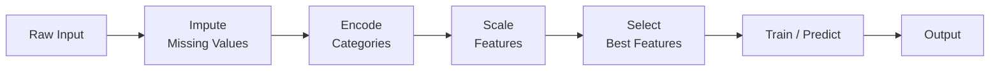

*Inspired by:* [YouTube](https://www.youtube.com/watch?v=xOccYkgRV4Q)

The last post covered `ColumnTransformer`: one object, one `fit_transform()` call, applying different preprocessing to different columns. That solves the problem of *one preprocessing step spanning several columns*. It doesn't solve a bigger problem: a real project usually needs *several* preprocessing steps, one after another, followed by a model, and every one of those steps has to be repeated, in the exact same order, on every new batch of data that comes in. That's what **`Pipeline`** is for.

---

## What Is a Pipeline?

A `Pipeline` chains multiple steps together so that the output of one step becomes the input of the next, automatically. You call `.fit()` once on the whole chain instead of calling `.fit_transform()` on each step by hand and wiring the outputs together yourself.



Say you're building a model and the raw data has missing values and categorical columns. Without a pipeline, that's three separate steps: impute the missing values, encode the categorical columns, then train the model, each one a separate object with its own `fit`/`transform` call. With a pipeline, you build the chain once. After that, you hand it raw input and it produces output, running every step internally.

---

## Why Bother? The Production Problem

The convenience during training is nice, but the real payoff shows up at deployment. Say you train a model, then wrap it in a web form: a user submits a new record, and the server needs to run it through the model and return a prediction.

That new record has to go through **exactly the same preprocessing** the training data went through: the same imputation, the same encoding, in the same order. Without a pipeline, that means:

- Exporting every individual transformer (every imputer, every encoder) alongside the model.
- Reproducing the exact preprocessing sequence by hand in the production code.
- Keeping the training script and the production script in perfect sync, forever. Change one preprocessing step during training and forget to mirror it in production, and predictions silently go wrong.

A pipeline bundles all of that into one object. Export the pipeline, and the production code just calls `.predict()` on it directly. No separate transformers to track, no preprocessing logic to duplicate.

---

## The Manual Way: Titanic Without a Pipeline

To feel the difference, it helps to see the manual version first. Using the Titanic dataset (`Survived` as the target, after dropping `PassengerId`, `Name`, `Ticket`, and `Cabin`), two columns need attention: `Age` has missing values, and `Embarked` has missing values.

**Step 1: Impute the two columns separately.** They can't share one `SimpleImputer`, since `Age` is numerical (best filled with the mean) and `Embarked` is categorical (best filled with the most frequent value):

```python
from sklearn.impute import SimpleImputer

si_age = SimpleImputer()  # default strategy='mean'
si_embarked = SimpleImputer(strategy='most_frequent')

X_train_age = si_age.fit_transform(X_train[['Age']])
X_test_age = si_age.transform(X_test[['Age']])

X_train_embarked = si_embarked.fit_transform(X_train[['Embarked']])
X_test_embarked = si_embarked.transform(X_test[['Embarked']])
```

**Step 2: One-hot encode `Sex` and `Embarked` separately.** They can't be encoded together either, since at this point `Embarked`'s missing values have already been filled in a separate array, not in the original `X_train`:

```python
from sklearn.preprocessing import OneHotEncoder

ohe_sex = OneHotEncoder(sparse_output=False, handle_unknown='ignore')
ohe_embarked = OneHotEncoder(sparse_output=False, handle_unknown='ignore')

X_train_sex = ohe_sex.fit_transform(X_train[['Sex']])
X_test_sex = ohe_sex.transform(X_test[['Sex']])

X_train_embarked_ohe = ohe_embarked.fit_transform(X_train_embarked)
X_test_embarked_ohe = ohe_embarked.transform(X_test_embarked)
```

**Step 3: Pull out the untouched columns, then concatenate everything back together, in order:**

```python
import numpy as np

X_train_rest = X_train[['Pclass', 'SibSp', 'Parch', 'Fare']].values
X_test_rest = X_test[['Pclass', 'SibSp', 'Parch', 'Fare']].values

X_train_final = np.concatenate(
    (X_train_rest, X_train_age, X_train_sex, X_train_embarked_ohe), axis=1
)
X_test_final = np.concatenate(
    (X_test_rest, X_test_age, X_test_sex, X_test_embarked_ohe), axis=1
)
```

**Step 4: Train, then export every piece separately for production:**

```python
import pickle

dtc = DecisionTreeClassifier()
dtc.fit(X_train_final, y_train)

pickle.dump(si_age, open('models/si_age.pkl', 'wb'))
pickle.dump(ohe_sex, open('models/ohe_sex.pkl', 'wb'))
pickle.dump(ohe_embarked, open('models/ohe_embarked.pkl', 'wb'))
pickle.dump(dtc, open('models/dtc.pkl', 'wb'))
```

Four separate files. And the production code that loads them has to rebuild the same four-step sequence, in the same order, by hand, every single time a new record comes in.

> **Why this doesn't scale.** Every preprocessing tweak made during training has to be re-implemented, in the same order, inside the production code, using the newly exported objects. Miss one, reorder two, and the model silently gets fed data shaped differently than it was trained on.

---

## Building a Pipeline the Easy Way

Now the same problem, built as a pipeline. The plan is five stages: impute the two problem columns, one-hot encode the categorical columns, scale everything, select the best features, then train the model.

Since the upcoming steps reference columns by position, it's worth looking at exactly what those positions are before writing any transformer:

```python
X_train.columns
```

```
Index(['Pclass', 'Sex', 'Age', 'SibSp', 'Parch', 'Fare', 'Embarked'], dtype='object')
```

<div className="overflow-x-auto my-8">
  <table className="w-full text-left border-collapse">
    <thead>
      <tr className="border-b border-black/10 dark:border-white/10 text-amber-600 dark:text-amber-400">
        <th className="py-3 px-4 font-bold">Index</th>
        <th className="py-3 px-4 font-bold">0</th>
        <th className="py-3 px-4 font-bold">1</th>
        <th className="py-3 px-4 font-bold">2</th>
        <th className="py-3 px-4 font-bold">3</th>
        <th className="py-3 px-4 font-bold">4</th>
        <th className="py-3 px-4 font-bold">5</th>
        <th className="py-3 px-4 font-bold">6</th>
      </tr>
    </thead>
    <tbody className="divide-y divide-black/5 dark:divide-white/5">
      <tr>
        <td className="py-3 px-4 font-semibold">Column</td>
        <td className="py-3 px-4"><code>Pclass</code></td>
        <td className="py-3 px-4"><code>Sex</code></td>
        <td className="py-3 px-4"><code>Age</code></td>
        <td className="py-3 px-4"><code>SibSp</code></td>
        <td className="py-3 px-4"><code>Parch</code></td>
        <td className="py-3 px-4"><code>Fare</code></td>
        <td className="py-3 px-4"><code>Embarked</code></td>
      </tr>
    </tbody>
  </table>
</div>

That's where `Age` at index `2` and `Embarked` at index `6` in Stage 1 below come from.

**Stage 1: Impute `Age` (index 2) and `Embarked` (index 6).** Inside a pipeline, `ColumnTransformer` steps must reference columns **by position, not by name**. The reason is that a `ColumnTransformer` returns a plain NumPy array, not a DataFrame, so by the time the next step in the pipeline runs, the column names are already gone:

```python
from sklearn.compose import ColumnTransformer
from sklearn.impute import SimpleImputer

trf1 = ColumnTransformer([
    ('impute_age', SimpleImputer(), [2]),
    ('impute_embarked', SimpleImputer(strategy='most_frequent'), [6]),
], remainder='passthrough')
```

`ColumnTransformer` always places its transformed columns first, then the passthrough columns after, in their original relative order. So after `trf1` runs, the seven columns (`Pclass`, `Sex`, `Age`, `SibSp`, `Parch`, `Fare`, `Embarked`) come out reordered as `Age, Embarked, Pclass, Sex, SibSp, Parch, Fare`, at positions `0` through `6`.

**Stage 2: One-hot encode `Sex` and `Embarked`, now at positions 3 and 1 in that new order:**

```python
from sklearn.preprocessing import OneHotEncoder

trf2 = ColumnTransformer([
    ('ohe', OneHotEncoder(sparse_output=False, handle_unknown='ignore'), [1, 3]),
], remainder='passthrough')
```

This is the part worth tracking on paper the first few times: `Sex` has 2 categories and `Embarked` has 3, so this step turns those 2 columns into 5. Combined with the 5 untouched columns passed through (`Age`, `Pclass`, `SibSp`, `Parch`, `Fare`), the output of `trf2` has 10 columns total.

**Stage 3: Scale everything.** Since every column is numeric by this point, this step doesn't need a `ColumnTransformer` wrapper at all; `MinMaxScaler` can just apply to the whole array directly. `MinMaxScaler` is the right choice here, not `StandardScaler`, because the next step needs non-negative values:

```python
from sklearn.preprocessing import MinMaxScaler

trf3 = MinMaxScaler()
```

**Stage 4: Select the best features.** `SelectKBest` with the `chi2` scoring function needs non-negative input, which is exactly what `MinMaxScaler` guarantees. This also doesn't need a `ColumnTransformer`, just the object itself:

```python
from sklearn.feature_selection import SelectKBest, chi2

trf4 = SelectKBest(score_func=chi2, k=5)
```

**Stage 5: The model.**

```python
from sklearn.tree import DecisionTreeClassifier

trf5 = DecisionTreeClassifier()
```

**Assemble all five into one `Pipeline`:**

```python
from sklearn.pipeline import Pipeline

pipe = Pipeline([
    ('trf1', trf1),
    ('trf2', trf2),
    ('trf3', trf3),
    ('trf4', trf4),
    ('trf5', trf5),
])

pipe.fit(X_train, y_train)
```

Notice the tuples here only need `(name, transformer)`, two items, unlike `ColumnTransformer`'s `(name, transformer, columns)`. A pipeline step operates on the entire output of the step before it, so there's no column list to pass.

> **`Pipeline` vs. `make_pipeline`.** scikit-learn also offers `make_pipeline(trf1, trf2, trf3, trf4, trf5)`, which skips naming each step and auto-generates names from the class names instead. It's shorter, but explicit names via `Pipeline` are worth the extra typing: they make a step easy to reference later, for debugging or for hyperparameter tuning.

**`fit` vs. `fit_transform`.** Whether you call `.fit()` or `.fit_transform()` on a pipeline depends on what's at the end of it. A pipeline ending in an estimator, like `trf5` here, behaves like an estimator: call `.fit()` to train it, and `.predict()` to get predictions. A pipeline made up of *only* preprocessing steps, with no model at the end, has nothing to "predict", so you call `.fit_transform()` on it instead, the same as any individual transformer.

---

## Visualizing and Inspecting a Fitted Pipeline

Once `pipe` is built, `set_config` renders an interactive diagram of the whole chain, useful for a quick sanity check that every step is wired up the way you expect:

```python
from sklearn import set_config

set_config(display='diagram')
pipe
```

To dig into what a specific step actually learned, `named_steps` returns a dictionary keyed by the names you gave each step:

```python
pipe.named_steps['trf1']
```

From there, a fitted `ColumnTransformer`'s `.transformers_` attribute lists its fitted sub-transformers, and something like a `SimpleImputer`'s `.statistics_` attribute reveals what it actually learned, the mean it computed for `Age`, or the most frequent value it found for `Embarked`:

```python
pipe.named_steps['trf1'].transformers_[0][1].statistics_  # mean used to fill Age
pipe.named_steps['trf1'].transformers_[1][1].statistics_  # most frequent value for Embarked
```

This is the fastest way to debug a pipeline that isn't behaving as expected: walk into the specific step, and check what it actually fit.

---

## Deploying a Pipeline to Production

Exporting a pipeline is exactly like exporting a single model, because it *is* a single object:

```python
import pickle

pickle.dump(pipe, open('models/pipe.pkl', 'wb'))
```

One file instead of four. The production code loads it back and calls `.predict()` directly on raw input, no manual imputation or encoding step in sight:

```python
import pickle
import pandas as pd

pipe = pickle.load(open('models/pipe.pkl', 'rb'))

test_input = pd.DataFrame([{
    'Pclass': 2, 'Sex': 'male', 'Age': 31, 'SibSp': 0,
    'Parch': 0, 'Fare': 10.5, 'Embarked': 'S',
}])

pipe.predict(test_input)
```

This is the actual payoff. Go back and change any preprocessing step, retrain, and re-export `pipe.pkl`, then drop the new file into the same location on the server. **The production code itself never has to change.** Compare that to the manual approach, where a single tweak to preprocessing means re-implementing that same tweak, in the same order, in a completely separate script.

---

## Summary Cheat Sheet

<div className="overflow-x-auto my-8">
  <table className="w-full text-left border-collapse">
    <thead>
      <tr className="border-b border-black/10 dark:border-white/10 text-amber-600 dark:text-amber-400">
        <th className="py-3 px-4 font-bold">Property / Aspect</th>
        <th className="py-3 px-4 font-bold">Detail</th>
      </tr>
    </thead>
    <tbody className="divide-y divide-black/5 dark:divide-white/5">
      <tr>
        <td className="py-3 px-4 font-semibold">Used For</td>
        <td className="py-3 px-4">Chaining preprocessing steps and a model into one object</td>
      </tr>
      <tr>
        <td className="py-3 px-4 font-semibold">Import</td>
        <td className="py-3 px-4"><code>sklearn.pipeline.Pipeline</code> (or <code>make_pipeline</code>)</td>
      </tr>
      <tr>
        <td className="py-3 px-4 font-semibold">Core Argument</td>
        <td className="py-3 px-4">A list of <code>(name, transformer)</code> tuples, run in order</td>
      </tr>
      <tr>
        <td className="py-3 px-4 font-semibold">Column References</td>
        <td className="py-3 px-4">Must use index, not name; a <code>ColumnTransformer</code> step returns an array, not a DataFrame</td>
      </tr>
      <tr>
        <td className="py-3 px-4 font-semibold">Ends in a Model?</td>
        <td className="py-3 px-4">Yes: use <code>.fit()</code> / <code>.predict()</code>. No: use <code>.fit_transform()</code> / <code>.transform()</code></td>
      </tr>
      <tr>
        <td className="py-3 px-4 font-semibold">Inspecting</td>
        <td className="py-3 px-4"><code>set_config(display='diagram')</code> to visualize, <code>.named_steps</code> to introspect fitted values</td>
      </tr>
      <tr>
        <td className="py-3 px-4 font-semibold">Production</td>
        <td className="py-3 px-4">Export the whole pipeline as one file; production code calls <code>.predict()</code> directly, never changes</td>
      </tr>
    </tbody>
  </table>
</div>

---

## What's Next?

In this post, we saw why chaining preprocessing steps by hand becomes a liability the moment a model reaches production, then rebuilt the same workflow as a single `Pipeline`, from imputation through feature selection to the final model. Two things fit naturally on top of a pipeline and are worth knowing about: **Cross-Validation**, running a pipeline across several train/validation splits with `cross_val_score(pipe, X_train, y_train, cv=5)` instead of trusting a single split, and **Hyperparameter Tuning** with `GridSearchCV`, which can tune a parameter buried inside a named pipeline step using the `stepname__paramname` syntax, for example `trf5__max_depth`.
