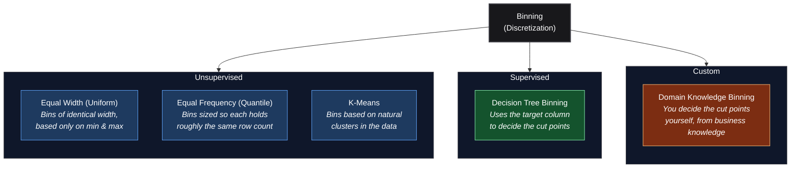

*Inspired by:* [YouTube](https://www.youtube.com/watch?v=kKWsJGKcMvo&t=1930s&pp=ugUEEgJoaQ%3D%3D)

So far in this feature engineering series, most of the work has gone one direction: taking messy categorical data and turning it into numbers a model can use. This post flips that around. Sometimes a numerical column actually works better once it's converted into categories. The two techniques for doing that are **Discretization** (also called Binning) and **Binarization**.

---

## Why Turn Numbers Into Categories?

Picture a Google Play Store dataset with a "Number of Downloads" column. Some apps have a huge number of downloads, most have very few, and the raw numbers are scattered all over the place: some tiny, some in the millions. Instead of using the raw count, you could group it into buckets like "1M+ downloads", "100K+ downloads", "10K+ downloads", and so on.

That's exactly what discretization does. Grouping the raw numbers into a handful of buckets turned a messy, spread-out column into a clean categorical one, and made a real machine learning problem easier to work with. That's the motivation for this whole post: sometimes your numerical data has a better representation as categories.

---

## What Is Discretization (Binning)?

**Discretization** is the process of transforming a continuous numerical column into a discrete one by creating a set of intervals, called **bins**, and sorting every value into whichever bin it falls into. It's also commonly called **Binning**. Think of a histogram: you're doing exactly the same thing a histogram does when it groups values into bars, except here the output is a new column you can actually use as a feature.

Binning gives you two concrete benefits:

- **It handles outliers better.** An extreme value at the far end of the data gets placed into the last bin along with other values in that same range. Once it's in a bin, it's treated exactly the same as its neighbors, so the model no longer sees it as a wild extreme value.
- **It can improve the value spread.** If most of your data is bunched up in one area, certain binning strategies can spread that bunched-up data out more evenly across bins.

> **Binning turns "this value is 47,382,910" into "this value is in the top bucket."** The exact number stops mattering; only which group it belongs to does.

---

## Three Categories of Binning



This post focuses on the three unsupervised techniques, plus a quick look at custom binning. Decision Tree binning uses the target column to pick cut points, which is a big enough topic to deserve its own dedicated post later.

---

## Equal Width (Uniform) Binning

This is the simplest version, and it works exactly like drawing a histogram. You pick how many bins you want, and the column's range gets sliced into that many equal-width chunks:

```
bin_width = (max_value - min_value) / number_of_bins
```

Say a column ranges from 0 to 100 and you ask for 10 bins. Each bin is 10 units wide: `0-10`, `10-20`, `20-30`, and so on up to `90-100`. Every value gets sorted into whichever slice it falls in.

**What it's good for:** handling outliers. A value way out at the top of the range just lands in the last bin along with everything else near it, and gets treated like any other value in that bin.

**What it doesn't do:** change how the data is spread out. If most of your values were bunched up in the middle before binning, they're still bunched up into the same few middle bins after binning. The shape of the distribution stays the same; it's just chopped into discrete steps now.

---

## Equal Frequency (Quantile) Binning

Here the goal flips: instead of making every bin the same *width*, you make every bin hold roughly the same *number of rows*. This is also called **Quantile Binning**, because the cut points come from percentiles.

Say you ask for 10 bins. The first bin runs from the minimum value up to the 10th percentile, so it holds about 10% of the data. The second bin runs from the 10th percentile to the 20th percentile, holding another 10%, and so on, all the way to the 100th percentile. The bins themselves can be very different widths: a bin covering a crowded part of the data might be narrow, while a bin covering a sparse stretch might be wide. What stays consistent is the *count* of rows in each one.

Quantile binning gives you two benefits at once:

- It handles outliers just as well as Equal Width binning.
- It also evens out the value spread, since by construction every bin ends up with a similar number of items.

Because of that second benefit, Quantile binning tends to get used more often than Equal Width, and it's the strategy scikit-learn reaches for by default.

---

## K-Means Binning

This one is different: instead of slicing the range or the percentiles, it looks for natural groupings in the data using the **K-Means** clustering algorithm.

K-Means works like this:

1. Randomly place a handful of "centroids" (cluster centers) somewhere among the data.
2. Assign every point to whichever centroid is closest to it. Each centroid now "owns" a group of points.
3. Move each centroid to the actual mean position of the points assigned to it.
4. Repeat steps 2 and 3. Points get reassigned to whichever centroid is now closest, centroids shift again, and this continues until nothing changes anymore.

Once it settles, each centroid represents one bin, and every point belongs to the bin of its nearest centroid. The bin edges themselves fall at the midpoint between each pair of neighboring centroids.

Here's that process on a synthetic column with three natural clumps of values (150, 400, and 100 points respectively, with real gaps between them): three centroids are dropped in randomly, then K-Means reassigns points and slides the centroids to the mean of their group until nothing moves anymore.

<MdxImage src="/images/ch23-kmeans-binning-steps.png" alt="Two scatter panels: the first shows three randomly placed centroids over a column of clustered data, the second shows the converged centroids after K-Means, colored by cluster, with dotted bin-edge lines sitting in the gaps between clusters" className="w-full h-auto rounded-lg my-6" />

Notice where the final dotted bin-edge lines land: right in the empty gaps between clusters, not through the middle of any of them. That's the key difference from Equal Width or Quantile binning, which don't know anything about where the data actually clusters:

<MdxImage src="/images/ch23-binning-strategy-comparison.png" alt="Three stacked histograms of the same clustered column, each with a different binning strategy's edges overlaid: Equal Width and Quantile both cut an edge through the middle cluster, while K-Means places both edges cleanly in the gaps between clusters" className="w-full h-auto rounded-lg my-6" />

Equal Width slices a bin edge straight through the middle cluster because it only looks at min and max, it has no idea that a cluster boundary sits nearby. Quantile does a little better but still drops both of its edges inside that same middle cluster, since it's just chasing an equal row count per bin and that cluster happens to hold most of the data. K-Means is the only one of the three that actually looks at the shape of the data and lands its edges in the natural gaps, which is exactly why it's the strategy to reach for when a column looks clustered rather than smoothly spread out.

K-Means binning is most useful when your data naturally clumps into groups, with visible gaps between clusters rather than one smooth spread. If the data doesn't have that clustered shape, Equal Width or Quantile binning generally does a fine job on their own.

---

## `KBinsDiscretizer` in scikit-learn

All three unsupervised strategies above are available through a single class: `KBinsDiscretizer`. You control it with three parameters:

<div className="overflow-x-auto my-8">
  <table className="w-full text-left border-collapse">
    <thead>
      <tr className="border-b border-black/10 dark:border-white/10 text-amber-600 dark:text-amber-400">
        <th className="py-3 px-4 font-bold">Parameter</th>
        <th className="py-3 px-4 font-bold">What It Controls</th>
      </tr>
    </thead>
    <tbody className="divide-y divide-black/5 dark:divide-white/5">
      <tr>
        <td className="py-3 px-4 font-semibold"><code>n_bins</code></td>
        <td className="py-3 px-4">How many bins to create</td>
      </tr>
      <tr>
        <td className="py-3 px-4 font-semibold"><code>strategy</code></td>
        <td className="py-3 px-4"><code>'uniform'</code>, <code>'quantile'</code>, or <code>'kmeans'</code></td>
      </tr>
      <tr>
        <td className="py-3 px-4 font-semibold"><code>encode</code></td>
        <td className="py-3 px-4">How the bin labels get output: <code>'ordinal'</code> (a single integer column) or one-hot</td>
      </tr>
    </tbody>
  </table>
</div>

```python
from sklearn.preprocessing import KBinsDiscretizer

kbin = KBinsDiscretizer(n_bins=10, encode='ordinal', strategy='quantile')
X_train_binned = kbin.fit_transform(X_train[['Age', 'Fare']])

X_train[['Age', 'Fare']].sample(5, random_state=42)
```

```text
      Age     Fare
254  41.0  20.2125
278   7.0  29.1250
869   4.0  11.1333
539  22.0  49.5000
391  21.0   7.7958
```

```python
import pandas as pd

pd.DataFrame(X_train_binned, columns=['Age', 'Fare'], index=X_train.index).sample(5, random_state=42)
```

```text
     Age  Fare
254  7.0   5.0
278  0.0   7.0
869  0.0   3.0
539  3.0   7.0
391  2.0   1.0
```

Same five rows, before and after. `Age` and `Fare` go from raw continuous values to a bin index between `0` and `9`. Row 254, for instance, had an `Age` of `41.0`, one of the older passengers in the training set, and it landed in bin `7`, near the top end of the 10 age bins.

`encode='ordinal'` is the more common choice: each row gets a single integer telling you which bin it landed in (`0`, `1`, `2`, ...), rather than expanding into a full set of one-hot columns.

---

## Hands-On Walkthrough

Using the Titanic dataset, keeping just `Age`, `Fare`, and `Survived`, with missing `Age` rows dropped and a `DecisionTreeClassifier` as the model:

**Baseline, no binning at all:**

```python
from sklearn.tree import DecisionTreeClassifier
from sklearn.metrics import accuracy_score

dtc = DecisionTreeClassifier()
dtc.fit(X_train, y_train)
accuracy_score(y_test, dtc.predict(X_test))  # roughly 63%
```

**Apply Quantile binning to both `Age` and `Fare`, then retrain:**

```python
from sklearn.preprocessing import KBinsDiscretizer
from sklearn.compose import ColumnTransformer

kbin_age = KBinsDiscretizer(n_bins=10, encode='ordinal', strategy='quantile')
kbin_fare = KBinsDiscretizer(n_bins=10, encode='ordinal', strategy='quantile')

trf = ColumnTransformer([
    ('bin_age', kbin_age, ['Age']),
    ('bin_fare', kbin_fare, ['Fare']),
])

X_train_trf = trf.fit_transform(X_train)
X_test_trf = trf.transform(X_test)

dtc.fit(X_train_trf, y_train)
accuracy_score(y_test, dtc.predict(X_test_trf))  # roughly the same, around 63%
```

Plotting `Fare`'s distribution before and after this transformation shows the difference clearly: beforehand it's heavily skewed with a long tail, afterward the bins are far more uniform, exactly what Quantile binning is supposed to do. Swapping `strategy='quantile'` for `strategy='uniform'` shows the opposite pattern: the distribution shape barely changes, since Equal Width binning doesn't touch the spread, it just chops the existing shape into fixed-width steps.

Accuracy across all three strategies (`uniform`, `quantile`, `kmeans`) landed in roughly the same ballpark here, with no dramatic winner. That's worth calling out honestly: the Titanic dataset isn't a great showcase for binning specifically, `Age` and `Fare` don't have the kind of outlier or clustering problems that binning is designed to fix. The point of the walkthrough is the workflow, not a guaranteed accuracy win. On a dataset where a column genuinely has extreme outliers or natural clusters, the gains from binning tend to be far more visible.

> **Always verify with cross-validation.** As with any transformation, a single train/test split can make a small accuracy change look bigger or smaller than it really is. Compare strategies using `cross_val_score` before deciding which one actually helps.

---

## Custom (Domain Knowledge) Binning

Sometimes the best bin edges aren't statistical at all, they come from what you already know about the problem. Age is a classic example: you might know that anything under 18 counts as a child, 18 to roughly 55-60 is working-age, and anything above that is retirement age. Those cut points come from business or domain knowledge, not from any formula.

There's no ready-made scikit-learn class for this. You define the bin edges yourself, typically with `pandas.cut()` or a small custom function, rather than reaching for `KBinsDiscretizer`.

```python
import pandas as pd

bins = [0, 18, 60, 100]
labels = ['Child', 'Working Age', 'Retirement']
df['AgeGroup'] = pd.cut(df['Age'], bins=bins, labels=labels)

df[['Age', 'AgeGroup']].sample(5, random_state=42)
```

```text
      Age     AgeGroup
149  42.0  Working Age
407   3.0        Child
53   29.0  Working Age
369  24.0  Working Age
818  43.0  Working Age
```

`bins` gives the cut points and `labels` names each resulting interval, `Age` values from `0` up to (and including) `18` fall into `Child`, `18` to `60` into `Working Age`, and `60` to `100` into `Retirement`. `pandas.cut()` bins are left-open/right-closed by default, so a value sitting exactly on a cut point like `18` lands in the lower bin, not the upper one.

```python
df['AgeGroup'].value_counts()
```

```text
AgeGroup
Working Age    553
Child          139
Retirement      22
Name: count, dtype: int64
```

On the real Titanic `Age` column this produces a heavily lopsided split, most passengers land in `Working Age`, which is exactly the kind of thing to check after any custom binning: if one bucket swallows almost all the data, the cut points probably need adjusting for the dataset at hand.

---

## Binarization

**Binarization** is a more extreme version of the same idea: instead of sorting a value into one of several bins, you sort it into exactly two, `0` or `1`, based on a single threshold. Anything above the threshold becomes `1`; anything at or below it becomes `0`.

A simple real-world example: annual income and taxes. Say the rule is that income under 6 lakh isn't taxable, and income above it is. Binarizing the income column with a threshold at 6 lakh gives you a clean `Taxable` column: `0` for not taxable, `1` for taxable.

Another common use case is image processing. A grayscale pixel's brightness is a number from 0 to 255. Binarizing that column with a threshold around the halfway point (roughly 127) turns every pixel into pure black (`0`) or pure white (`1`), converting a color or grayscale image into a black-and-white one.

### `Binarizer` in scikit-learn

```python
from sklearn.preprocessing import Binarizer

binarizer = Binarizer(threshold=0, copy=False)
```

Just two parameters matter:

- **`threshold`**: the cutoff value. Anything greater becomes `1`, anything less than or equal becomes `0`.
- **`copy`**: if `True` (the default), it creates a new column. If `False`, it overwrites the existing column in place.

### Hands-On Example: Is This Passenger Traveling Alone?

Using the Titanic dataset again, `SibSp` (siblings/spouses aboard) and `Parch` (parents/children aboard) get combined into a single `Family` column:

```python
X_train['Family'] = X_train['SibSp'] + X_train['Parch']
X_test['Family'] = X_test['SibSp'] + X_test['Parch']

X_train.drop(columns=['SibSp', 'Parch'], inplace=True)
X_test.drop(columns=['SibSp', 'Parch'], inplace=True)
```

`Family` being `0` means nobody else in that count is aboard, the passenger is traveling alone. Any value greater than `0` means at least one family member is aboard. That's a perfect fit for binarization with a threshold of `0`:

```python
X_train[['Age', 'Fare', 'Family']].sample(5, random_state=42)
```

```text
      Age     Fare  Family
254  41.0  20.2125       2
278   7.0  29.1250       5
869   4.0  11.1333       2
539  22.0  49.5000       2
391  21.0   7.7958       0
```

```python
from sklearn.compose import ColumnTransformer
from sklearn.preprocessing import Binarizer

trf = ColumnTransformer([
    ('bin_family', Binarizer(threshold=0, copy=False), ['Family']),
], remainder='passthrough')

X_train_trf = trf.fit_transform(X_train)
X_test_trf = trf.transform(X_test)

pd.DataFrame(X_train_trf, columns=trf.get_feature_names_out(), index=X_train.index).sample(5, random_state=42)
```

```text
     bin_family__Family  remainder__Age  remainder__Fare
254                 1.0            41.0          20.2125
278                 1.0             7.0          29.1250
869                 1.0             4.0          11.1333
539                 1.0            22.0          49.5000
391                 0.0            21.0           7.7958
```

Same five rows as before. Row 391, which had a `Family` count of `0`, comes out as `0` after binarizing, meaning they're traveling alone. Every other row here had a `Family` count of `2` or more, so they all collapse to `1`. The verbose `bin_family__Family` / `remainder__Age` column names come straight from `ColumnTransformer`'s own naming scheme, prefixing each column with the name of the transformer step that produced it.

After this runs, `Family` is no longer a raw headcount, it's a clean `0`/`1` flag for "traveling alone or not." Retraining the Decision Tree on this version gave accuracy in roughly the same range as before, another reminder that not every transformation moves the needle on every dataset. The value of Binarization here isn't a guaranteed accuracy jump, it's turning a slightly awkward numerical column into a feature that's easier for the model, and for a human reading the code later, to reason about.

---

## Summary Cheat Sheet

<div className="overflow-x-auto my-8">
  <table className="w-full text-left border-collapse">
    <thead>
      <tr className="border-b border-black/10 dark:border-white/10 text-amber-600 dark:text-amber-400">
        <th className="py-3 px-4 font-bold">Property / Aspect</th>
        <th className="py-3 px-4 font-bold">Detail</th>
      </tr>
    </thead>
    <tbody className="divide-y divide-black/5 dark:divide-white/5">
      <tr>
        <td className="py-3 px-4 font-semibold">Used For</td>
        <td className="py-3 px-4">Converting a numerical column into categorical bins, or into a 0/1 flag</td>
      </tr>
      <tr>
        <td className="py-3 px-4 font-semibold">Discretization Import</td>
        <td className="py-3 px-4"><code>sklearn.preprocessing.KBinsDiscretizer</code></td>
      </tr>
      <tr>
        <td className="py-3 px-4 font-semibold">Binarization Import</td>
        <td className="py-3 px-4"><code>sklearn.preprocessing.Binarizer</code></td>
      </tr>
      <tr>
        <td className="py-3 px-4 font-semibold">Equal Width (Uniform)</td>
        <td className="py-3 px-4">Fixed-width bins from min/max; handles outliers, doesn't change the spread</td>
      </tr>
      <tr>
        <td className="py-3 px-4 font-semibold">Equal Frequency (Quantile)</td>
        <td className="py-3 px-4">Bins hold similar row counts via percentiles; handles outliers AND evens out the spread</td>
      </tr>
      <tr>
        <td className="py-3 px-4 font-semibold">K-Means</td>
        <td className="py-3 px-4">Bins based on natural clusters; best when data has visible clumps and gaps</td>
      </tr>
      <tr>
        <td className="py-3 px-4 font-semibold">Custom / Domain</td>
        <td className="py-3 px-4">You set the cut points by hand; no built-in scikit-learn class</td>
      </tr>
      <tr>
        <td className="py-3 px-4 font-semibold">Binarizer Params</td>
        <td className="py-3 px-4"><code>threshold</code> (the cutoff), <code>copy</code> (new column vs. overwrite in place)</td>
      </tr>
      <tr>
        <td className="py-3 px-4 font-semibold">Key Best Practice</td>
        <td className="py-3 px-4">Fit on train, transform on test; verify any accuracy change with cross-validation, not one split</td>
      </tr>
    </tbody>
  </table>
</div>

---

## What's Next?

This post covered turning numerical columns into categorical ones: Equal Width, Equal Frequency, and K-Means binning through `KBinsDiscretizer`, custom domain-knowledge binning, and threshold-based Binarization through `Binarizer`. There's still Decision Tree (supervised) binning left on the table, which uses the target column itself to pick smarter cut points, a natural next stop in this feature engineering series alongside topics like handling outliers directly.
