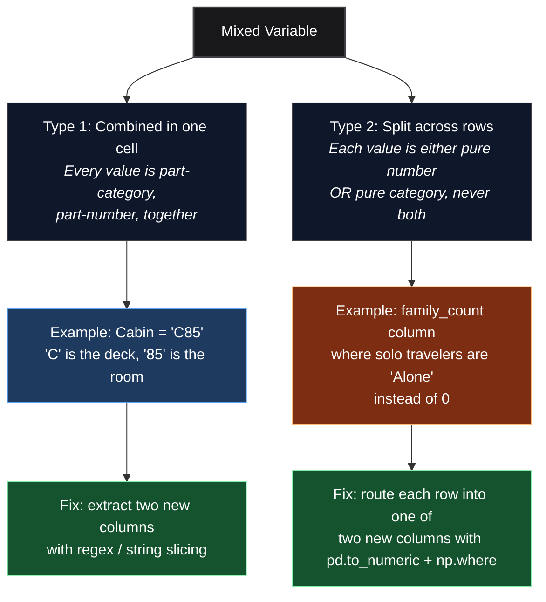

*Video Reference:* [YouTube](https://www.youtube.com/watch?v=9xiX-I5_LQY&t=1s)

Most feature engineering work goes one of two directions: encoding categories into numbers, or scaling numbers so a model can compare them fairly. **Mixed variables** are the annoying exception, a single column that refuses to be cleanly one or the other. This post covers what mixed variables look like and the two patterns for pulling them apart.

---

## What Is a Mixed Variable?

A **mixed variable** is a column that contains both numerical and categorical information instead of just one. That sounds rare, but it shows up constantly once you know to look for it, code numbers, ID strings, and free-text fields all tend to smuggle a number and a category into the same place.

There are two distinct ways this happens, and they need two different fixes:



The rest of this post walks through both, using the real Titanic dataset's `Cabin` and `Ticket` columns for Type 1, and a column built from `SibSp` and `Parch` for Type 2.

---

## Type 1: Category and Number in the Same Cell

The Titanic dataset's `Cabin` column is a textbook example. A handful of raw values:

```python
df['Cabin'].dropna().sample(6, random_state=42).tolist()
```

```text
['F G73', 'D33', 'E25', 'T', 'E36', 'C83']
```

Each value packs two pieces of information together: a letter for the **deck** the cabin was on, and a number for the **room** on that deck. `D33` means deck `D`, room `33`. Treating this as one categorical column would be wasteful, the deck letter is genuinely useful signal, but with 147 unique raw values, most of it gets lost as noise.

**The fix:** split the single column into two new ones, one purely numerical, one purely categorical.

```python
df['cabin_num'] = df['Cabin'].str.extract(r'(\d+)')
df['cabin_cat'] = df['Cabin'].str[0]

df[['Cabin', 'cabin_num', 'cabin_cat']].dropna(subset=['Cabin']).sample(6, random_state=42)
```

```text
     Cabin cabin_num cabin_cat
75   F G73        73         F
52     D33        33         D
512    E25        25         E
339      T       NaN         T
309    E36        36         E
230    C83        83         C
```

`str.extract(r'(\d+)')` pulls out the first run of digits it finds in each value, that becomes `cabin_num`. `str[0]` grabs the first character, the deck letter, into `cabin_cat`. Row `339` (`Cabin` = `'T'`) has no digits at all, so `cabin_num` comes back as `NaN`, a reminder that regex extraction only fills in what's actually there.

Before touching missing values, `cabin_cat` alone already collapses 147 raw cabin values down to 8 deck letters:

```python
df['cabin_cat'].value_counts()
```

```text
cabin_cat
C    59
B    47
D    33
E    32
A    15
F    13
G     4
T     1
```


Deck `C` has the most passengers with a known cabin, followed by `B`. That's a genuinely usable categorical feature, something the raw `Cabin` string never gave a model a fair shot at.

### Handling the Missing Values

`Cabin` is only populated for 204 of 891 passengers, everyone else is missing. Once split, the two new columns can be filled independently, with a strategy that fits each one:

```python
df['cabin_num'] = df['cabin_num'].fillna(0)
df['cabin_cat'] = df['cabin_cat'].fillna('Missing')

df[['Cabin', 'cabin_num', 'cabin_cat']].sample(6, random_state=1)
```

```text
    Cabin cabin_num cabin_cat
862   D17        17         D
223   NaN         0   Missing
84    NaN         0   Missing
680   NaN         0   Missing
535   NaN         0   Missing
623   NaN         0   Missing
```

`0` for the missing numerical part makes sense here since no real cabin number is ever `0`. For the categorical part, `'Missing'` becomes its own explicit category rather than silently vanishing, so a model (and anyone reading the data later) can tell "no cabin on record" apart from an actual deck letter.

---

## Type 2: Numbers and Categories in Different Rows

The second pattern is sneakier. The column isn't messy inside any single cell, every individual value is perfectly valid on its own. The problem is that some rows hold a **number** and other rows hold a **category**, mixed together in the same column.

To see this clearly, build one from `SibSp` (siblings/spouses aboard) and `Parch` (parents/children aboard). Adding them gives a family headcount, and instead of leaving solo travelers as `0`, relabel them `'Alone'`, exactly the kind of thing a real dataset does to make a special case stand out:

```python
family_count = df['SibSp'] + df['Parch']
df['number'] = family_count.astype(object)
df.loc[family_count == 0, 'number'] = 'Alone'

df['number'].value_counts()
```

```text
number
Alone    537
1        161
2        102
3         29
5         22
4         15
6         12
10         7
7          6
```

`number` now holds a mix of integers (`1`, `2`, `3`, ...) and the string `'Alone'`, all in the same column. Most passengers, 537 of them, traveled alone.

**The fix:** split the *rows* into two columns instead of splitting each cell. `pd.to_numeric()` with `errors='coerce'` turns every numeric-looking row into a float and turns everything else into `NaN`:

```python
import numpy as np

df['number_numerical'] = pd.to_numeric(df['number'], errors='coerce')
df['number_categorical'] = np.where(df['number_numerical'].isnull(), df['number'], np.nan)

df[['number', 'number_numerical', 'number_categorical']].sample(6, random_state=42)
```

```text
    number  number_numerical number_categorical
709      2               2.0                NaN
439  Alone               NaN              Alone
840  Alone               NaN              Alone
720      1               1.0                NaN
39       1               1.0                NaN
290  Alone               NaN              Alone
```

`number_numerical` keeps the real headcounts and turns every `'Alone'` row into `NaN`. `number_categorical` does the opposite: `np.where` checks which rows `number_numerical` failed to parse, and copies the original value from `number` into those spots, `NaN` everywhere else. Every row now lands cleanly in exactly one of the two new columns, never both, which is the signature of this type of mixed variable.

---

## A Harder Case: The `Ticket` Column

`Cabin` was a clean example, one letter, one number, always in that order. Real data is rarely that tidy. Titanic's `Ticket` column is the messier version of the same Type 1 problem:

```python
df['Ticket'].sample(10, random_state=5).tolist()
```

```text
['370372', '2647', 'STON/O 2. 3101273', '1601', '8471', '693', '110152',
 '347077', '111361', '315088']
```

Some tickets are pure numbers. Others have a category prefix glued onto a number (`'STON/O 2. 3101273'`). There's no fixed pattern like "first letter, then digits", the prefix can be almost any length. The same two-column idea still applies, just with a slightly more careful regex.

Before looking at the full code, it helps to know what the regex pattern `\d+$` actually means, since it's doing most of the work:

- **`\d`** means "a digit" (any single character `0`-`9`).
- **`+`** means "one or more of whatever came right before it", so `\d+` means "one or more digits in a row", i.e. a whole number.
- **`$`** anchors the match to the **end** of the string. Without it, `\d+` would grab the *first* run of digits it finds, which breaks on something like `'STON/O 2. 3101273'` (it would stop at the `2` in `O 2.` instead of the real ticket number at the end).

So `\d+$` reads as: "the run of digits sitting at the very end of the string." That's exactly the ticket number, since every ticket, whatever comes before it, always ends in the number.

With that in mind, here's what each line of the code does, one at a time, using `'STON/O 2. 3101273'` as the running example:

```python
df['ticket_num'] = df['Ticket'].str.extract(r'(\d+)$')
```

This pulls out just that trailing number and puts it in a new column. For `'STON/O 2. 3101273'`, `ticket_num` becomes `'3101273'`.

```python
ticket_cat_raw = df['Ticket'].str.replace(r'(\d+)$', '', regex=True).str.strip()
```

This does the opposite: it finds that same trailing number and deletes it (`.str.replace(..., '')`), leaving whatever text came before it. `.str.strip()` then trims any leftover space at the end. For `'STON/O 2. 3101273'`, that leaves `'STON/O 2.'`. For a ticket that was pure digits like `'370372'`, deleting the number leaves nothing, an empty string `''`.

```python
df['ticket_cat'] = ticket_cat_raw.replace('', 'NONE')
```

Those empty strings from pure-numeric tickets get relabeled `'NONE'` here, so the category column always has something readable in it instead of a blank.

Running all three lines and sampling the results:

```python
df[['Ticket', 'ticket_num', 'ticket_cat']].sample(10, random_state=5)
```

```text
                Ticket ticket_num ticket_cat
126             370372     370372       NONE
354               2647       2647       NONE
590  STON/O 2. 3101273    3101273  STON/O 2.
509               1601       1601       NONE
769               8471       8471       NONE
545                693        693       NONE
759             110152     110152       NONE
261             347077     347077       NONE
329             111361     111361       NONE
349             315088     315088       NONE
```

Row `590` is the one worth checking by hand: `'STON/O 2. 3101273'` splits into `ticket_num = '3101273'` (the trailing number) and `ticket_cat = 'STON/O 2.'` (everything before it, trimmed). Every other row here was a plain number to begin with, so it has no real prefix, `ticket_num` just repeats the whole value, and `ticket_cat` falls back to `'NONE'`.

The payoff is a large drop in cardinality:


681 unique raw ticket strings collapse into 45 categories once the trailing number is stripped out, most of them (`661`) landing in `'NONE'` because they were plain numeric tickets to begin with. `PC` is the largest real prefix at 60 passengers, followed by `C.A.` at 27. That's a column a model can actually make use of, compared to 681 near-unique strings that mostly just add noise.

---

## Summary Cheat Sheet

<div className="overflow-x-auto my-8">
  <table className="w-full text-left border-collapse">
    <thead>
      <tr className="border-b border-black/10 dark:border-white/10 text-amber-600 dark:text-amber-400">
        <th className="py-3 px-4 font-bold">Property / Aspect</th>
        <th className="py-3 px-4 font-bold">Detail</th>
      </tr>
    </thead>
    <tbody className="divide-y divide-black/5 dark:divide-white/5">
      <tr>
        <td className="py-3 px-4 font-semibold">Mixed Variable</td>
        <td className="py-3 px-4">A single column holding both numerical and categorical information</td>
      </tr>
      <tr>
        <td className="py-3 px-4 font-semibold">Type 1</td>
        <td className="py-3 px-4">Category and number combined inside the same cell (e.g. <code>Cabin</code>, <code>Ticket</code>)</td>
      </tr>
      <tr>
        <td className="py-3 px-4 font-semibold">Type 1 Fix</td>
        <td className="py-3 px-4"><code>str.extract()</code> / <code>str[0]</code> / <code>str.replace()</code> with regex to split one cell into two columns</td>
      </tr>
      <tr>
        <td className="py-3 px-4 font-semibold">Type 2</td>
        <td className="py-3 px-4">Some rows are purely numeric, other rows are purely categorical, never both together</td>
      </tr>
      <tr>
        <td className="py-3 px-4 font-semibold">Type 2 Fix</td>
        <td className="py-3 px-4"><code>pd.to_numeric(errors='coerce')</code> for the numerical column, <code>np.where()</code> for the categorical one</td>
      </tr>
      <tr>
        <td className="py-3 px-4 font-semibold">Missing Values</td>
        <td className="py-3 px-4">Fill the numerical half with a sentinel like <code>0</code>, the categorical half with an explicit label like <code>'Missing'</code></td>
      </tr>
      <tr>
        <td className="py-3 px-4 font-semibold">Why Bother</td>
        <td className="py-3 px-4">A high-cardinality mixed string is mostly noise; splitting it recovers a genuinely usable categorical feature plus a numerical one</td>
      </tr>
    </tbody>
  </table>
</div>

---

## What's Next?

This post covered the two shapes a mixed variable can take, category and number fused into one cell, or category and number scattered across different rows of the same column, and the pandas tools for untangling each: regex-based string extraction for the first, `pd.to_numeric` plus `np.where` for the second. The next post in this feature engineering series moves to another everyday nuisance: handling date and time columns.
