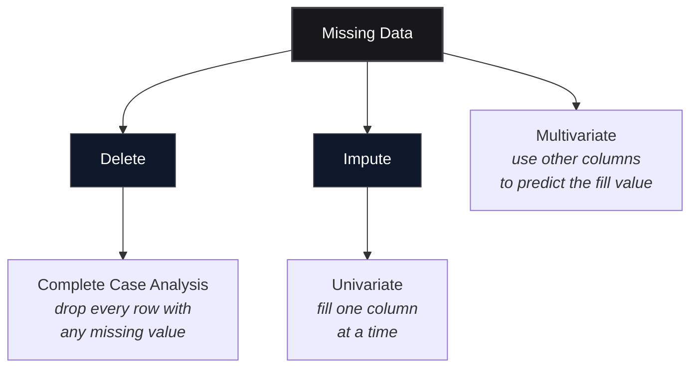

*Video Reference:* [YouTube](https://www.youtube.com/watch?v=aUnNWZorGmk)

Every feature engineering post so far has assumed the data is actually there, just in an inconvenient shape: numbers on different scales, categories as text, dates as strings. This post starts a different problem: what happens when the data simply isn't there at all. Almost every machine learning algorithm chokes on missing values, so cleaning them out (or filling them in) isn't optional, it's a required step before training. This is the first of several posts on the topic, and it covers the simplest option: **Complete Case Analysis**, dropping rows that have any missing data at all.

---

## Two Ways to Handle Missing Data

When a column has missing values, there are exactly two options:

1. **Delete** the rows (or columns) that have missing values.
2. **Impute** the missing values, fill them in with something reasonable.



Deletion is covered in this post. Imputation splits further into univariate techniques (mean, median, random sample, or "end of distribution" for numerical columns; mode or a placeholder like `"Missing"` for categorical ones) and multivariate techniques (KNN Imputer, Iterative Imputer), each of which gets its own post later in this series.

---

## What Is Complete Case Analysis?

**Complete Case Analysis (CCA)**, also called *listwise deletion*, means discarding every row that has a missing value in *any* column, and keeping only the rows where every single column is filled in. Picture a dataset with four columns, three inputs and one output, and five rows. If the third row is missing a value in the first column, CCA removes that entire row, leaving four complete rows to work with. It's called "complete case" because only cases (rows) with complete information across every column survive.

### Advantages

- **Trivial to implement.** One line, `df.dropna()`, and there's no data manipulation logic to get wrong.
- **Preserves the distribution of the remaining columns**, as long as the assumption below holds.

### Disadvantages

- **It can throw away a large fraction of the dataset.** If several columns each have some missing data, the rows lost to any one of them all stack up, and a wide dataset can shrink fast.
- **It distorts the distribution if the data isn't missing randomly.** This is the disadvantage that matters most, and it's covered next.
- **A production model won't know how to handle missing values.** If a model is trained only on rows that happened to have zero missing data, it has never seen a missing value during training. The moment real-world input arrives with a gap in it, the model has no learned strategy for it. This is exactly why CCA isn't used as heavily as its simplicity would suggest.

---

## The MCAR Assumption

CCA is only safe when data is **Missing Completely At Random (MCAR)**, meaning the fact that a value is missing has nothing to do with any other value in the dataset, the missingness itself is pure noise. If 50 values are missing out of 1,000 rows, MCAR means those 50 could be scattered anywhere: the first 50 rows, the last 50, or spread evenly, it makes no difference, because there's no underlying pattern connecting *which* rows lost data to anything else in the dataset.

Why this matters: if missingness actually correlates with something else in the data (say, a column is more often missing for one particular category), then dropping those rows doesn't just remove random noise, it systematically removes a subset of the population. The distribution of the remaining columns shifts, and any model trained on what's left has learned a biased picture.

The practical rule: apply CCA only when both of these hold.

1. **The data is MCAR.** There's no way to prove this with certainty, but it can be checked, and the next section shows how.
2. **Less than 5% of a column is missing.** There's no strict law behind this number, it's a widely used convention. Under 5%, the rows lost are a small enough slice that even in the worst case, the damage is limited. Over that, CCA starts trading away too much of the dataset. If a column has extreme missingness, like 95%+, the better move isn't CCA on the rows, it's dropping the *column* entirely, since it carries almost no usable signal anyway.

---

## Trying It on a Real Dataset

This dataset tracks candidates who applied for data science jobs, one row per applicant, columns describing their city, education, experience, current company, and whether they were ultimately hired (`target`).

```python
import pandas as pd

df = pd.read_csv('data_science_job.csv')
df.shape
```

```text
(19158, 13)
```

### Step One: Check What's Missing

```python
df.isnull().mean() * 100
```

```text
enrollee_id                0.00
city                       0.00
city_development_index     2.50
gender                     23.53
relevent_experience        0.00
enrolled_university         2.01
education_level             2.40
major_discipline           14.68
experience                  0.34
company_size               30.99
company_type                32.05
training_hours              4.00
target                      0.00
dtype: float64
```


Four columns are well past the 5% line: `company_type` (32%), `company_size` (31%), `gender` (23.5%), and `major_discipline` (14.7%). CCA on any of those would mean losing a fifth to a third of the entire dataset, and that's before accounting for whatever other columns are *also* missing in the surviving rows. Those columns are not CCA candidates.

Five columns sit comfortably under 5%: `training_hours` (4.0%), `city_development_index` (2.5%), `education_level` (2.4%), `enrolled_university` (2.0%), and `experience` (0.3%). Those five are what this post applies CCA to.

```python
cols = ['training_hours', 'city_development_index', 'education_level',
        'enrolled_university', 'experience']

new_df = df[cols].dropna()
```

### Step Two: Check How Much Data Survives

```python
len(new_df) / len(df)
```

```text
0.8969...
```

Roughly 90% of the rows survive, 17,182 out of 19,158. That's the first sanity check: not so much data lost that the exercise is pointless.

### Step Three: Compare Distributions Before and After

Row count surviving isn't enough on its own, the *shape* of what's left matters just as much. If dropping rows shifted the distributions, that's a signal the data wasn't MCAR after all.

For a numerical column like `training_hours`, that means comparing histograms before and after:

```python
import matplotlib.pyplot as plt

fig, ax = plt.subplots()
df['training_hours'].hist(bins=40, density=True, alpha=0.5, label='Original', ax=ax)
new_df['training_hours'].hist(bins=40, density=True, alpha=0.5, label='After CCA', ax=ax)
ax.legend()
plt.show()
```

For a categorical column like `education_level`, the equivalent check is comparing the proportion each category makes up before and after:

```python
df['education_level'].value_counts(normalize=True)
new_df['education_level'].value_counts(normalize=True)
```

```text
Graduate          0.620
Masters           0.233
High School       0.108
Phd                0.022
Primary School     0.016
```

```text
Graduate          0.620
Masters           0.234
High School       0.107
Phd                0.022
Primary School     0.017
```


Both checks agree. The `training_hours` histogram overlaps itself almost perfectly, blue (original) and orange (after CCA) barely diverge anywhere along the range. The `education_level` proportions move by less than half a percentage point in every category, `Graduate` stays at 62.0%, `Masters` goes from 23.3% to 23.4%, and so on. Neither shows the kind of shift that would suggest the missing values were tied to any particular group. That's the evidence needed to call this data MCAR, and it's what makes CCA a reasonable choice here.

If instead one category's share had jumped by several points, say `Masters` moved from 19% to 25%, that would be a red flag: it would mean masters-level candidates were disproportionately represented among the *complete* rows, which means the missing values in some other column weren't random with respect to education level. In that situation, CCA would be actively harmful, dropping rows wouldn't just shrink the dataset, it would skew it, and the fix would be to fall back on imputation instead.

---

## Summary Cheat Sheet

<div className="overflow-x-auto my-8">
  <table className="w-full text-left border-collapse">
    <thead>
      <tr className="border-b border-black/10 dark:border-white/10 text-amber-600 dark:text-amber-400">
        <th className="py-3 px-4 font-bold">Task</th>
        <th className="py-3 px-4 font-bold">Code</th>
      </tr>
    </thead>
    <tbody className="divide-y divide-black/5 dark:divide-white/5">
      <tr>
        <td className="py-3 px-4 font-semibold">Check % missing per column</td>
        <td className="py-3 px-4"><code>df.isnull().mean() * 100</code></td>
      </tr>
      <tr>
        <td className="py-3 px-4 font-semibold">Apply CCA on chosen columns</td>
        <td className="py-3 px-4"><code>df[cols].dropna()</code></td>
      </tr>
      <tr>
        <td className="py-3 px-4 font-semibold">Check rows retained</td>
        <td className="py-3 px-4"><code>len(new_df) / len(df)</code></td>
      </tr>
      <tr>
        <td className="py-3 px-4 font-semibold">Compare numerical distributions</td>
        <td className="py-3 px-4">overlaid <code>.hist()</code> before vs. after</td>
      </tr>
      <tr>
        <td className="py-3 px-4 font-semibold">Compare categorical ratios</td>
        <td className="py-3 px-4"><code>.value_counts(normalize=True)</code> before vs. after</td>
      </tr>
      <tr>
        <td className="py-3 px-4 font-semibold">When to apply CCA</td>
        <td className="py-3 px-4">data is MCAR, and column has &lt; 5% missing</td>
      </tr>
    </tbody>
  </table>
</div>

---

## What's Next?

This post covered the simplest way to handle missing data: dropping rows entirely with Complete Case Analysis, and how to check whether that's actually a safe move (the MCAR assumption, the 5% rule, and comparing distributions before and after). It's rarely used in production because a model trained this way never learns to handle missing values it will inevitably see later. The next posts in this series move to the more common approach: **imputation**, starting with univariate techniques using scikit-learn's `SimpleImputer`.
