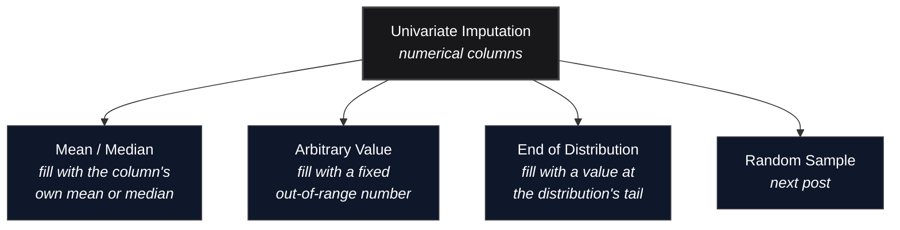

*Video Reference:* [YouTube](https://www.youtube.com/watch?v=mCL2xLBDw8M)

The last post covered Complete Case Analysis: dropping every row with a missing value, safe only when less than 5% of a column is missing and the data is MCAR. Most of the time neither condition holds, and the better move is **imputation**: filling the gaps in instead of throwing rows away. This post covers the first branch of that, **univariate imputation** for numerical columns, three separate techniques for deciding what value goes in the hole: mean/median, an arbitrary value, and a value pulled from the end of the distribution.

---

## Univariate vs. Multivariate Imputation

**Univariate imputation** fills a column's missing values using only that column's own data, its mean, its median, or some other value derived from itself, with no reference to any other column. **Multivariate imputation** (KNN Imputer, Iterative Imputer, covered in later posts) uses the *other* columns to predict what the missing value should have been.



All three techniques below share the same shape: pick one number, and use it to fill in every missing value in the column. What differs is *how that number gets picked*, and each choice comes with its own tradeoff between simplicity and how badly it distorts the data.

---

## The Dataset

This post uses the Titanic dataset, with `age`, `fare`, `family` (siblings/spouses plus parents/children aboard, `sibsp + parch`), and `survived` as the target.

```python
import pandas as pd
import numpy as np
from sklearn.model_selection import train_test_split

df = pd.read_csv('https://raw.githubusercontent.com/mwaskom/seaborn-data/master/titanic.csv')
df['family'] = df['sibsp'] + df['parch']
df = df[['age', 'fare', 'family', 'survived']]

X = df.drop(columns='survived')
y = df['survived']
X_train, X_test, y_train, y_test = train_test_split(X, y, test_size=0.2, random_state=2)
X_train.shape, X_test.shape
```

```text
((712, 3), (179, 3))
```

`age` already has real missing values in this dataset, and `fare` doesn't, so 5% of `fare` gets randomly nulled out to demonstrate imputation on a column with light missingness too:

```python
missing_idx = X_train.sample(frac=0.05, random_state=2).index
X_train.loc[missing_idx, 'fare'] = np.nan

X_train.isnull().mean() * 100
```

```text
age       20.79
fare       5.06
family     0.00
dtype: float64
```

As with CCA, statistics used for filling in values always come from the **training set only**. Whatever gets computed on `X_train` gets reused to transform `X_test`, never the other way around, otherwise information from the test set leaks into training.

---

## Technique 1: Mean and Median Imputation

The simplest option: replace every missing value in a column with that column's own mean or median.

**Which one to use** comes down to the shape of the distribution. If a column is roughly normally distributed, mean, median, and mode all sit close together, so mean is the natural choice. If it's skewed, the mean gets pulled toward the tail while the median stays put, so median is the safer pick.

```python
mean_age = X_train['age'].mean()
median_age = X_train['age'].median()
mean_fare = X_train['fare'].mean()
median_fare = X_train['fare'].median()

X_train['age'].skew(), X_train['fare'].skew()
```

```text
(0.33, 4.59)
```

`age` is close to normal (skew near 0), while `fare` is heavily right-skewed, a small number of passengers paid far more than everyone else. That shows up directly in the two sets of statistics:

```text
mean_age = 29.79     median_age = 28.75
mean_fare = 32.18     median_fare = 14.25
```

For `age`, mean and median are less than a year apart. For `fare`, they're worlds apart: the mean gets dragged up to 32.18 by the small cluster of expensive first-class tickets, while the median of 14.25 reflects what a typical passenger actually paid. Filling `fare`'s missing values with the mean here would insert a value most passengers never paid anywhere close to.

### Advantages

- **Trivial to implement**, one `.fillna()` call.
- **Works well when missingness is low**, under roughly 5%, same threshold as CCA.

### Disadvantages

- **Distorts the distribution's shape.** Piling extra mass onto a single value changes the PDF.
- **Shrinks the variance**, since every filled-in value sits exactly at the center, with zero spread of its own.
- **Distorts correlation with other columns**, since the filled-in rows contribute a constant instead of a value that actually correlates with the other columns.
- **Manufactures outliers that weren't there before.** Piling values onto the median squeezes the IQR, so the whiskers of a boxplot pull inward, and real, ordinary values near the old edges now fall outside them.

### Seeing the Distortion

```python
X_train['age_median'] = X_train['age'].fillna(median_age)
X_train['age_mean'] = X_train['age'].fillna(mean_age)
X_train['fare_median'] = X_train['fare'].fillna(median_fare)
X_train['fare_mean'] = X_train['fare'].fillna(mean_fare)
```

<MdxImage src="/images/ch27-mean-median-distribution.png" alt="Two-panel KDE chart comparing age and fare distributions before and after mean and median imputation. The age panel shows a slightly taller, narrower peak after imputation since age is nearly normally distributed. The fare panel shows median imputation staying closer to the original shape while mean imputation is pulled toward the skewed tail." className="w-full h-auto rounded-lg my-6" />

Both imputed curves grow a sharper peak right at the fill value, exactly where the extra density piles up. The effect on variance is measurable:

```python
X_train['age'].var(), X_train['age_median'].var(), X_train['age_mean'].var()
```

```text
(204.35, 161.99, 161.81)
```

Variance drops by about 20% just from filling in roughly a fifth of the column with a single constant. The correlation with `family` shifts too:

```python
X_train['age'].corr(X_train['family'])       # -0.299
X_train['age_median'].corr(X_train['family']) # -0.243
```

```text
Original:       -0.299
After Median:    -0.243
```

That's the tradeoff CCA doesn't have: dropping rows preserves the shape of what's left, but imputation changes the shape of the column itself. It's an acceptable price only when missingness is low enough that the damage stays small, which is why the same 5% rule from CCA applies here too.

### It Also Manufactures Outliers

A subtler side effect shows up in a boxplot. The IQR-based outlier rule flags anything outside `Q1 - 1.5*IQR` to `Q3 + 1.5*IQR`, and piling ~21% of `age` onto a single median value pulls `Q1` and `Q3` closer together, shrinking the IQR itself:

```python
def iqr_bounds(s):
    Q1, Q3 = s.quantile(0.25), s.quantile(0.75)
    IQR = Q3 - Q1
    return Q1, Q3, IQR, Q1 - 1.5 * IQR, Q3 + 1.5 * IQR

iqr_bounds(X_train['age'].dropna())
iqr_bounds(X_train['age_median'])
```

```text
Original:      Q1=21.00  Q3=38.25  IQR=17.25  bounds=(-4.88, 64.12)
After Median:  Q1=23.00  Q3=35.00  IQR=12.00  bounds=(5.00, 53.00)
```

<MdxImage src="/images/ch27-outlier-boxplot.png" alt="Side-by-side boxplot of age before and after median imputation. The original boxplot has a wider box and only 7 flagged outliers above the upper whisker. The median-imputed boxplot has a visibly narrower box, with 69 points now flagged as outliers on both the low and high ends." className="w-full h-auto rounded-lg my-6" />

The upper bound drops from 64.12 to 53.00, and the lower bound rises from below zero to 5.00. Passengers in their late 50s and early 60s, who were never outliers to begin with, now fall outside the whiskers, and so does anyone genuinely aged under 5. The number of points an IQR rule would flag as outliers jumps from **7 to 69**, none of which are actually anomalies, they're just ordinary values that got squeezed out by a shrinking box. Any downstream step that trims or caps outliers based on this boxplot would now be acting on manufactured noise instead of real ones.

### The scikit-learn Way

Doing this by hand works for a one-off notebook, but a pipeline needs it as a proper transformer. Since `age` and `fare` need different strategies (median vs. mean), a `ColumnTransformer` routes each column to its own `SimpleImputer`:

```python
from sklearn.impute import SimpleImputer
from sklearn.compose import ColumnTransformer

trf = ColumnTransformer([
    ('age_imputer', SimpleImputer(strategy='median'), ['age']),
    ('fare_imputer', SimpleImputer(strategy='mean'), ['fare']),
], remainder='passthrough')

trf.fit(X_train)
trf.named_transformers_['age_imputer'].statistics_
trf.named_transformers_['fare_imputer'].statistics_
```

```text
age_imputer statistics_:  [28.75]
fare_imputer statistics_: [32.18129231]
```

Same numbers as the manual calculation, confirming the transformer learned the right values from `X_train`. Fitting happens once, on the training data; both `X_train` and `X_test` then get transformed with those same learned values:

```python
X_train_trf = trf.transform(X_train)
X_test_trf = trf.transform(X_test)
```

The advantage of doing it this way over plain pandas is that the whole thing drops straight into a `Pipeline`, works with `GridSearchCV`, and ships to production without extra glue code.

---

## Technique 2: Arbitrary Value Imputation

Instead of picking a value from inside the distribution, arbitrary value imputation fills every missing value with a fixed number that clearly doesn't belong in the data, something like `99`, `-1`, or `9999`. It's used far more often for categorical columns (filling with a placeholder like `"Missing"`), but it applies to numerical ones too.

The idea isn't to guess a plausible value, it's to mark which rows were missing in the first place, so the model can learn "this row had no data here" as its own signal.

### Advantages

- **Easy to apply**, no statistics to compute.
- **Flags missingness explicitly**, giving the model a way to distinguish "was missing" from "had a real value."

### Disadvantages

- **Distorts the distribution, variance, and correlation far more aggressively than mean/median imputation**, since the fill value sits outside the data's natural range instead of near its center.

```python
X_train['age_99'] = X_train['age'].fillna(99)
X_train['age_minus1'] = X_train['age'].fillna(-1)

X_train['age'].var(), X_train['age_99'].var(), X_train['age_minus1'].var()
```

```text
(204.35, 951.73, 318.09)
```

Filling with `99` more than quadruples the variance, filling with `-1` pushes it up by 55%, both far worse than the ~20% *drop* mean/median imputation caused. With scikit-learn, this is `SimpleImputer` with `strategy='constant'`:

```python
trf = ColumnTransformer([
    ('age_imputer', SimpleImputer(strategy='constant', fill_value=99), ['age']),
    ('fare_imputer', SimpleImputer(strategy='constant', fill_value=999), ['fare']),
], remainder='passthrough')
trf.fit(X_train)
```

Because of how much it distorts the data, this technique is used less often on numerical columns, and mostly matters when the goal really is to preserve a "was this missing" flag for the model rather than to fill in a realistic number.

---

## Technique 3: End of Distribution Imputation

This is a more disciplined version of arbitrary value imputation. Instead of hand-picking a number like `99`, the fill value is calculated to sit just past the tail of the column's own distribution:

- If the column is roughly **normally distributed**, use `mean + 3 * std`.
- If the column is **skewed**, use the IQR proximity rule: `Q3 + 1.5 * IQR`.

```python
eod_age = X_train['age'].mean() + 3 * X_train['age'].std()

Q1 = X_train['fare'].quantile(0.25)
Q3 = X_train['fare'].quantile(0.75)
IQR = Q3 - Q1
eod_fare = Q3 + 1.5 * IQR

eod_age, eod_fare
```

```text
(72.67, 64.90)
```

`age` (skew ≈ 0.33) gets the normal-distribution formula, landing at 72.67, well past the oldest typical passengers. `fare` (skew ≈ 4.59) gets the IQR rule instead, landing at 64.90.

```python
X_train['age_eod'] = X_train['age'].fillna(eod_age)
X_train['age'].var(), X_train['age_eod'].var()
```

```text
(204.35, 465.07)
```

<MdxImage src="/images/ch27-variance-comparison.png" alt="Bar chart comparing age variance across five states: original data, after median imputation, after mean imputation, after arbitrary value imputation with 99, and after end of distribution imputation. Variance drops modestly for median and mean imputation, then spikes sharply for arbitrary value and end of distribution imputation." className="w-full h-auto rounded-lg my-6" />

Lined up side by side, the pattern is clear: mean/median imputation shrinks variance slightly, while arbitrary value and end of distribution imputation both inflate it well past the original, arbitrary value the most since `99` sits even further from the data than the calculated tail value does.

### Advantages and Disadvantages

Functionally the same as arbitrary value imputation, easy to apply, and it creates the same "this was missing" signal for the model. The disadvantages carry over too: distribution, variance, and correlation with other columns all shift, in this case even more than plain arbitrary value imputation for `age`. The upside over hand-picking `99` is that the fill value is derived from the data itself instead of guessed, so it's less likely to accidentally land inside the range of real values.

---

## When to Use Which

Mean/median imputation and end of distribution/arbitrary value imputation aim at opposite goals, and the choice comes down to *why* the data is missing:

- If the data is **Missing Completely At Random (MCAR)** and the missing fraction is small, mean or median imputation is the safer choice, it does the least damage to the distribution.
- If there's reason to believe the data is **not missing at random**, arbitrary value or end of distribution imputation is more appropriate, since the goal shifts from "guess a realistic value" to "make sure the model can tell this row was incomplete."

---

## Summary Cheat Sheet

<div className="overflow-x-auto my-8">
  <table className="w-full text-left border-collapse">
    <thead>
      <tr className="border-b border-black/10 dark:border-white/10 text-amber-600 dark:text-amber-400">
        <th className="py-3 px-4 font-bold">Technique</th>
        <th className="py-3 px-4 font-bold">Fill Value</th>
        <th className="py-3 px-4 font-bold">Use When</th>
      </tr>
    </thead>
    <tbody className="divide-y divide-black/5 dark:divide-white/5">
      <tr>
        <td className="py-3 px-4 font-semibold">Mean Imputation</td>
        <td className="py-3 px-4"><code>df[col].mean()</code></td>
        <td className="py-3 px-4">MCAR, &lt;5% missing, roughly normal distribution</td>
      </tr>
      <tr>
        <td className="py-3 px-4 font-semibold">Median Imputation</td>
        <td className="py-3 px-4"><code>df[col].median()</code></td>
        <td className="py-3 px-4">MCAR, &lt;5% missing, skewed distribution</td>
      </tr>
      <tr>
        <td className="py-3 px-4 font-semibold">Arbitrary Value</td>
        <td className="py-3 px-4">a fixed out-of-range number, e.g. <code>-1</code>, <code>99</code></td>
        <td className="py-3 px-4">data not MCAR, want an explicit "was missing" flag</td>
      </tr>
      <tr>
        <td className="py-3 px-4 font-semibold">End of Distribution</td>
        <td className="py-3 px-4"><code>mean + 3\*std</code> or <code>Q3 + 1.5\*IQR</code></td>
        <td className="py-3 px-4">data not MCAR, want a calculated (not guessed) flag value</td>
      </tr>
    </tbody>
  </table>
</div>

---

## What's Next?

This post covered the first two categories of univariate imputation for numerical data: mean/median imputation, which stays close to the original distribution but only works when little data is missing, and arbitrary value/end of distribution imputation, which sacrifices distribution shape in exchange for flagging which rows had missing data. The next posts in this series cover **Random Sample Imputation**, filling gaps with values randomly drawn from the column itself, and how to **automatically select the best imputation technique** for a given column instead of guessing.
