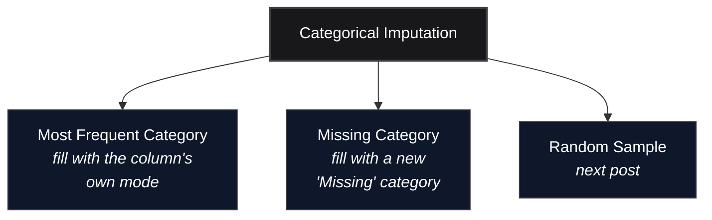

*Video Reference:* [YouTube](https://www.youtube.com/watch?v=l_Wip8bEDFQ)

The last post covered univariate imputation for numerical columns: mean/median, arbitrary value, and end of distribution. Categorical columns can't use any of those, there's no mean of `"Mumbai"`, `"Delhi"`, and `"Kolkata"`. This post covers the categorical equivalent: filling missing values with the **most frequent category**, and, when that doesn't work, carving out a **new "Missing" category** instead.

---

## Most Frequent Category (Mode) Imputation

The direct analogue of mean/median imputation for categorical data is **mode imputation**: replace every missing value with whichever category shows up most often in the column. A `city` column with `Mumbai`, `Delhi`, and `Kolkata`, where `Mumbai` is the most common, gets every missing row filled with `Mumbai`.

Mode exists for numerical columns too, technically nothing stops it from being computed there, but mean and median simply perform better on numerical data, so mode imputation is really a categorical-data technique in practice.



### When It's Safe to Use

Two conditions, mirroring the ones from numerical imputation:

1. **The data is Missing Completely At Random (MCAR)**, same requirement as every other univariate technique in this series.
2. **One category clearly dominates the others.** If `Mumbai` shows up far more often than `Delhi` or `Kolkata`, filling gaps with `Mumbai` barely changes the column's shape. If the top categories are close in frequency, mode imputation forces an artificial winner and skews the column hard.

### Advantages and Disadvantages

- **Advantage:** trivial to implement, a single `.fillna()` call, fast enough to run in production without a second thought.
- **Disadvantage:** it distorts the column's category proportions, and how badly depends entirely on whether condition 2 above holds. The example below shows both ends of that spectrum on the same dataset.

---

## Trying It on a Real Dataset

This post uses the Ames housing dataset (Kaggle's "House Prices: Advanced Regression Techniques"), narrowed to three columns: `GarageQual` and `FireplaceQu` (both categorical, rated `Po`/`Fa`/`TA`/`Gd`/`Ex` from Poor to Excellent), and `SalePrice` as the target. These two columns were picked deliberately, one has light missingness with a dominant category, the other has heavy missingness with no dominant category, which makes them a natural side-by-side test of when mode imputation works.

```python
import pandas as pd
from sklearn.datasets import fetch_openml
from sklearn.model_selection import train_test_split

df = fetch_openml(name='house_prices', as_frame=True, parser='auto').frame
df = df[['GarageQual', 'FireplaceQu', 'SalePrice']]

X = df.drop(columns='SalePrice')
y = df['SalePrice']
X_train, X_test, y_train, y_test = train_test_split(X, y, test_size=0.2, random_state=2)

X_train.isnull().mean() * 100
```

```text
GarageQual      5.57
FireplaceQu    47.69
dtype: float64
```

`GarageQual` sits comfortably in the "safe" range. `FireplaceQu` is missing on nearly half the rows, immediately a red flag for mode imputation regardless of how the categories are distributed.

### Checking Whether Missingness Relates to the Target

Before picking a technique, it's worth checking whether missingness itself carries information, comparing `SalePrice` for rows where the column is present against rows where it's missing. `SalePrice` was dropped out of `X_train` for the split, so this check joins it back onto a separate frame rather than mutating `X_train` itself:

```python
train_with_target = X_train.join(y_train)

for col in ['GarageQual', 'FireplaceQu']:
    present = train_with_target.loc[train_with_target[col].notna(), 'SalePrice']
    missing = train_with_target.loc[train_with_target[col].isna(), 'SalePrice']
    print(col, 'present:', present.median(), present.mean(), len(present))
    print(col, 'missing:', missing.median(), missing.mean(), len(missing))
```

```text
GarageQual present: median=167000, mean=184425 (n=1103)
GarageQual missing: median=100000, mean=104560 (n=65)

FireplaceQu present: median=190000, mean=215351 (n=611)
FireplaceQu missing: median=135000, mean=141182 (n=557)
```

<MdxImage src="/images/ch28-saleprice-by-missingness.png" alt="Two-panel KDE chart comparing SalePrice distributions for rows where GarageQual and FireplaceQu are present versus missing. In both panels, the orange missing-value curve is shifted noticeably to the left of the blue present-value curve, showing houses with missing values sell for less." className="w-full h-auto rounded-lg my-6" />

Both panels tell the same story: houses missing a value sell for meaningfully less, roughly $84,000 less at the median for `GarageQual`, $55,000 less for `FireplaceQu`. That's not a coincidence, in this dataset a null in `GarageQual` or `FireplaceQu` almost always means the house simply has no garage or no fireplace, and houses without those features tend to be smaller and cheaper. The missingness isn't random noise, it's meaningful information about the house itself, which is exactly the situation where a "Missing" category earns its keep: it isn't standing in for a guess, it's encoding a real fact.

### Checking for a Dominant Category

```python
X_train['GarageQual'].value_counts(normalize=True) * 100
```

```text
TA    95.10
Fa     3.72
Gd     1.00
Po     0.09
Ex     0.09
```

```python
X_train['FireplaceQu'].value_counts(normalize=True) * 100
```

```text
Gd    49.43
TA    41.24
Fa     4.09
Po     2.78
Ex     2.45
```

`GarageQual` passes both conditions: `TA` dominates at 95%, nothing close to a tie. `FireplaceQu` fails condition 2 outright, `Gd` and `TA` are separated by only 8 points, nowhere near dominant.

### Imputing and Comparing

```python
mode_garage = X_train['GarageQual'].mode()[0]      # 'TA'
mode_fireplace = X_train['FireplaceQu'].mode()[0]  # 'Gd'

X_train['GarageQual_imputed'] = X_train['GarageQual'].fillna(mode_garage)
X_train['FireplaceQu_imputed'] = X_train['FireplaceQu'].fillna(mode_fireplace)
```

<MdxImage src="/images/ch28-mode-imputation-distortion.png" alt="Two-panel bar chart comparing category proportions before and after mode imputation. The GarageQual panel shows nearly identical bars before and after, since TA already dominated at 95%. The FireplaceQu panel shows the Gd bar growing dramatically from about 49% to 74% after imputation, while TA shrinks from 41% to about 22%." className="w-full h-auto rounded-lg my-6" />

`GarageQual`'s bars barely move, `TA` goes from 95.10% to 95.38%, imputation added a sliver on top of a category that already dominated. `FireplaceQu` tells the opposite story: `Gd` jumps from 49.43% to **73.54%**, absorbing almost all of the missing 47.69% on top of its own share, while `TA` gets nearly cut in half, from 41.24% down to 21.58%. Neither number reflects reality, it's an artifact of forcing every unknown value into whichever category happened to be marginally ahead.

### The scikit-learn Way

```python
from sklearn.impute import SimpleImputer
from sklearn.compose import ColumnTransformer

trf = ColumnTransformer([
    ('garage_imputer', SimpleImputer(strategy='most_frequent'), ['GarageQual']),
    ('fireplace_imputer', SimpleImputer(strategy='most_frequent'), ['FireplaceQu']),
], remainder='passthrough')

trf.fit(X_train[['GarageQual', 'FireplaceQu']])
trf.named_transformers_['garage_imputer'].statistics_
trf.named_transformers_['fireplace_imputer'].statistics_
```

```text
garage_imputer statistics_:    ['TA']
fireplace_imputer statistics_: ['Gd']
```

Same modes as the manual calculation. As with numerical imputation, `strategy='most_frequent'` is the scikit-learn equivalent, and fitting stays confined to `X_train`, with `X_test` transformed using those same learned categories.

Given the distortion on `FireplaceQu`, the answer to "should mode imputation be used here" is no, not because the code is wrong, but because the column fails both the MCAR-adjacent assumption of light missingness and the dominant-category requirement.

---

## Missing Category Imputation

The fix for a column like `FireplaceQu` isn't a better guess, it's not guessing at all. **Missing category imputation** creates an entirely new category, typically named `"Missing"`, and every null gets filled with that label instead of an existing one.

This is the direct categorical counterpart to arbitrary value imputation from the last post (`99`, `-1`, or a value at the tail of the distribution): instead of picking a plausible value, the goal is to flag which rows had no data, and let the model treat that as its own signal.

### When to Use It

- **Data is not MCAR**, or there's no way to confirm that it is.
- **Missingness is heavy** and no category dominates, exactly `FireplaceQu`'s situation.

### Advantages and Disadvantages

- **Advantage:** just as easy to implement as mode imputation, one `.fillna('Missing')` call.
- **Disadvantage:** minimal on its own, the main cost is that it isn't really informed imputation, it's an honest admission that the value is unknown, so a downstream model has to learn what to do with that category rather than being handed a plausible guess.

```python
X_train['FireplaceQu_missing'] = X_train['FireplaceQu'].fillna('Missing')
X_train['FireplaceQu_missing'].value_counts(normalize=True) * 100
```

```text
Missing    47.69
Gd         25.86
TA         21.58
Fa          2.14
Po          1.46
Ex          1.28
```

<MdxImage src="/images/ch28-missing-category-comparison.png" alt="Bar chart comparing FireplaceQu category proportions across three states: original, after mode imputation, and after missing category imputation. Mode imputation inflates Gd to 74%. Missing category imputation instead adds a new Missing bar at about 48% while Gd and TA keep the same relative proportions to each other as the original data." className="w-full h-auto rounded-lg my-6" />

The difference from mode imputation is visible immediately: `Gd` and `TA` don't get warped, they shrink proportionally as `"Missing"` claims its own honest 47.69% slice, but their *ratio to each other* stays intact, `Gd` was 1.20x `TA` originally (49.43 / 41.24) and stays almost exactly 1.20x after (25.86 / 21.58). Mode imputation broke that relationship; missing category imputation preserves it.

With scikit-learn, this is `SimpleImputer` with a constant strategy, same as arbitrary value imputation was for numerical columns:

```python
si = SimpleImputer(strategy='constant', fill_value='Missing')
si.fit_transform(X_train[['FireplaceQu']])
```

---

## Summary Cheat Sheet

<div className="overflow-x-auto my-8">
  <table className="w-full text-left border-collapse">
    <thead>
      <tr className="border-b border-black/10 dark:border-white/10 text-amber-600 dark:text-amber-400">
        <th className="py-3 px-4 font-bold">Technique</th>
        <th className="py-3 px-4 font-bold">scikit-learn</th>
        <th className="py-3 px-4 font-bold">Use When</th>
      </tr>
    </thead>
    <tbody className="divide-y divide-black/5 dark:divide-white/5">
      <tr>
        <td className="py-3 px-4 font-semibold">Most Frequent (Mode)</td>
        <td className="py-3 px-4"><code>SimpleImputer(strategy='most_frequent')</code></td>
        <td className="py-3 px-4">MCAR, light missingness, one category clearly dominates</td>
      </tr>
      <tr>
        <td className="py-3 px-4 font-semibold">Missing Category</td>
        <td className="py-3 px-4"><code>SimpleImputer(strategy='constant', fill_value='Missing')</code></td>
        <td className="py-3 px-4">not MCAR, heavy missingness, no dominant category</td>
      </tr>
    </tbody>
  </table>
</div>

---

## What's Next?

This post covered the two go-to techniques for filling in categorical gaps: mode imputation, which works cleanly only when one category already dominates, and missing category imputation, which sidesteps the guessing problem entirely by giving unknown values their own honest label. Both are univariate: each column gets filled using only its own data. The next posts in this series cover **Random Sample Imputation**, which applies to numerical and categorical columns alike, and **multivariate imputation** (KNN Imputer, Iterative Imputer), which fills gaps using the other columns instead of just the column's own statistics.
