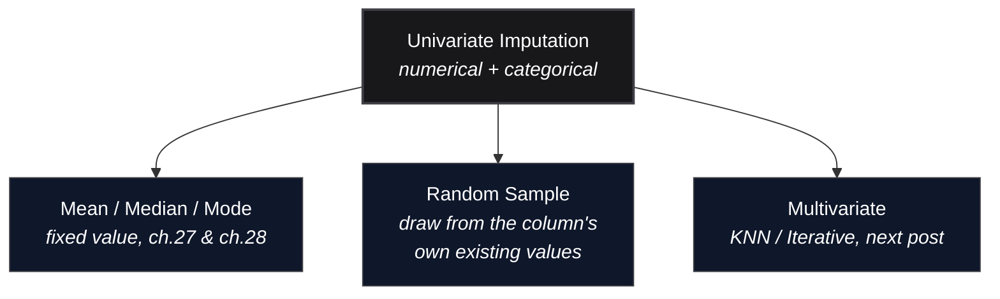

*Video Reference:* [YouTube](https://www.youtube.com/watch?v=Ratcir3p03w)

The last two posts covered univariate imputation with a fixed value: mean/median or an arbitrary constant for numerical columns, most frequent category or a new "Missing" category for categorical ones. All four share the same weakness, every missing value in a column gets replaced by the *same* number or category, which flattens the column's variance and reshapes its distribution. This post covers a technique that sidesteps that problem entirely, **random sample imputation**, plus two things that go alongside it: a **missing indicator** column that flags which rows were incomplete, and a way to stop guessing which imputation strategy to use by letting `GridSearchCV` pick it automatically.

---

## Random Sample Imputation

The idea: instead of filling every gap with one fixed value, fill each missing entry with a value picked at random from the column's own *existing*, non-null values. Not a random number in some arbitrary range, a random draw from the data that's already there. If a `city` column holds `Mumbai`, `Delhi`, and `Kolkata` in various proportions, a missing row gets filled with one of those three, chosen at random, weighted naturally by how often each one already appears in the column.



That single change, drawing from the data instead of computing a fixed statistic, is what makes the technique work on **both numerical and categorical columns** with the exact same logic, and it's also why the distribution barely moves.

### Why the Distribution Stays Intact

Picture the column's values as a bag of marbles, most of them clustered around whatever value is most common, fewer of them out toward the edges. Every random draw from that bag is more likely to land on a common value than a rare one, purely because there are more of it in the bag. Fill enough missing slots this way and the *proportions* of the filled-in values end up mirroring the proportions already in the column. The shape barely changes, because the filling process is just re-sampling the same shape.

Contrast that with mean imputation: every missing value becomes the exact same number, so the column develops an artificial spike at one point no matter what the rest of the distribution looks like. Random sample imputation never manufactures a spike, because it never picks the same fixed point twice on purpose.

### Advantages and Disadvantages

- **Advantage:** preserves the column's distribution and variance far better than mean/median/mode, which matters most when a downstream model (linear or logistic regression especially) is sensitive to the shape of its inputs.
- **Disadvantage:** it disturbs the column's relationship (covariance/correlation) with other columns, same as every other univariate technique in this series, since the filled-in value is chosen without looking at the rest of the row.
- **Disadvantage:** memory-heavy at deployment. The fill values for new, incoming rows have to be drawn from the *training* data, which means the training set's values for that column need to stay available at serve time, not just a couple of summary statistics like a mean.
- **Disadvantage:** doesn't work well with tree-based models. Trees split on the data's actual structure, and random substitution doesn't consistently help there the way it does for linear models.

---

## Trying It on Titanic (Numerical)

This uses the same Titanic setup as the [mean/median imputation post](/machine-learning/ch27-mean-median-imputation): `age`, `fare`, `family` (`sibsp + parch`), and `survived` as the target. `age` has real missing values; `fare` gets 5% randomly nulled out to demonstrate the technique on a lightly-missing column too.

```python
import pandas as pd
import numpy as np
from sklearn.model_selection import train_test_split

df = pd.read_csv('https://raw.githubusercontent.com/mwaskom/seaborn-data/master/titanic.csv')
df['family'] = df['sibsp'] + df['parch']
df = df[['age', 'fare', 'family', 'survived']]

X = df.drop(columns='survived')
y = df['survived']
X_train, X_test, y_train, y_test = train_test_split(X, y, test_size=0.2, random_state=2)

missing_idx = X_train.sample(frac=0.05, random_state=2).index
X_train.loc[missing_idx, 'fare'] = np.nan

X_train.isnull().mean() * 100
```

```text
age       20.79
fare       5.06
family     0.00
dtype: float64
```

### The Core Technique

```python
X_train['age_imputed'] = X_train['age']
X_test['age_imputed'] = X_test['age']

X_train.loc[X_train['age_imputed'].isnull(), 'age_imputed'] = (
    X_train['age'].dropna().sample(X_train['age'].isnull().sum(), random_state=0).values
)
X_test.loc[X_test['age_imputed'].isnull(), 'age_imputed'] = (
    X_train['age'].dropna().sample(X_test['age'].isnull().sum(), random_state=0).values
)
```

Four lines. The first two just copy the original column so the fill can happen on a separate `_imputed` column, leaving `age` itself untouched for comparison later. The real work is the `.loc[...] = ...` lines, and the trick that keeps them short is `.values` at the end of the `.sample()` chain. `X_train['age'].dropna().sample(n, random_state=0)` draws `n` random values from the column's own non-null entries, where `n` is exactly how many values are missing, but that draw comes back as a `Series` with its own index, some arbitrary subset of the original row labels. Assigning a `Series` straight into `.loc[mask, col]` would try to line up *that* index against the mask's index, which isn't what's wanted here. `.values` strips the index entirely, leaving a bare NumPy array, so the assignment falls back to positional order: the first drawn value goes into the first `True` row of the mask, the second into the second, and so on. That sidesteps index alignment entirely instead of managing it by hand.

The test-set line mirrors the train-set line with one deliberate difference: it draws from `X_train['age']`, never `X_test['age']`, since pulling replacement values from the test set's own data would leak information the model was never supposed to see. `X_test` also isn't guaranteed to need the exact same number of missing values as `X_train` has data for, so a stricter version would add `replace=True` on the test-side `.sample()` to be safe when the test set has more missing rows than the training column has values to draw from.

One caveat, `X_train['age_imputed'][mask] = values` (chained indexing straight off the column) is what most walkthroughs of this technique show, and it happens to still work today, but pandas raises a `ChainedAssignmentError` future warning when it runs and is expected to silently *stop* updating the original frame once Copy-on-Write becomes the default in pandas 3.0. `.loc[mask, col] = values`, used above, is the version that keeps working either way.

The same four lines, with `fare` substituted for `age`, handle the other column:

```python
X_train['fare_imputed'] = X_train['fare']
X_test['fare_imputed'] = X_test['fare']

X_train.loc[X_train['fare_imputed'].isnull(), 'fare_imputed'] = (
    X_train['fare'].dropna().sample(X_train['fare'].isnull().sum(), random_state=0).values
)
X_test.loc[X_test['fare_imputed'].isnull(), 'fare_imputed'] = (
    X_train['fare'].dropna().sample(X_test['fare'].isnull().sum(), random_state=0).values
)
```

### Checking the Distribution

```python
import matplotlib.pyplot as plt

X_train['age'].dropna().plot(kind='kde', label='Original')
X_train['age_imputed'].plot(kind='kde', label='After Random Sample Imputation')
plt.legend()
```

<MdxImage src="/images/ch29-random-sample-distribution.png" alt="Two-panel KDE chart comparing age and fare distributions before and after random sample imputation. Both panels show the original and imputed curves almost perfectly overlapping, in contrast to the visible distortion mean and median imputation caused in the previous chapter." className="w-full h-auto rounded-lg my-6" />

Compare this to the [mean/median chart from the last numerical post](/machine-learning/ch27-mean-median-imputation): those imputed curves grew a visible extra peak right at the fill value. Here, the dashed line tracks the solid one almost exactly, for both `age` and `fare`, because nothing new was ever added to the distribution, values already present just got reused.

Putting a number on it means bringing back mean and median imputation from the [earlier post](/machine-learning/ch27-mean-median-imputation) as a reference point:

```python
X_train['age_median'] = X_train['age'].fillna(X_train['age'].median())
X_train['age_mean'] = X_train['age'].fillna(X_train['age'].mean())

X_train['age'].var(), X_train['age_imputed'].var()
```

```text
(204.35, 204.96)
```

<div className="overflow-x-auto my-8">
  <table className="w-full text-left border-collapse">
    <thead>
      <tr className="border-b border-black/10 dark:border-white/10 text-amber-600 dark:text-amber-400">
        <th className="py-3 px-4 font-bold">State</th>
        <th className="py-3 px-4 font-bold">Variance</th>
      </tr>
    </thead>
    <tbody className="divide-y divide-black/5 dark:divide-white/5">
      <tr>
        <td className="py-3 px-4 font-semibold">Original</td>
        <td className="py-3 px-4">204.35</td>
      </tr>
      <tr>
        <td className="py-3 px-4 font-semibold">After Random Sample</td>
        <td className="py-3 px-4">204.96</td>
      </tr>
      <tr>
        <td className="py-3 px-4 font-semibold">After Median</td>
        <td className="py-3 px-4">161.99</td>
      </tr>
      <tr>
        <td className="py-3 px-4 font-semibold">After Mean</td>
        <td className="py-3 px-4">161.81</td>
      </tr>
    </tbody>
  </table>
</div>

Variance moves by less than 1%, 204.35 to 204.96, versus the ~20% drop mean/median imputation caused on the exact same column in the earlier post. That's the whole appeal of the technique in one number.

### It Still Disturbs Covariance

`.cov()` on a whole `DataFrame` slice, rather than one pair of columns at a time, gives the full picture in one call, `fare`, `age` (with its original gaps), and `age_imputed` all compared against each other at once:

```python
X_train[['fare', 'age', 'age_imputed']].cov()
```

<div className="overflow-x-auto my-8">
  <table className="w-full text-left border-collapse">
    <thead>
      <tr className="border-b border-black/10 dark:border-white/10 text-amber-600 dark:text-amber-400">
        <th className="py-3 px-4 font-bold"></th>
        <th className="py-3 px-4 font-bold">fare</th>
        <th className="py-3 px-4 font-bold">age</th>
        <th className="py-3 px-4 font-bold">age_imputed</th>
      </tr>
    </thead>
    <tbody className="divide-y divide-black/5 dark:divide-white/5">
      <tr>
        <td className="py-3 px-4 font-semibold">fare</td>
        <td className="py-3 px-4">2438.42</td>
        <td className="py-3 px-4">69.14</td>
        <td className="py-3 px-4">62.86</td>
      </tr>
      <tr>
        <td className="py-3 px-4 font-semibold">age</td>
        <td className="py-3 px-4">69.14</td>
        <td className="py-3 px-4">204.35</td>
        <td className="py-3 px-4">204.35</td>
      </tr>
      <tr>
        <td className="py-3 px-4 font-semibold">age_imputed</td>
        <td className="py-3 px-4">62.86</td>
        <td className="py-3 px-4">204.35</td>
        <td className="py-3 px-4">204.96</td>
      </tr>
    </tbody>
  </table>
</div>

Two things worth reading carefully in that matrix. The diagonal is just each column's own variance, `age_imputed`'s `204.96` is the same number from the [variance table above](#checking-the-distribution). Everything off the diagonal is a pairwise covariance, and the `age`↔`age_imputed` cell is exactly `204.35`, the *same* number as `age`'s own variance on the diagonal. That's not a coincidence, and it's not really telling us anything about the imputed values either: `.cov()` computes each cell using only the rows where *both* of that cell's columns are non-null. `age` still has its original 148 missing rows, so pandas drops those 148 rows for this one cell, leaving exactly the 564 rows where `age` was never missing in the first place, and on every one of those rows `age_imputed` is defined to equal `age` exactly, only the missing rows got a random fill. So that cell is quietly measuring `age`'s variance on its own non-missing subset again, not the relationship *after* imputation. It's a real gotcha: a covariance matrix with a partially-missing column in it can smuggle in a cell that looks like it's comparing two things but is actually comparing one thing to a copy of itself.

The `fare`↔`age` vs. `fare`↔`age_imputed` pair is the one that actually answers the question. Both of those exclude `fare`'s own 5% of missing rows, but they differ in which `age` rows get included, real values only for the first, real-plus-random-fill for the second, and that's a fair comparison. The covariance drops from `69.14` to `62.86`, a shrink of about 9%, the visible fingerprint of exactly what the earlier disadvantage warned about: every random draw is chosen from `age`'s own values with no regard for what `fare` happens to be on that row, so the pairing between the two columns on the imputed rows is close to random, and the measured relationship softens accordingly.

### It Doesn't Manufacture Outliers

The [mean/median post](/machine-learning/ch27-mean-median-imputation) found that piling ~21% of `age` onto a single median value crushed the IQR and manufactured dozens of fake outliers, ordinary ages that only got flagged because the box shrank around them. Random sample imputation never piles values onto one point, so it's worth checking whether that same damage shows up here:

```python
def count_outliers(s):
    Q1, Q3 = s.quantile(0.25), s.quantile(0.75)
    IQR = Q3 - Q1
    lo, hi = Q1 - 1.5 * IQR, Q3 + 1.5 * IQR
    return ((s < lo) | (s > hi)).sum()

count_outliers(X_train['age'].dropna())    # original
count_outliers(X_train['age_imputed'])     # after random sample
count_outliers(X_train['age_median'])      # after median, for comparison
```

```text
Original:              7 outliers
After Random Sample:    8 outliers
After Median:          69 outliers
```

<MdxImage src="/images/ch29-outlier-boxplot.png" alt="Three-panel boxplot of age: original, after random sample imputation, and after median imputation. The original and random sample boxes are nearly identical in size with 7 and 8 flagged outliers respectively. The median-imputed box is visibly narrower with 69 flagged outliers on both ends." className="w-full h-auto rounded-lg my-6" />

Original and random-sample-imputed `age` land within a single outlier of each other, `7` versus `8`, and the box itself is practically unchanged, `Q1`/`Q3` sit at the same values in both. Median imputation, on the same column, balloons that count to `69` by squeezing the IQR tight around its pile-up of identical median values. This is the direct visual companion to the variance and distribution results above: random sample imputation doesn't just avoid *shrinking* the spread, it avoids the specific downstream failure mode, real, ordinary values getting mislabeled as anomalies, that comes from any technique that stacks mass onto one fixed point.

---

## Trying It on House Prices (Categorical)

The same four-line pattern works unchanged on categorical data, `.sample()` and `.values` don't care whether the values they're moving around are numbers or strings. This reuses the [categorical imputation post's](/machine-learning/ch28-categorical-imputation) dataset: Ames housing, narrowed to `GarageQual`, `FireplaceQu`, and `SalePrice`, where `FireplaceQu` is missing on 47.7% of rows with no dominant category, exactly the situation mode imputation handled badly.

```python
X_train['FireplaceQu_imputed'] = X_train['FireplaceQu']

X_train.loc[X_train['FireplaceQu_imputed'].isnull(), 'FireplaceQu_imputed'] = (
    X_train['FireplaceQu'].dropna().sample(X_train['FireplaceQu'].isnull().sum(), random_state=0).values
)

X_train['FireplaceQu_imputed'].value_counts(normalize=True) * 100
```

```text
Gd    49.74
TA    41.01
Fa     4.11
Po     2.65
Ex     2.48
```

<MdxImage src="/images/ch29-categorical-random-sample.png" alt="Grouped bar chart comparing FireplaceQu category proportions across original, after mode imputation, and after random sample imputation. The mode imputation bars show Gd spiking to about 74% while TA collapses. The random sample bars closely track the original proportions for every category." className="w-full h-auto rounded-lg my-6" />

The original proportions were `Gd` 49.43%, `TA` 41.24%. Mode imputation from the last post pushed `Gd` to 73.54% and crushed `TA` down to 21.58%. Random sample imputation lands at `Gd` 49.74%, `TA` 41.01%, essentially untouched. This is the case mode imputation was never suited for, heavy missingness, no dominant category, and random sample imputation handles it cleanly without needing a new "Missing" category either.

### The Reproducibility Problem in Production

There's a catch specific to deployment. If the same user submits the same incomplete form twice, once today and once next week, and each submission draws a fresh random value for the missing field, the model can produce two different predictions for what is, from the user's perspective, the same input. That's confusing and hard to debug in production.

The fix: don't reseed randomness per request, tie it to something stable about the request itself. A common approach is deriving `random_state` from another value already sitting on that same incoming row, something that's already known and won't change between two submissions of the same form:

```python
sampled_value = X_train['age'].dropna().sample(1, random_state=int(observation['family']))
```

`observation` here is a single incoming row, `family` on it is just being reused as a seed, not because it's meaningful to the imputation itself, but because it's a stable number already attached to this exact request. Two submissions from the same user, with the same `family`, hit `random_state=int(observation['family'])` both times, so `.sample(1, random_state=...)` draws the identical value from `age` on both occasions, same input in, same imputed value out. A different row with a different `family` gets a different seed, so it can still draw a different value, the randomness across *different* rows is untouched, it's only randomness across *repeated* requests for the *same* row that gets removed.

The seed column has to be picked carefully, though: it has to be a column that's **guaranteed present on every incoming row**, since `int()` on a missing value throws immediately (`int(np.nan)` raises `ValueError: cannot convert float NaN to integer`). `fare` isn't a safe choice in this post's own dataset, it was given 5% artificial missingness earlier specifically to demonstrate a lightly-missing column, so a row could plausibly arrive missing both `age` and `fare` at once, and `int(observation['fare'])` would crash right when the fallback was supposed to save it. `family` (`sibsp + parch`) has zero missing values *in this training set*, which is why it looks like the safer pick here.

But "zero missing in the training data" is a fact about the past, not a guarantee about the future. `family` is still a user-facing feature, and nothing stops a real production user from submitting a form where `family` itself is left blank too, at which point the exact same crash comes right back, just on a different column. Any feature is fair game to go missing, that's the entire premise of this post, which means no feature is truly safe to lean on as a seed by itself.

The robust fix is to stop depending on a feature at all, and seed from something the *system* generates for every request by construction, a request ID, a session ID, a database row ID, something that exists because the request exists, not because a user happened to fill in a field. A reasonable pattern falls back to a feature when it's there (for continuity with how the model was demonstrated) but never trusts it alone:

```python
def get_seed(observation, request_id):
    val = observation.get('family')
    if val is not None and not (isinstance(val, float) and np.isnan(val)):
        return int(val)
    return hash(request_id) % (2**32)
```

If `family` is present, it's used, same as before. If it's missing, the seed falls back to a hash of `request_id`, something guaranteed to exist for every request regardless of which form fields the user left blank. Either branch is still fully deterministic for the same request submitted twice, which is the one property that actually matters here.

---

## Missing Indicator

A completely different technique, usually paired *with* one of the fixed-value or random imputation methods above rather than replacing them: alongside filling in a value, add a new boolean column that simply records whether the original value was missing.

```python
X_train['age_NA'] = X_train['age'].isnull()
```

Two columns instead of one, `age` (imputed) carries a best-guess value, `age_NA` carries `True`/`False` for whether that guess was needed at all. The idea reportedly traces back to a Kaggle competition where some participants added missing indicators across their dataset and it measurably helped their model, the working theory being that a model can learn a different pattern for "this row's value was missing" versus "this row had this column's imputed value for another reason", something a single imputed column can't represent no matter which fill strategy generated it.

### A Toy Example: Why It Can Work

The Kaggle anecdote is easy to hear and hard to believe without seeing the mechanism, so here's a minimal, constructed example that isolates exactly why a missing indicator can help: a single feature `x`, and a target `y` where whether `x` is missing is itself almost entirely determined by `y`. This is deliberately extreme, real data is rarely this clean, but it makes the failure mode of plain imputation obvious.

```python
import numpy as np
import pandas as pd
from sklearn.model_selection import train_test_split
from sklearn.impute import SimpleImputer
from sklearn.linear_model import LogisticRegression
from sklearn.metrics import accuracy_score

rng = np.random.RandomState(42)
n = 400
y = rng.binomial(1, 0.5, n)          # coin-flip target
x = rng.normal(0, 1, n)              # x itself carries no signal about y

# missingness depends on the target: 90% missing when y=1, 5% missing when y=0
miss_prob = np.where(y == 1, 0.9, 0.05)
is_missing = rng.binomial(1, miss_prob).astype(bool)
x[is_missing] = np.nan

df = pd.DataFrame({'x': x, 'y': y})
X_train, X_test, y_train, y_test = train_test_split(
    df[['x']], df['y'], test_size=0.25, random_state=2)

X_train['x'].isnull().mean() * 100
```

```text
43.0
```

Notice `x`'s actual *value* is pure noise, `rng.normal(0, 1, n)` draws it completely independently of `y`. The only thing in this dataset that correlates with `y` at all is *whether `x` is missing*. A model that only ever sees the imputed value of `x`, with no way to tell which rows were originally missing, is working with a feature that's indistinguishable from random noise:

```python
si = SimpleImputer(strategy='mean')
X_train_imp = si.fit_transform(X_train)
X_test_imp = si.transform(X_test)

clf = LogisticRegression()
clf.fit(X_train_imp, y_train)
accuracy_score(y_test, clf.predict(X_test_imp))
```

```text
0.35
```

35% accuracy on a balanced binary target, worse than guessing the majority class. Now add the indicator:

```python
si = SimpleImputer(strategy='mean', add_indicator=True)
X_train_imp = si.fit_transform(X_train)
X_test_imp = si.transform(X_test)

clf = LogisticRegression()
clf.fit(X_train_imp, y_train)
accuracy_score(y_test, clf.predict(X_test_imp))
```

```text
0.93
```

93%. Nothing about `x`'s imputed values changed, the only difference is the model now also receives a second column, 0 or 1, for whether that row's `x` was missing. Since missingness here is (by construction) almost a direct proxy for `y`, handing the model that boolean directly is handing it most of the answer. Real datasets are never this clean-cut, missingness is rarely a near-perfect proxy for the target, which is exactly why the Titanic result below is a 2-point accuracy bump rather than a 58-point one. But the mechanism is the same one in both cases: whenever *the fact that a value is missing* correlates with the target, a plain imputed column throws that correlation away, and a missing indicator is the cheapest way to hand it back.

### On Titanic, with scikit-learn

```python
from sklearn.impute import SimpleImputer

si = SimpleImputer()  # strategy='mean' by default
X_train_trf = si.fit_transform(X_train[['age', 'fare']])
```

```text
Baseline (mean imputation only):        61.45% test accuracy
```

```python
si = SimpleImputer(add_indicator=True)
X_train_trf = si.fit_transform(X_train[['age', 'fare']])
```

```text
Mean imputation + missing indicator:    63.13% test accuracy
```

<MdxImage src="/images/ch29-missing-indicator-accuracy.png" alt="Bar chart comparing logistic regression test accuracy on Titanic with age and fare as features: mean imputation alone reaches 61.45%, mean imputation plus a missing indicator reaches 63.13%." className="w-full h-auto rounded-lg my-6" />

Same mean-imputed `age`/`fare`, same logistic regression, the only difference is `add_indicator=True`, and accuracy moves from 61.45% to 63.13% on this Titanic split. `add_indicator=True` is the shortcut version of manually creating a separate `MissingIndicator` transformer and concatenating its output onto the imputed columns, both approaches produce the same extra columns, but the parameter avoids having to import a second class, instantiate it, fit it, and merge the result by hand.

---

## Automatically Selecting Imputation Parameters with GridSearchCV

Every technique in this three-post series has a "which one do I actually use" decision attached, mean vs. median, which arbitrary value, most frequent vs. missing category. Rather than deciding by hand, a `Pipeline` with `SimpleImputer` steps can have its strategies searched over directly by `GridSearchCV`, the same technique from [`GridSearchCV` for hyperparameter tuning](/machine-learning/ch20-pipelines), just applied to imputation choices instead of model hyperparameters.

This uses the raw Kaggle Titanic training file rather than the `seaborn-data` copy used earlier in this post, mostly so the column names (`Age`, `Fare`, `Embarked`, `Sex`, `Pclass`) line up with the original source notebook exactly:

```python
import pandas as pd
from sklearn.model_selection import train_test_split, GridSearchCV
from sklearn.compose import ColumnTransformer
from sklearn.pipeline import Pipeline
from sklearn.impute import SimpleImputer
from sklearn.preprocessing import StandardScaler, OneHotEncoder
from sklearn.linear_model import LogisticRegression

df = pd.read_csv('https://raw.githubusercontent.com/campusx-official/100-days-of-machine-learning/main/day38-missing-indicator/train.csv')
df.drop(columns=['PassengerId', 'Name', 'Ticket', 'Cabin'], inplace=True)

X = df.drop(columns=['Survived'])
y = df['Survived']
X_train, X_test, y_train, y_test = train_test_split(X, y, test_size=0.2, random_state=2)

X_train.isnull().sum()
```

```text
Pclass        0
Sex           0
Age         148
SibSp         0
Parch         0
Fare          0
Embarked      2
```

`Age` and `Embarked` have missing values, everything else doesn't, notably `Fare` here is the real, untouched Kaggle column, unlike the `fare` used earlier in this post, which had 5% artificially nulled out for demonstration. Two sub-pipelines, one for each column type, feed into a `ColumnTransformer`:

```python
numerical_features = ['Age', 'Fare']
numerical_transformer = Pipeline(steps=[
    ('imputer', SimpleImputer(strategy='median')),
    ('scaler', StandardScaler()),
])

categorical_features = ['Embarked', 'Sex']
categorical_transformer = Pipeline(steps=[
    ('imputer', SimpleImputer(strategy='most_frequent')),
    ('ohe', OneHotEncoder(handle_unknown='ignore')),
])

preprocessor = ColumnTransformer(transformers=[
    ('num', numerical_transformer, numerical_features),
    ('cat', categorical_transformer, categorical_features),
])

clf = Pipeline(steps=[
    ('preprocessor', preprocessor),
    ('classifier', LogisticRegression()),
])
```

Worth walking through what each layer of nesting is doing, since the grid search step depends on understanding this structure:

- **`numerical_transformer`** is a two-step `Pipeline`: `'imputer'` fills `Age`/`Fare` gaps, then `'scaler'` standardizes both columns. The scaler matters more here than in earlier posts, `LogisticRegression`'s `C` parameter (added to the grid below) regularizes the size of the model's coefficients, and that only means something consistent when every feature is on a comparable scale.
- **`categorical_transformer`** is a two-step `Pipeline`: `'imputer'` fills missing categories, then `'ohe'` one-hot encodes the result. Imputation has to run before encoding, `OneHotEncoder` can't handle `NaN` values on its own, and `handle_unknown='ignore'` tells it to zero out any category it never saw during `fit` (relevant once `X_test` gets transformed) instead of raising an error.
- **`preprocessor`** is a `ColumnTransformer` that routes `numerical_features` through `numerical_transformer` and `categorical_features` through `categorical_transformer`, in parallel, then concatenates the results back into one array. Same pattern as the `age`/`fare` split back in the [mean/median post](/machine-learning/ch27-mean-median-imputation), just with a full pipeline in each slot instead of a bare `SimpleImputer`.
- **`clf`** chains `preprocessor` into a `LogisticRegression`, so calling `clf.fit(X_train, y_train)` runs the entire preprocessing-plus-model sequence in one call.

The `strategy='median'`, `strategy='most_frequent'` set on the two imputers above are just starting points, values the pipeline needs *something* set to in order to be constructible, not the final answer. That's what `param_grid` is for, and this time it's not limited to imputation strategies, `LogisticRegression`'s own `C` (inverse regularization strength) gets searched over in the same grid:

```python
param_grid = {
    'preprocessor__num__imputer__strategy': ['mean', 'median'],
    'preprocessor__cat__imputer__strategy': ['most_frequent', 'constant'],
    'classifier__C': [0.1, 1.0, 10, 100],
}
```

Each key is a **path into the nested pipeline**, joined with double underscores, one segment per level of nesting: `preprocessor` (the step name inside `clf`) → `num` (the transformer name inside `preprocessor`) → `imputer` (the step name inside `numerical_transformer`) → `strategy` (the actual constructor argument on that `SimpleImputer`). `classifier__C` is a shorter path, straight from `clf` to the `C` argument on the `LogisticRegression` step, no nesting in between. `GridSearchCV` doesn't know anything about imputers, pipelines, or regularization specifically, it just calls `.set_params(**{that path: that value})` on a clone of `clf` for every combination in the grid, and `scikit-learn`'s `.set_params()` is what knows how to walk a dotted (here, double-underscore) path down through nested estimators, imputation strategy and model hyperparameter alike. Getting a segment wrong fails immediately with an "invalid parameter" error rather than silently ignoring it, which is a fast way to double check a path matches the actual step names used above.

```python
grid_search = GridSearchCV(clf, param_grid, cv=10)
grid_search.fit(X_train, y_train)

grid_search.best_params_
grid_search.best_score_
```

`cv=10` means every one of the `2 × 2 × 4 = 16` combinations in the grid gets evaluated with 10-fold cross-validation, `16 × 10 = 160` total model fits, all run by that one `.fit()` call. By default `GridSearchCV` also refits one final model on the *entire* training set using whichever combination scored best, accessible afterward as `grid_search.best_estimator_`.

```text
best_params_: {'classifier__C': 1.0, 'preprocessor__cat__imputer__strategy': 'most_frequent', 'preprocessor__num__imputer__strategy': 'mean'}
best_score_:  0.788
```

On this split, `C=1.0` (the default), most frequent for the categorical imputer, and mean for the numerical imputer come out on top, at 78.8% average cross-validated accuracy. Sorting `grid_search.cv_results_` into a table shows there isn't one lonely best combination so much as a tied cluster at the top:

```python
cv_results = pd.DataFrame(grid_search.cv_results_)
cv_results = cv_results.sort_values('mean_test_score', ascending=False)
cv_results[[
    'param_classifier__C',
    'param_preprocessor__cat__imputer__strategy',
    'param_preprocessor__num__imputer__strategy',
    'mean_test_score',
]].head()
```

```text
    C      cat strategy    num strategy   mean_test_score
  1.0     most_frequent            mean           0.78785
  1.0     most_frequent          median           0.78785
  1.0          constant            mean           0.78785
  1.0          constant          median           0.78785
 10.0     most_frequent            mean           0.78785
```

Both imputer strategies for both columns land on the exact same score once `C=1.0`, only `classifier__C` actually moves the needle on this dataset, `Age`'s and `Embarked`'s missingness are light enough here (148 and 2 rows respectively) that mean vs. median or most-frequent vs. constant makes no measurable difference. That's a real, useful finding in itself, not every dataset punishes a "wrong" imputation choice, and `GridSearchCV` is what reveals that cheaply instead of assuming it. On a dataset with heavier or more skewed missingness, the same setup would show a real gap between strategies rather than a tie, exactly the kind of thing worth checking rather than guessing.

---

## Summary Cheat Sheet

<div className="overflow-x-auto my-8">
  <table className="w-full text-left border-collapse">
    <thead>
      <tr className="border-b border-black/10 dark:border-white/10 text-amber-600 dark:text-amber-400">
        <th className="py-3 px-4 font-bold">Technique</th>
        <th className="py-3 px-4 font-bold">scikit-learn</th>
        <th className="py-3 px-4 font-bold">Use When</th>
      </tr>
    </thead>
    <tbody className="divide-y divide-black/5 dark:divide-white/5">
      <tr>
        <td className="py-3 px-4 font-semibold">Random Sample Imputation</td>
        <td className="py-3 px-4">manual, no built-in class</td>
        <td className="py-3 px-4">preserving distribution/variance matters, works for numerical + categorical alike</td>
      </tr>
      <tr>
        <td className="py-3 px-4 font-semibold">Missing Indicator</td>
        <td className="py-3 px-4"><code>SimpleImputer(add_indicator=True)</code> or <code>MissingIndicator</code></td>
        <td className="py-3 px-4">pair with any imputation technique when missingness itself might be predictive</td>
      </tr>
      <tr>
        <td className="py-3 px-4 font-semibold">Automatic Strategy Selection</td>
        <td className="py-3 px-4"><code>GridSearchCV</code> over a <code>Pipeline</code>'s imputer strategies</td>
        <td className="py-3 px-4">unsure which fixed-value strategy performs best, want it decided by cross-validation</td>
      </tr>
    </tbody>
  </table>
</div>

---

## What's Next?

This closes out univariate imputation: mean/median and arbitrary value/end of distribution for fixed numerical fills (ch.27), most frequent and missing category for fixed categorical fills (ch.28), and now random sample imputation, which drops the "fixed" part entirely and preserves distribution shape at the cost of disturbing correlations with other columns, same as every technique in this series. All of them share one limitation: each column gets filled using only its own data. The next posts move to **multivariate imputation**, KNN Imputer and Iterative Imputer, which fill gaps using the *other* columns in the row instead of just the column's own statistics.
