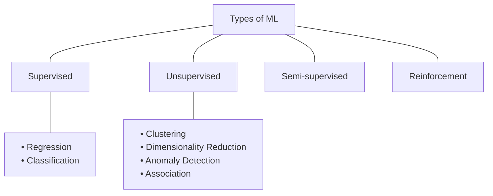

*Video Reference:* [YouTube](https://www.youtube.com/watch?v=81ymPYEtFOw&t=301s)

Machine learning algorithms can be categorized in several ways, but the most common and practical approach is based on the **amount of supervision** they require during training. 

By analyzing how much external guidance an algorithm needs, we can divide the entire field of Machine Learning into four primary categories:

1. Supervised Learning
2. Unsupervised Learning
3. Semi-supervised Learning
4. Reinforcement Learning

Here is a visual map of how these concepts connect:

Let's break down each of these categories in detail.

---

## 1. Supervised Machine Learning

Supervised learning is all about learning from labeled data. You provide the algorithm with both the **input** data and the corresponding **output** (the answer). The algorithm's job is to figure out the mathematical relationship between the input and the output so it can predict the output for completely new, unseen inputs.

### The College Placement Example

Imagine you have data from 5,000 college students containing three columns:
- **IQ Score** (Input)
- **CGPA** (Input)
- **Placement Status** (Output: Yes or No)

Because you have the inputs (IQ and CGPA) and the known outcome (whether they got placed), this is a supervised learning problem. Once the algorithm learns the relationship, you can give it a new student's IQ and CGPA, and it will predict whether they will get placed.

Supervised learning is the most widely used type of ML in the industry today, and it is further divided into two subcategories based on the type of output data:

### A. Regression
If your output column is **numerical** (continuous data), it is a regression problem. 
*Example:* Instead of predicting whether a student gets placed (Yes/No), you are predicting their exact salary package (e.g., 4.5 LPA, 8.0 LPA). Because the target is a number, you use Regression.

### B. Classification
If your output column is **categorical** (discrete data), it is a classification problem.
*Example:* Predicting if a student gets placed (Yes/No), if an email is Spam or Not Spam, or if an image contains a Dog or a Cat.

---

## 2. Unsupervised Machine Learning

In unsupervised learning, things get a bit more mysterious. You are given the **input** data, but there is absolutely no **output** (or label) provided. 

Since there is no target variable to predict, the algorithm's job is not prediction. Instead, its job is to find **hidden structures, patterns, or groupings** within the raw data. 

Unsupervised learning is generally categorized into four main tasks:

### A. Clustering
Clustering groups similar data points together. If we take our student data (IQ and CGPA) without the placement labels, a clustering algorithm might group the students into distinct clusters:
- High CGPA, High IQ
- Low CGPA, High IQ
- High CGPA, Low IQ

This is heavily used in the industry for **Customer Segmentation**. E-commerce companies use clustering to group customers by purchasing behavior to run targeted ad campaigns.

### B. Dimensionality Reduction
When working with real-world data (like images or text), you might have thousands of input columns (dimensions). Having too many columns can slow down your algorithms and introduce unnecessary noise.

Dimensionality reduction techniques (like PCA) merge highly correlated columns into single, more meaningful features. For example, combining "Number of Rooms" and "Number of Washrooms" into a single feature called "House Size" (a process known as Feature Extraction). It is also incredibly useful for visualizing high-dimensional data in a 2D or 3D space.

### C. Anomaly Detection
Anomaly detection algorithms scan datasets to find outliers or unusual data points that do not conform to expected patterns.
*Use Cases:* Detecting credit card fraud, finding manufacturing defects on an assembly line, or spotting unusual network traffic that could indicate a cyber attack.

### D. Association Rule Learning
This technique discovers interesting relationships between different variables in large databases. It is most famous for its use in retail.

*The Walmart Case Study:* Walmart analyzed shopping data and found a surprising correlation: customers who bought baby diapers were also highly likely to buy beer. While seemingly unrelated, Walmart placed these two items next to each other in stores, resulting in a massive increase in sales. Association rule learning surfaces these hidden connections.

---

## 3. Semi-supervised Learning

In the real world, data is abundant, but **labeled data is expensive**. Hiring humans to manually look at millions of images and label them (e.g., "Cat", "Dog", "Car") costs a lot of time and money.

Semi-supervised learning bridges this gap. You start with a massive dataset where only a tiny fraction of the data is labeled. The algorithm uses this small set of labeled data to understand the general pattern, and then automatically applies those labels to the remaining millions of unlabeled data points.

### The Google Photos Example
When you use Google Photos, it groups hundreds of images of a person's face together using unsupervised clustering. Then, it asks you to label just one photo ("This is Mom"). Using semi-supervised learning, it immediately applies that label to all the other grouped photos, saving you the effort of labeling each one manually.

---

## 4. Reinforcement Learning

While we will cover this extensively in later posts, Reinforcement Learning relies on an agent interacting with an environment. The agent takes actions and receives rewards for good actions and penalties for bad ones. Over time, it learns to maximize its reward, much like training a pet with treats.

---

## Summary

In the upcoming posts, we will dive deeper into the specific algorithms that power these different types of learning!
