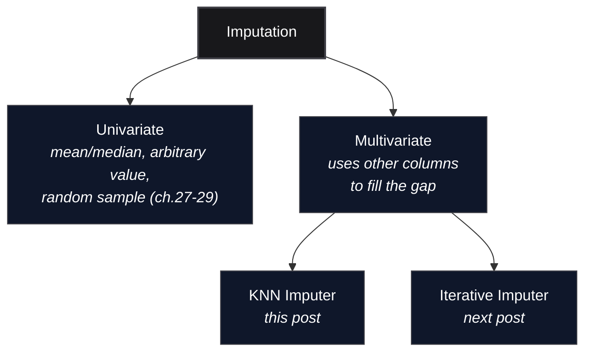

*Inspired by:* [YouTube](https://www.youtube.com/watch?v=-fK-xEev2I8)

Every imputation technique so far, mean/median, arbitrary value, end of distribution, most frequent category, random sample, shares one trait: each column gets filled using only *that column's own data*. This post covers the first technique that breaks from that pattern, **KNN Imputer**, scikit-learn's implementation of **multivariate imputation**: filling a missing value by looking at the *other* columns in the row and borrowing from whichever training rows look most similar.

---

## Univariate vs. Multivariate Imputation



Say a dataset has four columns and a row is missing a value in the first one. A univariate technique looks only at that first column's other, non-missing rows to decide what goes in the gap. A multivariate technique instead looks at columns two, three, and four *on that same row*, finds other rows whose columns two, three, and four look similar, and borrows their column-one values. **KNN Imputer** is the "similar rows" idea taken literally: treat each row as a point in space, and for a missing value, look at its `k` nearest neighbors and average what they have in that column.

---

## Finding Neighbors When Some Values Are Missing

Ordinary Euclidean distance between two rows, each treated as a point with one coordinate per column, is the familiar formula:

$$d = \sqrt{(x_1 - y_1)^2 + (x_2 - y_2)^2 + \dots + (x_n - y_n)^2}$$

That formula breaks the moment either row has a `NaN` in it, there's nothing to subtract. scikit-learn's `KNNImputer` uses a variant built for exactly this, `nan_euclidean_distances`, which does two things differently:

1. **Skip any coordinate where either row is missing.** Only compute the squared difference over columns where *both* rows have a value.
2. **Rescale by how many columns actually got used**, so that a distance computed from 2 present columns isn't unfairly small next to one computed from all 4. That rescaling factor is a **weight**, defined as:

$$w = \frac{n_{\text{features}}}{n_{\text{present}}}$$

which folds into the full distance as:

$$d = \sqrt{w \sum_{i \,\in\, \text{present}} (x_i - y_i)^2}$$

`n_features` is the total column count, `n_present` is how many of them weren't missing in *either* row for this particular pairwise comparison. This is exactly the "weight" scikit-learn's own docs name for this function, it inflates the sum-of-squares to compensate for using fewer terms, so distances stay roughly comparable whether a pair of rows shares 4 columns or only 2.

It's worth being precise about what this correction is actually for: `n_present` is a property of the *pair* being compared, not of one row being "more empty" in general, and the weight isn't there to penalize sparse-overlap pairs. A sum of fewer squared terms is, all else equal, a smaller number purely because fewer things are being added up, not because the rows are truly more similar. Left uncorrected, a pair sharing only one present column would tend to look artificially closer than a pair sharing all four, even if that one shared value disagrees a lot, and get wrongly picked as a "nearest" neighbor for the wrong reason. Scaling by `w` corrects that bias by inflating the partial sum back up to roughly what a full-column comparison would have produced, so a thin-overlap pair no longer has an unfair advantage. It can still end up as the nearest neighbor, honestly, if the few values it does share are genuinely close.

### A Worked Example on Real Titanic Rows

This uses the same `Age` / `Pclass` / `Fare` / `Survived` slice of Titanic the source notebook uses (more on that below). Row `766` in the training split is missing `Age`:

```text
idx=766: Pclass=1.0, Fare=39.60, Age=NaN
```

Its three nearest rows that *do* have an `Age` value, found by `nan_euclidean_distances` (equivalently, by hand with the formula above, `n_features=3`, and only `Pclass`/`Fare` present on every pair since `Age` is the very thing being compared to a `NaN`):

<div className="overflow-x-auto my-8">
  <table className="w-full text-left border-collapse">
    <thead>
      <tr className="border-b border-black/10 dark:border-white/10 text-amber-600 dark:text-amber-400">
        <th className="py-3 px-4 font-bold">idx</th>
        <th className="py-3 px-4 font-bold">Pclass</th>
        <th className="py-3 px-4 font-bold">Fare</th>
        <th className="py-3 px-4 font-bold">Age</th>
        <th className="py-3 px-4 font-bold">Distance to row 766</th>
      </tr>
    </thead>
    <tbody className="divide-y divide-black/5 dark:divide-white/5">
      <tr>
        <td className="py-3 px-4 font-semibold">853</td>
        <td className="py-3 px-4">1.0</td>
        <td className="py-3 px-4">39.40</td>
        <td className="py-3 px-4">16.0</td>
        <td className="py-3 px-4">0.2449</td>
      </tr>
      <tr>
        <td className="py-3 px-4 font-semibold">583</td>
        <td className="py-3 px-4">1.0</td>
        <td className="py-3 px-4">40.13</td>
        <td className="py-3 px-4">36.0</td>
        <td className="py-3 px-4">0.6430</td>
      </tr>
      <tr>
        <td className="py-3 px-4 font-semibold">684</td>
        <td className="py-3 px-4">2.0</td>
        <td className="py-3 px-4">39.00</td>
        <td className="py-3 px-4">60.0</td>
        <td className="py-3 px-4">1.4283</td>
      </tr>
    </tbody>
  </table>
</div>

Row `853` gets the shortest distance because it agrees with row `766` on `Pclass` exactly and is only 0.20 off on `Fare`, so $d = \sqrt{1.5 \times ((1-1)^2 + (39.6 - 39.4)^2)} = \sqrt{1.5 \times 0.04} = 0.2449$, the $1.5$ is $n_{\text{features}} / n_{\text{present}} = 3/2$, since only `Pclass` and `Fare` were available to compare. Row `684` is farthest, it's a different `Pclass` entirely.

### From Distance to a Filled Value

With `n_neighbors=3`, those three rows are the whole neighborhood. `weights='uniform'` would just average their `Age` values plainly, $(16 + 36 + 60) / 3 = 37.33$. `weights='distance'` instead weights each neighbor by $1/d$, so closer rows count for more, and critically, the denominator is the **sum of the weights**, not a fixed count like 2 or 3:

$$\text{Age}_{766} = \frac{\dfrac{16}{0.2449} + \dfrac{36}{0.6430} + \dfrac{60}{1.4283}}{\dfrac{1}{0.2449} + \dfrac{1}{0.6430} + \dfrac{1}{1.4283}} = 25.77$$

Row `853`, the closest match, pulls the estimate down toward `16` far more than the distant row `684` pulls it toward `60`. Running `KNNImputer(n_neighbors=3, weights='distance').fit_transform(X_train)` on the real data confirms it: the actual imputed value for row `766` is `25.768`, matching the hand calculation above exactly. It's worth being precise about that denominator: the source video's own manual walkthrough of a similar distance-weighted example divides by the neighbor *count* instead of the sum of the $1/d$ weights, which gives a different (wrong) number, the general formula for a weighted average is always $\sum w_i x_i / \sum w_i$, never $\sum w_i x_i / n$.

---

## Trying It on Titanic

Same setup as the [source notebook](https://github.com/campusx-official/100-days-of-machine-learning/tree/main/day39-knn-imputer): `Age`, `Pclass`, `Fare` as features, `Survived` as target, `Age` is the only column with missing values (about 19.9% of rows).

```python
import numpy as np
import pandas as pd

from sklearn.model_selection import train_test_split
from sklearn.impute import KNNImputer, SimpleImputer
from sklearn.linear_model import LogisticRegression
from sklearn.metrics import accuracy_score

df = pd.read_csv('train.csv')[['Age', 'Pclass', 'Fare', 'Survived']]

X = df.drop(columns=['Survived'])
y = df['Survived']

X_train, X_test, y_train, y_test = train_test_split(X, y, test_size=0.2, random_state=2)
```

```python
knn = KNNImputer(n_neighbors=3, weights='distance')

X_train_trf = knn.fit_transform(X_train)
X_test_trf = knn.transform(X_test)

lr = LogisticRegression()
lr.fit(X_train_trf, y_train)
y_pred = lr.predict(X_test_trf)

accuracy_score(y_test, y_pred)
```

```python
# Comparison with SimpleImputer --> mean

si = SimpleImputer()

X_train_trf2 = si.fit_transform(X_train)
X_test_trf2 = si.transform(X_test)

lr = LogisticRegression()
lr.fit(X_train_trf2, y_train)
y_pred2 = lr.predict(X_test_trf2)

accuracy_score(y_test, y_pred2)
```

<MdxImage src="/images/ch30-knn-vs-mean-accuracy.png" alt="Bar chart comparing logistic regression test accuracy on Titanic Age/Pclass/Fare: mean imputation reaches 69.27%, KNN Imputer with n_neighbors=3 and weights='distance' reaches 70.95%." className="w-full h-auto rounded-lg my-6" />

One call to `fit_transform`, `KNNImputer` fits its own internal nearest-neighbor structure on `X_train` and fills every missing `Age` using the worked-example logic above, in parallel for every row that needs it. `.transform(X_test)` reuses that same fitted structure, test-set rows get filled using distances computed against the *training* rows, never against other test rows, the same train/test separation discipline as every other imputation technique in this series. On this split, `KNNImputer` edges out `SimpleImputer`'s mean by about 1.7 points, `70.95%` versus `69.27%`.

### Tuning `n_neighbors` and `weights`

`n_neighbors` and `weights` are the two knobs, and there's no formula for the right `n_neighbors`, it's found by trying values and checking test accuracy, same as any other hyperparameter:

<MdxImage src="/images/ch30-n-neighbors-sweep.png" alt="Line chart of test accuracy against n_neighbors from 1 to 5 with weights='distance'. Accuracy rises from 68.72% at k=1 to a peak of 71.51% at k=2, then declines to 69.83% by k=4 and 5." className="w-full h-auto rounded-lg my-6" />

`k=2` happens to edge out `k=3` on this particular split, `71.51%` versus `70.95%`, and the curve is not monotonic in either direction, too few neighbors means each estimate leans on very little evidence, too many starts pulling in rows that aren't actually similar. `weights` matters too: switching the `n_neighbors=3` run from `'distance'` to `'uniform'` drops accuracy slightly, `70.95%` down to `70.39%`, plain averaging lets a distant, less-relevant neighbor pull the estimate just as hard as a close one.

---

## Does KNN Actually Preserve Relationships Between Columns?

Every univariate technique in this series has carried the same disadvantage: filling a column using only its own values ignores whatever relationship that column has with the others, and [random sample imputation's `.cov()` check](/machine-learning/ch29-random-sample-imputation-and-missing-indicator#it-still-disturbs-covariance) measured exactly that damage. `KNN Imputer` is built around the opposite idea, it explicitly uses `Pclass` and `Fare` to decide what `Age` should be, so it's worth checking whether that shows up as *less* damage to the `Age`↔`Pclass` relationship, not just better accuracy.

```python
X_train_knn = pd.DataFrame(X_train_trf, columns=X_train.columns, index=X_train.index)
X_train_mean = pd.DataFrame(X_train_trf2, columns=X_train.columns, index=X_train.index)

X_train.corr().loc['Age', 'Pclass']       # pairwise-complete, original
X_train_knn.corr().loc['Age', 'Pclass']   # after KNN imputation
X_train_mean.corr().loc['Age', 'Pclass']  # after mean imputation
```

<MdxImage src="/images/ch30-correlation-preservation.png" alt="Bar chart comparing Age-Pclass correlation across three states: original pairwise-complete correlation of -0.380, after KNN imputation -0.365, after mean imputation -0.339." className="w-full h-auto rounded-lg my-6" />

<div className="overflow-x-auto my-8">
  <table className="w-full text-left border-collapse">
    <thead>
      <tr className="border-b border-black/10 dark:border-white/10 text-amber-600 dark:text-amber-400">
        <th className="py-3 px-4 font-bold">State</th>
        <th className="py-3 px-4 font-bold">Age ↔ Pclass correlation</th>
      </tr>
    </thead>
    <tbody className="divide-y divide-black/5 dark:divide-white/5">
      <tr>
        <td className="py-3 px-4 font-semibold">Original (pairwise-complete)</td>
        <td className="py-3 px-4">-0.380</td>
      </tr>
      <tr>
        <td className="py-3 px-4 font-semibold">After KNN Imputation</td>
        <td className="py-3 px-4">-0.365</td>
      </tr>
      <tr>
        <td className="py-3 px-4 font-semibold">After Mean Imputation</td>
        <td className="py-3 px-4">-0.339</td>
      </tr>
    </tbody>
  </table>
</div>

The original, pairwise-complete correlation (computed only over rows where both columns are present, `pandas.DataFrame.corr()` does this automatically) is `-0.380`, older passengers skew slightly toward lower-numbered (higher) classes. Mean imputation flattens that to `-0.339`, every missing `Age` becomes the exact same number regardless of what `Pclass` that row belongs to, which mutes the relationship. KNN imputation lands at `-0.365`, closer to the original than mean gets, precisely because each fill was chosen *using* that row's own `Pclass` and `Fare` rather than ignoring them. It's not a perfect restoration, the filled values are still estimates, not the true missing ages, but the gap between `-0.380` and `-0.365` is noticeably smaller than the gap between `-0.380` and `-0.339`. This is the concrete payoff of "multivariate": the technique doesn't just predict better, it does measurably less damage to how the columns relate to each other.

---

## Advantages and Disadvantages

- **Advantage:** generally more accurate fills than any univariate technique, because it uses more information, the values in the *other* columns of that same row, rather than only the target column's own distribution.
- **Disadvantage:** computationally expensive. Filling one missing value means computing a distance from that row to *every other row* in the training set, then sorting to find the nearest `k`. That cost scales with the size of the dataset, not just the number of missing values.
- **Disadvantage:** memory-heavy at deployment, and for a different reason than random sample imputation's version of the same problem. `KNNImputer.transform()` on a brand-new incoming row needs to compute its distance against the *entire* training set stored inside the fitted object, so the whole training set has to live on the production server, not just a couple of summary numbers. That's slower and heavier than any technique covered so far in this series.
- **Good fit for:** small to medium-sized datasets, where the extra computation at fit/transform time is cheap enough to be worth the accuracy gain, and the full training set isn't too large to keep in memory on the serving side.

---

## Summary Cheat Sheet

<div className="overflow-x-auto my-8">
  <table className="w-full text-left border-collapse">
    <thead>
      <tr className="border-b border-black/10 dark:border-white/10 text-amber-600 dark:text-amber-400">
        <th className="py-3 px-4 font-bold">Aspect</th>
        <th className="py-3 px-4 font-bold">KNN Imputer</th>
      </tr>
    </thead>
    <tbody className="divide-y divide-black/5 dark:divide-white/5">
      <tr>
        <td className="py-3 px-4 font-semibold">scikit-learn</td>
        <td className="py-3 px-4"><code>sklearn.impute.KNNImputer</code></td>
      </tr>
      <tr>
        <td className="py-3 px-4 font-semibold">Key params</td>
        <td className="py-3 px-4"><code>n_neighbors</code> (tune by trying values), <code>weights</code> (<code>'uniform'</code> or <code>'distance'</code>)</td>
      </tr>
      <tr>
        <td className="py-3 px-4 font-semibold">Distance metric</td>
        <td className="py-3 px-4">nan-aware Euclidean, rescaled by <code>n_features / n_present</code> per pair of rows</td>
      </tr>
      <tr>
        <td className="py-3 px-4 font-semibold">Use when</td>
        <td className="py-3 px-4">dataset is small/medium, better accuracy than univariate methods is worth the extra compute and memory</td>
      </tr>
      <tr>
        <td className="py-3 px-4 font-semibold">Avoid when</td>
        <td className="py-3 px-4">dataset is large (slow fit/transform), or the production server can't hold the full training set in memory</td>
      </tr>
    </tbody>
  </table>
</div>

---

## What's Next?

`KNNImputer` fills a gap by borrowing from similar *rows*. The next post covers **Iterative Imputer**, a different multivariate approach that instead treats each column-with-missing-values as a regression target, predicted from the other columns, and repeats that process in rounds until the filled values stabilize.
