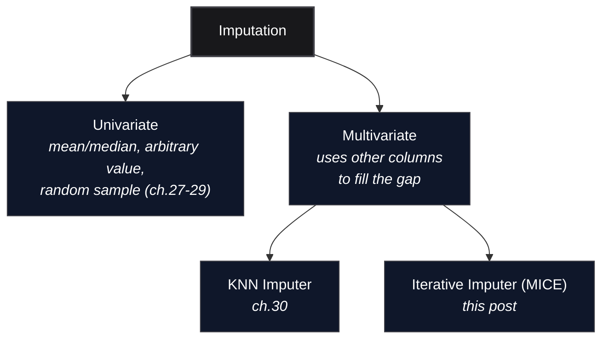

*Inspired by:* [YouTube](https://www.youtube.com/watch?v=a38ehxv3kyk)

[Ch.30 covered KNN Imputer](/machine-learning/ch30-knn-imputer), which fills a missing value by borrowing from *similar rows*. This post covers the other major multivariate technique, **Iterative Imputer**, scikit-learn's implementation of an algorithm more commonly called **MICE**, Multivariate Imputation by Chained Equations. Instead of looking at nearby rows, MICE treats each column that has missing values as a **regression target**, predicted from the other columns, and repeats that prediction in rounds until the predictions stop changing.

---



## Why "Chained Equations": Three Kinds of Missing Data

MICE only makes sense to reach for once the *reason* the data is missing has been thought through. There are three standard categories:

- **MCAR, Missing Completely at Random:** the value is gone for a reason that has nothing to do with any column in the dataset, a sensor dropped a reading, a row wasn't collected that day. Nothing else in the row predicts it.
- **MAR, Missing at Random:** the value is gone in a way that correlates with *other* columns. Age might be missing more often for a particular ticket class, but conditional on the other columns, there's no leftover pattern tied to the missing value itself.
- **MNAR, Missing Not at Random:** the value is missing *because of what it would have been*. Someone with a very high income skips the income field on purpose. Here the missingness itself carries information no other column can recover.

MICE is a MAR technique: it works by predicting the missing column from the others, so it only makes sense if those other columns actually carry a signal about the missing one. It can technically be run on any dataset, but it earns its extra cost specifically when the columns are correlated, which is also exactly the condition under which mean imputation does the most damage.

---

## The Algorithm, Worked by Hand

This uses the same slice of the `50_Startups` dataset as the [source notebook](https://github.com/campusx-official/100-days-of-machine-learning/tree/main/day40-iterative-imputer): `R&D Spend`, `Administration`, and `Marketing Spend`, five rows sampled with `np.random.seed(9)`, values divided by 10,000 and rounded so the numbers stay readable. Three values are knocked out, one per column, so every column has exactly one gap to fill:

```text
    R&D Spend  Administration  Marketing Spend
21       8.0            15.0             30.0
37       NaN             5.0             20.0
2       15.0            10.0             41.0
14      12.0             NaN             26.0
44       2.0            15.0              NaN
```

### Step 0: Mean-Fill Everything

Before any regression happens, every gap gets the plain column mean, exactly like [Ch.27](/machine-learning/ch27-mean-median-imputation). This is only a placeholder, a starting point the algorithm needs so every column is complete enough to be used as a predictor for the others:

```text
    R&D Spend  Administration  Marketing Spend
21       8.00           15.00            30.00
37       9.25            5.00            20.00     <- mean of [8,15,12,2]
2       15.00           10.00            41.00
14      12.00           11.25            26.00     <- mean of [15,5,10,15]
44       2.00           15.00            29.25     <- mean of [30,20,41,26]
```

### Step 1: Predict Each Column From the Others, Left to Right

Now, one column at a time, left to right: erase that column's mean-filled value, train `LinearRegression` on the rows that actually have real data in that column, using the *other two* columns as features, and predict the missing one.

**Column 1 (`R&D Spend`, row 37):** train on rows `{21, 2, 14, 44}` using `Administration` and `Marketing Spend` as `X`, `R&D Spend` as `y`. Predict row 37's `R&D Spend` from its `Administration=5.0` and `Marketing Spend=20.0`:

```text
23.14158651
```

**Column 2 (`Administration`, row 14):** same move, but this time row 37 already has its *new* predicted `R&D Spend` value (`23.14`) available as a feature, not the old mean:

```text
11.06331285
```

**Column 3 (`Marketing Spend`, row 44):** by now both row 37's `R&D Spend` and row 14's `Administration` have been updated, so this last prediction uses the freshest version of every column:

```text
31.56351448
```

That's **one full iteration**. Every previously-missing cell now holds a regression prediction instead of a mean:

```text
    R&D Spend  Administration  Marketing Spend
21       8.00           15.00            30.00
37      23.14            5.00            20.00
2       15.00           10.00            41.00
14      12.00           11.06            26.00
44       2.00           15.00            31.56
```

Subtracting the mean-filled starting point from this shows exactly how far the predictions moved on their first pass, everywhere else is `0` since only the three imputed cells changed:

```text
    R&D Spend  Administration  Marketing Spend
21       0.00            0.00             0.00
37      13.89            0.00             0.00
2        0.00            0.00             0.00
14       0.00           -0.19             0.00
44       0.00            0.00             2.31
```

### Step 2: Repeat, Using the Latest Predictions as Input

Iteration 2 does the exact same three regressions, but now every "other column" feature is the *iteration 1* prediction, not the original mean. Erase, predict, fill, column by column:

```text
    R&D Spend  Administration  Marketing Spend
21       8.00           15.00            30.00
37      23.78            5.00            20.00
2       15.00           10.00            41.00
14      12.00           11.22            26.00
44       2.00           15.00            31.56
```

Compared to iteration 1, `R&D Spend` moved by `0.64` and `Administration` by `0.16`, both far smaller shifts than iteration 1's `13.89` and `-0.19`. That's the trend MICE is chasing, each round's predictions should move less than the round before, as the algorithm settles toward a set of values all three regressions agree on.

### It Doesn't Always Shrink Every Round

Iteration 3 breaks that pattern:

```text
    R&D Spend  Administration  Marketing Spend
21       8.00           15.00            30.00
37      24.57            5.00            20.00
2       15.00           10.00            41.00
14      12.00           11.37            26.00
44       2.00           15.00            45.53
```

`Marketing Spend` jumps from `31.56` to `45.53`, a swing of `13.97`, bigger than the previous round's changes, not smaller. This is expected, not a bug: on a five-row toy dataset, each regression is fit on only 3-4 points, so a prediction can legitimately overshoot before the next round pulls it back. With only 5 rows and 3 columns, this is exactly the kind of noisy, non-monotonic path MICE takes before settling down.

### Running It Out to Convergence

Continuing this same left-to-right, erase-predict-fill loop for several more rounds (same regressions, same 5 rows, run programmatically instead of by hand) shows the full picture: an early swing, a spike, then a steady collapse toward zero change:

<MdxImage src="/images/ch31-mice-convergence.png" alt="Line chart on a log scale showing total imputed-value change per MICE iteration. Values start at 16.43, rise to a peak of 28.05 at iteration 3, then fall steadily through 8.64, 0.39, 0.018, 0.0008, down to 0.00004 by iteration 8." className="w-full h-auto rounded-lg my-6" />

By iteration 8 the total change across all three imputed cells is `0.00004`, effectively nothing. The final values, `R&D Spend = 26.72`, `Administration = 13.02`, `Marketing Spend = 70.69`, match what scikit-learn's own `IterativeImputer(estimator=LinearRegression())` produces on the exact same data, `imp.n_iter_` reports `8`, the point where its internal stopping criterion (change below `tol`) was met. This is precisely what "chained equations" means: a chain of regressions run in a loop, each one re-using the freshest fill for every other column, until the chain stabilizes.

---

## Using `IterativeImputer` in Practice

Nobody hand-rolls the loop above. `sklearn.impute.IterativeImputer` runs it automatically, defaulting to `BayesianRidge` as the regressor rather than plain `LinearRegression`, and stopping once the change between rounds drops below `tol` or `max_iter` is hit. It still requires the explicit opt-in import shown below, it's an experimental API in scikit-learn:

```python
import pandas as pd

from sklearn.model_selection import train_test_split
from sklearn.experimental import enable_iterative_imputer  # noqa
from sklearn.impute import IterativeImputer, KNNImputer, SimpleImputer
from sklearn.linear_model import LogisticRegression
from sklearn.metrics import accuracy_score

df = pd.read_csv('train.csv')[['Age', 'Pclass', 'Fare', 'Survived']]

X = df.drop(columns=['Survived'])
y = df['Survived']

X_train, X_test, y_train, y_test = train_test_split(X, y, test_size=0.2, random_state=2)
```

Same setup as Ch.30: `Age` is the only column with gaps (about 19.9% of rows), `Pclass` and `Fare` are complete and used as predictors.

```python
it = IterativeImputer()

X_train_trf = it.fit_transform(X_train)
X_test_trf = it.transform(X_test)

lr = LogisticRegression()
lr.fit(X_train_trf, y_train)
y_pred = lr.predict(X_test_trf)

accuracy_score(y_test, y_pred)
```

```text
0.6927374301675978
```

Which, on this particular split, **ties mean imputation exactly** and trails `KNNImputer(n_neighbors=3, weights='distance')` from Ch.30 (`0.7095`):

<div className="overflow-x-auto my-8">
  <table className="w-full text-left border-collapse">
    <thead>
      <tr className="border-b border-black/10 dark:border-white/10 text-amber-600 dark:text-amber-400">
        <th className="py-3 px-4 font-bold">Imputer</th>
        <th className="py-3 px-4 font-bold">Test accuracy</th>
      </tr>
    </thead>
    <tbody className="divide-y divide-black/5 dark:divide-white/5">
      <tr>
        <td className="py-3 px-4">SimpleImputer (mean)</td>
        <td className="py-3 px-4">0.6927</td>
      </tr>
      <tr>
        <td className="py-3 px-4">IterativeImputer (MICE)</td>
        <td className="py-3 px-4">0.6927</td>
      </tr>
      <tr>
        <td className="py-3 px-4">KNNImputer (k=3, distance)</td>
        <td className="py-3 px-4">0.7095</td>
      </tr>
    </tbody>
  </table>
</div>

That tie is worth understanding rather than shrugging off, it does *not* mean `IterativeImputer` filled `Age` the same way mean imputation did, and it comes down to three things stacking against MICE on this split. First, [Ch.30 already measured](/machine-learning/ch30-knn-imputer#does-knn-actually-preserve-relationships-between-columns) how much `Pclass` and `Fare` actually know about `Age`, a correlation of `-0.380`, which squared means class explains only about 14% of the variation in age, the rest is noise no algorithm can recover from class and fare alone. So MICE's per-row fills are only a mild nudge off the mean, not a confident, accurate guess. Second, that nudge only reaches the accuracy number by surviving `LogisticRegression`, which weighs `Age` against two other features, so a fill only changes the model's prediction for a passenger who was already sitting close to its decision boundary, most aren't. Third, there aren't many chances for that to happen at all, only 29 of the 179 test rows have a missing `Age`. For MICE to beat mean here, at least one of those 29 people needed a fill good enough to carry them across the boundary in the right direction, on this split, none did.

### Same Accuracy, Very Different Fills

`Age`'s mean-fill is a single constant, `29.79`, stamped onto every missing row. `IterativeImputer`'s fills are different per row, built from that row's own `Pclass` and `Fare`:

<div className="overflow-x-auto my-8">
  <table className="w-full text-left border-collapse">
    <thead>
      <tr className="border-b border-black/10 dark:border-white/10 text-amber-600 dark:text-amber-400">
        <th className="py-3 px-4 font-bold">idx</th>
        <th className="py-3 px-4 font-bold">Pclass</th>
        <th className="py-3 px-4 font-bold">Fare</th>
        <th className="py-3 px-4 font-bold">Age_mean</th>
        <th className="py-3 px-4 font-bold">Age_iter</th>
      </tr>
    </thead>
    <tbody className="divide-y divide-black/5 dark:divide-white/5">
      <tr>
        <td className="py-3 px-4 font-semibold">77</td>
        <td className="py-3 px-4">3</td>
        <td className="py-3 px-4">8.05</td>
        <td className="py-3 px-4">29.79</td>
        <td className="py-3 px-4">24.83</td>
      </tr>
      <tr>
        <td className="py-3 px-4 font-semibold">334</td>
        <td className="py-3 px-4">1</td>
        <td className="py-3 px-4">133.65</td>
        <td className="py-3 px-4">29.79</td>
        <td className="py-3 px-4">35.00</td>
      </tr>
      <tr>
        <td className="py-3 px-4 font-semibold">295</td>
        <td className="py-3 px-4">1</td>
        <td className="py-3 px-4">27.72</td>
        <td className="py-3 px-4">29.79</td>
        <td className="py-3 px-4">39.86</td>
      </tr>
      <tr>
        <td className="py-3 px-4 font-semibold">792</td>
        <td className="py-3 px-4">3</td>
        <td className="py-3 px-4">69.55</td>
        <td className="py-3 px-4">29.79</td>
        <td className="py-3 px-4">22.01</td>
      </tr>
    </tbody>
  </table>
</div>

Mean imputation writes `29.79` regardless of class or fare. `IterativeImputer` gives a third-class, low-fare passenger (`77`) a younger predicted age (`24.83`) and a first-class, high-fare passenger (`334`) an older one (`35.00`), a real, different-per-row correction built from that row's own `Pclass` and `Fare`. It just wasn't enough, on this split, to flip any predictions, for the reasons above. The correlation table below is a more direct way to see the difference MICE actually made, it doesn't have to survive a classifier first.

### Which One Preserves Correlation Best

Same `.corr()` check as Ch.30, `Age` (still has its gaps), `Age_iter`, `Age_knn`, and `Age_mean` sit side by side so one call shows every method's damage, or lack of it, against the two complete columns:

<div className="overflow-x-auto my-8">
  <table className="w-full text-left border-collapse">
    <thead>
      <tr className="border-b border-black/10 dark:border-white/10 text-amber-600 dark:text-amber-400">
        <th className="py-3 px-4 font-bold"></th>
        <th className="py-3 px-4 font-bold">Pclass</th>
        <th className="py-3 px-4 font-bold">Fare</th>
      </tr>
    </thead>
    <tbody className="divide-y divide-black/5 dark:divide-white/5">
      <tr>
        <td className="py-3 px-4 font-semibold">Age (original)</td>
        <td className="py-3 px-4">-0.380</td>
        <td className="py-3 px-4">0.096</td>
      </tr>
      <tr>
        <td className="py-3 px-4 font-semibold">Age_iter (MICE)</td>
        <td className="py-3 px-4">-0.423</td>
        <td className="py-3 px-4">0.115</td>
      </tr>
      <tr>
        <td className="py-3 px-4 font-semibold">Age_knn (Ch.30)</td>
        <td className="py-3 px-4">-0.365</td>
        <td className="py-3 px-4">0.090</td>
      </tr>
      <tr>
        <td className="py-3 px-4 font-semibold">Age_mean (Ch.27)</td>
        <td className="py-3 px-4">-0.339</td>
        <td className="py-3 px-4">0.091</td>
      </tr>
    </tbody>
  </table>
</div>

Mean imputation pulls both correlations toward zero, expected, a constant value carries no relationship to anything. KNN lands close to the original on `Pclass` (`-0.365` vs. `-0.380`) without overshooting. MICE overshoots on both columns, `-0.423` is *more* negative than the original `-0.380`, and `0.115` is *more* positive than the original `0.096`, because it explicitly fits a regression line through `Pclass` and `Fare` and then predicts exactly on that line, which tends to sharpen a correlation that was already there rather than just approximating it. Neither behavior is strictly "more correct", but it's a real, measurable difference between the two multivariate techniques, and it's invisible if the only thing being checked is downstream accuracy.

---

## Advantages and Disadvantages

- **Advantage:** each fill uses the actual relationships between columns, generally closer to the true value than any univariate method, and the video's own framing of the trade-off holds up: it's "quite natural" in the sense that the fitted regressions can genuinely recover structure mean imputation destroys.
- **Disadvantage:** slow. Every iteration re-fits one regression per column-with-missing-values, and the whole thing runs for several iterations before stopping, this cost is paid at `fit_transform` time, before a single downstream model is even trained.
- **Disadvantage:** at `.transform()` time on new data, the fitted regressors from training are reused, but the same iterative refinement runs again, so it's heavier at inference than a technique that just stores a handful of summary numbers.
- **Good fit for:** datasets where columns are genuinely correlated (the MAR case above) and the accuracy gain is worth the extra compute, small to medium-sized data where a few seconds of iterative fitting isn't a bottleneck.

---

## Summary Cheat Sheet

<div className="overflow-x-auto my-8">
  <table className="w-full text-left border-collapse">
    <thead>
      <tr className="border-b border-black/10 dark:border-white/10 text-amber-600 dark:text-amber-400">
        <th className="py-3 px-4 font-bold">Aspect</th>
        <th className="py-3 px-4 font-bold">Iterative Imputer (MICE)</th>
      </tr>
    </thead>
    <tbody className="divide-y divide-black/5 dark:divide-white/5">
      <tr>
        <td className="py-3 px-4 font-semibold">scikit-learn</td>
        <td className="py-3 px-4"><code>sklearn.impute.IterativeImputer</code> (needs <code>from sklearn.experimental import enable_iterative_imputer</code>)</td>
      </tr>
      <tr>
        <td className="py-3 px-4 font-semibold">Core idea</td>
        <td className="py-3 px-4">each missing column is a regression target predicted from the others, repeated in rounds until predictions stabilize</td>
      </tr>
      <tr>
        <td className="py-3 px-4 font-semibold">Key params</td>
        <td className="py-3 px-4"><code>estimator</code> (default <code>BayesianRidge</code>), <code>max_iter</code>, <code>tol</code></td>
      </tr>
      <tr>
        <td className="py-3 px-4 font-semibold">Assumes</td>
        <td className="py-3 px-4">Missing at Random (MAR), the other columns actually carry signal about the missing one</td>
      </tr>
      <tr>
        <td className="py-3 px-4 font-semibold">Use when</td>
        <td className="py-3 px-4">columns are correlated and the accuracy/relationship-preservation gain is worth slower fit/transform</td>
      </tr>
      <tr>
        <td className="py-3 px-4 font-semibold">Avoid when</td>
        <td className="py-3 px-4">data is MCAR (no column correlations to exploit) or the dataset is too large for repeated regression fits to be practical</td>
      </tr>
    </tbody>
  </table>
</div>

---

## What's Next?

Missing data is done for now. The next posts move to **outliers**: what actually counts as an outlier, why they distort mean-based statistics and linear models, and the first detection technique, the **Z-score method**.
