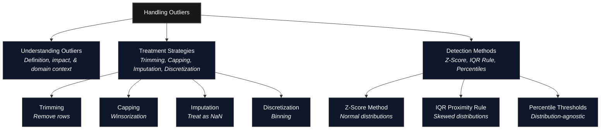
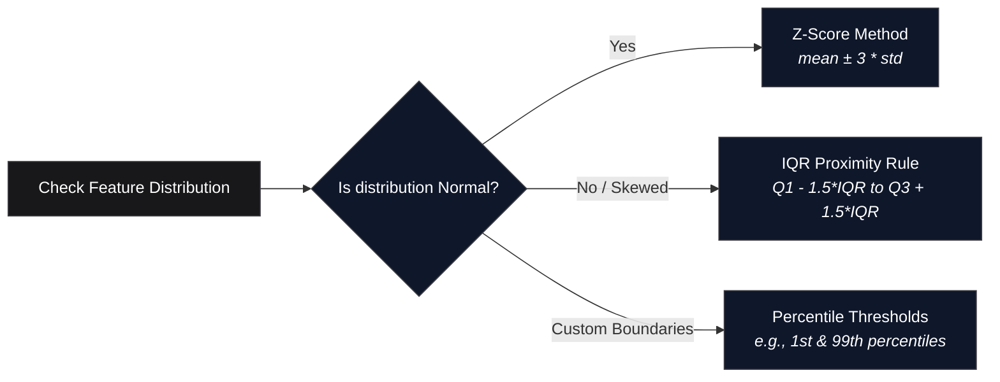

*Inspired by:* [YouTube](https://www.youtube.com/watch?v=Lln1PKgGr_M)

In the previous post, we wrapped up our deep dive into missing data imputation with [Iterative Imputer (MICE)](/machine-learning/ch31-iterative-imputer-mice). In this post, we begin a new core module of feature engineering: **Outlier Detection and Removal**. Outliers are extreme or unusual data points that can silently distort machine learning models, skew performance metrics, and ruin predictions if left unaddressed.

---



---

## What is an Outlier?

An **outlier** is a data point or observation that deviates significantly from the remaining data points in a sample. It behaves distinctly from the overall pattern of the dataset.

To understand how drastically an outlier can distort summary statistics, consider a classroom salary example:

* Suppose a class has 50 students, and the average salary of 49 of them ranges between $30,000 and $50,000 per year.
* If Bill Gates enters the room, his multi-billion-dollar income becomes part of the dataset.
* Calculating the mean salary of the room now yields millions of dollars.

That mean is technically correct mathematically, but it completely fails as a representative metric for the typical student in that classroom.

---

## Why are Outliers Problematic for Machine Learning Models?

Outliers pull model parameters away from the true underlying pattern of the majority of the data. 

Consider a simple linear regression task predicting student exam marks based on study hours:

```text
Study Hours vs. Marks (True Data Distribution):
Study Hours:   [ 1,   2,   3,   4,   5,   6,   7 ]
Marks:         [ 15,  25,  35,  48,  60,  72,  85 ]  <- Strong linear trend

Add two outliers (Students studying 1 hour but scoring 98 due to prior background):
Study Hours:   [ 1,   1 ]
Marks:         [ 95,  98 ]
```

### The Geometry of Distortion in Linear Models

Linear regression fits a line $y = mx + c$ by minimizing the Mean Squared Error (MSE):

$$\text{MSE} = \frac{1}{n} \sum_{i=1}^{n} (y_i - \hat{y}_i)^2$$

Because distance errors are **squared**, extreme vertical distances created by outliers dominate the loss function. To minimize total error across all points, the optimization algorithm rotates and shifts the regression line significantly toward the outliers.

```text
Without Outliers:  Line follows general trend (slanted upwards through main cluster).
With Outliers:     Line gets pulled up on the left side, flattening or tilting artificially.
```

<MdxImage src="/images/ch14-outlier-regression-impact.png" alt="Side-by-side regression plots showing a fitted line skewed by outliers versus a clean fit after removing them" className="w-full h-auto rounded-lg my-6" />

As a result:
1. The model fits the outliers slightly better, but its performance degrades across the 95% of normal data points.
2. Future predictions for standard input queries produce higher generalization error.

---

## When Are Outliers Dangerous vs. When Should You Keep Them?

Deciding what to do with an outlier requires domain knowledge and an understanding of *why* the outlier exists in the first place.

### Scenario 1: Data Entry / Measurement Errors (Remove or Fix)
If a survey respondent's `Age` field contains `830`, this is clearly a human typo or system corruption (someone typed 830 instead of 83 or 38). Keeping `830` introduces unrecoverable noise. In such cases, the observation should be removed or converted to `NaN` for imputation.

### Scenario 2: Valid Rare Events in Anomaly Detection (Keep)
In domain applications like **Credit Card Fraud Detection**, **Network Intrusion Detection**, or **Rare Disease Diagnosis**, outliers are not unwanted noise, they are the exact target event you want to detect. If you remove all anomalous transactions during preprocessing, your model will never learn the signature of fraudulent behavior.

### Scenario 3: Missing Context / Unmodeled Features (Re-engineer)
In the student study-hours example, a student studying 1 hour and scoring 98 marks seems like an inexplicable outlier. However, if you collect an additional feature such as `IQ_Score` or `Prior_Coursework_Completed`, that observation ceases to be anomalous and becomes logically explained by the model.

> Outliers are not inherently bad data. They are simply extreme observations. Determining whether an outlier is unwanted noise or genuine signal is one of the most critical domain decisions a data scientist must make.

---

## Algorithm Sensitivity to Outliers

Not all machine learning algorithms are impacted by outliers in the same way. Machine learning models fall into two primary categories regarding outlier sensitivity:

<div className="overflow-x-auto my-8">
  <table className="w-full text-left border-collapse">
    <thead>
      <tr className="border-b border-black/10 dark:border-white/10 text-amber-600 dark:text-amber-400">
        <th className="py-3 px-4 font-bold">Algorithm Type</th>
        <th className="py-3 px-4 font-bold">Examples</th>
        <th className="py-3 px-4 font-bold">Outlier Sensitivity</th>
        <th className="py-3 px-4 font-bold">Reason</th>
      </tr>
    </thead>
    <tbody className="divide-y divide-black/5 dark:divide-white/5">
      <tr>
        <td className="py-3 px-4 font-semibold">Weight-Based / Parametric</td>
        <td className="py-3 px-4">Linear Regression, Logistic Regression, AdaBoost, Artificial Neural Networks (ANNs)</td>
        <td className="py-3 px-4 text-red-500 font-bold">Highly Sensitive</td>
        <td className="py-3 px-4">These models compute global weights and parameters by minimizing loss functions (e.g. squared errors). Extreme values heavily skew loss gradients.</td>
      </tr>
      <tr>
        <td className="py-3 px-4 font-semibold">Tree-Based / Non-Parametric</td>
        <td className="py-3 px-4">Decision Trees, Random Forest, Gradient Boosting (XGBoost, LightGBM, CatBoost)</td>
        <td className="py-3 px-4 text-green-500 font-bold">Robust / Immune</td>
        <td className="py-3 px-4">Tree models split feature space using monotonic threshold cuts (e.g., $X_i > 45$). The exact magnitude of extreme values beyond the split threshold does not alter the decision boundaries.</td>
      </tr>
    </tbody>
  </table>
</div>

A simple rule of thumb: **If an algorithm calculates weights, coefficients, or distance metrics across features, it is sensitive to outliers.**

---

## How to Treat Outliers: 4 Preprocessing Strategies

Once outliers are identified and deemed unwanted noise, there are four standard methods to handle them:

### 1. Trimming (Data Deletion)
Trimming simply drops rows containing outlier values from the dataset.

* **Pros**: Extremely simple and fast to implement. Completely removes the distortion.
* **Cons**: Reduces dataset size. If outliers occur across multiple columns, trimming can eliminate a substantial portion of your overall data.

```python
# Trimming example: keeping rows within lower and upper bounds
df_trimmed = df[(df['age'] >= lower_bound) & (df['age'] <= upper_bound)]
```

### 2. Capping (Threshold Clamping / Winsorization)
Capping establishes maximum and minimum threshold boundaries. Any value exceeding the upper bound is capped to the upper bound value; any value below the lower bound is raised to the lower bound value.

* **Pros**: Preserves 100% of rows and sample size.
* **Cons**: Alters the original tail shape of the feature distribution by stacking extreme points onto boundary values.

```python
import numpy as np

# Capping example: clipping values outside [lower_bound, upper_bound]
df['age_capped'] = np.clip(df['age'], a_min=lower_bound, a_max=upper_bound)
```

### 3. Treating Outliers as Missing Values
Outlier values are converted to `np.nan` and imputed using standard missing data techniques (e.g., median imputation, KNN Imputer, or MICE).

```python
# Convert outliers to NaN, then apply SimpleImputer
df.loc[(df['age'] < lower_bound) | (df['age'] > upper_bound), 'age'] = np.nan
```

### 4. Discretization (Feature Binning)
As covered in detail in [Ch.23 on Discretization and Binarization](/machine-learning/ch23-discretization-binarization), converting continuous numerical variables into discrete categorical bins naturally absorbs outliers into boundary intervals (e.g., binning ages into `[0-18, 19-35, 36-60, 60+]`). Both an age of `65` and an outlier age of `105` fall into the same `60+` bucket, neutralizing the extreme distance impact.

---

## How to Detect Outliers: 3 Core Frameworks

Before applying any treatment strategy, you must detect which observations fall outside acceptable bounds. Three main frameworks are used depending on the feature's underlying probability distribution:



### Method 1: Z-Score / Standard Deviation Rule (For Normally Distributed Data)

When a feature follows a Gaussian (normal) distribution, data points concentrate symmetrically around the mean $\mu$:

* $\mu \pm 1\sigma$ covers $\approx 68.27\%$ of data.
* $\mu \pm 2\sigma$ covers $\approx 95.45\%$ of data.
* $\mu \pm 3\sigma$ covers $\approx 99.73\%$ of data.

<MdxImage src="/images/ch32-68-95-997-rule.png" alt="Normal distribution bell curve showing the 68-95-99.7 empirical rule across 1, 2, and 3 standard deviations from the mean" className="w-full h-auto rounded-lg my-6" />

```text
Lower Bound = μ - 3 * σ
Upper Bound = μ + 3 * σ
```

Any observation lying outside $[\mu - 3\sigma, \mu + 3\sigma]$ (or having an absolute Z-score $|Z| > 3$) represents fewer than 0.27% of expected samples under a normal distribution and is flagged as an outlier.

$$Z = \frac{x - \mu}{\sigma}$$

### Method 2: Interquartile Range (IQR) Proximity Rule (For Skewed Data)

If data is skewed (left-skewed or right-skewed), the mean and standard deviation themselves become corrupted by extreme values. In such cases, non-parametric quantile metrics from a **Box Plot** are used:

```text
IQR = Q3 - Q1   (75th percentile - 25th percentile)

Lower Fence = Q1 - 1.5 * IQR
Upper Fence = Q3 + 1.5 * IQR
```

Any data point smaller than the `Lower Fence` or larger than the `Upper Fence` is defined as an outlier.

<MdxImage src="/images/ch32-iqr-box-plot.png" alt="Box plot diagram illustrating Q1, Median, Q3, Interquartile Range (IQR), Lower Fence (Q1 - 1.5*IQR), Upper Fence (Q3 + 1.5*IQR), and outliers" className="w-full h-auto rounded-lg my-6" />

### Method 3: Percentile-Based Thresholds (Distribution-Agnostic)

For arbitrary distributions where strict normal assumptions or box plot multipliers do not fit well, custom percentile cutoffs are defined manually based on dataset inspection:

```text
Lower Threshold = 1st percentile (or 2.5th percentile)
Upper Threshold = 99th percentile (or 97.5th percentile)
```

Values falling outside these upper and lower percentile bounds are flagged for trimming or capping.

---

## What's Next in the Series?

Now that we have established the foundational taxonomy of outliers, the next four posts in this series will cover each detection and treatment technique in deep practical detail with full Python implementations:

1. **Z-Score Method** (Detecting & treating outliers in Gaussian features)
2. **IQR Proximity Rule** (Detecting & treating outliers in skewed features using Box Plots)
3. **Percentile-Based Trimming & Capping** (Handling arbitrary distributions)
4. **Winsorization** (Advanced capping techniques)
