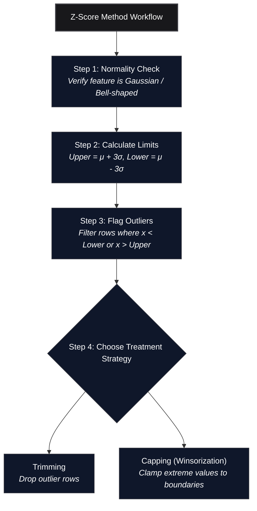

*Inspired by:* [YouTube](https://www.youtube.com/watch?v=OnPE-Z8jtqM)

In [the previous post](/machine-learning/ch32-introduction-to-outliers), we introduced the foundational concepts of outliers: why they distort model performance, when to remove vs. keep them, and the taxonomy of handling techniques. In this post, we cover our first concrete technique: the **Z-Score Method** (also known as the **3-Sigma / Standard Deviation Rule**) for detecting and removing outliers.

---



---

## Core Assumption: Normality Requirement

Before applying the Z-Score method to any column, there is **one non-negotiable prerequisite**:

> The feature column MUST follow a **Normal (Gaussian) distribution**, or at least be reasonably close to a bell curve.

If a column is heavily skewed (left-skewed or right-skewed), the mean $\mu$ and standard deviation $\sigma$ themselves become corrupted by tail values, invalidating the Z-Score boundary calculations. Skewed distributions should be handled using the **IQR Proximity Rule**, which will be covered in the next post.

---

## The Mathematics of the Z-Score Rule

In a standard normal distribution $\mathcal{N}(\mu, \sigma^2)$, data points cluster symmetrically around the mean $\mu$ according to the **68-95-99.7 Empirical Rule**:

* $\mu \pm 1\sigma$ contains **68.27%** of all observations.
* $\mu \pm 2\sigma$ contains **95.45%** of all observations.
* $\mu \pm 3\sigma$ contains **99.73%** of all observations.

```text
Lower Boundary = μ - 3 * σ
Upper Boundary = μ + 3 * σ
```

Any observation lying beyond $3\sigma$ from the mean accounts for fewer than **0.27%** of samples under normal random variation. Statisticians treat values outside this range as statistical anomalies.

### Converting Raw Feature Values to Z-Scores

The **Z-score** represents the number of standard deviations an individual observation $x_i$ lies away from the population mean $\mu$:

$$Z_i = \frac{x_i - \mu}{\sigma}$$

* A Z-score of `0` means the observation equals the mean.
* A Z-score of `+2.5` means the observation lies 2.5 standard deviations above the mean.
* A Z-score of `-3.2` means the observation lies 3.2 standard deviations below the mean.

Checking whether a feature value falls outside $[\mu - 3\sigma, \mu + 3\sigma]$ is **mathematically identical** to checking whether its absolute Z-score is greater than 3:

$$\text{Outlier Condition: } |Z_i| > 3 \iff x_i < (\mu - 3\sigma) \quad \text{or} \quad x_i > (\mu + 3\sigma)$$

The advantage of converting data to Z-scores is scale standardization: regardless of whether you are measuring height in centimeters, salary in thousands, or CGPA on a 10-point scale, the outlier threshold remains fixed at $|Z| > 3$.

---

## Hands-On Python Walkthrough: `placement.csv` Dataset

Let's test the Z-score method on a real placement dataset containing 1,000 student records with two numerical features: `cgpa` and `placement_exam_marks`.

```python
import numpy as np
import pandas as pd
import matplotlib.pyplot as plt
import seaborn as sns

df = pd.read_csv('placement.csv')
df.head()
```

```text
   cgpa  placement_exam_marks  placed
0  6.89                  26.0       1
1  8.00                  14.0       1
2  5.12                  31.0       1
3  7.42                  33.0       1
4  6.84                  51.0       1
```

---

### Step 1: Normality Check

We first plot histograms with KDE curves to verify which columns follow a Gaussian distribution:

```python
plt.figure(figsize=(14, 5))

plt.subplot(1, 2, 1)
sns.histplot(df['cgpa'], kde=True)
plt.title('CGPA Distribution (Normally Distributed)')

plt.subplot(1, 2, 2)
sns.histplot(df['placement_exam_marks'], kde=True)
plt.title('Placement Exam Marks (Right-Skewed)')

plt.show()
```

<MdxImage src="/images/ch33-distribution-check.png" alt="Side-by-side distribution plots comparing CGPA, which forms a clean Gaussian bell curve, against Placement Exam Marks, which exhibits a heavy right skew" className="w-full h-auto rounded-lg my-6" />

### Key Observation
* **`cgpa`**: Displays a symmetric, classic bell-curve shape. **Z-score method is valid here.**
* **`placement_exam_marks`**: Heavily right-skewed (most students scored low, very few scored high). **Z-score method CANNOT be used here** (we will use IQR in the next post).

---

### Step 2: Summary Statistics & Boundary Calculations

Next, we inspect the summary metrics of `cgpa`:

```python
print("Mean CGPA:", df['cgpa'].mean())
print("Std CGPA :", df['cgpa'].std())
print("Min CGPA :", df['cgpa'].min())
print("Max CGPA :", df['cgpa'].max())
```

```text
Mean CGPA: 6.96124
Std CGPA : 0.61589
Min CGPA : 4.89000
Max CGPA : 9.12000
```

Now we compute the upper and lower 3-sigma limits:

```python
upper_limit = df['cgpa'].mean() + 3 * df['cgpa'].std()
lower_limit = df['cgpa'].mean() - 3 * df['cgpa'].std()

print("Upper Limit (μ + 3σ):", upper_limit)
print("Lower Limit (μ - 3σ):", lower_limit)
```

```text
Upper Limit (μ + 3σ): 8.80893
Lower Limit (μ - 3σ): 5.11354
```

Any student with a CGPA greater than `8.80893` or lower than `5.11354` is classified as an outlier.

<MdxImage src="/images/ch33-cgpa-outliers-zscore.png" alt="Histogram of CGPA showing the mean line in purple and upper/lower 3-sigma boundary lines in red, isolating 5 outlier data points in the tails" className="w-full h-auto rounded-lg my-6" />

---

### Step 3: Detecting Outlier Rows

We query the dataset to isolate observations outside these boundary limits:

```python
# Filtering outliers using feature limits
outliers = df[(df['cgpa'] > upper_limit) | (df['cgpa'] < lower_limit)]
outliers
```

```text
     cgpa  placement_exam_marks  placed
485  4.89                  16.0       0
496  4.90                  24.0       1
537  5.01                  52.0       0
995  8.95                  44.0       1
996  9.12                  65.0       1
```

Out of 1,000 students, exactly 5 observations violate the $3\sigma$ boundary: 3 on the lower tail ($4.89, 4.90, 5.01$) and 2 on the upper tail ($8.95, 9.12$).

#### Verification via Z-Score Standardization Formula
We can also calculate explicit Z-scores for every row to achieve the identical result:

```python
# Create Z-score column
df['cgpa_zscore'] = (df['cgpa'] - df['cgpa'].mean()) / df['cgpa'].std()

# Filter where |Z| > 3
df[(df['cgpa_zscore'] > 3) | (df['cgpa_zscore'] < -3)]
```

```text
     cgpa  placement_exam_marks  placed  cgpa_zscore
485  4.89                  16.0       0    -3.362985
496  4.90                  24.0       1    -3.346764
537  5.01                  52.0       0    -3.168161
995  8.95                  44.0       1     3.229081
996  9.12                  65.0       1     3.505105
```

Both conditions return the exact same 5 outlier rows.

---

## Treatment Approach 1: Trimming (Dropping Outliers)

In **Trimming**, we drop rows containing outlier values and keep only observations within $[\mu - 3\sigma, \mu + 3\sigma]$:

```python
# Trimming implementation
new_df_trimmed = df[(df['cgpa'] <= upper_limit) & (df['cgpa'] >= lower_limit)]

print("Original shape:", df.shape)
print("Trimmed shape :", new_df_trimmed.shape)
```

```text
Original shape: (1000, 3)
Trimmed shape : (995, 3)
```

The dataset size shrinks from 1,000 rows to 995 rows, cleanly removing the 5 anomalous points.

---

## Treatment Approach 2: Capping (Winsorization)

When dropping rows is undesirable because dataset size must be preserved, we apply **Capping** (also known as **Winsorization**).

Instead of deleting the 5 outlier rows, we clamp their values:
* Any CGPA $> 8.80893$ is replaced with $8.80893$.
* Any CGPA $< 5.11354$ is replaced with $5.11354$.

### Implementation in Python via `np.where`

```python
# Apply capping using nested np.where
df['cgpa_capped'] = np.where(
    df['cgpa'] > upper_limit,
    upper_limit,
    np.where(
        df['cgpa'] < lower_limit,
        lower_limit,
        df['cgpa']
    )
)

print("Original Min:", df['cgpa'].min(), "| Capped Min:", df['cgpa_capped'].min())
print("Original Max:", df['cgpa'].max(), "| Capped Max:", df['cgpa_capped'].max())
print("Final Dataset Shape:", df.shape)
```

```text
Original Min: 4.89 | Capped Min: 5.11354
Original Max: 9.12 | Capped Max: 8.80893
Final Dataset Shape: (1000, 4)
```

Alternatively, `np.clip` performs the identical operation cleanly in one line:

```python
# One-liner capping using np.clip
df['cgpa_capped'] = np.clip(df['cgpa'], a_min=lower_limit, a_max=upper_limit)
```

<MdxImage src="/images/ch33-capping-before-after.png" alt="Side-by-side box plots comparing raw CGPA with outliers extending beyond 4.89 and 9.12 against capped CGPA where extreme points are neatly clamped at 5.11 and 8.81" className="w-full h-auto rounded-lg my-6" />

> **Why do points still appear outside the whiskers in the capped box plot?**
> Seaborn and Matplotlib box plots compute whisker boundaries using the **IQR rule** ($Q_3 + 1.5 \times \text{IQR}$), NOT the Z-score $3\sigma$ rule. In a standard normal distribution, $1.5 \times \text{IQR}$ corresponds to roughly $\pm 2.7\sigma$. Because Z-score capping clamps extreme values at $\pm 3.0\sigma$, values clamped between $2.7\sigma$ and $3.0\sigma$ (e.g. `8.81` and `5.11`) are correctly capped, but still sit slightly beyond the box plot's $2.7\sigma$ whisker boundary.

---

## Summary & Key Takeaways

1. **Prerequisite**: The Z-score method strictly requires normally (or near-normally) distributed data. Do not apply it to skewed columns.
2. **Boundary Threshold**: Data points outside $\mu \pm 3\sigma$ (or $|Z| > 3$) are flagged as outliers under the 68-95-99.7 empirical rule.
3. **Trimming vs. Capping**:
   * Use **Trimming** (`df[(df[col] >= lower) & (df[col] <= upper)]`) if dataset size is large and dropping < 1% of rows does not impact training.
   * Use **Capping** (`np.clip(df[col], lower, upper)`) if sample size must be preserved or downstream models require consistent record counts.

In the next post, we will cover the **IQR Proximity Rule** to detect and treat outliers in **skewed distributions** where the Z-score method cannot be applied.
