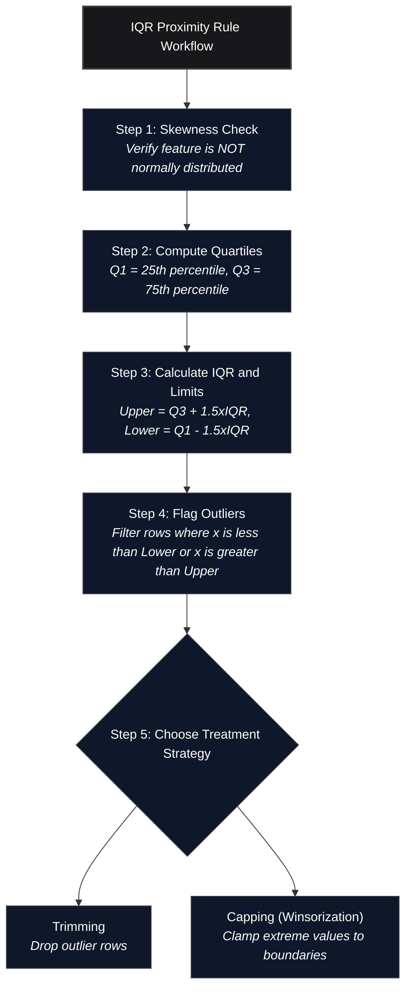

*Inspired by:* [YouTube](https://www.youtube.com/watch?v=Ccv1-W5ilak)

In [the previous post](/machine-learning/ch33-z-score-method-for-outlier-detection), we tackled outlier removal using the Z-Score (3-Sigma) method. That technique has one strict prerequisite: the column must follow a **normal (Gaussian) distribution**. The moment a column is heavily skewed, the mean and standard deviation are themselves distorted by the tail values, making Z-score boundaries unreliable.

This post covers the fallback approach: the **IQR Proximity Rule**, a robust method that works specifically for **skewed distributions**.

---



---

## Prerequisites: Box Plots and Quartiles

Before stepping through the IQR formula, it helps to be fluent in the two building blocks the method relies on: **percentiles/quartiles** and **box plots**.

### Percentiles and Quartiles

A **percentile** answers the question: "What value sits at the boundary where $k\%$ of all observations fall below it?"

The three quartile boundaries divide any sorted dataset into four equal parts:

| Symbol | Percentile | Meaning |
|--------|-----------|---------|
| **Q1** | 25th | 25% of values are below this point |
| **Q2** (Median) | 50th | Half the values are below, half above |
| **Q3** | 75th | 75% of values are below this point |

The **Interquartile Range (IQR)** is simply the width of the middle 50% of your data:

$$\text{IQR} = Q3 - Q1$$

Because IQR is defined by the middle bulk of the distribution, it is resistant to extreme values on either tail. This is the key reason it works where Z-scores fail: you are not involving the mean or standard deviation at all.

### Reading a Box Plot

A box plot is the standard visualization for IQR-based statistics. Every element maps directly to a quantile. Here it is labeled on the real `placement_exam_marks` column used throughout this post:


* The **box** spans Q1 to Q3 (the IQR).
* The **center line** inside the box is the median (Q2).
* The **whiskers** extend to the IQR proximity limits (Q1 - 1.5*IQR on the left, Q3 + 1.5*IQR on the right).
* Any point **beyond the whiskers** is plotted as an individual dot and is treated as an outlier by the chart.

This is not coincidental: the IQR proximity rule is literally the same formula box plots use to decide where to draw their whiskers. When you see outlier dots in a box plot, those are exactly the points you would remove or cap using this method.

---

## The IQR Proximity Rule Formula

```text
Upper Boundary = Q3 + 1.5 * IQR
Lower Boundary = Q1 - 1.5 * IQR
```

Any observation above the upper boundary or below the lower boundary is classified as an outlier.

### Why 1.5?

The multiplier `1.5` was proposed by statistician John Tukey when he introduced box plots in 1977. It is a convention, not a mathematically derived constant, but it has a useful property: for a perfectly normal distribution, the IQR-based whiskers at `1.5*IQR` extend to approximately $\pm 2.7\sigma$. This catches most genuine outliers while keeping false-positive rates low. Some practitioners use `3*IQR` for "far outliers" (roughly $\pm 4.7\sigma$), but `1.5` remains the standard default.

---

## Hands-On Python Walkthrough: `placement.csv` Dataset

We use the same 1,000-student placement dataset from ch33: columns `cgpa`, `placement_exam_marks`, and `placed`.

```python
import numpy as np
import pandas as pd
import matplotlib.pyplot as plt
import seaborn as sns

df = pd.read_csv('placement.csv')
df.head()
```

```text
   cgpa  placement_exam_marks  placed
0  7.19                  26.0       1
1  7.46                  38.0       1
2  7.54                  40.0       1
3  6.42                   8.0       1
4  7.23                  17.0       0
```

---

### Step 1: Identify the Skewed Column

We plot both numeric columns side by side to confirm which one is suitable for the IQR method:

```python
plt.figure(figsize=(16, 5))
plt.subplot(1, 2, 1)
sns.distplot(df['cgpa'])
plt.subplot(1, 2, 2)
sns.distplot(df['placement_exam_marks'])
plt.show()
```


* **`cgpa`**: Near-symmetric bell curve. The Z-score method (covered in ch33) applies here.
* **`placement_exam_marks`**: Clear right skew. Most students scored low, but a handful of high scorers pull the tail to the right. Z-score boundaries would be distorted by those extremes. **This is the target column for the IQR method.**

We can confirm the skew numerically:

```python
df['placement_exam_marks'].describe()
```

```text
count    1000.000000
mean       59.580000
std        33.466...
min         0.000000
25%        17.000000
50%        28.000000
75%        44.000000
max       100.000000
```

The gap between the mean (59.58) and the median (28.0) signals right skew: the few very high scorers are dragging the mean upward, far above the typical student's marks.

---

### Step 2: Inspect the Box Plot

```python
sns.boxplot(df['placement_exam_marks'])
```


The dots beyond the right whisker are exactly the outliers the IQR rule will flag. There are no dots on the left side, which means no outliers exist in the lower tail of this distribution.

---

### Step 3: Compute Q1, Q3, IQR, and Limits

```python
# Finding the IQR
percentile25 = df['placement_exam_marks'].quantile(0.25)
percentile75 = df['placement_exam_marks'].quantile(0.75)
iqr = percentile75 - percentile25

upper_limit = percentile75 + 1.5 * iqr
lower_limit = percentile25 - 1.5 * iqr

print("Upper limit", upper_limit)
print("Lower limit", lower_limit)
```

```text
Upper limit 84.5
Lower limit -23.5
```

Breaking this down with the real numbers:

| Statistic | Value |
|-----------|-------|
| Q1 (25th percentile) | 17.0 |
| Q3 (75th percentile) | 44.0 |
| IQR (Q3 - Q1) | 27.0 |
| Upper limit (Q3 + 1.5 * 27) | **84.5** |
| Lower limit (Q1 - 1.5 * 27) | **-23.5** |

The lower limit of **-23.5** is below zero. Since exam marks cannot be negative, no student can possibly fall below it. The outlier problem is entirely one-sided here: only the **upper tail** has genuine outliers.

---

### Step 4: Detect Outlier Rows

```python
## Finding Outliers
df[df['placement_exam_marks'] > upper_limit]
df[df['placement_exam_marks'] < lower_limit]
```

```text
# Upper outliers: 15 rows with placement_exam_marks > 84.5
# Lower outliers: 0 rows
```

Exactly **15 students** scored above 84.5. These are the right-tail outliers visible as individual dots in the box plot above. The lower boundary catches zero rows, confirming the skew is purely right-sided.

---

## Treatment Approach 1: Trimming (Dropping Outliers)

Trimming removes the outlier rows entirely from the dataset. Since all outliers are on the upper side, we simply keep rows below the upper limit:

```python
## Trimming
new_df = df[df['placement_exam_marks'] < upper_limit]
new_df.shape
```

```text
(985, 3)
```

The dataset shrinks from **1,000 rows to 985 rows**, removing the 15 anomalous high-scorers. The lower boundary condition is skipped because no rows violate it.

### Before vs. After Trimming


Key observations from the comparison:

* **Distribution plot**: The shape is mostly unchanged, but the right tail is cleanly cut off at 84.5. The bin around 85-100 disappears entirely. The overall shape remains right-skewed (trimming does not normalize a distribution, it just clips the extremes).
* **Box plot**: The outlier dots on the right are gone. The whisker now terminates at the largest remaining value, which sits within the IQR boundary.

---

## Treatment Approach 2: Capping (Winsorization)

When you cannot afford to lose rows (small dataset, downstream processes expecting fixed record counts, etc.), **Capping** replaces outlier values with the boundary limit rather than deleting the row.

```python
## Capping
new_df_cap = df.copy()
new_df_cap['placement_exam_marks'] = np.where(
    new_df_cap['placement_exam_marks'] > upper_limit,
    upper_limit,
    np.where(
        new_df_cap['placement_exam_marks'] < lower_limit,
        lower_limit,
        new_df_cap['placement_exam_marks']
    )
)
new_df_cap.shape
```

```text
(1000, 3)
```

All 1,000 rows are preserved. The logic is a nested `np.where` that walks through each value:

1. If the value exceeds 84.5, replace it with 84.5.
2. Otherwise, if it is below -23.5, replace it with -23.5.
3. Otherwise, leave the value unchanged.

After capping: maximum value is **84.5**, minimum is **0.0** (unchanged, since the lower cap of -23.5 was never triggered).

### Before vs. After Capping


Key observations:

* **Distribution plot**: A small spike appears at exactly 84.5 in the "after" plot. This is the telltale signature of capping: all 15 outlier values that were previously spread between 85 and 100 are now collapsed onto the single boundary value of 84.5. The rest of the distribution is identical.
* **Box plot**: The outlier dots disappear. Because all previously-outlying values are now exactly at 84.5 (which sits right at the whisker boundary), they are no longer plotted as individual points.

> **Capping vs. Trimming: which to choose?**
> If your dataset has thousands of rows and you are removing fewer than 1-2% of them, Trimming is simpler and cleaner. If sample size matters (medical trials, rare event datasets, class imbalance scenarios), Capping preserves every row while still clipping the distortion caused by extreme values.

---

## Why IQR Works for Skewed Data

To understand why IQR is robust where Z-scores fail, consider what happens with a right-skewed column:

* The **mean** gets pulled toward the high-value tail, placing it well above the typical observation.
* The **standard deviation** inflates because it is computed from squared deviations from that already-shifted mean.
* As a result, the Z-score upper boundary ($\mu + 3\sigma$) ends up far to the right, failing to flag obvious outliers sitting in the stretched tail.

The IQR method sidesteps this entirely. Q1 and Q3 are **order statistics**: they are computed by sorting and indexing the data, with no arithmetic on the actual values. Extreme tail values cannot shift Q1 or Q3. They only affect positions beyond the quartile boundaries, which are exactly the candidates for outlier classification.

---

## Summary and Key Takeaways

1. **When to use IQR over Z-score**: Use the IQR Proximity Rule when a column is skewed (non-normal). Use Z-score only when the column is approximately Gaussian. In the placement dataset, `placement_exam_marks` (right-skewed) is the IQR candidate, while `cgpa` (near-normal) was handled by Z-score in ch33.

2. **The formula**:
   ```text
   IQR = Q3 - Q1
   Upper Boundary = Q3 + 1.5 * IQR
   Lower Boundary = Q1 - 1.5 * IQR
   ```

3. **Real numbers from this dataset**: Q1 = 17, Q3 = 44, IQR = 27, upper limit = 84.5, lower limit = -23.5. All 15 outliers resided in the upper tail; the lower limit was never triggered.

4. **Trimming vs. Capping**:
   * Use **Trimming** (`df[df[col] < upper_limit]`) when you can afford to lose the outlier rows. Dataset shrinks from 1,000 to 985.
   * Use **Capping** (`np.where(...)` or `np.clip(...)`) when row count must be preserved. Dataset stays at 1,000, with extreme values clamped to the boundary.

5. **The capping spike**: After Winsorization, a visible spike at the capping boundary is expected and normal. It represents all formerly-outlying values collapsed onto a single point. This is not a modeling problem, it is a feature of the technique.

In the next post, we will continue exploring feature engineering techniques for building cleaner, more model-ready datasets.
