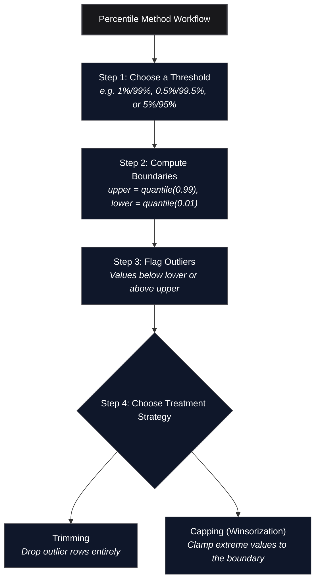

*Inspired by:* [YouTube](https://www.youtube.com/watch?v=bcXA4CqRXvM)

In [the previous post](/machine-learning/ch34-iqr-method-for-outlier-detection), we used the IQR Proximity Rule to handle outliers in skewed columns. That method is a step up from Z-score (which only works on normally distributed data), but it still derives its boundaries from the quartile structure of the distribution.

This post covers the **general-purpose fallback**: the **Percentile Method**, sometimes called **Winsorization**. It makes no assumption about distribution shape at all. Whether the column is normal, skewed, bimodal, or something else entirely, the technique works the same way: simply decide how much of each tail to treat as extreme, and clip everything outside that boundary.

---



---

## What Is a Percentile?

A **percentile** answers the question: "What value sits at the rank where $k\%$ of all observations in the dataset fall below it?"

The exam-rank intuition makes this concrete. If you scored at the **98th percentile** on an exam, it means 98% of students scored below you and only 2% scored above. If you are at the **50th percentile**, half the class is below you and half is above: that is the median. If you scored the maximum value in the entire group, you are at the **100th percentile** because everyone else scored below you. Conversely, the minimum value sits at the 0th percentile because no one scored below it.

Apply the same logic to any feature column:

| Percentile | Meaning |
|------------|---------|
| 0th (minimum) | No observations fall below this value |
| 1st | 1% of observations fall below this value |
| 50th (median) | Half fall below, half above |
| 99th | 99% of observations fall below this value |
| 100th (maximum) | All observations fall below or equal this value |

---

## The Core Idea: Rank-Based Boundaries

The percentile method defines outliers purely by **rank**, not by any statistic that depends on the shape of the distribution:

```text
upper_limit = quantile(0.99)   # 99th percentile
lower_limit = quantile(0.01)   # 1st percentile
```

Any value **above the upper limit** or **below the lower limit** is classified as an outlier.

The threshold is **your choice**. Common conventions:

- **1% / 99%**: The most widely used default. Treats the bottom and top 1% of each column as outliers.
- **0.5% / 99.5%**: Tighter. Keeps more data, removes only the most extreme observations.
- **5% / 95%**: More aggressive. Useful for noisy sensor data or very heavy-tailed distributions.

This tunability is one of the method's strengths: the percentile cutoff is a **hyperparameter**. Try 1%, 0.5%, and 2% on your actual downstream model and use whatever produces the best validation result. There is no universally correct value.

### Why This Method Works on Any Distribution

Recall the constraint on the other two techniques:

- **Z-score** (ch33): Requires the column to be approximately **normally distributed**. The moment the distribution is skewed, the mean and standard deviation are pulled by the tails, making the $\mu \pm 3\sigma$ boundaries unreliable.
- **IQR Proximity Rule** (ch34): More robust than Z-score and works on **skewed data**, but the boundaries are still anchored to Q1 and Q3, the 25th and 75th percentiles. The 1.5x multiplier is a convention from box plot design, not a general-purpose guarantee.
- **Percentile Method** (this post): Makes **no distributional assumption**. It works by sorting observations and reading off rank positions. Extreme values only affect the specific percentile slots they occupy and nothing else.

---

## Dataset: Weight and Height

We use a 10,000-row dataset with three columns: `Gender`, `Height` (in inches), and `Weight` (in pounds). The [source notebook](https://github.com/campusx-official/100-days-of-machine-learning/blob/main/day44-outlier-detection-using-percentiles/day44.ipynb) focuses on the `Height` column. After a quick inspection, `Weight` does not show notable outliers in this dataset, so we will work with `Height` only.

```python
import numpy as np
import pandas as pd
import seaborn as sns

df = pd.read_csv('weight-height.csv')
df.head()
```

```text
   Gender     Height      Weight
0    Male  73.847017  241.893563
1    Male  68.781904  162.310473
2    Male  74.110105  212.740856
3    Male  71.730978  220.042470
4    Male  69.881796  206.349801
```

```python
df.shape
# (10000, 3)
```

### Baseline Statistics

```python
df['Height'].describe()
```

```text
count    10000.000000
mean        66.367560
std          3.847528
min         54.263133
25%         63.505620
50%         66.318070
75%         69.174262
max         78.998742
```

The minimum is about 54.3 inches and the maximum is about 79.0 inches. The mean and median are nearly identical (66.37 vs 66.32), confirming the column is very close to normally distributed. Yet even a near-normal column can carry a handful of genuinely extreme values at the tails, and the percentile method catches those regardless of shape.

### Visualizing the Raw Distribution

```python
sns.distplot(df['Height'])
sns.boxplot(df['Height'])
```


The distribution is nearly symmetric and bell-shaped, confirming what the describe() stats suggested. However, the box plot reveals **outlier dots at both ends**: a handful of very short individuals and a handful of very tall individuals that fall beyond the box plot whiskers. The dashed red and green lines mark the 1st and 99th percentile boundaries that we will use as our cutoff.

---

## Step 1: Compute the Percentile Limits

```python
upper_limit = df['Height'].quantile(0.99)
lower_limit = df['Height'].quantile(0.01)

print(upper_limit)  # 74.786
print(lower_limit)  # 58.134
```

Real computed values from this dataset:

| Statistic | Value |
|-----------|-------|
| Upper limit (99th percentile) | **74.79 inches** |
| Lower limit (1st percentile)  | **58.13 inches** |

Every observation above 74.79 inches or below 58.13 inches will be treated as an outlier.

---

## Treatment Approach 1: Trimming

Trimming drops the outlier rows entirely. Both conditions are applied simultaneously with `&` because this dataset has outliers on both tails:

```python
# Trimming
new_df = df[(df['Height'] <= 74.78) & (df['Height'] >= 58.13)]
new_df['Height'].describe()
```

Note: the notebook uses the literal values `74.78` and `58.13` (rounded from the computed quantiles). Using the computed variables directly is equivalent and cleaner:

```python
new_df = df[(df['Height'] <= upper_limit) & (df['Height'] >= lower_limit)]
```

```text
count     9800.000000
mean        66.364366
std          3.645075
min         58.134496
25%         63.577162
50%         66.318070
75%         69.119896
max         74.785714
```

**Key result**: the dataset shrinks from **10,000 rows to 9,800 rows**, removing exactly 200 rows (roughly 1% from each tail: 100 from the bottom, 100 from the top). The mean barely moves (66.37 to 66.36), but the standard deviation drops from 3.85 to 3.65, and the min/max now sit at the percentile boundaries instead of the true extremes.

### Before vs. After Trimming


Key observations:

- **Distribution plot**: The overall bell shape is preserved. The very short and very tall tails are clipped. The curve tightens slightly around the centre.
- **Box plot**: All outlier dots on both ends disappear. The whiskers now terminate at the smallest and largest remaining values, both of which sit within the percentile boundaries.

---

## Treatment Approach 2: Capping (Winsorization)

When you cannot afford to drop rows, **Capping** replaces outlier values with the boundary value instead of deleting the row. This is also called **Winsorization**, a term named after the statistician **Charles Winsor** who formalized the technique. (The same name appeared in ch34 in the context of IQR-based capping: the Winsorization label applies whenever you clamp extreme values to a boundary, regardless of how that boundary was computed.)

```python
# Capping --> Winsorization
df['Height'] = np.where(df['Height'] >= upper_limit,
        upper_limit,
        np.where(df['Height'] <= lower_limit,
        lower_limit,
        df['Height']))
```

The nested `np.where` logic:

1. If `Height >= upper_limit` (74.79), replace with `upper_limit`.
2. Otherwise, if `Height <= lower_limit` (58.13), replace with `lower_limit`.
3. Otherwise, keep the original value.

A style variant you will sometimes see in practice uses `upper_limit + 1` or `lower_limit - 1` as the replacement value instead of the exact boundary. This is a personal preference and makes no material difference to model training: the goal is simply to move the extreme values to some bounded region.

```python
df.shape
# (10000, 3)

df['Height'].describe()
```

```text
count    10000.000000
mean        66.366281
std          3.795717
min         58.134412
25%         63.505620
50%         66.318070
75%         69.174262
max         74.785790
```

All **10,000 rows are preserved**. The maximum is now capped at **74.79 inches** and the minimum at **58.13 inches**, matching the percentile boundaries. The standard deviation tightens slightly (3.85 to 3.80) but the shape is otherwise intact.

### Before vs. After Capping


Key observations:

- **Distribution plot**: Small spikes appear at exactly 58.13 and 74.79 in the "after" panel. This is the signature of capping: every observation that previously exceeded the boundary is now collapsed onto the boundary value. The spike height reflects how many rows were capped at each end.
- **Box plot**: The outlier dots on both ends disappear. Values that were once scattered beyond the whiskers are now stacked at the whisker endpoints.

> **Capping vs. Trimming: which to choose?**
> Trimming is simpler and removes the distortion entirely, but you lose rows. Capping keeps every row at the cost of introducing a small artificial spike at the boundary. For large datasets (like this 10,000-row example) where 200 rows is a trivial loss, Trimming is clean and straightforward. For small datasets or situations where every record matters (clinical trials, rare-event fraud detection, class-imbalanced datasets), Capping is the safer choice.

---

## Choosing the Right Threshold

The 1%/99% split is a convention, not a law. Some practical guidance:

- Start at **1%/99%** as the baseline.
- If your model's validation metric improves after tightening to **0.5%/99.5%**, use that.
- If the dataset is very noisy (sensor readings, scraped web data), try a more aggressive **2%/98%** or even **5%/95%**.
- There is no formula that tells you the optimal percentile in advance. Treat it as a hyperparameter and cross-validate.

The key insight is that unlike Z-score (where the $3\sigma$ rule has a specific statistical justification) or IQR (where the 1.5x Tukey multiplier is a convention with a known probability interpretation), the percentile threshold is entirely empirical and problem-specific.

---

## Series Recap: All Three Outlier Techniques

Over the last three posts (ch33, ch34, ch35) we covered every major outlier detection and removal method used in practice:

| Method | When to Use | Statistic Used | Distributional Assumption |
|--------|-------------|----------------|--------------------------|
| **Z-Score** (ch33) | Column is approximately normal | Mean, Standard Deviation | Requires normality |
| **IQR Proximity Rule** (ch34) | Column is skewed | Q1, Q3, IQR | Works for skewed; no normality needed |
| **Percentile Method** (ch35) | Any distribution shape | Rank/quantile | None: purely rank-based |

The three form a natural decision tree: check for normality first; if present, use Z-score; if skewed, prefer IQR; and when in doubt or when the distribution is unusual, fall back to the percentile method as the most general tool.

In the next post, we will move on to the next stage of feature engineering.
