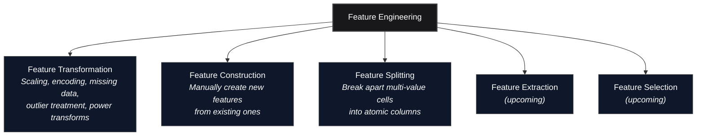

*Inspired by:* [YouTube](https://www.youtube.com/watch?v=ma-h30PoFms)

The previous several posts (ch32 through ch35) covered outlier detection and treatment: Z-score, IQR, the percentile method. All of those fall under **Feature Transformation**, which is one branch of the broader feature engineering tree. Transformation techniques share a common trait: there is a well-defined procedure or formula you follow (compute a statistic, set a threshold, clip or remove).

This post opens a different branch: **Feature Construction** and **Feature Splitting**. These are qualitatively different because they are *manual*. There is no universal formula. You look at the columns you have, apply domain knowledge and intuition, and create new columns that capture information the originals did not express directly. This gets easier with practice, but at the start it can feel open-ended because the question is always "can I combine or rearrange what I already have into something more useful?"

---



---

## Feature Construction

Feature Construction means creating an entirely new column by combining, transforming, or re-encoding one or more existing columns, guided by your understanding of the problem rather than by a fixed algorithm. The key difference from everything we have done so far: there is no standard procedure. You decide *what* to build based on what you know about the domain, and whether it actually helps is something you verify empirically by checking model performance before and after.

This reliance on intuition and domain knowledge is what makes Feature Construction hard for beginners. You are not applying a formula; you are asking "does it make sense, given what I know about this problem, to combine these columns into something new?" The answer comes from experience, and the only way to build that experience is to try it on real datasets.

### Example: Family Size and Family Type on Titanic

The [source notebook](https://github.com/campusx-official/100-days-of-machine-learning/blob/main/day45-feature-construction-and-feature-splitting/day45.ipynb) demonstrates this on the Titanic dataset. The idea: the Titanic has `SibSp` (number of siblings/spouses aboard) and `Parch` (number of parents/children aboard). Individually, each column captures part of the picture. But what might actually matter for survival is the *overall family size*, and more specifically, whether someone was travelling alone, with a small family, or with a large family.

First, establish a baseline. Load only five columns, drop rows with missing `Age`, and run Logistic Regression with 20-fold cross-validation:

```python
import numpy as np
import pandas as pd
from sklearn.model_selection import cross_val_score
from sklearn.linear_model import LogisticRegression

df = pd.read_csv('train.csv')[['Age','Pclass','SibSp','Parch','Survived']]
df.dropna(inplace=True)

X = df.iloc[:,0:4]   # Age, Pclass, SibSp, Parch
y = df.iloc[:,-1]    # Survived

np.mean(cross_val_score(LogisticRegression(), X, y, scoring='accuracy', cv=20))
```

```text
0.6933333333333332
```

Baseline accuracy: **69.33%**. Now construct two new features from `SibSp` and `Parch`:

```python
X['Family_size'] = X['SibSp'] + X['Parch'] + 1   # +1 counts the passenger themself
```

The `+ 1` is important: `SibSp` and `Parch` count *other* family members, so without adding the passenger, a solo traveller would show `Family_size = 0` instead of `1`.

Next, collapse `Family_size` into an ordinal `Family_type`:

```python
def myfunc(num):
    if num == 1:
        return 0  # alone
    elif num > 1 and num <= 4:
        return 1  # small family
    else:
        return 2  # large family

X['Family_type'] = X['Family_size'].apply(myfunc)
```

The thresholds (alone = 1, small family = 2-4, large family = 5+) are not derived from any formula. They come from a reasonable guess: travelling alone is qualitatively different from travelling with family, and a very large family might behave differently from a small one (harder to coordinate, more people to find during evacuation). Whether this particular binning is optimal is an empirical question, and you could try other splits.

Now drop the original columns that were consumed by the construction:

```python
X.drop(columns=['SibSp','Parch','Family_size'], inplace=True)
```

The resulting features:

```text
    Age  Pclass  Family_type
0  22.0       3            1
1  38.0       1            1
2  26.0       3            0
3  35.0       1            1
4  35.0       3            0
```

Re-run the same cross-validation:

```python
np.mean(cross_val_score(LogisticRegression(), X, y, scoring='accuracy', cv=20))
```

```text
0.7003174603174602
```

Accuracy after construction: **70.03%**. That is a **+0.7 percentage point** improvement from a single manually engineered feature. The improvement is small in absolute terms, but the point is not the magnitude: it is that this improvement came from *thinking about the data* rather than from tuning a hyperparameter or switching algorithms. In a real competition or production model, many small gains like this compound.

### Why It Works

`SibSp` and `Parch` are raw counts that carry different semantic weight depending on context. A passenger with `SibSp=2, Parch=0` and one with `SibSp=0, Parch=2` have different family structures, but the same total family presence. By collapsing them into `Family_type`, you give the model a single, cleaner signal: was this person alone, with a small group, or with a large group? The model no longer has to learn the interaction between two separate count columns to figure out something that, to a human, is a single concept.

---

## Feature Splitting

Feature Splitting solves the opposite problem. Instead of combining multiple columns into one, you take a single column that packs *multiple pieces of information into one cell* and break it apart into separate, atomic columns.

This is a **tidy data** issue. In a well-structured dataset, every cell should contain exactly one piece of information: one observation per row, one value per cell. When a column violates this (a name that contains both a title and a given name, an address that contains both city and state, a datetime string that encodes both date and time), you cannot easily filter, group, or plot on the individual pieces without first extracting them.

### Example: Extracting Title from Name on Titanic

The Titanic `Name` column looks like this:

```text
Braund, Mr. Owen Harris
Cumings, Mrs. John Bradley (Florence Briggs Thayer)
Heikkinen, Miss. Laina
```

Each cell contains at least three pieces of information: surname, title (Mr/Mrs/Miss/Master/etc.), and given name. The title is particularly interesting because it encodes social status, gender, marital status, and age group, all in a single word. But you cannot access it without splitting.

```python
df = pd.read_csv('train.csv')  # full Titanic, reload

df['Title'] = df['Name'].str.split(', ', expand=True)[1].str.split('.', expand=True)[0]
```

How this works, step by step:

1. **Split on `, `** (comma-space): separates `"Braund"` from `"Mr. Owen Harris"`.
2. **Take column `[1]`**: the part after the comma, which starts with the title.
3. **Split on `.`**: separates `"Mr"` from `" Owen Harris"`.
4. **Take column `[0]`**: the title itself.

### Survival Rate by Title

Once you have the title extracted, you can compute survival rates grouped by title. This is exactly the kind of analysis that was impossible before splitting, because the title was buried inside the full name string.

```python
df.groupby('Title')['Survived'].mean().sort_values(ascending=False)
```

```text
Title
the Countess    1.000000
Mlle            1.000000
Sir             1.000000
Ms              1.000000
Lady            1.000000
Mme             1.000000
Mrs             0.792000
Miss            0.697802
Master          0.575000
Col             0.500000
Major           0.500000
Dr              0.428571
Mr              0.156673
Jonkheer        0.000000
Rev             0.000000
Don             0.000000
Capt            0.000000
```

The pattern is striking. Among the **common titles** (those with enough passengers to be statistically meaningful):

- **Mrs** (married women): ~79% survival rate, the highest among common titles.
- **Miss** (unmarried women): ~70%.
- **Master** (young boys): ~57.5%.
- **Mr** (adult men): ~15.7%, by far the lowest.

This aligns with the historical "women and children first" evacuation protocol on the Titanic.

**A note on the rare titles**: the Countess, Mlle, Sir, Ms, Lady, and Mme all show 100% survival, and Jonkheer, Rev, Don, and Capt show 0%. These look dramatic, but check the sample sizes:

```text
Mr              517
Miss            182
Mrs             125
Master           40
Dr                7
Rev               6
Mlle              2
Major             2
Col               2
the Countess      1
Capt              1
Ms                1
Sir               1
Lady              1
Mme               1
Don               1
Jonkheer          1
```

Every title with a 100% or 0% survival rate has only 1 or 2 passengers. That is **noise, not signal**. When n=1, "100% survival" just means that one particular person survived, and "0% survival" means that one person did not. You cannot draw any conclusion about the title itself from a single data point. The meaningful insights come from Mr (n=517), Miss (n=182), Mrs (n=125), and Master (n=40), where the sample sizes are large enough to trust the rates.


### Deriving Further Features from the Split

Once you have `Title` as its own column, you can construct additional features from it. For example, a binary `Is_Married` column:

```python
df['Is_Married'] = 0
df.loc[df['Title'] == 'Mrs', 'Is_Married'] = 1
```

> **Note:** The original notebook uses `df['Is_Married'].loc[df['Title'] == 'Mrs'] = 1`, which triggers a `SettingWithCopyWarning` in modern pandas because it chains indexing operations. The form above (`df.loc[condition, column] = value`) is the correct idiom and avoids the warning.

This is feature construction again, but built on top of a feature that only exists because of feature splitting. The two techniques naturally chain: split a compound column into atomic pieces, then construct new features from those pieces. `Is_Married` encodes a single yes/no signal that might help a model without requiring it to learn the full categorical mapping of all 17 title values.

---

## Key Takeaways

1. **Feature Construction is manual and intuition-driven.** Unlike transformation techniques (scaling, encoding, outlier treatment) that follow a defined procedure, construction requires you to think about what information might be latent in the columns you already have. There is no formula; domain knowledge and practice are what make it work.

2. **Feature Splitting addresses tidy data violations.** When a single cell contains multiple pieces of information, you cannot analyze, plot, or model the individual pieces. Splitting into atomic columns unlocks that information.

3. **The two techniques chain naturally.** Split a compound column, then construct new features from the pieces (Title to Is_Married, for example).

4. **Always verify empirically.** A constructed feature that "makes sense" might not improve your model. Check with cross-validation before and after, the same way you would validate any other preprocessing step.

5. **Watch out for small-sample noise.** When grouping by a newly extracted feature, titles or categories with very few observations can show extreme statistics (100% or 0%) that look meaningful but are just artifacts of small n. Always check value counts alongside rates.

---

In the next post, we will continue through the feature engineering tree with Feature Extraction and Feature Selection.
