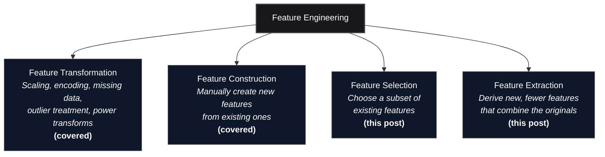
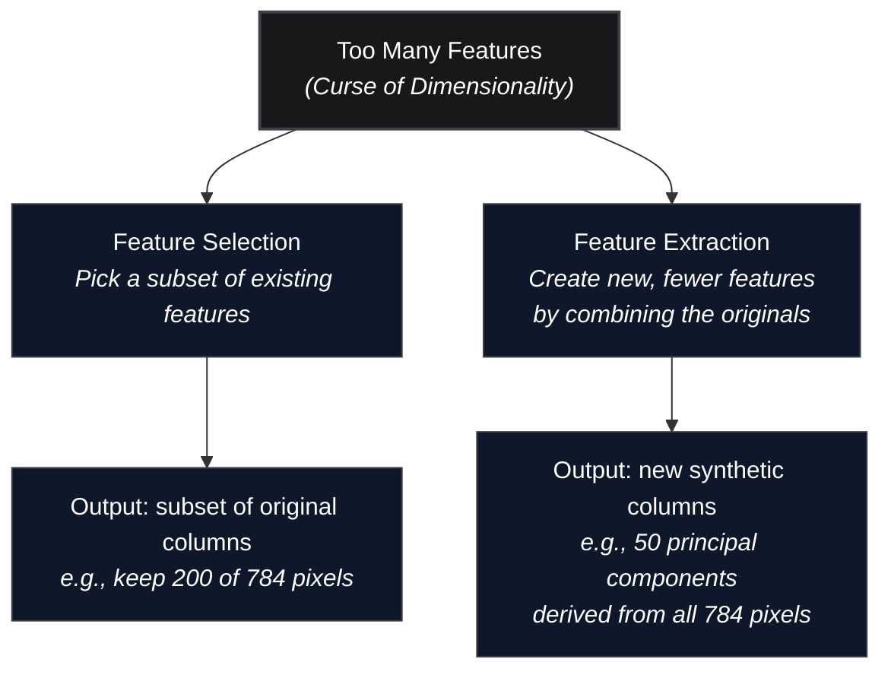

*Inspired by:* [YouTube](https://www.youtube.com/watch?v=ToGuhynu-No)

In the [previous post](/machine-learning/ch36-feature-construction-and-feature-splitting), we covered **Feature Construction** and **Feature Splitting**, the two manual, intuition-driven branches of feature engineering. With those complete, we have now finished the first two pillars of the feature engineering tree: **Feature Transformation** (scaling, encoding, missing values, outliers) and **Feature Construction** (creating new columns from domain knowledge).

This post introduces the remaining two pillars: **Feature Selection** and **Feature Extraction**. Both exist to solve a single underlying problem that becomes unavoidable as your feature count grows: the **Curse of Dimensionality**.

---

---

## The Curse of Dimensionality

### More Features ≠ Better Models

A common misconception, especially early on, is that feeding a model *more* features will always improve its predictions. Intuitively this sounds right: more information should help, not hurt. But in practice, model performance follows a curve that rises, plateaus, and then falls as the number of features increases.

There exists an **optimal number of features** for any given model and dataset. Up to that point, each new feature contributes useful signal and accuracy improves. Beyond it, additional features add more noise than signal, computational cost climbs, and the model's ability to generalize *degrades*. This phenomenon, where high-dimensional feature spaces actively hurt model performance, is what is meant by the **Curse of Dimensionality**.

To make this concrete, the chart below runs a small real experiment: a synthetic 60-feature dataset (12 informative, 8 redundant, the rest pure noise) with a KNN classifier (`k=5`), retrained repeatedly while feeding it more and more of those features in order:

Accuracy climbs sharply as the first informative features are added, peaks once the 12 informative and 8 redundant columns are all in play, then drops as the remaining pure-noise columns get mixed in. KNN's decisions get worse not because the informative signal disappeared, but because computing distance across dozens of irrelevant dimensions drowns it out.

Three concrete problems emerge as dimensionality grows:

1. **Performance plateau and decline.** Beyond the optimal feature count, the model starts memorizing noise rather than learning signal. Generalization error increases.
2. **Computational cost explodes.** Training time, memory usage, and prediction latency all scale with the number of features. A model with 784 features takes dramatically more resources than one with 50, even if those extra 734 features contribute nothing.
3. **Distance metrics become meaningless.** Many algorithms (KNN, SVM with RBF kernels, clustering methods) rely on computing distances between data points. In high-dimensional space, a counterintuitive phenomenon occurs: all points become approximately equidistant from each other. When every point is roughly the same distance from every other point, the concept of "nearest neighbor" loses its discriminative power, and distance-based algorithms fail.

### Why High-Dimensional Distance Breaks Down

To build intuition for this, think of a concrete analogy. You have lost your wallet somewhere in your neighborhood. If you know it is somewhere along a single road (1 dimension), searching is straightforward: walk down the road, check both sides, done. If you know it is somewhere in a particular building (2 dimensions), the search area grows: you need to check every room on every floor. Now imagine you know it is somewhere in a large campus with multiple buildings, floors, rooms, and corridors (3+ dimensions). The volume of space you must search grows exponentially with each added dimension.

The same thing happens with data. In one or two dimensions, data points cluster naturally into groups that are easy to separate. As you add more and more dimensions, the data points spread out into an increasingly vast space. The volume grows so fast that the available data becomes sparse, distances between points converge, and algorithms that depend on spatial structure struggle to find meaningful patterns.

### The MNIST Example: 784 Features for Handwritten Digits

To see why this matters concretely, consider the classic [MNIST handwritten digit dataset](http://yann.lecun.com/exdb/mnist/). Each image is 28 × 28 pixels. When flattened into a tabular row for a machine learning model, that single image becomes a vector of **784 features** (one per pixel).

But are all 784 features equally useful? Not even close. As we demonstrated back in [Ch.14: Introduction to Feature Engineering](/machine-learning/ch14-introduction-to-feature-engineering), the border pixels of these images are almost always white (value 0) across every digit sample. They have **near-zero variance**, which means they carry no discriminative information whatsoever. The actual digit strokes are concentrated in the central region of the image.

The heatmap above (from [Ch.14](/machine-learning/ch14-introduction-to-feature-engineering)) makes this obvious: border pixels are dark (zero variance), center pixels are bright (high variance). If your model ingests all 784 features, the several hundred zero-variance border pixels contribute nothing to accuracy while increasing training time, memory consumption, and the risk of overfitting. The model has to process and carry weights for columns that are pure dead weight.

This is the Curse of Dimensionality in action on a real dataset. The question then becomes: how do we get rid of the useless dimensions while keeping the useful ones?

---

## Two Paths to Reducing Dimensionality

There are two fundamentally different strategies for reducing the number of features. Both reduce dimensionality, but they work in very different ways:

### Feature Selection: Choosing What to Keep

Feature Selection takes the original set of features and selects a **subset** of them, discarding the rest. The features that survive are untouched: they are the same columns with the same values, just fewer of them.

Going back to the MNIST example: if you run variance analysis across all 784 pixel columns and find that 300 of them have near-zero variance (the border pixels), you can simply drop those 300 columns and train your model on the remaining 484. Each retained column is still an original pixel value, perfectly interpretable and unchanged.

Common Feature Selection techniques include:

- **Variance Threshold**: drop columns whose variance falls below a cutoff.
- **Univariate Statistical Tests**: rank features by their individual correlation or mutual information with the target variable and keep the top-k.
- **Forward/Backward Selection**: iteratively add or remove features based on model performance.
- **Feature Importance from Models**: train a model (e.g., Random Forest) and rank features by their learned importance scores.

The key advantage of Feature Selection is **interpretability**: the surviving features are the same columns you started with, so you can always explain what the model is looking at. The disadvantage is that you might lose information carried by the dropped features.

### Feature Extraction: Creating Something New

Feature Extraction takes a different approach. Instead of choosing among existing features, it **creates entirely new features** that are mathematical combinations of the originals. These new features are designed to compress the maximum amount of information from the original high-dimensional space into a much smaller number of dimensions.

The most important technique in this category is **Principal Component Analysis (PCA)**. PCA finds the directions (axes) of maximum variance in the data and projects all data points onto those axes. The result is a set of new "principal components," each of which is a weighted combination of every original feature, ranked by how much variance they capture.

For MNIST, instead of selecting 484 of the 784 original pixels, PCA might produce 50 principal components that together capture 95% of the total variance in the dataset. Each component blends information from all 784 pixels into a single synthetic variable.

As shown in [Ch.14](/machine-learning/ch14-introduction-to-feature-engineering), even a simple dataset like Iris (4 original features) becomes visually separable when projected down to 2 principal components via PCA:

The tradeoff is the mirror image of Feature Selection: you gain a compact, information-dense representation, but you lose direct interpretability. A "principal component" is a weighted sum of all original features, so you can no longer point to a single column and say "this is pixel 342."

---

## Feature Selection vs. Feature Extraction: When to Use Which

  <table className="w-full text-left border-collapse">
    <thead>
      <tr className="border-b border-black/10 dark:border-white/10 text-amber-600 dark:text-amber-400">
        <th className="py-3 px-4 font-bold">Criterion</th>
        <th className="py-3 px-4 font-bold">Feature Selection</th>
        <th className="py-3 px-4 font-bold">Feature Extraction</th>
      </tr>
    </thead>
    <tbody className="divide-y divide-black/5 dark:divide-white/5">
      <tr>
        <td className="py-3 px-4 font-semibold">What it produces</td>
        <td className="py-3 px-4">A subset of the original columns.</td>
        <td className="py-3 px-4">New synthetic columns (combinations of originals).</td>
      </tr>
      <tr>
        <td className="py-3 px-4 font-semibold">Interpretability</td>
        <td className="py-3 px-4">High: retained features are unchanged.</td>
        <td className="py-3 px-4">Low: components are abstract mixtures.</td>
      </tr>
      <tr>
        <td className="py-3 px-4 font-semibold">Information loss</td>
        <td className="py-3 px-4">Dropped features are completely gone.</td>
        <td className="py-3 px-4">Minimal if enough components are kept.</td>
      </tr>
      <tr>
        <td className="py-3 px-4 font-semibold">Best for</td>
        <td className="py-3 px-4">Datasets with clearly redundant or zero-variance features.</td>
        <td className="py-3 px-4">High-dimensional data (images, text, genomics) where all features carry partial signal.</td>
      </tr>
      <tr>
        <td className="py-3 px-4 font-semibold">Key techniques</td>
        <td className="py-3 px-4">Variance threshold, univariate tests, forward/backward selection, model-based importance.</td>
        <td className="py-3 px-4">PCA, LDA, t-SNE, UMAP, autoencoders.</td>
      </tr>
    </tbody>
  </table>

In practice, you might use both. For example, on MNIST you could first apply Feature Selection to drop the obvious zero-variance border pixels, then apply PCA to the remaining pixels to compress them further. The two approaches are complementary, not mutually exclusive.

---

## Placing This in the Series

This post, and the two that precede it on Feature Construction and Feature Splitting, complete the conceptual map of all four feature engineering pillars that we first outlined in [Ch.14: Introduction to Feature Engineering](/machine-learning/ch14-introduction-to-feature-engineering):

| Pillar | Status in the Series |
|---|---|
| Feature Transformation | Covered across Ch.15 through Ch.35 (scaling, encoding, missing values, outlier detection and treatment, power transforms). |
| Feature Construction | Covered in [Ch.36](/machine-learning/ch36-feature-construction-and-feature-splitting). |
| Feature Extraction | Conceptually introduced in this post. Deep-dive with PCA coming next. |
| Feature Selection | Conceptually introduced in this post. Detailed techniques covered after ML algorithms. |

Feature Selection techniques are most naturally taught *after* you understand how machine learning models work, because several selection methods (forward selection, backward elimination, model-based importance) require training and evaluating a model. For that reason, the series will cover Feature Extraction (specifically PCA) next, then move into ML algorithms, and return to Feature Selection once you have the algorithmic toolkit to make sense of it.

---

## What's Next?

In the next post, we will dive into **Principal Component Analysis (PCA)**, the most widely used Feature Extraction technique. We will cover the mathematical intuition behind PCA (eigenvectors, eigenvalues, variance maximization), walk through a worked example, and see how PCA compresses high-dimensional data into a compact representation without discarding too much information.
