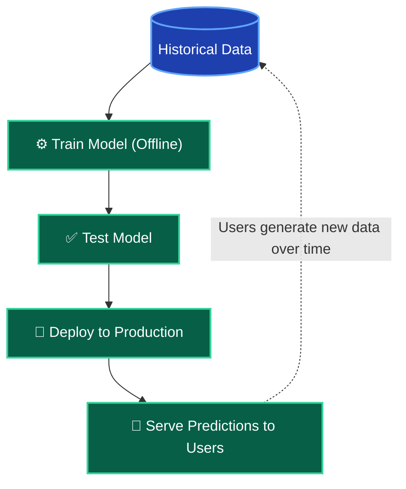

*Video Reference:* [YouTube](https://www.youtube.com/watch?v=nPrhFxEuTYU)

In the previous post, we categorized machine learning based on the *amount of supervision* required (Supervised, Unsupervised, etc.). Today, we are looking at a completely different way to categorize machine learning: **How the model trains and updates in a production environment.**

Before we dive in, let's clarify what "production" means. 

When you write code or train a model on your personal laptop, you are in a **Development Environment**. However, your customers cannot access your laptop. To make your software available to the world, you must deploy your code to a live server. This live, customer-facing server environment is called the **Production Environment**.

Based on how a machine learning model learns and behaves in production, we can divide them into two types:
1. Batch Learning (Offline Learning)
2. Online Learning

In this post, we will focus heavily on understanding **Batch Learning**.

---

## What is Batch Learning?

Batch Learning (also known as Offline Learning) is the conventional and most common way to train a machine learning model. 

In Batch Learning, the model is trained using the **entire available dataset at once**. There is no incremental learning. You cannot train the model on a small piece of data today and another small piece tomorrow. You must feed it the entire "batch" of data in one go.

> **Catastrophic Forgetting:** 
>
>If you try to take a traditional Batch model and train it *only* on the new data, it will suffer from a phenomenon called "catastrophic forgetting". It will learn the new patterns, but completely overwrite and forget everything it learned from the historical data! This is why Batch models must always be re-trained on the combined dataset (old + new) from scratch.

### The Batch Learning Workflow

Because training on massive datasets requires significant computational power and time, you do not train the model on your live production server. Instead, the workflow looks like this:

1. **Train Offline:** The Data Scientist takes the entire historical dataset and trains the model offline on a powerful local machine or a dedicated training server.
2. **Test:** The trained model is rigorously tested to ensure it makes accurate predictions.
3. **Deploy:** The fully trained, static model is uploaded to the production server.
4. **Predict:** Once in production, the model *only* makes predictions. It stops learning. It uses exactly what it learned offline to serve your users.

---

## The Big Problem: Static Models in a Dynamic World

You might notice a glaring issue with the workflow above. Once the model is deployed to production, it is **static**. 

Business scenarios and user behaviors evolve constantly. For example:
- **Recommendation Systems:** If you build a movie recommendation engine for Netflix and deploy it today, it only knows about the movies available up to today. When Netflix adds 10 new movies next week, your model has no idea they exist and will never recommend them.
- **Spam Filters:** You train an email spam classifier that works perfectly today. However, in six months, spammers will invent completely new techniques to bypass your filter. Because your model isn't learning anything new in production, it will quickly become outdated and fail.

### The Solution: The Re-training Cycle
To keep a Batch Learning model relevant, you must constantly re-train it. You collect all the new data generated by users, combine it with the old historical data, and train a brand new model from scratch offline. Once trained, you replace the old model in production with the new one. 

This cycle is typically repeated on a schedule (e.g., every 24 hours, weekly, or monthly) depending on how fast your data changes.

---

## Disadvantages of Batch Learning

While Batch Learning is simple and widely used, relying on a continuous re-training cycle introduces three major limitations:

### 1. Hardware and Time Limitations (The Big Data Problem)
If you are running a fast-growing social network, your data might double every few months. Because Batch Learning requires you to train on the *entire* dataset (old + new) every single time, the computational cost grows exponentially. Eventually, your dataset might become so massive that it takes weeks to train a single model, making daily updates impossible.

### 2. Connectivity Constraints
Sometimes, models are deployed in environments without reliable internet access. 
- A defense application used by soldiers in remote areas.
- A model running on a space satellite.
- An autonomous system in a cargo train traversing dead zones.

Because a Batch Learning model is completely static once deployed, it cannot learn anything new from its environment on its own. When that space satellite encounters a brand new stellar anomaly, the model will fail to recognize it. In a normal environment with fast internet, you would quickly upload the new sensor data, train a new model offline, and download a massive 500MB+ updated model back to the device.

But in these remote scenarios, uploading gigabytes of training data and pushing massive model updates over a kilobyte-per-second connection is impossible. Without constant, high-bandwidth connectivity, a Batch Learning model gets stuck in the past.

### 3. Lack of Real-Time Responsiveness
Imagine you run a social network that recommends trending news. Your batch model is scheduled to re-train every 24 hours at midnight. 

Suddenly, a massive breaking news event occurs at 8:00 AM. Users immediately start posting about it and showing high interest. Because your model only updates every 24 hours, it will completely ignore this trending topic until midnight. By the time the model finally updates and starts recommending the news, 24 hours have passed, and the news is already stale.

For highly dynamic scenarios where milliseconds matter, Batch Learning simply cannot keep up. 

This exact limitation paved the way for a different approach: **Online Learning**, which we will explore in the next post!
