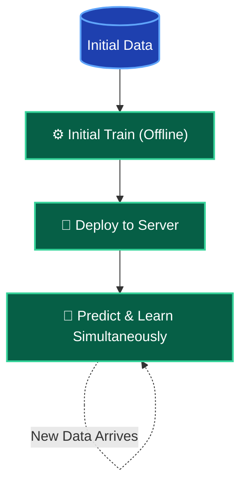

*Video Reference:* [YouTube](https://www.youtube.com/watch?v=3oOipgCbLIk)

In the previous post, we explored Batch Learning, where a model is trained offline on a static dataset and then deployed to production. We saw that Batch Learning struggles in highly dynamic environments. Today, we will explore the solution to those problems: **Online Machine Learning**.

If you have ever heard a company advertise, "Our product gets better the more you use it," they are likely talking about Online Learning. This means their machine learning model is dynamically improving on the server in real-time as it receives new data.

---

## What is Online Learning?

Unlike Batch Learning, where the model is trained all at once, Online Learning is done **incrementally**. You feed the model data in small, sequential pieces (often called mini-batches or even single data points). The model trains and improves continuously on the go.

Because the data chunks are so small and the training steps are extremely fast, this process can happen directly on the production server while the model is actively serving predictions to users.

### The Online Learning Workflow

The lifecycle of an online model looks very different from a batch model:

1. **Initial Training:** You start by training the model offline on a small amount of historical data just to give it a baseline understanding.
2. **Deploy:** The baseline model is deployed to the production server.
3. **Continuous Learning:** As a continuous stream of new data flows in from users, the model performs two tasks simultaneously: it makes predictions *and* updates itself (learns) based on that new data.

<div className="my-8">

</div>

---

## Real-World Examples

You interact with Online Learning models every day. Here are a few prominent examples:

- **Chatbots and Virtual Assistants:** Voice assistants like Google Assistant, Alexa, and Siri are deployed on servers and constantly learn from new voice data and interactions to improve their accuracy on the fly.
- **Smart Keyboards:** Mobile keyboards like SwiftKey learn your unique typing habits, slang, and common phrases as you type, dynamically improving their autocorrect and next-word predictions.
- **YouTube Recommendations:** When you scroll through YouTube, click on a video, and then go back to the home feed, your feed has often already changed. The model instantly captured your click, learned from it, and updated your recommendations in real-time.

---

## When Should You Use Online Learning?

Online Learning is powerful, but it is not necessary for every problem. You should opt for Online Learning in the following scenarios:

### 1. Handling Concept Drift
Sometimes the underlying nature of a problem changes rapidly over time. This is known as **Concept Drift**. For example, in an e-commerce platform, consumer buying behavior might change wildly based on viral trends or sudden events. In the stock market, financial patterns shift constantly. In these volatile scenarios where the "concept" itself keeps moving, an online model that continuously adapts is essential.

### 2. Cost-Effective Scaling
Batch Learning requires immense computational resources because you must load the entire historical dataset into memory every time you re-train. Online Learning, however, only looks at tiny chunks of data at a time. This makes it highly cost-effective and computationally lightweight, allowing you to train on modest hardware even if the total data generated over time is massive.

### 3. Fast Solutions
Because the model trains incrementally on the production server, you completely bypass the slow, offline re-training cycle. The model updates and reacts to new trends in fractions of a second.

---

## Implementation and Tools

Implementing Online Learning requires specific algorithms that support incremental updates. 

### Scikit-Learn
In the popular `scikit-learn` library, most algorithms use the `.fit()` method for batch training. However, certain algorithms (like `SGDRegressor`, which uses Stochastic Gradient Descent) offer a `.partial_fit()` method. This allows you to pass a small chunk of data to the model, train it slightly, and then seamlessly pass another chunk later to continue the training from where it left off. A single data point can be trained in a fraction of a millisecond (e.g., 0.000 seconds).

Here is a simple conceptual example of how you might use `.partial_fit()` in Python to train incrementally:

```python
from sklearn.linear_model import SGDRegressor
import numpy as np
import time

# Initialize the model
model = SGDRegressor()

# Simulated incoming stream of new data points
# Each incoming data point is a tuple of (X_new, y_new)
streaming_data = [
    (np.array([[1.0, 2.0]]), np.array([3.0])),
    (np.array([[1.5, 2.5]]), np.array([4.0])),
    (np.array([[2.0, 3.0]]), np.array([5.0]))
]

# The model trains incrementally as each new point arrives
for X_new, y_new in streaming_data:
    start_time = time.time()
    
    # Train ONLY on the new data point
    model.partial_fit(X_new, y_new)
    
    end_time = time.time()
    print(f"Trained on new data point in {end_time - start_time:.5f} seconds")
```

### Dedicated Libraries
There are also libraries built exclusively for this purpose:
- **River:** A very famous Python library for online machine learning. It was created by merging two older libraries (Creme and scikit-multiflow) and is excellent for working with streaming data.
- **Vowpal Wabbit:** While widely known for reinforcement learning, it is also highly optimized for online machine learning tasks.

---

## The Role of the Learning Rate

A critical concept in Online Learning is the **Learning Rate**. This determines how aggressively your model updates itself when it sees new data.

- **High Learning Rate:** The model adapts very quickly to new data but rapidly forgets what it learned in the past. If the rate is too high, the model becomes erratic and unstable.
- **Low Learning Rate:** The model remembers historical data well but reacts very slowly to new trends.

Setting the correct learning rate is a delicate balancing act that depends entirely on your specific business needs. If you configure this poorly, your model will misbehave in production.

---

## Out-of-Core Learning

There is a fascinating technique that borrows from Online Learning called **Out-of-Core Learning**. 

Imagine you have a massive 50GB dataset, but your computer only has 8GB of RAM. You physically cannot load the data to perform Batch Learning. 

To solve this, you can split the 50GB dataset into small, manageable chunks. You load one chunk into memory, feed it to the model using incremental learning (like `.partial_fit()`), and then discard the chunk. You repeat this sequentially until the entire 50GB has been processed. 

Even though you are doing this offline (not on a live server), you are using the core concepts of Online Learning to overcome hardware limitations.

---

## Risks and Challenges

While Online Learning sounds incredible, it comes with significant risks that make it tricky to implement in enterprise environments:

### 1. Data Poisoning and Bias
When your model updates dynamically on the server, its behavior is directly controlled by the incoming data. If a malicious actor hacks your system, or if trolls intentionally feed bad data to your system (e.g., teaching a chatbot offensive language), your model will immediately learn that bad behavior and become biased. 

### 2. The Need for Active Monitoring
Because of the risk of bad data, you cannot just deploy an online model and forget about it. You must build an active, real-time monitoring system (often using anomaly detection algorithms). If the system detects suspicious data or erratic model behavior, it must automatically reject the data or temporarily take the learning system offline.

### 3. Rollback Mechanisms
If the model does ingest bad data and breaks, you need an automated fallback plan. Your system must be capable of quickly taking the corrupted model offline, rolling back to a previously saved "healthy" state, and deploying it back to production with minimal downtime.

### 4. Enterprise Reliability
Because the tools (like River) are largely open-source projects built by communities rather than massive corporations, they sometimes lack enterprise-grade assurances. Building a highly reliable online system that flawlessly handles huge streams of real-time data requires serious engineering expertise.

---

## Batch (Offline) vs. Online Learning Summary

To summarize everything we've covered, here is a direct comparison between the two approaches:


<div className="my-8 rounded-xl overflow-hidden shadow-xl border border-white/10">
  
</div>


