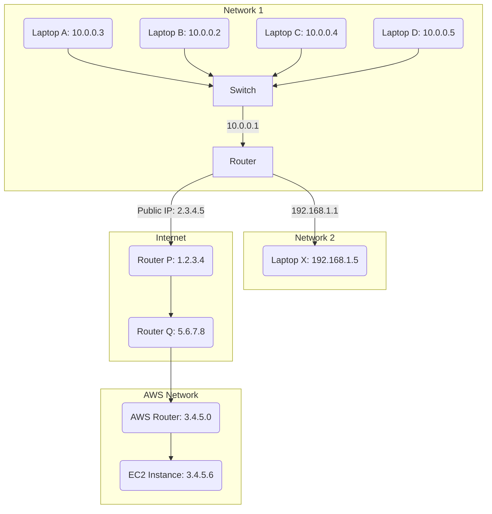
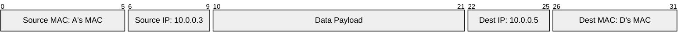
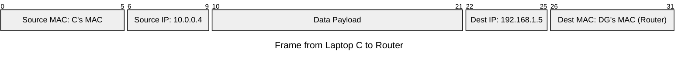
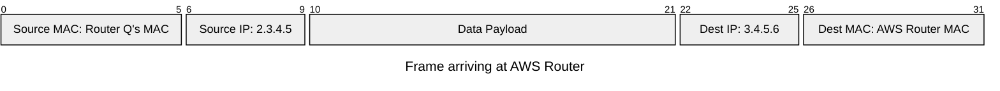
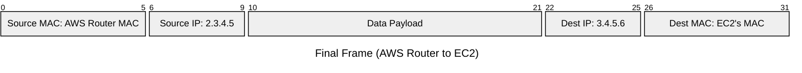

*Video Reference:* [YouTube](https://www.youtube.com/watch?v=GBhaNXK-ows)

In the previous post, we explored how a router helps two devices in different networks communicate. In this post, we will look at routing in much finer detail. We will trace exactly how a packet travels from a source device (like Laptop A) to a destination device (like Laptop X or an AWS server), observing the exact changes that happen to the Ethernet frame at each hop.

## What Exactly is Routing?

When your frontend application makes an API request to a backend server, the data packet travels over the network. Since your local machine and the backend server (perhaps hosted on an AWS EC2 instance in a distant data center) are on entirely different networks, they cannot communicate directly. 

Your machine does not know the exact physical location of the destination. Instead, it relies on a series of intermediate devices, like switches and routers, taking multiple "jumps" or "hops." This process of finding a path to the destination through multiple hops is called **Routing**.

Routing can occur in three main scenarios:
1. Within the same local network.
2. Between two different local networks managed by the same router.
3. Across the internet to an external network.

Before exploring these scenarios, let us understand the network setup we will be referencing.

## The Network Setup

### Wait, Where Does "Network 2" Exist in the Real World?

You might be wondering: *"In my house, my devices connect to my router via Wi-Fi, and the router plugs directly into my Internet Service Provider. I do not have a 'Network 2' plugged into my router!"*

You are completely right. The abstract setup with a "Network 2" is intentionally designed to demonstrate the theory of how a router passes data between two different local networks (Case 2) before routing it to the internet (Case 3).

In a standard home setup, you usually only have **Network 1** (your local devices like laptops, phones, and smart TVs) and the **Internet** (WAN). However, a real-world "Network 2" managed by a single router exists in scenarios like:
* **Guest Wi-Fi**: When you enable a Guest Wi-Fi network on your home router, it creates an entirely separate subnet (Network 2) so guests cannot access your personal devices (Network 1). The router acts as the bridge between both!
* **Corporate Offices**: Large enterprise routers often manage multiple local networks simultaneously (e.g., HR on Network 1, Engineering on Network 2) to enforce security and isolation.

### What is a Switch?

In past posts, we saw that a router operates at Layer 3 (Network Layer) and makes decisions based on IP addresses. A **Switch**, on the other hand, is a Layer 2 (Data Link Layer) device. It does not inspect IP addresses. Instead, it looks at the **MAC address** inside the Ethernet frame to make routing decisions.

When a device connects to a switch port, the switch records the MAC address associated with that specific port. Therefore, a switch can efficiently "unicast" (send directly) a frame to the correct port rather than broadcasting it to everyone, provided it knows the destination MAC address. 

---

## Case 1: Routing in the Same Network (Laptop A to Laptop D)

Let us assume Laptop A (`10.0.0.3`) wants to send a packet to Laptop D (`10.0.0.5`). 

1. **Subnet Check**: A applies its subnet mask and determines that D is within the same network.
2. **ARP Request**: A does not know D's MAC address. It creates an Address Resolution Protocol (ARP) request: *"What is the MAC address of IP 10.0.0.5?"*
3. **Broadcast**: A sends this request to the Switch. Since A does not know the destination MAC, it broadcasts it. The Switch forwards the request to all connected ports (B, C, D, and the Router).
4. **ARP Response**: D receives the request and sees its own IP. D caches A's MAC address in its own ARP table to avoid future lookups. D then generates a response: *"My MAC is D's MAC."*
5. **Unicast Delivery**: D sends the response to the Switch, addressed specifically to A's MAC. The Switch, knowing A is on port `pA`, smartly forwards the response *only* to Laptop A.

Now that A has D's MAC address, it constructs the Ethernet frame:

Laptop A sends this frame to the Switch, which efficiently forwards it to port `pD`. The packet successfully reaches Laptop D.

---

## Case 2: Routing to a Different Network (Laptop C to Laptop X)

Now, Laptop C (`10.0.0.4`) wants to send a packet to Laptop X (`192.168.1.5`).

1. **Subnet Check**: C applies its subnet mask and realizes X is on a completely different network.
2. **Default Gateway**: C must forward the packet to its Default Gateway (the Router at `10.0.0.1`). If C does not have the Router's MAC address, it performs an ARP request just like in Case 1.
3. **Frame to Router**: C creates the initial frame and sends it.

4. **Router Processing**: The Router receives the frame, breaks it open, and sees its own MAC address as the destination. It then inspects the IP packet. The destination IP (`192.168.1.5`) is not its own. Applying its subnet masks, the Router determines the IP belongs to Network 2.
5. **Router ARP**: The Router now acts as a source in Network 2. If it does not know X's MAC, it sends an ARP request in Network 2 for `192.168.1.5`.
6. **Final Frame**: Once it has X's MAC, the Router constructs a new frame and sends it.

Notice that the **Source IP and Destination IP never change**, but the MAC addresses are updated at the router hop.

---

## Case 3: Routing Over the Internet (Laptop C to AWS EC2)

This is the most complex scenario. Laptop C (`10.0.0.4`) wants to reach an AWS EC2 instance (`3.4.5.6`).

1. **Subnet Check**: C realizes the destination is external and sends the frame to the Default Gateway (the Router), exactly as it did in Case 2.
2. **Router Check**: The Router receives the frame. It checks its routing tables and subnet masks and realizes the IP `3.4.5.6` belongs to neither Network 1 nor Network 2. It must forward the packet to the Internet.

### Network Address Translation (NAT)

Here is where a critical transformation occurs. Laptop C's IP (`10.0.0.4`) is a **Private IP**. Private IPs are not routable on the public internet. If the router sent the packet with `10.0.0.4` as the source IP, the AWS server would not know how to reply, as there are millions of `10.0.0.4` devices globally.

To solve this, the Router performs **NAT (Network Address Translation)**:
* It replaces the Private Source IP (`10.0.0.4`) with its own **Public IP** (`2.3.4.5`).
* It assigns a random port (e.g., `54362`) and maps it to C's original source port (e.g., `3000`) in its internal NAT table.

### The Journey Across the Internet

Now, the packet begins its journey across multiple ISP routers (Router P and Router Q). At every single hop, the **Source and Destination MAC addresses change**, but the **Destination IP remains constant**. 

* **Hop 1 (Home Router to Router P)**: 
  * Source MAC: Home Router's Public MAC
  * Dest MAC: Router P's MAC
* **Hop 2 (Router P to Router Q)**: 
  * Source MAC: Router P's MAC
  * Dest MAC: Router Q's MAC
* **Hop 3 (Router Q to AWS Router)**: 
  * Source MAC: Router Q's MAC
  * Dest MAC: AWS Router's MAC

The frame arriving at the AWS Router looks like this:

### Final Hop to EC2

The AWS Router receives the packet, sees that `3.4.5.6` belongs to its own internal network, and performs a final ARP request to get the EC2 instance's MAC address. It updates the frame one last time:

### The Response Path

When the EC2 instance replies, it sends the response to the destination IP `2.3.4.5` on port `54362`. The packet hops back across the internet until it reaches your home Router. The Router checks its NAT table, translates `2.3.4.5:54362` back to the private IP `10.0.0.4:3000`, replaces the destination MAC with Laptop C's MAC, and forwards it through the Switch to Laptop C.

## Key Takeaway

Whenever a packet travels over a network, the **Destination IP never changes**. However, the **MAC addresses (both Source and Destination) are replaced at every single hop**. The Source IP may also change if the packet traverses a NAT-enabled router to enter the public internet. 

Understanding these transformations is the foundation of mastering network routing!
