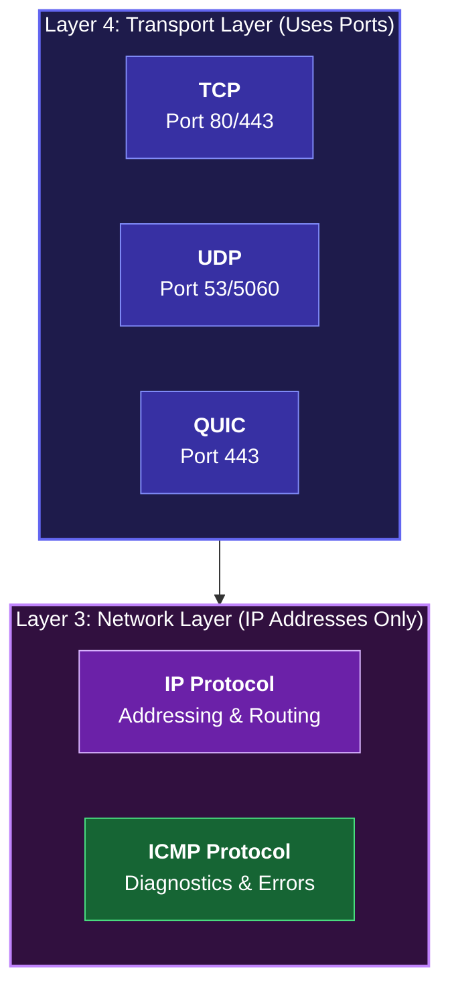
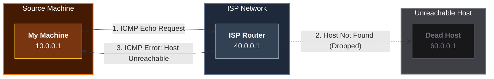
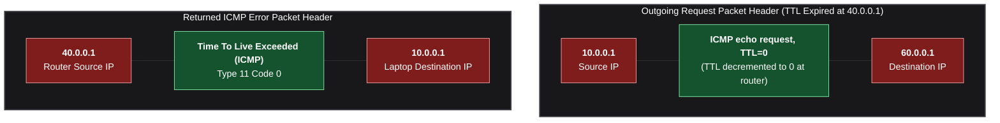
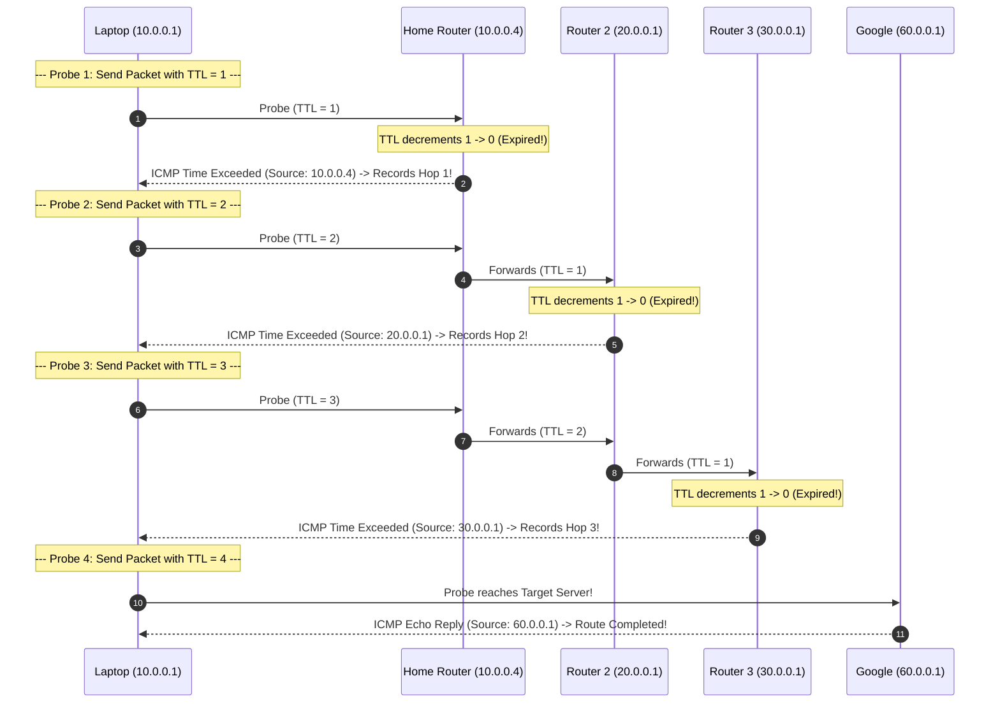
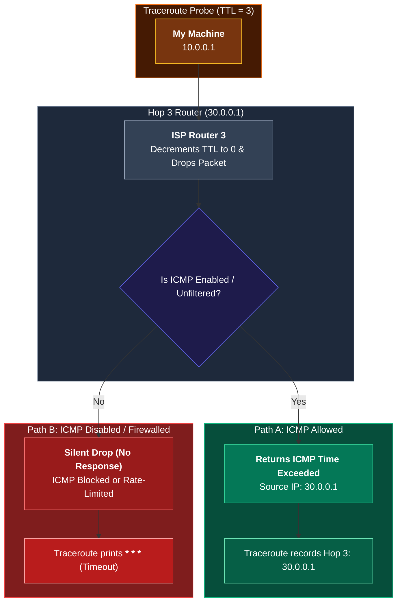

*Video Reference:* [YouTube](https://www.youtube.com/watch?v=VzPFY40qAhQ)

In the previous post, we explored routing in detail, examining how data packets jump across switches, local subnets, and internet routers to reach external services. However, when sending data over complex networks, things do not always go smoothly. Packets can get stuck in infinite routing loops, targets might be offline, or targeted ports might not have active services listening.

To diagnose network issues and communicate errors across devices, networks rely on **ICMP (Internet Control Message Protocol)** and its utility tools: **Ping** and **Traceroute**. In this post, we will break down how ICMP operates at Layer 3, examine how Ping and Traceroute function under the hood, analyze Time-To-Live (TTL) mechanics, and explain why `* * *` (star star star) appears in traceroute outputs.

---

## What is ICMP (Internet Control Message Protocol)?

**ICMP (Internet Control Message Protocol)** is a core protocol in the Internet Protocol Suite used by network devices (such as routers, switches, and host machines) to send operational messages, diagnostic status, and error notifications back to the source device.



### Key Characteristics of ICMP

1. **Operates at Layer 3 (Network Layer)**: ICMP sits directly at Layer 3 alongside IP. It does not carry application data or user payloads.
2. **No Port Numbers**: Unlike Layer 4 protocols (TCP and UDP) which use port numbers (such as port 80 for HTTP or port 443 for HTTPS) to direct traffic to specific applications, ICMP does not have ports. It relies purely on IP addresses to deliver diagnostic messages.
3. **Control and Error Reporting**: ICMP notifies the sender when network anomalies occur rather than guaranteeing data delivery.

### Common ICMP Messages and Use Cases

* **Host Unreachable**: Sent by an intermediate router when it cannot locate or route traffic to the requested destination IP address.
* **Port Unreachable**: Sent by the destination host when an IP packet arrives, but no process or application is listening on the targeted destination port.
* **Time Exceeded (TTL Expired)**: Sent by a router when an IP packet's Time-To-Live counter reaches zero before reaching its final destination.

---

## What is Ping and How Does It Work Under the Hood?

**Ping** is a command-line network utility used to test whether a remote server or host machine is reachable over an IP network, while also measuring the **Round Trip Time (RTT)** (latency) for messages sent from the source host to the destination.

### Network Setup & Ping Flow

```mermaid
flowchart LR
    subgraph Client ["Source Host"]
        Laptop["<b>My Machine</b><br>10.0.0.1"]
    end

    subgraph Local ["Local Gateway"]
        HomeRouter["<b>Home Router</b><br>10.0.0.4"]
    end

    subgraph Internet ["INTERNET"]
        R20["<b>Router</b><br>20.0.0.1"]
        R30["<b>Router</b><br>30.0.0.1"]
        R40["<b>Router</b><br>40.0.0.1"]
        R50["<b>Router</b><br>50.0.0.1"]

        R20 --> R30 --> R40 --> R50
    end

    subgraph Target ["Destination Host"]
        Google["<b>google.com</b><br>60.0.0.1"]
    end

    Laptop --> HomeRouter
    HomeRouter --> R20
    R50 --> Google

    style Client fill:#451a03,stroke:#f97316,stroke-width:2px,color:#fff
    style Laptop fill:#78350f,stroke:#fbbf24,color:#fff

    style Local fill:#1e293b,stroke:#64748b,stroke-width:2px,color:#fff
    style HomeRouter fill:#334155,stroke:#94a3b8,color:#fff

    style Internet fill:#3b0764,stroke:#a855f7,stroke-width:2px,color:#fff
    style R20 fill:#581c87,stroke:#c084fc,color:#fff
    style R30 fill:#581c87,stroke:#c084fc,color:#fff
    style R40 fill:#581c87,stroke:#c084fc,color:#fff
    style R50 fill:#581c87,stroke:#c084fc,color:#fff

    style Target fill:#451a03,stroke:#f97316,stroke-width:2px,color:#fff
    style Google fill:#78350f,stroke:#fbbf24,color:#fff
```



### IP Packet Header Structure During Request & Reply

```mermaid
flowchart TD
    subgraph RequestPacket ["Outgoing IP Packet Header (ICMP Echo Request)"]
        direction LR
        SrcReq["<b>10.0.0.1</b><br>Source IP"] --- PayloadReq["<b>ICMP echo request</b><br>Sequence: 1 | TTL: 64"] --- DstReq["<b>60.0.0.1</b><br>Destination IP"]
    end

    subgraph ReplyPacket ["Incoming IP Packet Header (ICMP Echo Reply)"]
        direction LR
        SrcRep["<b>60.0.0.1</b><br>Source IP"] --- PayloadRep["<b>ICMP echo reply</b><br>Sequence: 1 | RTT: 18ms"] --- DstRep["<b>10.0.0.1</b><br>Destination IP"]
    end

    style RequestPacket fill:#18181b,stroke:#3f3f46,stroke-width:2px,color:#fff
    style SrcReq fill:#7f1d1d,stroke:#fca5a5,color:#fff
    style PayloadReq fill:#14532d,stroke:#86efac,color:#fff
    style DstReq fill:#7f1d1d,stroke:#fca5a5,color:#fff

    style ReplyPacket fill:#18181b,stroke:#3f3f46,stroke-width:2px,color:#fff
    style SrcRep fill:#7f1d1d,stroke:#fca5a5,color:#fff
    style PayloadRep fill:#14532d,stroke:#86efac,color:#fff
    style DstRep fill:#7f1d1d,stroke:#fca5a5,color:#fff
```



### Ping Step-by-Step Execution

1. **DNS Lookup**: Ping performs a DNS resolution for `google.com` to discover its IP address (e.g., `60.0.0.1`).
2. **ICMP Echo Request**: The local operating system constructs an **ICMP Echo Request** message. It wraps this inside an IP packet with:
   * **Source IP**: `10.0.0.1` (Laptop IP)
   * **Destination IP**: `60.0.0.1` (Google Server IP)
3. **Network Traversal**: The packet is forwarded across local switches and internet routers until it reaches the destination host.
4. **ICMP Echo Reply**: Upon receiving the Echo Request, the target host generates an **ICMP Echo Reply** packet with:
   * **Source IP**: `60.0.0.1` (Google Server IP)
   * **Destination IP**: `10.0.0.1` (Laptop IP)
5. **RTT Latency Calculation**: When the laptop receives the ICMP Echo Reply, it calculates the time difference between sending the request and receiving the response. This duration is reported in milliseconds (ms) as the Round Trip Time (RTT).

### Handling Host Unreachability

What happens if you attempt to ping a server IP that does not exist or is offline?



When an intermediate router (such as `40.0.0.1`) determines that the destination network or host `60.0.0.1` does not exist:
1. The router drops the incoming ICMP Echo Request packet.
2. The router generates an **ICMP Host Unreachable** error message.
3. It sets the **Source IP** to its own IP (`40.0.0.1`) and the **Destination IP** to your laptop (`10.0.0.1`).
4. Upon receiving this ICMP packet, your terminal displays `Destination Host Unreachable`.

---

## Understanding TTL (Time-To-Live) Mechanics

Without safeguards, a misconfigured router routing table could cause an IP packet to loop endlessly between routers, consuming network bandwidth indefinitely.

To prevent infinite loops, every IP packet header includes a field called **TTL (Time-To-Live)**.

### How TTL Functions During Hop Traversal

```mermaid
flowchart LR
    subgraph Client ["Source"]
        Laptop["<b>My Machine</b><br>10.0.0.1"]
    end

    subgraph Gateway ["Local Gateway"]
        HomeRouter["<b>Home router</b><br>10.0.0.4"]
    end

    subgraph Internet ["INTERNET"]
        R20["<b>20.0.0.1</b><br>Hop 1 (TTL=3)"]
        R30["<b>30.0.0.1</b><br>Hop 2 (TTL=2)"]
        R40["<b>40.0.0.1</b><br>Hop 3 (TTL=1 -> 0)"]
        R50["<b>50.0.0.1</b><br>Hop 4"]

        R20 --> R30 --> R40
        R40 -.-x|"Dropped (TTL=0)"| R50
    end

    subgraph Dest ["Target"]
        Google["<b>google.com</b><br>60.0.0.1"]
    end

    Laptop -- "Sent: TTL=4" --> HomeRouter
    HomeRouter --> R20
    R50 --> Google
    R40 -- "ICMP Time Exceeded" --> Laptop

    style Client fill:#451a03,stroke:#f97316,stroke-width:2px,color:#fff
    style Laptop fill:#78350f,stroke:#fbbf24,color:#fff

    style Gateway fill:#1e293b,stroke:#64748b,stroke-width:2px,color:#fff
    style HomeRouter fill:#334155,stroke:#94a3b8,color:#fff

    style Internet fill:#3b0764,stroke:#a855f7,stroke-width:2px,color:#fff
    style R20 fill:#581c87,stroke:#c084fc,color:#fff
    style R30 fill:#581c87,stroke:#c084fc,color:#fff
    style R40 fill:#991b1b,stroke:#f87171,stroke-width:3px,color:#fff
    style R50 fill:#3f3f46,stroke:#71717a,color:#9ca3af

    style Dest fill:#451a03,stroke:#f97316,stroke-width:2px,color:#fff
    style Google fill:#78350f,stroke:#fbbf24,color:#fff
```



### IP Header Packets During TTL Expiration



1. **Initial TTL Value**: The originating OS sets an initial TTL value on outgoing IP packets (commonly 64 on macOS/Linux or 128 on Windows).
2. **Hop Decrement**: Every router that forwards the packet decrements the TTL field by exactly 1.
3. **TTL Expiration at Zero**: If a packet's TTL reaches 0 before reaching the destination:
   * The router holding the packet drops it immediately.
   * The router constructs an **ICMP Time Exceeded** (Type 11) error message.
   * The router sets the **Source IP** of the message to its own IP address and sends it back to the originating machine.

### Observing TTL Expiration Manually

You can test TTL behavior by setting a custom maximum TTL of 1 using ping (for example, `ping google.com -m 1` on macOS):

```text
PING google.com (142.250.190.46): 56 data bytes
36 bytes from 192.168.1.1: Time to live exceeded
```

Because TTL was limited to 1, the packet reached your home router (`192.168.1.1`), which decremented TTL from 1 to 0, dropped the packet, and returned an `ICMP Time Exceeded` message back to your computer.

---

## Traceroute: How It Works Under the Hood

**Traceroute** (invoked as `traceroute` on macOS/Linux or `tracert` on Windows) is a diagnostic tool that maps the entire route (every router hop) taken by packets to reach a destination host.

### The Clever Mechanics of Traceroute

Traceroute does not rely on routers voluntarily reporting their paths. Instead, it cleverly manipulates the **TTL field** in successive ICMP (or UDP) probe requests to discover routers one by one.



### Step-by-Step Traceroute Execution

1. **Hop 1 (TTL = 1)**: Traceroute sends a packet with `TTL = 1`. The first router (Home Router `10.0.0.4`) receives it, decrements TTL to 0, drops the packet, and returns an `ICMP Time Exceeded` message. Traceroute reads the source IP of the error message (`10.0.0.4`) and records it as Hop 1.
2. **Hop 2 (TTL = 2)**: Traceroute sends a packet with `TTL = 2`. The packet passes the home router (TTL becomes 1) and reaches the second router (`20.0.0.1`), where TTL decrements to 0. The second router drops the packet and returns `ICMP Time Exceeded`. Traceroute records `20.0.0.1` as Hop 2.
3. **Incremental Hops (TTL = 3, 4, ...)**: Traceroute increments TTL by 1 on each step, peeling back intermediate routers sequentially like layers of an onion.
4. **Reaching the Destination**: Eventually, TTL is large enough for the packet to reach the destination server (`60.0.0.1`). The target server does not expire the TTL, but responds with an **ICMP Echo Reply** (or Port Unreachable message if UDP probes are used). Traceroute recognizes the final response, logs the destination, and finishes execution.

---

## Deep Dive: Explaining `* * *` (Star Star Star) in Traceroute Output

When running `traceroute`, you will often see lines where router IP addresses are replaced by asterisks (`* * *`):

```text
traceroute to google.com (142.250.190.46), 64 hops max, 52 byte packets
 1  192.168.1.1 (192.168.1.1)  2.412 ms  1.854 ms  1.611 ms
 2  10.240.0.1 (10.240.0.1)  11.201 ms  10.844 ms  12.110 ms
 3  * * *
 4  142.250.238.15 (142.250.238.15)  18.450 ms  17.912 ms  18.102 ms
 5  142.250.190.46 (142.250.190.46)  19.120 ms  18.733 ms  18.910 ms
```

### Why Are There Three Asterisks?

By default, traceroute sends **3 probe packets** for each TTL value to calculate latency accurately across multiple attempts. 

Each asterisk (`*`) represents **one probe packet that timed out** without receiving a corresponding ICMP response. Therefore, `* * *` indicates that all three probe packets for that specific hop failed to receive an ICMP reply within the timeout period.



### Primary Causes of `* * *` in Traceroute

1. **ICMP Responses Disabled on the Router**: Many ISP core routers are configured to process and forward data packets normally, but explicitly disable ICMP error message generation. The router decrements TTL to 0 and drops the probe packet, but sends nothing back. Because no ICMP response is generated, traceroute cannot discover the router's IP address.
2. **Firewall and Security Filtering**: Security appliances, enterprise firewalls, and cloud network security groups frequently block inbound ICMP traffic or drop TTL-expired ICMP responses to prevent external network mapping and topology discovery.
3. **ICMP Rate Limiting**: High-performance core routers prioritize transit user data and rate-limit low-priority ICMP error responses. If a router receives too many TTL-expired packets, it silently drops subsequent probes without replying.
4. **Asymmetric Routing and Packet Loss**: Return paths on the internet are not always symmetric. The ICMP response packet generated by a router may take a different path back to your laptop and get dropped due to network congestion or link degradation.

> [!NOTE]
> Seeing `* * *` on an intermediate hop does **not** necessarily mean network failure! If subsequent hops (e.g., Hop 4 and Hop 5 above) respond successfully, data is flowing through Hop 3 normally. The router at Hop 3 is simply refusing to respond to ICMP probes.

---

## Summary and Key Takeaways

* **ICMP Protocol (Layer 3)**  
  Communicates diagnostic status, control notifications, and network error reports across IP networks without using port numbers.

* **Ping Utility**  
  Sends ICMP Echo Requests to check if a remote host is online and measures Round Trip Time (RTT) latency.

* **Time-To-Live (TTL)**  
  Decrements by 1 at each router hop to prevent infinite routing loops; triggers an `ICMP Time Exceeded` message when reaching 0.

* **Traceroute Utility**  
  Incrementally increases TTL starting from 1 to map every router hop along the network path to a destination host.

* **Asterisks (`* * *`) Output**  
  Indicates that intermediate routers or security firewalls intentionally blocked, rate-limited, or dropped ICMP responses for probes at that specific hop.

In the next post, we will explore Transport Layer concepts, examining how TCP and UDP establish reliable and fast socket connections across applications!
