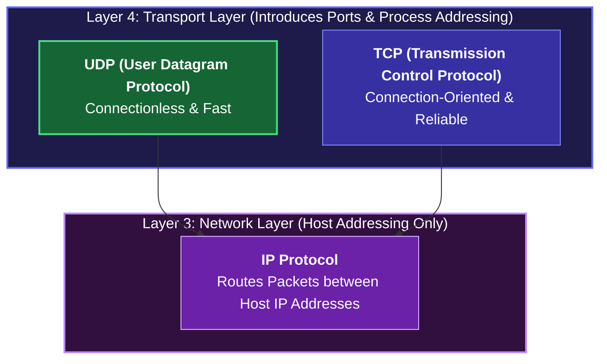
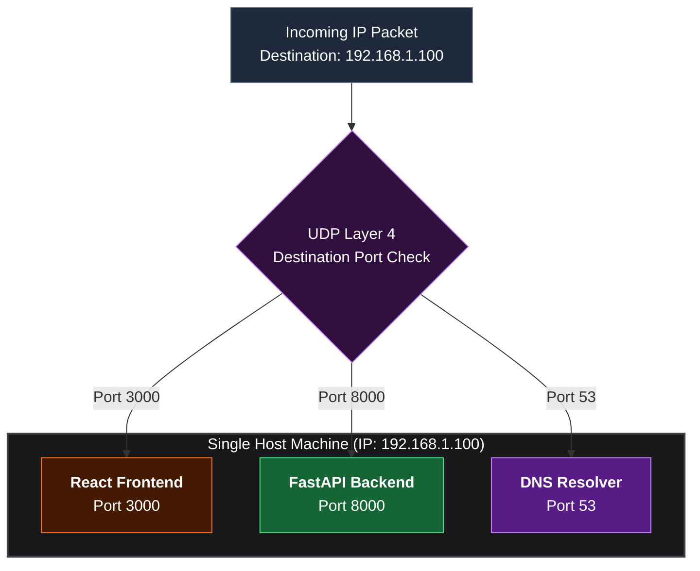
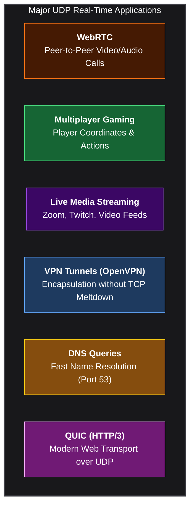
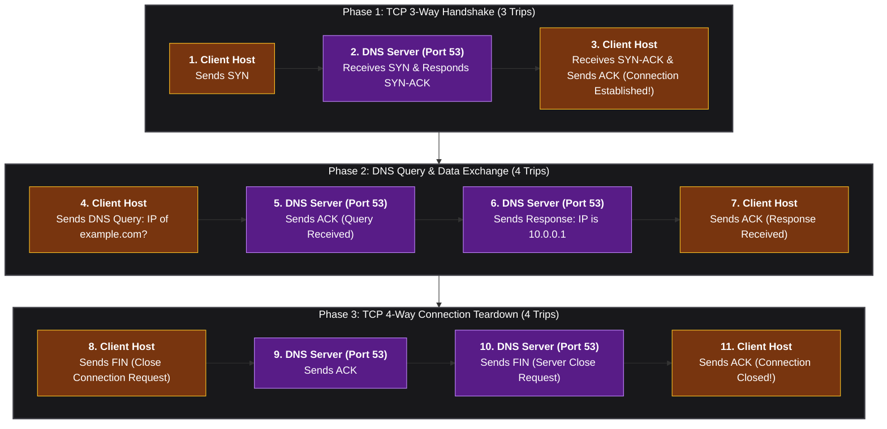
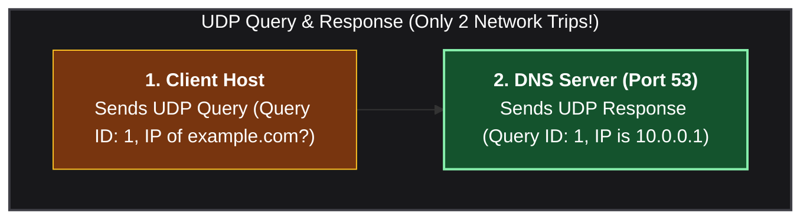
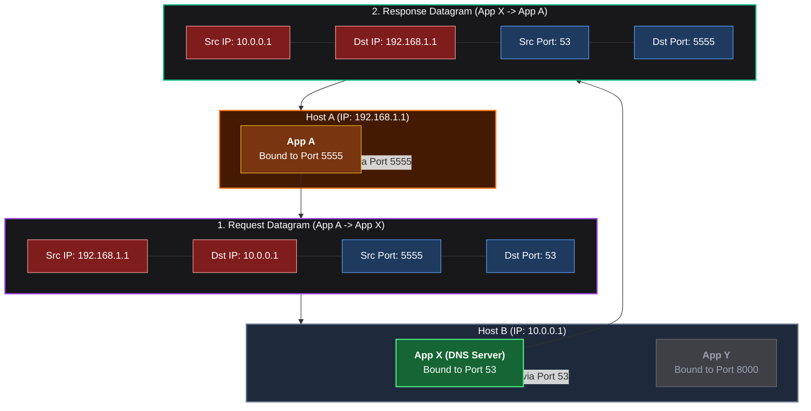

*Video Reference:* [YouTube](https://www.youtube.com/watch?v=SjMw3nwAhuI)

In the previous post, we explored ICMP, Ping, and Traceroute, learning how Layer 3 diagnostic messages use IP addresses to report network status and hop paths. However, IP and ICMP only operate at the Network Layer. They do not know which specific application or process on a computer should receive incoming data.

This brings us to **Layer 4 (the Transport Layer)**. In this post, we will explore **User Datagram Protocol (UDP)**, one of the foundational protocols of the modern internet. We will examine how UDP uses ports to deliver data to specific application processes, why it is connectionless and lightweight, how major protocols like DNS, WebRTC, and QUIC leverage it, and why DNS prefers UDP over TCP.

---

## What is UDP (User Datagram Protocol)?

**UDP (User Datagram Protocol)** is a core protocol operating at **Layer 4 (Transport Layer)** of the OSI and TCP/IP models. Its basic unit of data transfer is called a **Datagram**.

While Layer 3 (IP) delivers data to the destination host machine, **Layer 4 (UDP) delivers data to a specific application process on that host machine** using **Port Numbers**.

### Key Characteristics of UDP

1. **Port-Based Addressing**: Introduces **Source Port** and **Destination Port** fields to direct traffic to running applications (for example, port 8000 for a backend API or port 3000 for a web app).
2. **Stateless and Connectionless**: UDP does not perform a connection handshake (unlike TCP's 3-way handshake). It does not maintain state, sequence numbers, or window sizes.
3. **Unreliable but Ultra-Fast**: UDP sends datagrams without tracking whether they arrive safely at the destination. It does not perform automatic retransmissions or packet ordering checks.
4. **Minimal Overhead**: The UDP header is fixed at only **8 bytes**, containing just 4 fields: Source Port, Destination Port, Length, and Checksum.

---

## Why Do We Need Ports? (Process-Level Addressing)

An IP address (such as `192.168.1.1` or `10.0.0.1`) and a MAC address identify a physical or virtual machine on a network. However, a single computer runs dozens or hundreds of processes simultaneously.

Without Layer 4 ports, the operating system would receive an IP packet but have no idea which application should process it. 

UDP solves this by attaching **Source Port** and **Destination Port** numbers to every datagram:
* **Source IP + Source Port**: Identifies the exact sending process on the client.
* **Destination IP + Destination Port**: Identifies the exact target process on the server.

---

## UDP vs TCP: Core Differences

* **Connection Type**  
  * **UDP**: Connectionless (No preliminary handshake)  
  * **TCP**: Connection-Oriented (3-Way Handshake)

* **Reliability & Delivery**  
  * **UDP**: Unreliable (No automatic retransmissions or arrival acknowledgments)  
  * **TCP**: Reliable (Guaranteed delivery with packet acknowledgments)

* **State Tracking**  
  * **UDP**: Stateless (Does not track sequence numbers or receiver windows)  
  * **TCP**: Stateful (Tracks sequence numbers, window sizes, and connection state)

* **Header Overhead**  
  * **UDP**: Fixed 8 Bytes (Ultra-lightweight)  
  * **TCP**: 20 to 60 Bytes (Higher header overhead)

* **Packet Ordering**  
  * **UDP**: Unordered (Datagrams can arrive out of order)  
  * **TCP**: Strictly Ordered (Reassembles packets in exact sequence)

---

## Real-World Use Cases of UDP

Because UDP sacrifices delivery guarantees for speed and low latency, it is the protocol of choice whenever real-time delivery matters more than occasional lost packets.

### 1. Video Calling & Live Media Streaming (Zoom, WebRTC)
During a live video call, audio and video frames are transmitted constantly. If frame #2 is dropped in transit, the application prefers to skip it and immediately display frame #3. Retransmitting lost video frames seconds later would cause severe buffering lags and out-of-sync audio.

### 2. Multiplayer Online Gaming
In games like First-Person Shooters, player coordinates (X, Y, Z) are broadcast dozens of times per second. If one coordinate packet drops, the next packet arriving milliseconds later updates the position. Fast, real-time updates are far more crucial than re-sending outdated player coordinates.

### 3. Virtual Private Networks (VPNs) and TCP Meltdown
VPNs encapsulate user network packets inside a secure tunnel. If a VPN uses TCP to encapsulate inner TCP traffic, a single lost packet causes both inner and outer TCP stacks to trigger independent retransmissions and exponential backoffs. This catastrophic performance degradation is known as **TCP Meltdown**. Using UDP for VPN encapsulation avoids this issue.

---

## Deep Dive: Why DNS Uses UDP Instead of TCP

**DNS (Domain Name System)** translates human-readable domain names (such as `example.com`) into IP addresses (such as `10.0.0.1`). DNS operates on **Port 53** and uses UDP by default.

Why does such a critical internet service use an "unreliable" protocol like UDP?

### Scenario A: If DNS Were Built on TCP (11 Network Trips)

If DNS relied on TCP, resolving a single domain name would require a full TCP connection handshake, request transmission, acknowledgment, and a 4-way teardown sequence:

### Scenario B: DNS Built on UDP (Only 2 Network Trips!)

With UDP, DNS eliminates handshakes and connection teardowns entirely:

### How DNS Handles Reliability at the Application Layer

If UDP is unreliable, what happens if a DNS query packet gets dropped by a router?

DNS solves this by implementing **Application-Layer Reliability**:
1. Every DNS query carries a unique **Query ID** (for example, `ID: 1`).
2. The client sets a short response timer.
3. If no UDP response with matching `ID: 1` arrives before time out, the DNS client application simply retransmits the query to the same or a backup DNS server.

By leveraging UDP's speed for 99% of successful queries and handling retries in the application logic for the remaining 1%, DNS achieves maximum internet resolution speed!

---

## How UDP Datagram Flow Works Under the Hood

Let's walk through how two applications communicate using UDP across different hosts.

### Step-by-Step Datagram Flow

1. **Request Datagram Construction**: App A on Host A (`192.168.1.1`) constructs a UDP request targeting App X on Host B (`10.0.0.1`).
   * **Source IP**: `192.168.1.1` | **Destination IP**: `10.0.0.1`
   * **Source Port**: `5555` | **Destination Port**: `53`
2. **Network Traversal**: The OS wraps the UDP datagram inside an IP packet and routes it across the internet to Host B.
3. **Port Demultiplexing on Target**: Host B receives the packet, matches its own IP (`10.0.0.1`), inspects the Layer 4 **Destination Port (`53`)**, and routes the payload directly to App X.
4. **Response Datagram Construction**: App X generates a response and swaps the source/destination IPs and ports:
   * **Source IP**: `10.0.0.1` | **Destination IP**: `192.168.1.1`
   * **Source Port**: `53` | **Destination Port**: `5555`
5. **Return Delivery**: Host A receives the response, sees **Destination Port `5555`**, and passes the data back to App A.

---

## Summary and Key Takeaways

* **UDP Protocol (Layer 4)**  
  Operates at the Transport Layer to provide fast, connectionless, and lightweight datagram communication across network processes.

* **Port-Based Addressing**  
  Introduces Source and Destination Ports to route network traffic to specific application processes running on a host machine.

* **Stateless Mechanics**  
  UDP performs no handshakes, maintains no connection state, and does not perform packet retransmissions or sequencing checks.

* **DNS Efficiency**  
  DNS uses UDP to complete query resolutions in just 2 network trips instead of 11 trips under TCP, managing retries at the application layer.

* **Real-Time Applications**  
  Essential for WebRTC video calling, online multiplayer gaming, live streaming, and VPN tunnels where low latency is prioritized over absolute reliability.

In the next post, we will explore Transmission Control Protocol (TCP) in detail, examining its 3-way handshake, sequence numbers, window sizing, and reliable flow control mechanisms!
