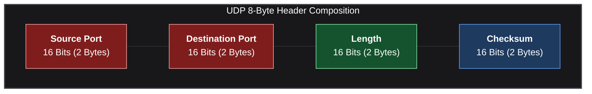
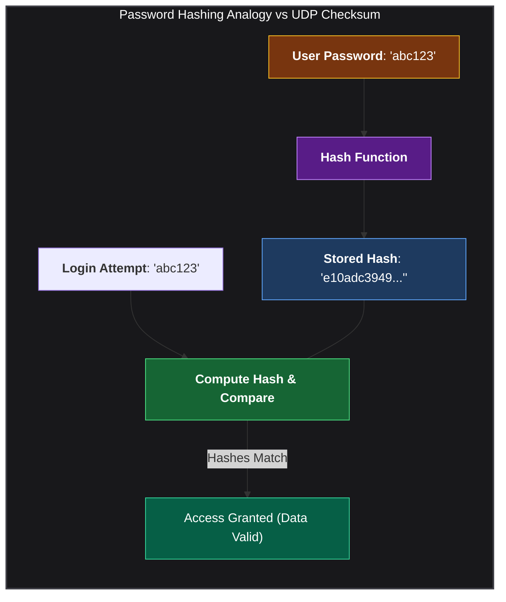
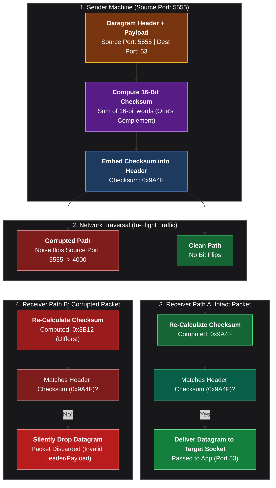
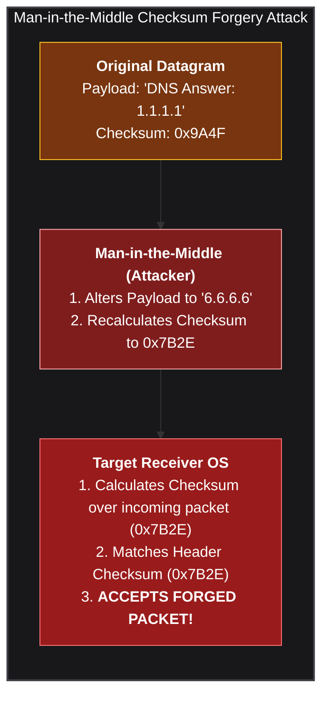
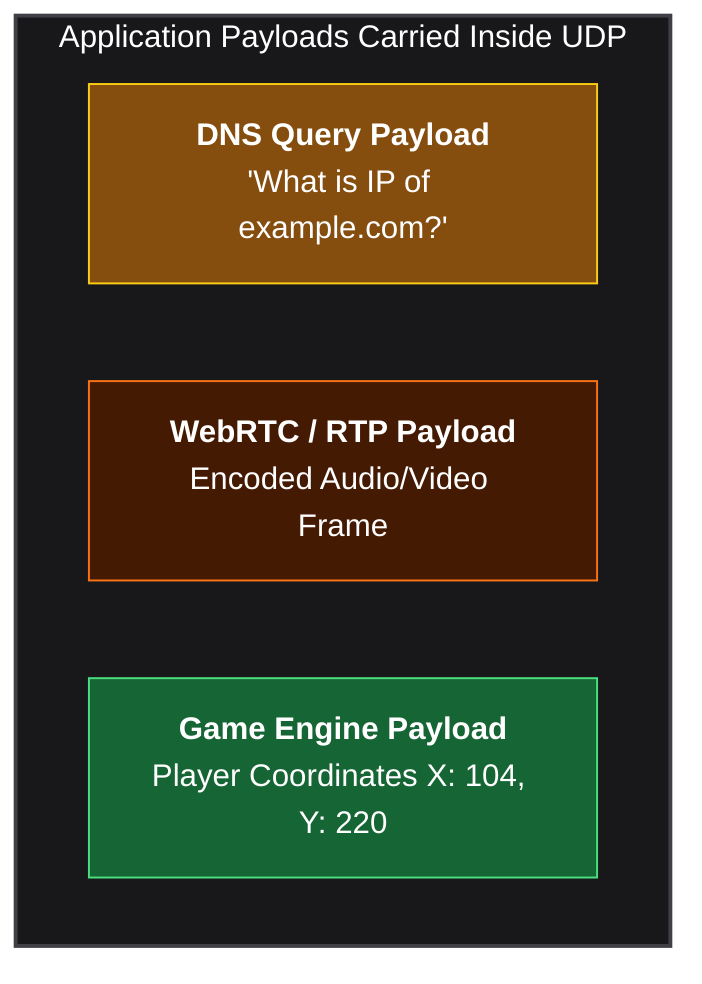

*Video Reference:* [YouTube](https://www.youtube.com/watch?v=1mTI5X0pN6M)

In the previous post, we explored User Datagram Protocol (UDP) at a high level, examining why its connectionless, stateless architecture makes it ultra-fast for DNS, WebRTC video streaming, and online gaming. We noted that a UDP header is fixed at just **8 bytes**, compared to TCP's 20 to 60-byte header.

In this post, we will dissect the **anatomy of a UDP datagram** down to the bit level. We will examine the RFC 768 standard, break down the 4 header fields, explore why the header is exactly 8 bytes, and dive deep into **how Checksum calculations detect in-flight data corruption**.

---

## The Simplicity of UDP: RFC 768 vs RFC 791

While the IPv4 specification (RFC 791) spans 45 pages of complex packet rules, the official UDP specification (RFC 768) is a tiny **3-page document**. Its header format contains only 4 basic fields.

---

## 32-Bit Layout: Anatomy of a UDP Datagram

In networking specifications, packet headers are visually represented as a **32-bit wide grid** (4 bytes per row). Here is how a UDP datagram header is structured in memory:

<UdpHeaderTable />

### Physical Byte Stream Note
Although diagrams represent headers in 32-bit rows for clarity, data in transit over wire or fiber optics travels as a **continuous 1D byte stream**:

```text
[ Source Port (2B) ][ Dest Port (2B) ][ Length (2B) ][ Checksum (2B) ][ Application Payload... ]
```

---

## Dissecting the 4 Header Fields (8 Bytes Total)

Every UDP header consists of 4 required fields. Each field occupies exactly **16 bits (2 bytes)**:



### 1. Source Port (16 Bits / 2 Bytes)
Identifies the sending application process on the originating host. Since it occupies 16 bits, port numbers range from `0` to `65535`. (For example, port `5555`).

### 2. Destination Port (16 Bits / 2 Bytes)
Identifies the receiving application process on the target host (such as DNS on port `53` or a backend service on port `8000`).

### 3. Length (16 Bits / 2 Bytes)
Specifies the **total size of the UDP datagram in bytes**, which includes both the 8-byte header and the application payload:

**Length = Header Size (8 Bytes) + Payload Size (Bytes)**

Because the header alone is 8 bytes, the minimum value for the Length field is `8`.

### 4. Checksum (16 Bits / 2 Bytes)
An error-detection value used by the destination host to verify whether the datagram arrived intact or suffered bit corruption during transit.

### Why Is the Header Exactly 8 Bytes?
Summing the byte sizes of all 4 fields gives:

**Total Header Size = 2 Bytes (Source Port) + 2 Bytes (Dest Port) + 2 Bytes (Length) + 2 Bytes (Checksum) = 8 Bytes**

---

## Deep Dive: How the UDP Checksum Works

A **Checksum** is a numerical value calculated from packet bytes to verify data integrity.

### The Password Hashing Analogy

To understand checksum verification conceptually, consider how user passwords are stored and verified in web applications:



1. When a user creates a password (`abc123`), the server computes a hash and stores it.
2. During login, the server hashes the entered password and compares it against the stored hash.
3. If someone alters the password to `xyz123`, the newly computed hash will not match the stored hash, and access is denied.

A UDP Checksum works on the exact same verification principle: the sender hashes (calculates a 16-bit sum of) the datagram header and payload, stores that value in the Checksum field, and the receiver recalculates the sum to confirm match!

---

## Checksum Generation at Sender & Verification at Receiver

Here is the complete end-to-end flow of how checksum generation and verification protect datagrams from in-flight network corruption.



### Step-by-Step Checksum Execution

1. **Sender Calculation**: The sending operating system takes the 16-bit words of the UDP header, application payload, and IP pseudo-header (Source IP, Destination IP, Protocol ID = 17, UDP Length). It calculates the 16-bit One's Complement sum and writes `0x9A4F` into the Checksum field.
2. **Transit**: The packet moves across network hardware, switches, and routers.
3. **Corruption Example**: Suppose electrical interference or faulty router memory flips a bit in flight, changing the Source Port from `5555` to `4000`.
4. **Receiver Verification**: Upon arrival, the receiver re-calculates the checksum across the received fields:
   * **If packet is intact**: The calculated checksum matches `0x9A4F`. The receiver accepts the datagram and forwards it to the application on port 53.
   * **If packet is corrupted**: The calculated checksum (`0x3B12`) fails to match `0x9A4F`. The receiver immediately drops the datagram.

---

## UDP Checksum Limitations: Error Detection vs. Cryptographic Security

A common question in network engineering is: *What happens if an active attacker (Man-in-the-Middle) intercepts a UDP datagram in transit, tampers with the payload, recalculates the 16-bit checksum for the forged data, and forwards it to the target?*



Because the UDP checksum is an **unkeyed, open algorithm** (a simple 16-bit One's Complement sum), any party who intercepts a packet can recalculate a valid checksum for any arbitrary payload. The receiver's operating system at Layer 4 has no secret key to verify *who* calculated the checksum; it only confirms that the mathematical equation holds true.

### How Real-World Systems Prevent Payload Forgery

To defend against active tampering, modern networks rely on higher-layer security mechanisms built on top of UDP:

* **DTLS (Datagram Transport Layer Security)**  
  Encrypts UDP payloads and attaches an **HMAC (Hash-based Message Authentication Code)** derived from a secret key negotiated during a secure handshake. An attacker cannot forge a valid HMAC without knowing the secret key.

* **DNSSEC (DNS Security Extensions)**  
  Digitally signs DNS responses using public/private key cryptography (RSA or ECDSA). Even if an attacker recalculates the UDP checksum, the application layer rejects forged answers because the cryptographic signature check fails.

* **QUIC (HTTP/3)**  
  Encapsulates transport traffic inside encrypted UDP datagrams where all payload bytes and packet sequence headers are cryptographically authenticated using AEAD ciphers.

---

## Application Payload Field

The final part of the UDP datagram is the **Data Payload** field. This carries the actual application data:



Higher-layer protocols (such as DNS, WebRTC, RTP, or custom game engines) use the 8-byte UDP datagram as a fast vehicle. Their application data is packed into this payload field without added transport overhead.

---

## Summary and Key Takeaways

* **RFC 768 Simplicity**  
  The official UDP specification is only 3 pages long, reflecting its minimalist design compared to complex protocols like IP or TCP.

* **32-Bit Header Layout**  
  Arranged as two 32-bit rows in specification grids, containing Source Port, Destination Port, Length, and Checksum.

* **8-Byte Fixed Overhead**  
  Composed of 4 mandatory fields, each taking 16 bits (2 bytes), totaling exactly 8 bytes of header overhead.

* **Length Field Formula**  
  **Length = Header Size (8 Bytes) + Data Payload Size**. The minimum possible value is `8`.

* **Checksum Data Integrity**  
  Calculates a 16-bit One's Complement sum over the header, pseudo-header, and payload to detect in-flight corruption. If checksums do not match at the receiver, the datagram is dropped.

In the next post, we will begin our deep dive into Transmission Control Protocol (TCP), exploring its segment structure, flags, sequence numbers, and stateful connection management!
