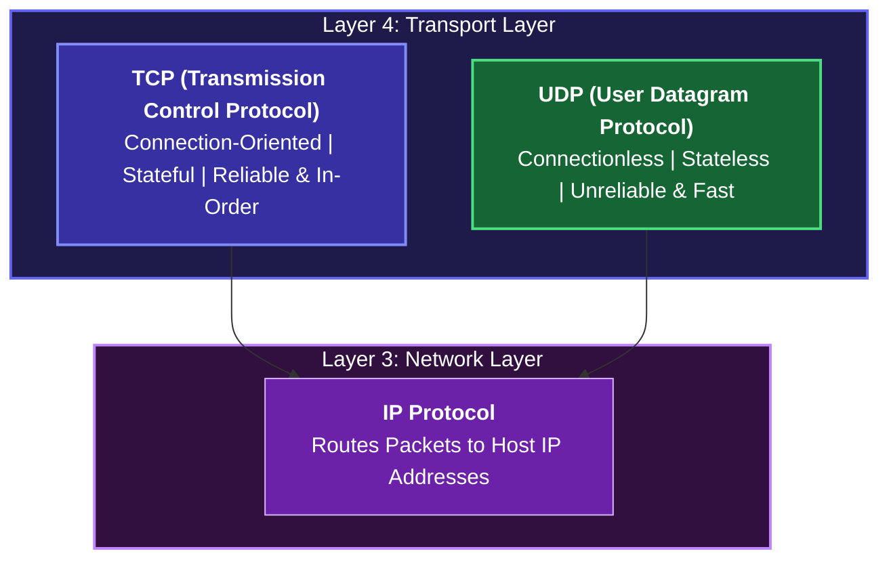
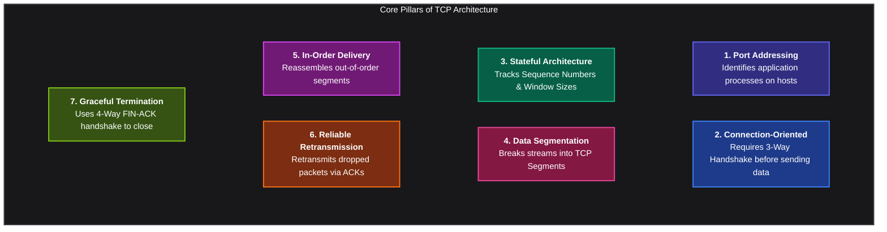
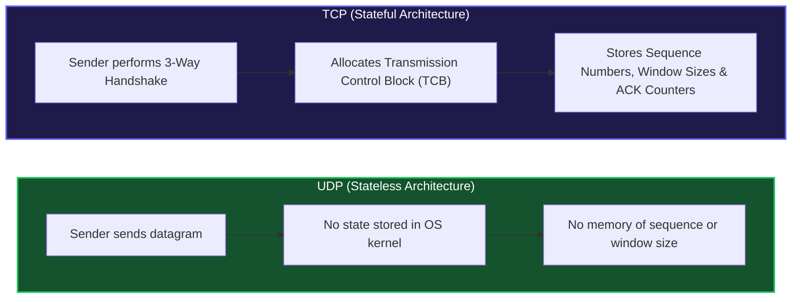
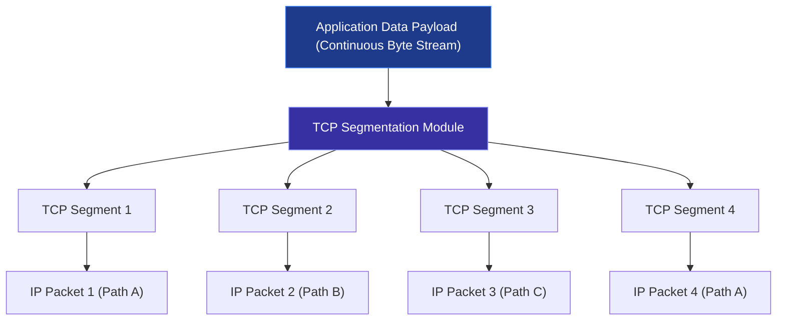
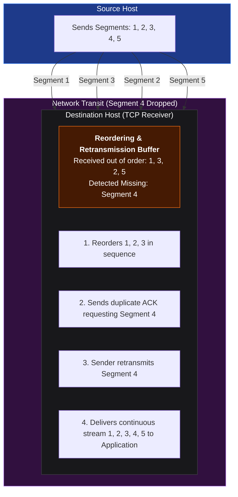
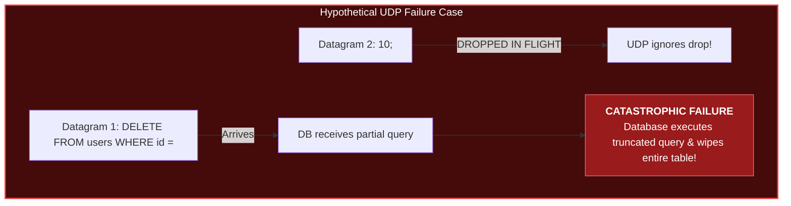
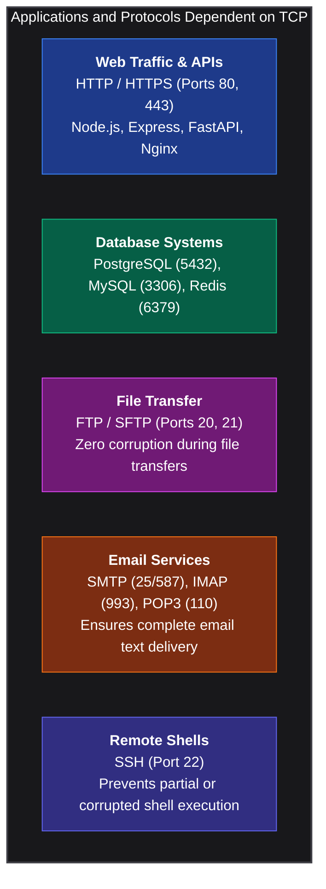
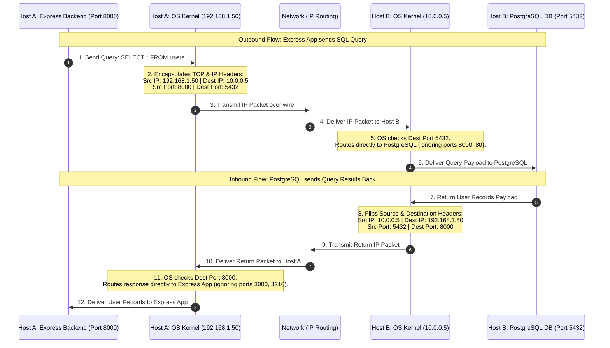

*Inspired by:* [YouTube](https://www.youtube.com/watch?v=v4gKJv4C1wo)

In the previous post, we dissected the anatomy of a UDP datagram, calculating 16-bit checksums to detect packet corruption and seeing why UDP's connectionless 8-byte header enables high-speed streaming. However, while UDP excels at raw speed, it provides no delivery guarantees, no retransmissions, and no sequence ordering.

In this post, we enter the world of **Transmission Control Protocol (TCP)**, one of the most vital protocols powering the modern internet. From web servers and databases to remote SSH shells and email systems, critical network infrastructure relies heavily on TCP's connection-oriented, stateful, and reliable architecture.

---

## What is TCP (Transmission Control Protocol)?

**TCP (Transmission Control Protocol)** operates at **Layer 4 (Transport Layer)** of the OSI and TCP/IP networking models. Its fundamental mandate is to control data transmission between a source and a destination in a structured, guaranteed, and reliable manner.



While Layer 3 (IP) delivers raw packets across intermediate routers to a destination host machine, TCP manages how application processes exchange streams of bytes across that host connection.

---

## Core Characteristics of TCP

TCP introduces several mechanisms to guarantee data integrity across lossy, unpredictable networks.



### 1. Port Addressing (Process Identification)
Similar to UDP, TCP uses **Source Port** and **Destination Port** numbers to route incoming network data to the exact application running on a machine (for example, React on port 3000 or a backend API on port 8000).

### 2. Connection-Oriented (3-Way Handshake)
Before a single byte of application payload can be sent over TCP, the sender and receiver must establish a formal connection using a **3-Way Handshake** (exchanging `SYN`, `SYN-ACK`, and `ACK` packets).

### 3. Stateful Tracking
Unlike UDP (which is stateless and retains no memory of past datagrams), TCP is **stateful**. Both host machines store connection state information in memory, including sequence numbers, acknowledgment counters, and receive window sizes.

### 4. Data Segmentation
Application data (such as a large HTTP request or file upload) is a continuous stream of bytes. Before sending data over the network, TCP breaks this stream into manageable chunks called **TCP Segments**.

### 5. Guaranteed In-Order Delivery
Because IP packets can take different intermediate routing paths, TCP segments often arrive out of sequence at the destination. TCP buffers and reorders these segments so the receiving application receives data in the exact sequence it was transmitted.

### 6. Reliability via Acknowledgments (ACKs) and Retransmission
Every received segment is confirmed by the destination sending back an **Acknowledgment (ACK)**. If a segment is dropped in transit, the sender detects the missing ACK and automatically retransmits the dropped segment.

### 7. Graceful Connection Termination
When data transfer is complete, host machines cannot leave socket connections open indefinitely, as doing so would consume kernel resources. TCP uses a **4-Way Termination Process** (FIN-ACK) to shut down connections cleanly.

---

## Stateful vs Stateless: Why TCP Stores State

To understand why TCP requires extra memory and processing power compared to UDP, we must examine what it means to be **stateful**.



When two machines establish a TCP connection, both operating system kernels allocate a internal control structure (Transmission Control Block, or TCB) to store:
- **Sequence Numbers**: Tracks the exact position of every byte in the stream.
- **Window Size**: Tracks how much data the remote peer can store in its receive buffer before overflowing.
- **Connection Status**: Tracks state transitions (e.g., `LISTEN`, `SYN_SENT`, `ESTABLISHED`, `FIN_WAIT`).

Because TCP maintains state at both endpoints, it has a higher memory and CPU overhead than UDP. However, this state information is what makes reliability and flow control possible.

---

## Data Segmentation and In-Order Delivery

When an application passes a large block of data to TCP, TCP does not send the entire payload in a single massive packet. Instead, it breaks the stream into smaller segments.



### Handling Out-of-Order Delivery and Packet Loss

Because intermediate routers forward IP packets independently, segments may arrive at the destination out of order, or some segments may be dropped along the way:



1. **Reordering**: Even if Segment 3 arrives before Segment 2, TCP buffers Segment 3 and delays passing data to the application until Segment 2 arrives.
2. **Retransmission**: If Segment 4 is dropped by a router, the receiver detects a gap in sequence numbers and does not acknowledge Segment 4. TCP on the sender machine detects the missing acknowledgment and retransmits Segment 4.

---

## Why Critical Systems Demand TCP (The SQL Disaster Scenario)


> **Note:** This is an extreme example used only to demonstrate why UDP is generally not used for operations where reliability is critical. In practice, a UDP datagram usually carries the entire message as a single unit and is not split into multiple UDP datagrams. However, if a datagram is very large, it may be fragmented (split) at the IP layer (We will explore fragmentation in a future MTU post).

To appreciate why TCP's overhead is necessary, consider what happens if an application uses UDP instead of TCP for database operations.

Suppose a Node.js backend sends the following SQL query to a remote PostgreSQL database across the network:

```sql
DELETE FROM users WHERE id = 10;
```

### Scenario A: Transmitting over UDP (Hypothetical)
If this query is split across 2 UDP datagrams:
- **Datagram 1**: `DELETE FROM users WHERE id = `
- **Datagram 2**: `10;`

If Datagram 2 is dropped by a congested network router, UDP ignores the loss and does not retransmit it. The PostgreSQL database receives only Datagram 1:

```sql
DELETE FROM users WHERE id = 
```

If the database engine parses this incomplete query or truncates it to `DELETE FROM users;`, **every user record in the production database is instantly deleted**.



### Scenario B: Transmitting over TCP (Real-World)
Under TCP, the transport layer guarantees that:
1. Every segment of the SQL query arrives at the destination.
2. The bytes are assembled in the exact original order.
3. If any segment drops in transit, TCP halts query delivery, requests a retransmission, and only passes the full, verified query (`DELETE FROM users WHERE id = 10;`) to PostgreSQL once all bytes are accounted for.

---

## Real-World Applications Powered by TCP

Because TCP guarantees reliability and order, virtually all critical application protocols use TCP under the hood:



- **Database Connections**: System queries, transactions, and user authentication require 100% byte integrity.
- **HTTP / REST APIs**: Web pages, JSON payloads, and assets must load without missing bytes or corrupted code.
- **FTP (File Transfer Protocol)**: Downloading binary files, software installers, or PDFs requires that every single byte matches the source file.
- **Email Protocols (SMTP / IMAP / POP3)**: Message headers, body text, and attachments must not drop words or recipients.
- **SSH (Secure Shell)**: Running remote administrative commands like `rm -rf /var/log` over SSH requires guaranteed delivery so commands are never cut short into dangerous partial strings like `rm -rf /`.

---

## How TCP Uses Port Numbers (Interactive Request-Response Flow)

To visualize how TCP uses port numbers to multiplex connections across multiple applications running on the same host machine, consider a client host interacting with a remote database server.

### Endpoint Setup
- **Host A (Client Machine)**: IP `192.168.1.50`
  - App A (React Dev Server) running on port `3000`
  - App B (Express API Backend) running on port `8000`
  - App C (Background Worker) running on port `3210`
- **Host B (Database Server Machine)**: IP `10.0.0.5`
  - PostgreSQL DB running on port `5432` (default PostgreSQL port)
  - FastAPI App running on port `8000`
  - Nginx Web Server running on port `80`

### Step-by-Step Request and Response Breakdown

#### Phase 1: Outbound Request (Express Backend -> PostgreSQL DB)
1. **Query Initiation**: The Express backend app running on Host A (`192.168.1.50:8000`) wants to execute a query: `SELECT * FROM users;`.
2. **Layer 4 Encapsulation**: Host A's operating system wraps the query payload into a TCP segment with:
   - **Source Port**: `8000` (identifies the Express process on Host A)
   - **Destination Port**: `5432` (identifies the PostgreSQL process on Host B)
3. **Layer 3 Encapsulation**: The OS wraps the TCP segment into an IP packet with:
   - **Source IP**: `192.168.1.50` (Host A IP)
   - **Destination IP**: `10.0.0.5` (Host B IP)
4. **Server Demultiplexing on Host B**: When the IP packet arrives at Host B (`10.0.0.5`), Host B's operating system inspects the **Destination Port (5432)**. Even though Host B is also running FastAPI on port `8000` and Nginx on port `80`, the OS uses port `5432` to deliver the query payload directly to the PostgreSQL database process.

#### Phase 2: Inbound Response (PostgreSQL DB -> Express Backend)
1. **Query Processing**: PostgreSQL executes `SELECT * FROM users;` and generates a response containing the user data records.
2. **Address Swapping**: When constructing the return response, the operating system **flips the IP addresses and port numbers**:
   - **Source IP**: `10.0.0.5` (PostgreSQL Server IP)
   - **Destination IP**: `192.168.1.50` (Host A IP)
   - **Source Port**: `5432` (PostgreSQL DB service port)
   - **Destination Port**: `8000` (The Express app port that initiated the request)
3. **Client Demultiplexing on Host A**: When the return IP packet reaches Host A (`192.168.1.50`), Host A's operating system inspects **Destination Port 8000**. Even though Host A is simultaneously running React on port `3000` and a background worker on port `3210`, the OS routes the database response directly into the Express backend process listening on port `8000`.

### Visual Interaction Sequence



---

## TCP vs. UDP Comparison Matrix

<div className="overflow-x-auto my-8">
  <table className="w-full text-left border-collapse rounded-xl overflow-hidden shadow-lg border border-zinc-800">
    <thead>
      <tr className="bg-amber-500/10 text-amber-400 font-bold border-b border-zinc-800">
        <th className="p-4 border-r border-zinc-800">Feature</th>
        <th className="p-4 border-r border-zinc-800">TCP (Transmission Control Protocol)</th>
        <th className="p-4">UDP (User Datagram Protocol)</th>
      </tr>
    </thead>
    <tbody className="divide-y divide-zinc-800/60 bg-zinc-900/40 text-sm">
      <tr className="hover:bg-zinc-800/30 transition-colors">
        <td className="p-4 font-semibold text-zinc-200 border-r border-zinc-800">Protocol Type</td>
        <td className="p-4 border-r border-zinc-800">Connection-Oriented</td>
        <td className="p-4">Connectionless</td>
      </tr>
      <tr className="hover:bg-zinc-800/30 transition-colors">
        <td className="p-4 font-semibold text-zinc-200 border-r border-zinc-800">Statefulness</td>
        <td className="p-4 border-r border-zinc-800">Stateful (Maintains TCB, Sequence Numbers, Window Sizes)</td>
        <td className="p-4">Stateless (No state maintained)</td>
      </tr>
      <tr className="hover:bg-zinc-800/30 transition-colors">
        <td className="p-4 font-semibold text-zinc-200 border-r border-zinc-800">Data Unit</td>
        <td className="p-4 border-r border-zinc-800">Segment</td>
        <td className="p-4">Datagram</td>
      </tr>
      <tr className="hover:bg-zinc-800/30 transition-colors">
        <td className="p-4 font-semibold text-zinc-200 border-r border-zinc-800">Header Size</td>
        <td className="p-4 border-r border-zinc-800">Variable (20 to 60 Bytes)</td>
        <td className="p-4">Fixed (8 Bytes)</td>
      </tr>
      <tr className="hover:bg-zinc-800/30 transition-colors">
        <td className="p-4 font-semibold text-zinc-200 border-r border-zinc-800">Reliability</td>
        <td className="p-4 border-r border-zinc-800">Guaranteed (ACKs + Automatic Retransmissions)</td>
        <td className="p-4">Unreliable (Best-effort delivery)</td>
      </tr>
      <tr className="hover:bg-zinc-800/30 transition-colors">
        <td className="p-4 font-semibold text-zinc-200 border-r border-zinc-800">Ordering</td>
        <td className="p-4 border-r border-zinc-800">Guaranteed In-Order (Buffers and reorders segments)</td>
        <td className="p-4">No order guarantees (Datagrams can arrive out of order)</td>
      </tr>
      <tr className="hover:bg-zinc-800/30 transition-colors">
        <td className="p-4 font-semibold text-zinc-200 border-r border-zinc-800">Flow & Congestion Control</td>
        <td className="p-4 border-r border-zinc-800">Built-in (Sliding Window, Slow Start, Congestion Avoidance)</td>
        <td className="p-4">None</td>
      </tr>
      <tr className="hover:bg-zinc-800/30 transition-colors">
        <td className="p-4 font-semibold text-zinc-200 border-r border-zinc-800">Overhead & Speed</td>
        <td className="p-4 border-r border-zinc-800">Higher CPU/Memory overhead, lower speed</td>
        <td className="p-4">Ultra-low overhead, maximum speed</td>
      </tr>
      <tr className="hover:bg-zinc-800/30 transition-colors">
        <td className="p-4 font-semibold text-zinc-200 border-r border-zinc-800">Primary Use Cases</td>
        <td className="p-4 border-r border-zinc-800">Databases, HTTP/HTTPS, Web APIs, FTP, Email, SSH</td>
        <td className="p-4">DNS, WebRTC, Video Streaming, Online Gaming, QUIC</td>
      </tr>
    </tbody>
  </table>
</div>

---

## Summary and What's Next

In this post, we explored the high-level architecture of **TCP**:
- Why connection-oriented transport and 3-way handshakes establish state before sending data.
- How state tracking allows TCP to provide reliable, guaranteed, and in-order delivery.
- Why critical services like databases, web servers, email, and SSH rely strictly on TCP over UDP.
- How source and destination port numbers direct segments to specific application processes.

In the next post, we will take a deep dive into the **Anatomy of a TCP Segment**, examining the 20 to 60-byte header fields, flags (`SYN`, `ACK`, `FIN`, `RST`, `PSH`, `URG`), sequence numbers, acknowledgment math, and window scaling mechanisms.

