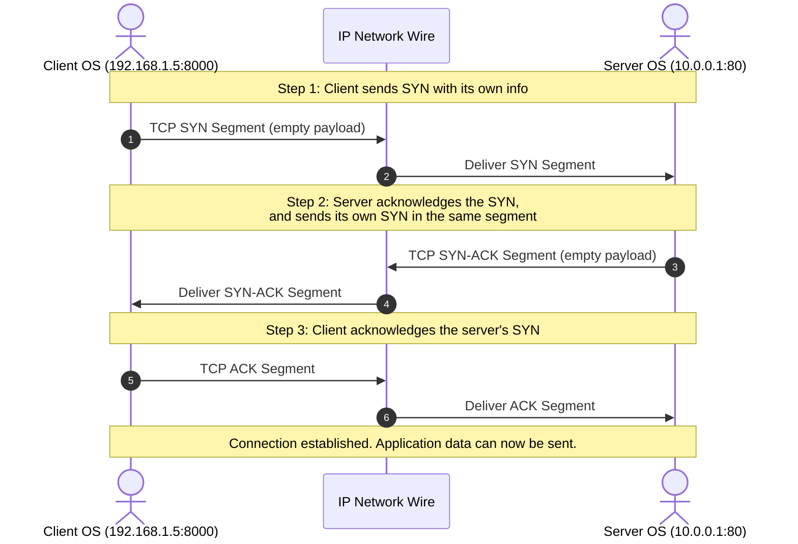

*Video Reference:* [YouTube](https://www.youtube.com/watch?v=xkP8iBAdgck)

In the previous post, we explored an overview of **Transmission Control Protocol (TCP)** and saw one important point: TCP is a **connection-oriented protocol**. That means before any actual data can be sent over TCP, a connection first needs to be established for it.

That connection establishment happens through the **TCP 3-Way Handshake**. In this post, we'll go through exactly what the TCP 3-way handshake is and what happens during it.

---

## Why Do We Need a Connection First?

Let's say you have a React application running on your laptop at `192.168.1.5`, and an Express server running somewhere in the cloud (AWS or any other provider) at `10.0.0.1` on port `80`.

Whenever the React app makes an HTTP request to the Express server, remember: **HTTP runs on top of TCP under the hood**. So before any actual application data (the real business logic payload, like an HTTP request) can be sent from the client to the server, we first have to create some kind of connection between them.

This connection establishment always happens first, before any data is sent. So how exactly does this connection get created?

---

## The Setup

- **Client**: A React (or Angular) application running on `192.168.1.5`, port `8000`.
- **Server**: A Node.js and Express server running on `10.0.0.1`, port `80`.

The client wants to send an HTTP request to the server, and since HTTP relies on TCP, a TCP connection must be established before the client can send any HTTP-related data to the server.

Since the client is the one that wants to send data, **the client initiates the TCP connection**. It does this by sending a **SYN packet**, a TCP segment, to the server.

This TCP segment travels inside an IP packet, exactly like every other protocol (TCP, UDP, HTTP, WebSockets) that needs to talk to another host over the network. That IP packet carries the TCP segment, and the TCP segment itself deals with source and destination ports, along with some information about the client.

If you recall the **[anatomy of a UDP datagram](/networking/ch14-anatomy-of-a-udp-datagram-and-checksum)**, a UDP datagram is made up of headers plus a payload (Source Port, Destination Port, Length, Checksum). A TCP segment works the same way: headers plus a payload. The payload is whatever the TCP segment is carrying as a vehicle (an HTTP request, a WebSocket handshake, an SMTP payload, and so on), and the headers are what make TCP actually function correctly, things like the sequence number, the window size, and control flags such as SYN and ACK.

We'll go through exactly what these header fields mean and how they work in future posts. For now, all we need to know is that this information about the client (and later the server) lives inside the TCP segment's headers.

---

## Step 1: Client Sends a SYN

The client sends a TCP segment with its information (its sequence number starting point, its window size, and so on) to the server, with the **SYN** flag set.

This is an **empty segment**, its data/payload portion is empty, because at this point the client hasn't sent any actual application data yet. It's simply establishing a TCP connection, so there's nothing to include as a payload.

---

## Step 2: Server Acknowledges and Sends Its Own SYN

As soon as the server receives this SYN request from the client, it notes down the client's information carried in the TCP segment's headers, and it acknowledges it: "I noted your information, and I acknowledge it."

Now here's the important part: **TCP is smart about this**. Instead of the server sending two separate packets, one just to acknowledge the client's SYN, and another separate SYN packet to share its own information with the client, it merges both into a **single segment**. This merged segment says: "I acknowledge your SYN, and here's my own information too."

Just like the client's SYN, this is also an **empty segment**, there's no data being carried, since this is still part of setting up the connection, not sending actual data.

---

## Step 3: Client Acknowledges the Server's SYN

Once the client receives this segment from the server, it sends a request back saying: "I received your SYN, I've noted your information, and I acknowledge it."

Let's recap what just happened:
1. The client sent a SYN request with its own information.
2. The server noted it and acknowledged it, and merged its own SYN into that same response.
3. The client received the server's SYN, and acknowledged it.

Notice that we sent **three requests** in total. That's exactly why this is called the **TCP 3-Way Handshake**. You may also see it referred to as **SYN, SYN-ACK, ACK**, since the second step merges a SYN and an ACK into one segment.

Once this exchange completes, the connection is established, and now the client and server can actually communicate.

---

## Why TCP Is Called a "Stateful" Protocol

During this handshake, the client shared some information about itself with the server, and the server shared some information about itself with the client. Both sides stored that information so they could create and maintain the connection.

This connection stays alive, and this stored information keeps getting tracked, for as long as the client and server need to communicate. That's exactly why TCP is called a **stateful protocol**: both machines maintain some state about each other, based on the information exchanged during this handshake, for the life of the connection.

---

## What Comes Next?

In this post, we focused purely on **what** happens during the 3-way handshake and **why** it's called that, three requests exchanged so client and server become aware of each other's state.

We deliberately didn't get into what exactly goes inside those TCP segment headers, sequence numbers, acknowledgment numbers, window sizes, and so on, since that's a bit tangential to understanding how the connection itself gets established. We cover those header fields in detail in later posts: **[TCP Sequence and Acknowledgment Numbers](/networking/ch18-tcp-sequence-and-acknowledgment-numbers)** and the **[Anatomy of a TCP Segment](/networking/ch19-anatomy-of-a-tcp-segment)**. We'll also look at how a TCP connection gets torn down in **[TCP Connection Termination (4-Way Handshake)](/networking/ch17-tcp-connection-termination-four-way-handshake)**.
