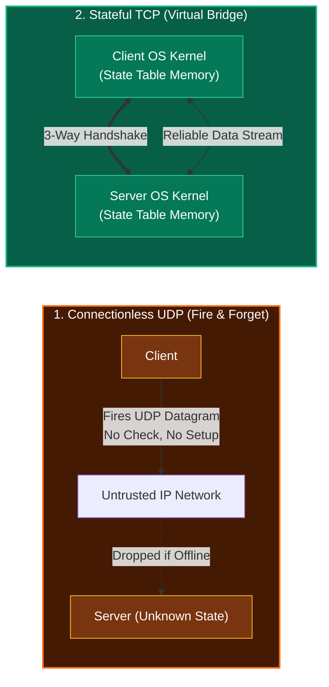
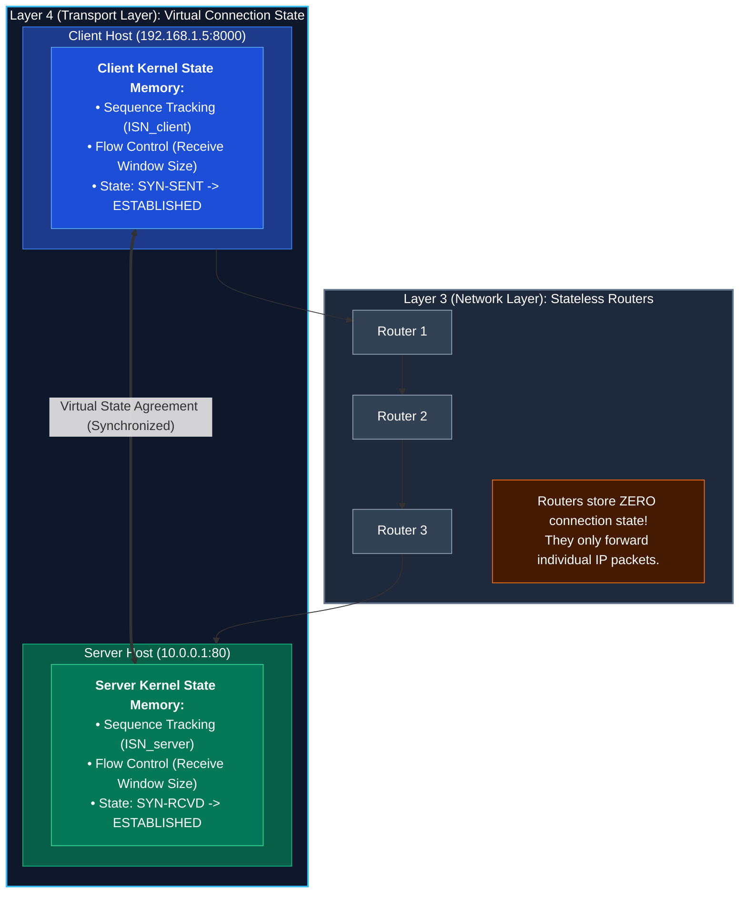
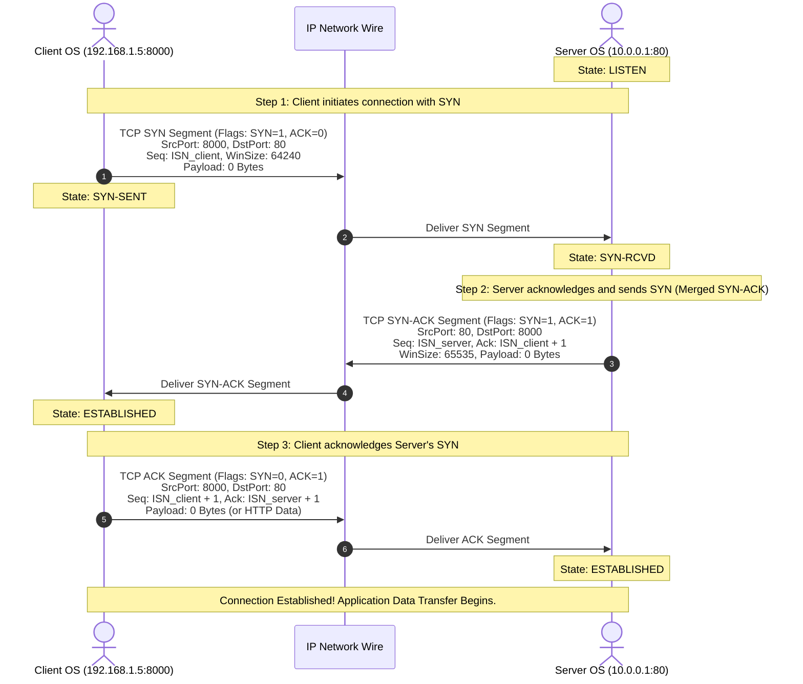
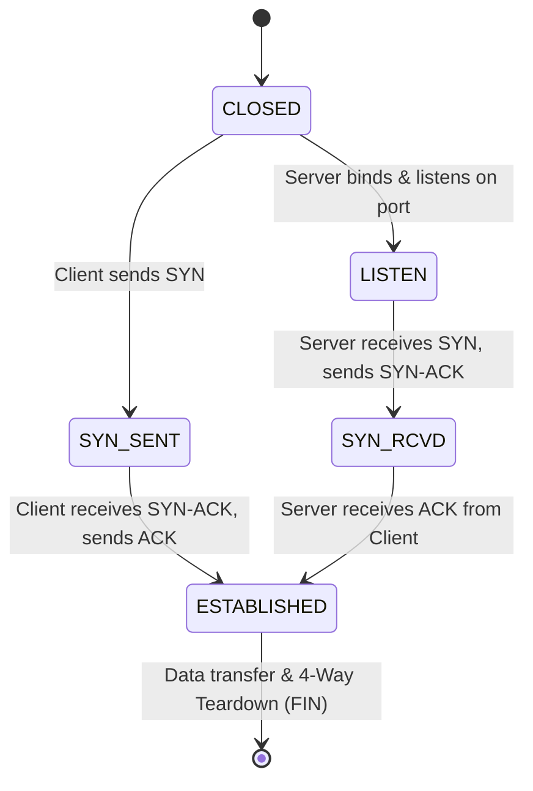

*Video Reference:* [YouTube](https://www.youtube.com/watch?v=xkP8iBAdgck)

In the previous post, we explored an overview of **Transmission Control Protocol (TCP)**, contrasting its connection-oriented, stateful, and reliable architecture against UDP's connectionless and lightweight nature. We learned that before any application data (such as an HTTP GET request, a database query, or a WebSocket message) can travel across a network via TCP, both devices must first establish a connection.

In this post, we will take a deep dive into **how** TCP establishes this connection through the famous **TCP 3-Way Handshake (SYN, SYN-ACK, ACK)**. We will examine why state synchronization is essential, walk through the step-by-step segment exchange, analyze header parameters, discuss optimizations like TCP Fast Open (TFO), and inspect connection states.

---

## Why Do We Need a Connection?

To understand why TCP requires a connection establishment phase, we must contrast it with connectionless protocols like UDP:

* **Connectionless Protocols (UDP)**: When a client sends a UDP datagram, it simply fires bytes onto the network wire. It does not verify whether the destination server is online, whether the target port is listening, or whether the receiver has buffer space. If the server is offline, the datagram is dropped into the void, and the client remains unaware.
* **Stateful Protocols (TCP)**: TCP promises guaranteed, in-order, and error-checked data delivery over an inherently unreliable IP network (where packets can be lost, corrupted, delayed, or reordered). 

To fulfill this reliability guarantee, TCP **must be stateful**. Both devices must explicitly establish, synchronize, and track connection state before transmitting a single byte of application data.

### What is a "Connection" in TCP?

A common misconception is that a TCP connection creates a dedicated physical circuit or virtual tunnel across routers in the network. In reality, **routers between the client and server know nothing about a TCP connection** (they operate at Layer 3, forwarding raw IP packets).

A TCP connection exists **entirely in the memory of the two host operating systems**. It is a virtual agreement consisting of synchronized state parameters stored in OS kernel data structures at both endpoints:

1. **Sequence Number Synchronization**: Both hosts agree on starting Sequence Numbers (`ISN`) so they can detect lost packets, reassemble bytes in exact order, and discard duplicates.
2. **Buffer and Flow Control Alignment**: Both hosts exchange their **Receive Window Sizes**, informing each other how much unacknowledged data their memory buffers can hold to prevent buffer overflow.
3. **Endpoint Verification**: Both hosts confirm that target ports are active, listening, and ready to process incoming payloads.
4. **State Persistence**: Both kernels maintain these state tables active in memory for the entire duration of the session until the connection is explicitly closed.

Without establishing and synchronizing this state upfront, reliable data transfer across an unpredictable network would be impossible.

---

## Practical Application Scenario

Consider a standard web application architecture:
- **Client**: A React application running locally on host `192.168.1.5`, using ephemeral port `8000`.
- **Server**: An Express.js backend hosted in AWS Cloud at IP `10.0.0.1`, listening on port `80`.

When a user triggers an HTTP request from the React frontend to the Express backend, HTTP relies on TCP at Layer 4 under the hood. Before a single byte of HTTP business logic payload (e.g. `GET /api/v1/users`) can be sent, the client OS kernel automatically initiates a TCP 3-way handshake with the server OS kernel.

---

## Step-by-Step Mechanism of the 3-Way Handshake

The 3-way handshake consists of three directional TCP segment transmissions between client and server.

### Step 1: The SYN Segment (Client to Server)

The client initiates connection establishment by sending a TCP segment with the **SYN (Synchronize)** control flag set to `1`.

- **Encapsulation**: The TCP segment is encapsulated inside an IP packet.
  - Source IP: `192.168.1.5` | Destination IP: `10.0.0.1`
  - Source Port: `8000` | Destination Port: `80`
- **Header Parameters**:
  - **Sequence Number (`Seq`)**: Set to a randomly generated Initial Sequence Number (`ISN_client`), e.g., `1000`.
  - **Window Size**: Advertises the client's receive buffer capacity (e.g., `64240` bytes).
  - **Control Flags**: `SYN = 1, ACK = 0`.
- **Payload**: In a standard handshake, this initial SYN segment carries **0 bytes of application data**. The payload section is empty.
- **Client State Transition**: The client operating system moves from `CLOSED` state to `SYN-SENT` state.

### Step 2: The SYN-ACK Segment (Server to Client)

When the server kernel receives the SYN segment on its listening port (`80`), it extracts and stores the client's parameters in memory.

Instead of sending two separate packets (one to acknowledge the client's SYN and another to request synchronization from the server), TCP performs an **optimization called piggybacking**: it merges the acknowledgment and synchronization into a single **SYN-ACK** segment.

- **Header Parameters**:
  - **Sequence Number (`Seq`)**: Set to the server's own randomly generated Initial Sequence Number (`ISN_server`), e.g., `5000`.
  - **Acknowledgment Number (`Ack`)**: Set to `ISN_client + 1` (e.g., `1001`), informing the client that the server received its SYN and expects sequence `1001` next.
  - **Window Size**: Advertises the server's receive buffer capacity (e.g., `65535` bytes).
  - **Control Flags**: `SYN = 1, ACK = 1`.
- **Payload**: Contains **0 bytes of application data**.
- **Server State Transition**: The server kernel moves from `LISTEN` state to `SYN-RCVD` (SYN Received) state.

### Step 3: The ACK Segment (Client to Server)

Upon receiving the SYN-ACK segment, the client learns the server's sequence number (`ISN_server`) and window size. The client immediately responds with a final **ACK (Acknowledgment)** segment.

- **Header Parameters**:
  - **Sequence Number (`Seq`)**: `ISN_client + 1` (e.g., `1001`).
  - **Acknowledgment Number (`Ack`)**: `ISN_server + 1` (e.g., `5001`), confirming receipt of the server's SYN.
  - **Control Flags**: `SYN = 0, ACK = 1`.
- **Client State Transition**: Client moves from `SYN-SENT` to `ESTABLISHED`.
- **Server State Transition**: Upon receiving this ACK, the server moves from `SYN-RCVD` to `ESTABLISHED`.

Both endpoints now share a fully synchronized, stateful TCP connection.

---

## Summary of Handshake Segment Flags and Parameters

| Step | Segment Name | Sender | Control Flags | Sequence Number (`Seq`) | Acknowledgment (`Ack`) | Payload Size |
| :--- | :--- | :--- | :--- | :--- | :--- | :--- |
| **1** | `SYN` | Client | `SYN=1, ACK=0` | `ISN_client` | N/A (0) | 0 Bytes |
| **2** | `SYN-ACK` | Server | `SYN=1, ACK=1` | `ISN_server` | `ISN_client + 1` | 0 Bytes |
| **3** | `ACK` | Client | `SYN=0, ACK=1` | `ISN_client + 1` | `ISN_server + 1` | 0 Bytes (or Data) |

---

## Connection States Machine

TCP maintains connection states on both host machines throughout the handshake lifecycle:

1. **`CLOSED`**: Fictional starting state when no connection exists.
2. **`LISTEN`**: Server passive state waiting for incoming SYN requests on a specific port.
3. **`SYN-SENT`**: Client active state after sending SYN, waiting for matching SYN-ACK.
4. **`SYN-RCVD`**: Server state after receiving SYN and sending SYN-ACK, waiting for final ACK.
5. **`ESTABLISHED`**: Connection fully open; bidirectionally ready for application payload transfer.

---

## Technical Edge Cases and Optimizations

### 1. TCP Fast Open (TFO)

In standard TCP handshakes, the first SYN segment carries 0 bytes of application data. Data transfer only begins after the 3-way handshake completes (costing 1 full Round Trip Time, or 1 RTT).

**TCP Fast Open (TFO)** is an extension (RFC 7413) that allows a client to include application payload directly inside the initial SYN segment on subsequent reconnections to a server.
- During an initial handshake, the server sends a cryptographic **TFO Cookie** to the client.
- On subsequent connections, the client sends `SYN + TFO Cookie + Data Payload` in the very first packet.
- This eliminates 1 RTT of latency, enabling instant HTTP data request processing.

### 2. SYN Flood Denial-of-Service Attack

Because the server transitions to `SYN-RCVD` state and allocates memory buffers upon receiving a SYN segment, it is vulnerable to a **SYN Flood Attack**.

An attacker spoofing thousands of fake source IP addresses sends a flood of SYN segments without responding to SYN-ACKs. The server's memory buffer fills up with half-open connections, preventing legitimate users from connecting.

**Mitigation (SYN Cookies)**: The server avoids allocating memory buffers in `SYN-RCVD` state. Instead, it encodes connection parameters directly into the server's Initial Sequence Number (`ISN_server`) as a cryptographic cookie. Memory is allocated only when a valid final ACK returning the cookie is received.

---

## What Comes Next?

Now that we understand how the 3-way handshake synchronizes state parameters between client and server, the next logical question is: **what specific fields inside the TCP segment header enable this tracking?**

In the next post, we will inspect the **Anatomy of a TCP Segment Header**, exploring sequence numbers, acknowledgment numbers, window sizes, flags (URG, ACK, PSH, RST, SYN, FIN), and MSS in detail.
