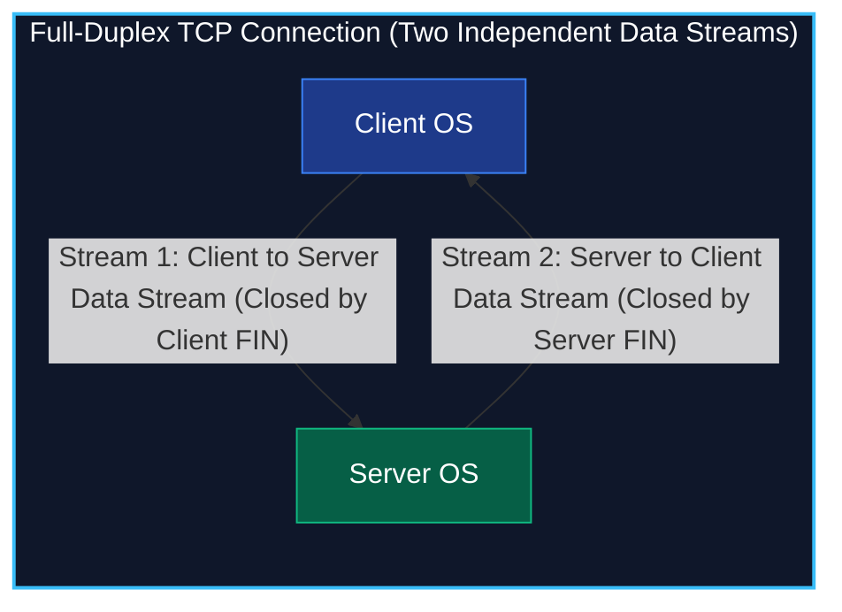
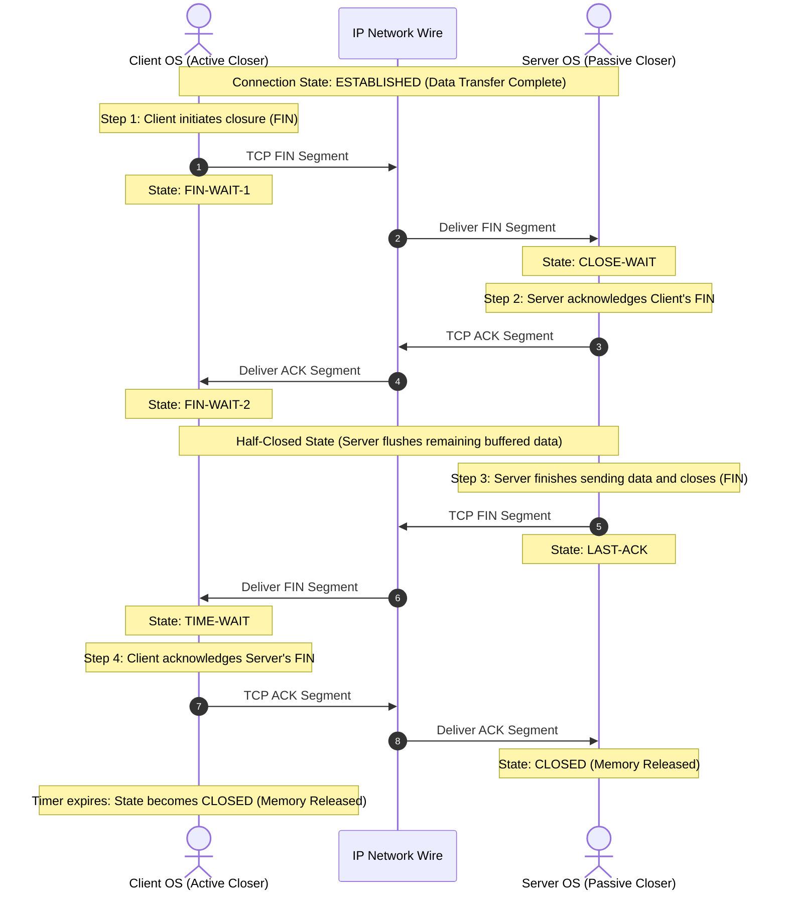
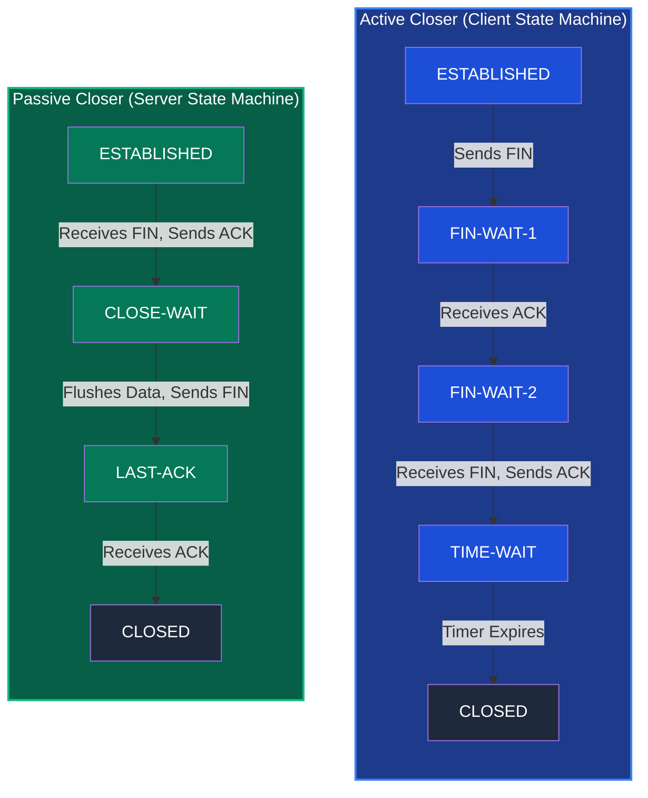
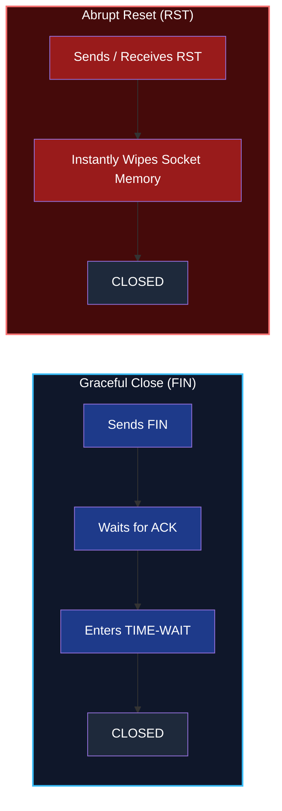

*Inspired by:* [YouTube](https://www.youtube.com/watch?v=ly6ixTfKpjM)

In the previous post, we examined the **TCP 3-Way Handshake (SYN, SYN-ACK, ACK)**, learning how client and server operating systems establish a stateful connection by synchronizing sequence numbers and receive window sizes. However, a TCP connection cannot remain open indefinitely.

Once client and server finish exchanging application data (such as HTTP requests and responses), host operating systems must cleanly teardown the connection. This process releases critical system resources, including kernel socket descriptors, memory buffers, and state table entries.

In this post, we will explore **TCP Connection Termination**, analyzing why connection teardown requires a **4-way handshake (FIN, ACK, FIN, ACK)**, how half-closed states work, why the `TIME-WAIT` state is essential, and how abrupt `RST` resets work.

---

## Why Connection Teardown Requires 4 Steps (The Full-Duplex Principle)

In the 3-way handshake, the server merges its acknowledgment (`ACK`) and synchronization (`SYN`) into a single `SYN-ACK` segment. A common question arises: **Why isn't connection termination also a 3-step process? Why are FIN and ACK sent separately by the server?**

The answer lies in TCP's **Full-Duplex Architecture**:

TCP provides two independent, directional data channels:
1. **Client to Server Stream**
2. **Server to Client Stream**

When the client finishes sending its HTTP request payload and transmits a `FIN` (Finish) segment, it is only closing **its sending direction (Client to Server)**. The server may still have pending response data in its kernel queue that needs to be transmitted to the client.

Therefore:
1. The server immediately sends an `ACK` acknowledging the client's `FIN` segment.
2. The connection enters a **Half-Closed State**. The client can no longer send data, but the server can continue streaming remaining response bytes to the client.
3. Once the server finishes sending all remaining data, it transmits its own `FIN` segment to close the **Server to Client** direction.
4. The client responds with a final `ACK`, fully terminating the connection.

---

## Step-by-Step Mechanism of the 4-Way Teardown

Here is the complete exchange of segments during a standard 4-way connection termination:

### Step 1: The First FIN (Client to Server)

When an application (such as a web browser or React app) completes its data transmission, it calls the `close()` system call on its socket descriptor.

- **Client Action**: Client kernel sends a **`FIN` segment** to the server.
- **Client State Transition**: Client moves from `ESTABLISHED` state to **`FIN-WAIT-1`**.
- **Meaning**: "I have finished sending data from my side. I want to close the Client to Server data stream."

### Step 2: The First ACK (Server to Client)

The server receives the `FIN` segment from the client.

- **Server Action**: Server kernel immediately sends an **`ACK` segment** back to the client.
- **Server State Transition**: Server moves from `ESTABLISHED` state to **`CLOSE-WAIT`**.
- **Client State Transition**: Upon receiving this ACK, client moves from `FIN-WAIT-1` to **`FIN-WAIT-2`**.
- **Meaning**: Server confirms it received the client's FIN. The connection is now **Half-Closed**.

### Step 3: The Second FIN (Server to Client)

While in `CLOSE-WAIT`, the server application finishes sending any remaining buffered responses. Once all response data is flushed and the server application calls `close()`, the server kernel initiates its own closure.

- **Server Action**: Server sends a **`FIN` segment** to the client.
- **Server State Transition**: Server moves from `CLOSE-WAIT` to **`LAST-ACK`**.
- **Meaning**: "I have finished sending all response data. I want to close the Server to Client data stream."

### Step 4: The Second ACK (Client to Server)

The client receives the server's `FIN` segment.

- **Client Action**: Client kernel sends a final **`ACK` segment** back to the server.
- **Server State Transition**: Upon receiving this ACK, server transitions to **`CLOSED`** state and immediately frees socket memory.
- **Client State Transition**: Client transitions to **`TIME-WAIT`** state and starts a timer. Once the timer expires, the client moves to **`CLOSED`**.

---

## Summary of 4-Way Teardown Segments and States

| Step | Segment Name | Sender | Client State | Server State | Note |
| :--- | :--- | :--- | :--- | :--- | :--- |
| **1** | `FIN` | Client | `FIN-WAIT-1` | `ESTABLISHED` | Client closes sending direction |
| **2** | `ACK` | Server | `FIN-WAIT-2` | `CLOSE-WAIT` | Server acknowledges Client FIN (Half-Closed) |
| **3** | `FIN` | Server | `FIN-WAIT-2` | `LAST-ACK` | Server flushes data & closes sending direction |
| **4** | `ACK` | Client | `TIME-WAIT` | `CLOSED` | Client acknowledges Server FIN |

---

## Connection Teardown State Machine

---

## Deep Dive: The TIME-WAIT State

Why doesn't the active closer (client) transition directly to `CLOSED` after sending the final ACK in Step 4? Why must it wait in **`TIME-WAIT`** for a short timer period before fully closing?

There are two fundamental reasons:

### 1. Reliable Delivery of the Final ACK

Network IP packets can be lost. If the client's final ACK (Step 4) is dropped by a router:
- The server remains stuck in `LAST-ACK` state.
- Because the server didn't receive the ACK, it assumes its `FIN` (Step 3) was lost and retransmits the `FIN` to the client.
- If the client were already in `CLOSED` state, it would respond with an error (`RST`) segment, leaving the server in an unclean state.
- Because the client stays in `TIME-WAIT`, it can intercept the retransmitted `FIN` and re-send the final `ACK` to cleanly close the server.

### 2. Preventing Stale Packet Corruption (Draining Straggler Segments)

IP networks can delay packets due to routing loops. Imagine a scenario where a connection closes, and a new TCP connection is opened immediately using the exact same 4-tuple (`Client IP`, `Server IP`, `Client Port`, `Server Port`).

If an old delayed packet from the previous connection suddenly arrives, the new connection could mistake it for valid data, corrupting application state.

Holding the socket in `TIME-WAIT` for a timer period ensures that all old straggler packets belonging to that 4-tuple expire and drain from the network before the port can be reused.

### Who Enters TIME-WAIT? (Can the Server Enter TIME-WAIT?)

A common point of confusion is whether `TIME-WAIT` is exclusive to clients.

The rule in TCP is simple: **Whichever endpoint sends the first `FIN` segment (the Active Closer) is the host that enters `TIME-WAIT`.**

* **Client-Initiated Close**: If the client sends the first `FIN` (e.g., user closes a browser tab or websocket), the **Client** enters `TIME-WAIT`.
* **Server-Initiated Close**: If the server sends the first `FIN` (e.g., Nginx server times out an idle HTTP keep-alive connection or sends `Connection: close`), the **Server** becomes the active closer and enters `TIME-WAIT`!
* **Passive Closer**: The receiving host (the passive closer) does **not** enter `TIME-WAIT`—it transitions directly from `LAST-ACK` to `CLOSED` upon receiving the final ACK.

---

## Technical Edge Cases

### 1. Abrupt Termination: The RST (Reset) Segment

Not all TCP connections close gracefully through a 4-way handshake. In certain operational scenarios, a connection must be terminated immediately. This is accomplished using an **`RST` (Reset)** segment.

#### Graceful (`FIN`) vs. Forceful (`RST`) Termination

The fundamental difference between a standard `FIN` segment and an `RST` segment comes down to courtesy versus emergency aborts:

* **Graceful Teardown (`FIN`)**: A polite, negotiated agreement between hosts. The active closer announces it has finished sending data, allowing the passive closer time to flush any remaining in-flight responses before closing.
* **Abrupt Reset (`RST`)**: A sudden, non-negotiable directive that forces an immediate connection teardown without waiting for pending data or acknowledgments.

#### How an RST Segment Works under the Hood

When a host transmits or receives an `RST` segment:

1. **Bypasses State Lifecycle**:
   Both endpoints bypass intermediate handshake states (`FIN-WAIT-1`, `FIN-WAIT-2`, `CLOSE-WAIT`, `LAST-ACK`, and `TIME-WAIT`) and transition directly to `CLOSED`.

2. **No Acknowledgment Required (Preventing Infinite Reset Loops)**:
   The recipient of an `RST` segment does **not** send an `ACK` back. This design rule prevents infinite packet loops: if an `ACK` sent in response to an `RST` were dropped or misrouted, the other host (which already destroyed its connection state) would be forced to respond with *another* `RST`, creating an endless ping-pong loop of packets storming the network. Unlike `FIN` (which asks for confirmation), `RST` is a one-way command. The connection is considered dead the instant `RST` is processed.

3. **Buffer Erasure (Immediate Memory Purge)**:
   In a normal `FIN` teardown, TCP guarantees that all queued data is flushed across the wire before closing. In an `RST` scenario:
   - **Outbound Transmission Queue**: The OS kernel immediately wipes all unsent payload bytes sitting in its outbound socket buffer. They are deleted from RAM without ever touching the network.
   - **Inbound Receive Queue**: If the application has not yet read the data already sitting in its socket receive buffer, the OS kernel purges those unread bytes immediately. Any subsequent `read()` system call by the application returns an instant error (`ECONNRESET` / "Connection reset by peer") instead of returning the unread data.

#### Common Triggers for RST Segments

1. **Connection Refused (Closed Port)**:
   If a client sends a `SYN` request to a server port where no application is actively listening (e.g., attempting an HTTP request on port 8080 when the backend server is stopped), the host OS kernel immediately responds with an `RST` segment to inform the client that the port is closed.

2. **Process Crash or Sudden Host Reboot**:
   If an application process (like Node.js, Python, or Nginx) crashes unexpectedly while holding active TCP connections, the OS kernel reclaims orphaned socket descriptors by sending `RST` segments to all connected peers.

3. **Out-of-State / Unsolicited Packets**:
   If a host receives a TCP segment belonging to a connection that no longer exists in its active state table (for example, if a firewall or router previously cleared the connection state), the host replies with an `RST` segment to signal that the connection is invalid.

#### What Happens if an RST Segment is Lost in Transit?

Because an `RST` segment is not acknowledged (`No ACK`), IP network routers can occasionally drop an `RST` segment in transit. When this happens:

1. **Temporary Half-Open (Zombie) State**:
   - **Sender of RST (Host A)**: Host A immediately closes its socket and wipes its state table. It considers the connection dead.
   - **Recipient (Host B)**: Because Host B never received the `RST` segment, Host B still believes the connection is active (`ESTABLISHED`) and keeps its kernel socket memory allocated.

2. **Self-Healing on Next Packet Transmission**:
   - The moment Host B attempts to send new data bytes or a keep-alive probe to Host A, Host A receives a packet for a connection that no longer exists in its table.
   - Host A's kernel immediately responds by transmitting **another `RST` segment**.
   - Host B receives this new `RST` segment and finally tears down its socket, throwing an `ECONNRESET` error.

3. **Fallback to Keep-Alive Timers**:
   - If Host B remains completely silent and never transmits data, Host B's **TCP Keep-Alive timer** (or application-level heartbeat) eventually triggers, sending probe packets. When Host A rejects the probe with an `RST`, Host B's connection is cleanly closed.

#### Comparison: FIN vs. RST

| Feature | `FIN` Segment (Graceful Close) | `RST` Segment (Abrupt Reset) |
| :--- | :--- | :--- |
| **Operational Goal** | Clean, negotiated connection shutdown | Immediate, forced connection termination |
| **Buffer Handling** | Flushes and delivers all pending data | Discards all queued and in-flight data |
| **Acknowledgment** | Requires explicit `ACK` segments | No `ACK` expected or transmitted |
| **State Lifecycle** | Moves through state transitions and `TIME-WAIT` | Bypasses all states and instantly transitions to `CLOSED` |

### 2. Simultaneous Close

If both endpoints send `FIN` segments simultaneously:
- Client sends `FIN` and enters `FIN-WAIT-1`.
- Before receiving client's `FIN`, server also sends `FIN` and enters `FIN-WAIT-1`.
- Both endpoints receive `FIN`, send `ACK`, and enter `CLOSING` state.
- Upon receiving the `ACK`, both enter `TIME-WAIT` and eventually `CLOSED`.

### 3. Combined FIN-ACK Optimization (3-Way Connection Termination)

In a standard 4-way teardown, the server sends a separate `ACK` followed by a separate `FIN`. This occurs when the server still has buffered response data to flush to the client.

However, **if the server has no pending data and is ready to close immediately upon receiving the client's `FIN`**:
- Many modern TCP implementations optimize transmission by merging the server's `ACK` and `FIN` into a single **`FIN-ACK` segment** (`FIN = 1, ACK = 1`).
- This compresses the exchange into a **3-way termination**:
  1. `FIN` (Client to Server)
  2. `FIN-ACK` (Server to Client)
  3. `ACK` (Client to Server)
- **Logically Identical**: Even though sent as 3 physical packets on the wire, logically it executes the exact same four actions (`Client FIN`, `Server ACK`, `Server FIN`, `Client ACK`). Both 4-way teardown and 3-way combined `FIN-ACK` teardown are completely valid standard TCP behaviors.

---

## Summary

* **3-Way Handshake (SYN, SYN-ACK, ACK)** establishes a stateful TCP connection.
* **4-Way Teardown (FIN, ACK, FIN, ACK)** gracefully closes a TCP connection because TCP is full-duplex, allowing one direction to close while the other flushes pending responses.
* **Combined FIN-ACK (3-Way Termination)** occurs when the server has no pending data and merges its `ACK` and `FIN` into a single segment.
* **`TIME-WAIT` State** protects against lost final ACKs and prevents stale delayed packets from corrupting future connections on the same port.
* **`RST` Segments** provide emergency abrupt termination when graceful teardown is impossible.
