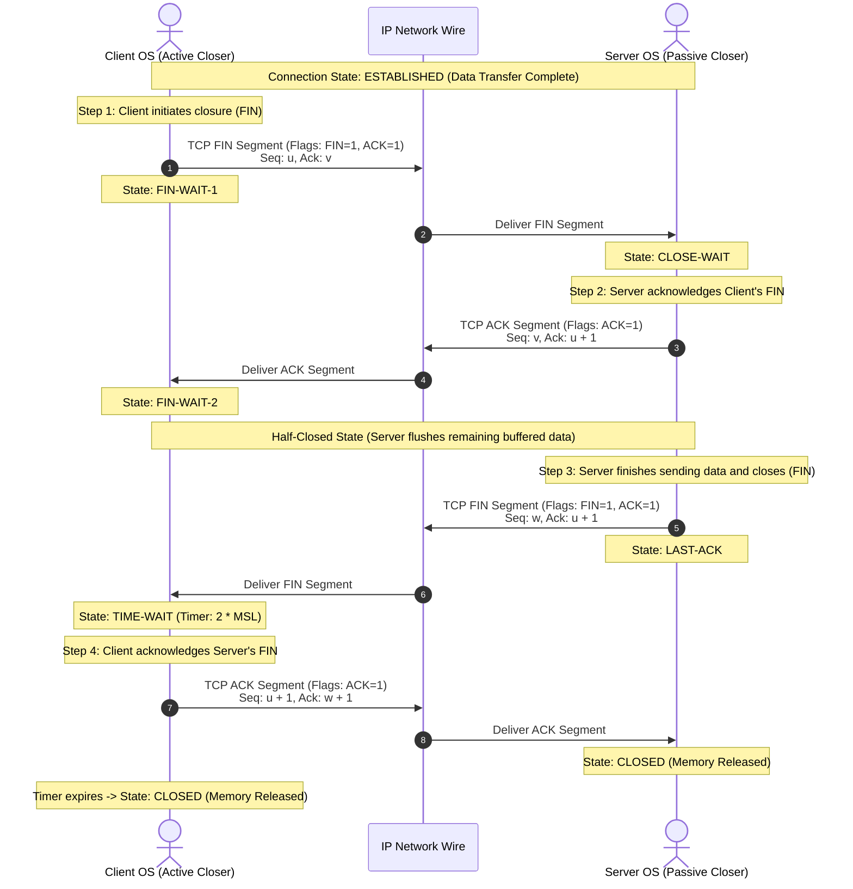
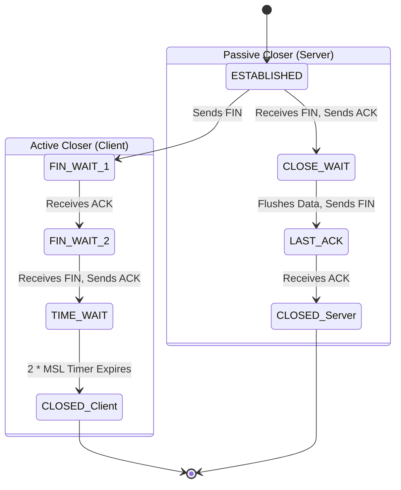

*Video Reference:* [YouTube](https://www.youtube.com/watch?v=ly6ixTfKpjM)

In the previous post, we examined the **TCP 3-Way Handshake (SYN, SYN-ACK, ACK)**, learning how client and server operating systems establish a stateful connection by synchronizing sequence numbers and receive window sizes. However, a TCP connection cannot remain open indefinitely.

Once client and server finish exchanging application data (such as HTTP requests and responses), host operating systems must cleanly teardown the connection. This process releases critical system resources, including kernel socket descriptors, memory buffers, and state table entries.

In this post, we will explore **TCP Connection Termination**, analyzing why connection teardown requires a **4-way handshake (FIN, ACK, FIN, ACK)**, how half-closed states work, why the `TIME-WAIT` state is essential, and how abrupt `RST` resets work.

---

## Why Connection Teardown Requires 4 Steps (The Full-Duplex Principle)

In the 3-way handshake, the server merges its acknowledgment (`ACK`) and synchronization (`SYN`) into a single `SYN-ACK` segment. A common question arises: **Why isn't connection termination also a 3-step process? Why are FIN and ACK sent separately by the server?**

The answer lies in TCP's **Full-Duplex Architecture**:

```mermaid
flowchart LR
    subgraph FullDuplex ["Full-Duplex TCP Connection"]
        direction TB
        Client["Client OS"] <==="Direction 1: Client -> Server Data Stream"===> Server["Server OS"]
        Client <==="Direction 2: Server -> Client Data Stream"===> Server
    end

    style FullDuplex fill:#0f172a,stroke:#38bdf8,stroke-width:2px,color:#fff
    style Client fill:#1e3a8a,stroke:#3b82f6,color:#fff
    style Server fill:#065f46,stroke:#10b981,color:#fff
```

TCP provides two independent, directional data channels:
1. **Client to Server Stream**
2. **Server to Client Stream**

When the client finishes sending its HTTP request payload and transmits a `FIN` (Finish) segment, it is only closing **its sending direction (Client to Server)**. The server may still have pending response data in its kernel queue that needs to be transmitted to the client.

Therefore:
1. The server immediately sends an `ACK` acknowledging the client's `FIN` segment.
2. The connection enters a **Half-Closed State**. The client can no longer send data, but the server can continue streaming remaining response bytes to the client.
3. Once the server finishes sending all remaining data, it transmits its own `FIN` segment to close the **Server to Client** direction.
4. The client responds with a final `ACK`, fully terminating the connection.

---

## Step-by-Step Mechanism of the 4-Way Teardown

Here is the complete exchange of segments during a standard 4-way connection termination:



### Step 1: The First FIN (Client to Server)

When an application (such as a web browser or React app) completes its data transmission, it calls the `close()` system call on its socket descriptor.

- **Client Action**: Client kernel constructs a TCP segment with the **`FIN` flag set to 1** (`FIN = 1, ACK = 1`).
- **Client State Transition**: Client moves from `ESTABLISHED` state to **`FIN-WAIT-1`**.
- **Meaning**: "I have finished sending data from my side. I want to close the Client to Server data stream."

### Step 2: The First ACK (Server to Client)

The server receives the `FIN` segment from the client.

- **Server Action**: Server kernel immediately sends an **`ACK` segment** back to the client (`Ack = u + 1`).
- **Server State Transition**: Server moves from `ESTABLISHED` state to **`CLOSE-WAIT`**.
- **Client State Transition**: Upon receiving this ACK, client moves from `FIN-WAIT-1` to **`FIN-WAIT-2`**.
- **Meaning**: Server confirms it received the client's FIN. The connection is now **Half-Closed**.

### Step 3: The Second FIN (Server to Client)

While in `CLOSE-WAIT`, the server application finishes sending any remaining buffered responses. Once all response data is flushed and the server application calls `close()`, the server kernel initiates its own closure.

- **Server Action**: Server constructs a TCP segment with **`FIN = 1, ACK = 1`** (`Seq = w`).
- **Server State Transition**: Server moves from `CLOSE-WAIT` to **`LAST-ACK`**.
- **Meaning**: "I have finished sending all response data. I want to close the Server to Client data stream."

### Step 4: The Second ACK (Client to Server)

The client receives the server's `FIN` segment.

- **Client Action**: Client kernel sends a final **`ACK` segment** back to the server (`Ack = w + 1`).
- **Server State Transition**: Upon receiving this ACK, server transitions to **`CLOSED`** state and immediately frees socket memory.
- **Client State Transition**: Client transitions to **`TIME-WAIT`** state and starts a timer. Once the timer expires, the client moves to **`CLOSED`**.

---

## Summary of 4-Way Teardown Flags and States

| Step | Segment | Sender | Control Flags | Client State | Server State | Note |
| :--- | :--- | :--- | :--- | :--- | :--- | :--- |
| **1** | `FIN` | Client | `FIN=1, ACK=1` | `FIN-WAIT-1` | `ESTABLISHED` | Client closes sending direction |
| **2** | `ACK` | Server | `ACK=1` | `FIN-WAIT-2` | `CLOSE-WAIT` | Server acknowledges Client FIN (Half-Closed) |
| **3** | `FIN` | Server | `FIN=1, ACK=1` | `FIN-WAIT-2` | `LAST-ACK` | Server flushes data & closes sending direction |
| **4** | `ACK` | Client | `ACK=1` | `TIME-WAIT` | `CLOSED` | Client acknowledges Server FIN |

---

## Connection Teardown State Machine



---

## Deep Dive: The TIME-WAIT State

Why doesn't the active closer (client) transition directly to `CLOSED` after sending the final ACK in Step 4? Why must it wait in **`TIME-WAIT`** for **2 * MSL (Maximum Segment Lifetime)** (typically 30 seconds to 2 minutes)?

There are two fundamental reasons:

### 1. Reliable Delivery of the Final ACK

Network IP packets can be lost. If the client's final ACK (Step 4) is dropped by a router:
- The server remains stuck in `LAST-ACK` state.
- Because the server didn't receive the ACK, it assumes its `FIN` (Step 3) was lost and retransmits the `FIN` to the client.
- If the client were already in `CLOSED` state, it would respond with an error (`RST`) segment, leaving the server in an unclean state.
- Because the client stays in `TIME-WAIT`, it can intercept the retransmitted `FIN` and re-send the final `ACK` to cleanly close the server.

### 2. Preventing Stale Packet Corruption (Draining Straggler Segments)

IP networks can delay packets due to routing loops. Imagine a scenario where a connection closes, and a new TCP connection is opened immediately using the exact same 4-tuple (`Client IP`, `Server IP`, `Client Port`, `Server Port`).

If an old delayed packet from the previous connection suddenly arrives, the new connection could mistake it for valid data, corrupting application state.

Holding the socket in `TIME-WAIT` for 2 * MSL ensures that all old straggler packets belonging to that 4-tuple expire and drain from the network before the port can be reused.

---

## Technical Edge Cases

### 1. Abrupt Termination: The RST (Reset) Segment

Not all connections close gracefully via the 4-way teardown. If a process crashes, a server reboots unexpectedly, or a firewall blocks traffic, TCP sends an **`RST` (Reset)** segment (`RST = 1`).

An `RST` segment immediately aborts the connection, bypassing `FIN-WAIT` and `TIME-WAIT` states, and instantly frees memory on both hosts.

### 2. Simultaneous Close

If both endpoints send `FIN` segments simultaneously:
- Client sends `FIN` and enters `FIN-WAIT-1`.
- Before receiving client's `FIN`, server also sends `FIN` and enters `FIN-WAIT-1`.
- Both endpoints receive `FIN`, send `ACK`, and enter `CLOSING` state.
- Upon receiving the `ACK`, both enter `TIME-WAIT` and eventually `CLOSED`.

---

## Summary

* **3-Way Handshake (SYN, SYN-ACK, ACK)** establishes a stateful TCP connection.
* **4-Way Teardown (FIN, ACK, FIN, ACK)** gracefully closes a TCP connection because TCP is full-duplex, allowing one direction to close while the other flushes pending responses.
* **`TIME-WAIT` State** protects against lost final ACKs and prevents stale delayed packets from corrupting future connections on the same port.
* **`RST` Segments** provide emergency abrupt termination when graceful teardown is impossible.
