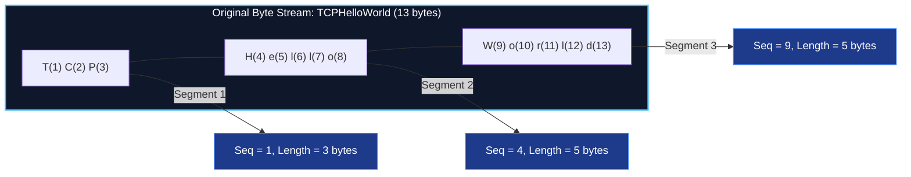
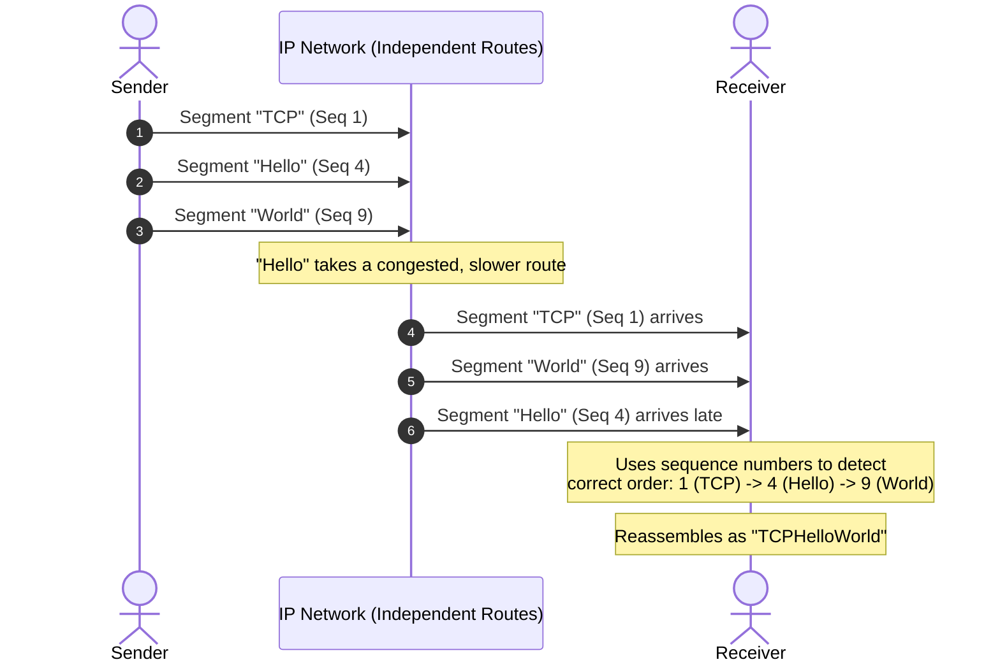
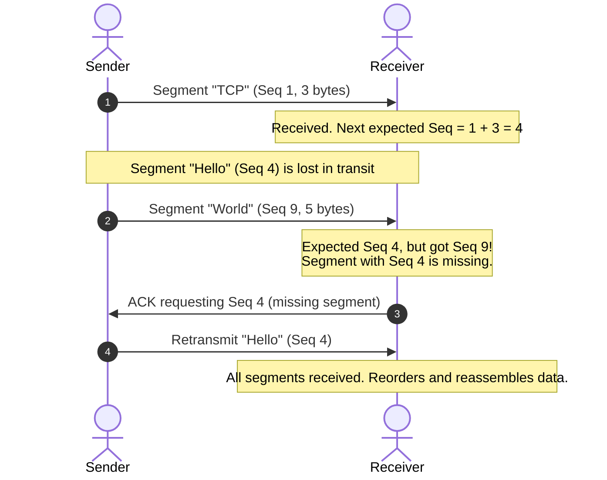
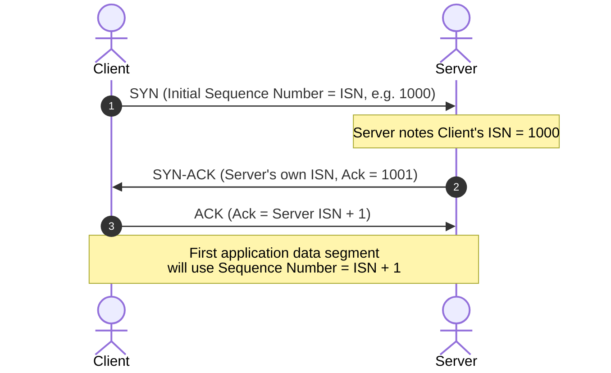
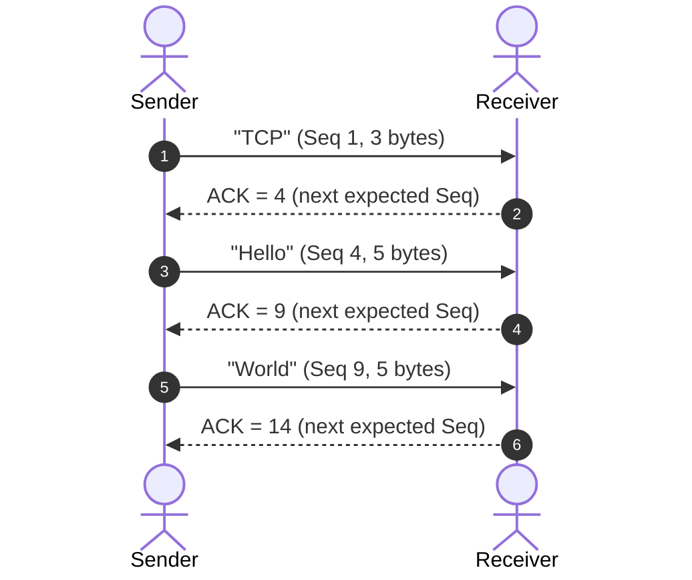
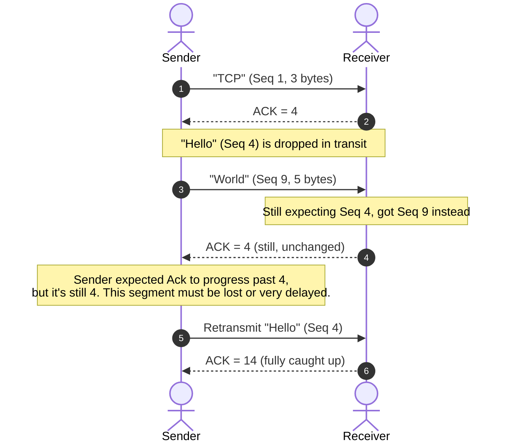

*Video Reference:* [YouTube](https://www.youtube.com/watch?v=YryEKDfMXQw)

In earlier posts, we established that **TCP is reliable** and **guarantees in-order delivery** of data. Reliable means that any data we intend to send is guaranteed to reach the receiver, and if a segment is lost in transit, it gets retransmitted. In-order delivery means that even if our data is broken into multiple segments before transmission, those segments are reassembled in the exact original order at the receiver.

Both of these properties exist **because of two fields in the TCP header: the Sequence Number and the Acknowledgment Number.** In this post, we will go through both of these fields in detail, with a worked example.

---

## TCP Sequence Number

The core idea is simple: **every byte sent over a TCP connection is numbered.**

When an application (say, an HTTP client) has a continuous stream of bytes to send, the OS's TCP/IP stack breaks that stream into smaller chunks. Each chunk becomes a **TCP segment**. Since these segments are carved out of one continuous byte stream, each one needs a way to record *where it sits* in that original stream: this is exactly what the sequence number does.

> **The Sequence Number field contains the position of the *first* byte of data in that segment, relative to the original byte stream.**

### Worked Example: Splitting a Byte Stream into Segments

Suppose we want to send the string `TCPHelloWorld` as application data. Every character here is one byte. The OS breaks this continuous byte stream into three segments:

* **Segment 1 (`TCP`)**: The letter `T` is the first byte of the original stream, at position `1`. So this segment's **sequence number is `1`**. It carries 3 bytes.
* **Segment 2 (`Hello`)**: The letter `H` sits at position `4` in the original stream (positions 1-3 were already consumed by `TCP`). So this segment's **sequence number is `4`**. It carries 5 bytes.
* **Segment 3 (`World`)**: The letter `W` sits at position `9` in the original stream (positions 1-8 are already consumed). So this segment's **sequence number is `9`**. It carries 5 bytes.

Notice the pattern: **the sequence number of the next segment = sequence number of the current segment + number of bytes it carried.** `1 + 3 = 4`, and `4 + 5 = 9`.

> **Note:** In these examples, we start counting from sequence number `1` purely for simplicity. In reality, the very first sequence number (the **Initial Sequence Number**) is a large, randomized 32-bit value, not zero. Tools like Wireshark display a *relative sequence number* starting at `0` for readability, but the actual field on the wire is randomized. We will revisit exactly where this initial number comes from later in this post.

### Why Number Every Byte? Reordering Out-of-Order Segments

TCP segments don't travel together as a bundle. Each segment is wrapped inside its own independent IP packet and can take a **completely different route (different hops, different routers)** across the network to reach the receiver.

Because of this, segments can arrive **out of order**. For example, the `Hello` segment might get routed through congested routers and arrive late, while `World`, traveling through faster routers, arrives before it:

This is not an error or a bug: **this is simply how IP networks and the internet work**. The receiver uses the sequence number of every incoming segment to figure out the correct order and reassembles the original byte stream correctly, regardless of the order in which segments physically arrived.

### Why Number Every Byte? Detecting Loss and Enabling Retransmission

Sequence numbers also let the receiver detect **missing segments**.

Say the receiver gets `TCP` (Seq `1`, 3 bytes). Using the TCP header length (a standard TCP header is `20` bytes, comparable to the `8`-byte UDP header we covered earlier), the receiver calculates:

**Next expected sequence number = current segment's sequence number + its byte length.**

For `TCP` (Seq `1`, length `3`), the receiver now expects the **next segment to start at sequence number `4`**.

If the receiver was expecting sequence number `4` next, but instead receives a segment with sequence number `9`, it immediately knows that the segment starting at `4` (`Hello`) is **either delayed or lost**. The receiver informs the sender it is still waiting for sequence number `4`. If the sender doesn't get confirmation that this data arrived, it **retransmits** the segment until the receiver acknowledges it.

### Why Number Every Byte? Preventing Duplicate Data

Sequence numbers also protect against **duplicate segments** being accepted twice.

Sometimes a sender transmits a segment, but due to network latency, the receiver takes a long time to receive it. Meanwhile, since the sender hasn't received an acknowledgment in time, it assumes the segment was lost and retransmits it. Now both copies, the original (delayed) segment and the retransmitted copy, can end up arriving at the receiver.

When the second copy arrives, the receiver checks: *"Do I already have data starting at this sequence number in memory?"* If yes, it simply **discards the duplicate** instead of accepting it twice. This is exactly how sequence numbers prevent duplicate data from being accepted.

---

## Initial Sequence Number (ISN) and the 3-Way Handshake

The **initial sequence number** for a connection is exchanged during the **TCP 3-way handshake**, which we covered in detail in a previous post.

The `SYN` segment that the client sends to initiate a connection is itself a TCP segment, meaning it also carries a sequence number field. For simplicity, we've been assuming this initial value is `0`, but in reality **it is a large, randomized number** (this is a deliberate security measure to prevent attackers from guessing sequence numbers and hijacking connections).

Because the very first `SYN` segment itself **occupies one sequence number** (the ISN), the **first actual application-data segment cannot reuse that same number**: it starts at `ISN + 1`.

So if the client's ISN is `0` (as in our simplified examples), the first data segment starts at sequence number `1`. But if the client's ISN were `1000`, the first data segment would start at `1001`, the next at `1004` (after 3 bytes), then `1009` (after 5 bytes), and so on: the exact same logic, just **relative to a different starting point**.

This is precisely why Wireshark shows a *relative sequence number* of `0` for the first segment regardless of the actual randomized ISN on the wire: it makes the flow far easier to read, while the underlying mental model (position of first byte, relative to where numbering started) stays identical.

> **Note:** The Sequence Number field in the TCP header is **32 bits wide**, so its maximum value is **2³² − 1 (4,294,967,295)**. Once a connection transmits enough bytes to exceed this limit, the sequence number **wraps around back to `0`** and continues counting from there.

### What Happens When the Sequence Number Wraps Around?

Wraparound is not an error condition, it's expected, designed-for behavior. Once a connection crosses `4,294,967,295` bytes transferred, the next byte is simply numbered `0` again, and counting continues from there. Both endpoints compare sequence numbers using **modulo-2³² arithmetic** (a circular number line) rather than plain integer comparison, so a number like `2` is correctly understood to come *after* `4,294,967,295`, not treated as a huge jump backward.

On older or slower links, wrapping around ~4 GB of data took long enough that any stray duplicate or delayed segment from before the wrap would have already expired in the network. But on modern high-speed connections (multi-Gbps links), that same ~4 GB can be transferred in just a few seconds. This creates ambiguity: an old, delayed duplicate segment from *before* the wrap could carry a sequence number that looks perfectly valid *after* the wrap, and could mistakenly be accepted as fresh data.

TCP solves this with an extension called **PAWS (Protection Against Wrapped Sequence numbers)**, defined in RFC 1323. Every segment carries a monotonically increasing **timestamp** (via the TCP Timestamps option). If an incoming segment has a sequence number that looks valid but its timestamp is *older* than the most recent timestamp seen on that connection, the receiver recognizes it as a stale duplicate from before the wrap and discards it, even though the raw sequence number alone couldn't tell the difference.

---

## TCP Acknowledgment Number

Before understanding the acknowledgment number, let's understand what an **ACK** is. We already know: **ACK is used to confirm the successful receipt of data.** We saw this in the 3-way handshake: when the client sent its `SYN`, the server responded with its own `SYN` *and* an `ACK` confirming it received the client's synchronization request, and the client in turn sent a final `ACK` confirming it received the server's.

This confirmation is controlled by a flag in the TCP segment (the `ACK` flag, one of several control flags in the TCP header, alongside `SYN`, `FIN`, and `PSH`, covered in detail when we explore the full TCP segment anatomy). **Whenever the `ACK` flag is set to `1`, the segment is required to carry a valid Acknowledgment Number.**

> **The Acknowledgment Number contains the next sequence number the receiver expects to receive.**

### Worked Example: Calculating the Acknowledgment Number

Continuing our earlier example, when the receiver gets the segment `TCP` (Seq `1`, length `3` bytes):

**Acknowledgment Number = Sequence Number of received segment + its length in bytes = `1 + 3 = 4`.**

The Acknowledgment Number does two things simultaneously:
1. Confirms to the sender that data **was received**.
2. Tells the sender **exactly how much has been received**, by specifying the next byte position it expects.

| Segment Received | Seq | Length | Next Expected (Ack Sent) |
| :--- | :--- | :--- | :--- |
| `TCP` | `1` | 3 bytes | `4` |
| `Hello` | `4` | 5 bytes | `9` |
| `World` | `9` | 5 bytes | `14` |

### How Acknowledgment Numbers Detect Loss

Say the sender transmits `Hello` (Seq `4`), but it gets dropped somewhere in the network, while `World` (Seq `9`) arrives successfully:

The receiver already knows its next expected sequence number is `4`. When it receives `World` (Seq `9`) instead, it detects something is wrong: it acknowledges receipt of this new segment, but **it keeps sending back Ack = `4`**, because from its perspective it is still waiting on that byte range. The sender, seeing the Ack number `4` doesn't progress even though it already sent both `Hello` and `World`, concludes that the `Hello` segment is either lost or severely delayed, and **retransmits** it. Once the retransmitted `Hello` arrives, the receiver can finally advance its acknowledgment to `14`, confirming everything has now been received.

---

## Summary

* **Every byte** sent over a TCP connection is numbered, and the **Sequence Number** of a segment marks the position of its **first byte** in the original byte stream.
* Because independent IP packets can take different routes, segments frequently **arrive out of order**; the receiver uses sequence numbers to detect the correct order and reassemble data correctly.
* Sequence numbers let the receiver detect **missing segments** (by noticing a gap in the expected next sequence number) and let the sender know when **retransmission** is required.
* Sequence numbers also help the receiver **discard duplicate segments** that arrive more than once.
* The **Initial Sequence Number (ISN)** is a randomized value exchanged during the **3-way handshake**; the first actual data segment always starts at `ISN + 1`, since the `SYN` segment itself occupies the initial number.
* The Sequence Number field is **32 bits**, so it can hold values up to **2³² − 1**, after which it **wraps around to `0`**.
* The **Acknowledgment Number**, sent whenever the `ACK` flag is set, tells the sender the **next sequence number the receiver expects**; it is calculated as `received segment's Seq + its byte length`.
* Together, Sequence Numbers and Acknowledgment Numbers enable **ordered reassembly**, **loss detection with retransmission**, and **duplicate rejection**, making these two fields the foundation of TCP's reliability.
