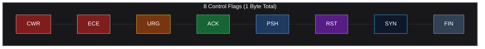
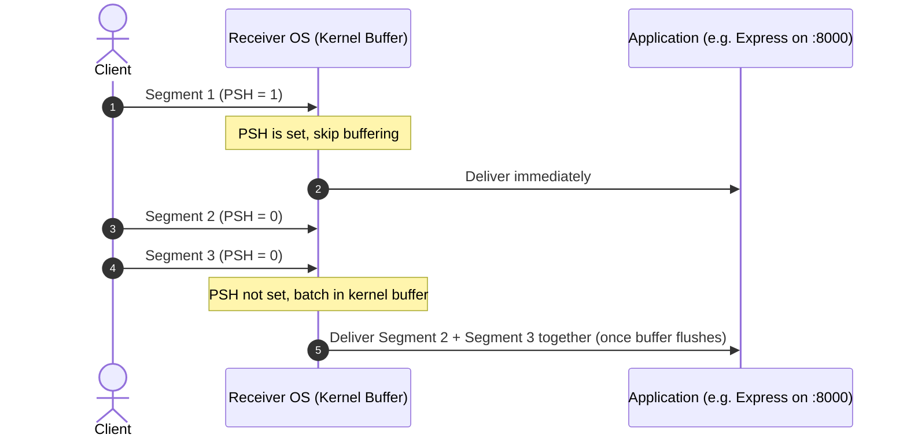
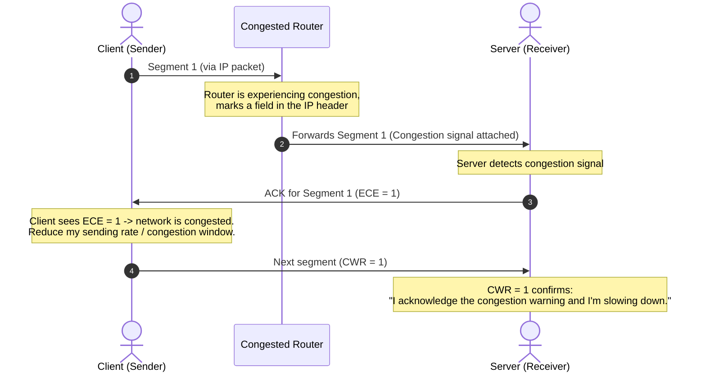

*Video Reference:* [YouTube](https://www.youtube.com/watch?v=_d4_vkSQIEk)

We already dissected the **[Anatomy of a UDP Datagram](/networking/ch14-anatomy-of-a-udp-datagram-and-checksum)** down to its 4 fields and 8-byte header. We've also covered TCP's **[Sequence and Acknowledgment Numbers](/networking/ch18-tcp-sequence-and-acknowledgment-numbers)** in isolation. In this post, we zoom out and examine the **complete TCP segment header**, field by field, exactly as defined in the official RFC.

A TCP segment, just like a UDP datagram, travels across the network **carried inside an IP packet**. But unlike UDP's minimal 8-byte header, TCP carries significantly more metadata, because it's responsible for reliability, ordering, flow control, and congestion control.

---

## RFC 793 / RFC 9293: The Source of Truth

The header layout below is modeled directly on the **official TCP RFC**, which defines the segment format as a 32-bit-wide grid (4 bytes per row). Although diagrams represent it as rows and columns for readability, on the wire it is always a **continuous stream of bytes**, source port, then destination port, then sequence number, and so on, one after another.

<TcpHeaderTable />

Everything from **Source Port** through **Options** is the **TCP header**, the metadata needed to make TCP function. The **Data** field is the actual payload (an HTTP request, an SSH command, an SMTP message) that the higher-layer protocol hands off to TCP. TCP acts purely as a **vehicle**: it carries this payload while enforcing reliability and ordering on top of it.

---

## Source Port and Destination Port (2 Bytes Each)

Identical in concept to UDP: the **Source Port** identifies the application process that initiated the request (say, a React app running on the client host), and the **Destination Port** identifies the application process the segment is headed to (say, an Express server on port `8000`). Since each field is 16 bits wide, both range from `0` to `65535`.

---

## Sequence Number and Acknowledgment Number (4 Bytes Each)

We covered both of these fields in full detail in the [previous post](/networking/ch18-tcp-sequence-and-acknowledgment-numbers), so we won't repeat that here. What's worth noting on the header level:

* Each field occupies a full **32 bits (4 bytes)**.
* Since both are 32-bit unsigned integers, they can represent values up to **2³² − 1 (~4.29 billion)**, which is exactly why the Initial Sequence Number (ISN) negotiated during the 3-way handshake is a large, randomized number rather than a small counter.

---

## Data Offset (4 Bits) and Reserved (4 Bits)

The **Data Offset** field tells the receiver exactly where the header ends and the **Data** payload begins.

* Its unit is **4 bytes per increment**, a Data Offset value of `5` means the header is `5 × 4 = 20` bytes; a value of `7` means `7 × 4 = 28` bytes.
* The **minimum possible value is `5`**, because the 5 required rows (Source Port through Urgent Pointer) always occupy `20` bytes, regardless of whether Options are present.
* If Data Offset is **greater than `5`**, that means the segment carries additional bytes in the **Options** field, and the receiver must account for those extra bytes before locating the actual payload.

The **Reserved** field is simply **4 bits set aside for future use** (typically `0`), giving the protocol room to grow without breaking backward compatibility, for example, to accommodate additional flags later.

---

## The 8 Control Flags

Each flag is a single bit: `0` means disabled, `1` means enabled. Multiple flags can be set simultaneously on the same segment (a `SYN-ACK` segment, for instance, has both `SYN` and `ACK` set to `1`).

### SYN
Set to `1` on the very first segment of the 3-way handshake. It tells the receiver, "I want to synchronize, here's my Initial Sequence Number, and I'll expect subsequent sequence numbers to follow from it." We covered this in detail in our [3-way handshake post](/networking/ch16-tcp-three-way-handshake).

### ACK
Whenever this flag is `1`, the segment is required to carry a **valid Acknowledgment Number**. If the flag is `0`, the Acknowledgment Number field is ignored entirely, sender and receiver simply don't consider it. This is why TCP is described as an "acknowledgment-oriented" protocol: virtually every segment exchanged (after the initial `SYN`) carries an `ACK`.

### FIN
Set to `1` when a host wants to **gracefully close** its side of the connection ("I've sent everything I need to send. I want to close."). Unlike `SYN` or `ACK`, `FIN` doesn't unlock any additional header field, it's purely a signal. We covered the full graceful teardown sequence in our [4-way termination post](/networking/ch17-tcp-connection-termination-four-way-handshake).

### RST
Set to `1` for an **abrupt, non-graceful termination**, a "mayday" signal used when something has gone wrong (the server crashed, the port is closed, or a segment arrived for a connection that no longer exists in the state table). Unlike `FIN`'s mutual, negotiated close, `RST` forces an immediate teardown with no handshake required.

### PSH (Push)
Under normal conditions, an OS **buffers** incoming TCP segments in kernel memory for a short window, batching several segments together before handing them up to the application (say, Express), this is more resource-efficient than delivering every single segment individually. The **PSH flag overrides this optimization**: when set to `1`, it tells the receiving OS, "Don't buffer this, push it up to the application immediately."

### ECE (ECN-Echo) and CWR (Congestion Window Reduced)
These two flags work together as a **congestion feedback loop** between sender and receiver:

* **ECE**: Set by the receiver to tell the sender, "A router along this path signaled congestion, you should slow down."
* **CWR**: Set by the sender in reply, confirming, "I've received your congestion warning and I'm reducing my congestion window (sending rate) accordingly."

> **Note:** `ECE`, `CWR`, the **Congestion Window**, and **ECN (Explicit Congestion Notification)** are all part of TCP's broader congestion control mechanism. We'll cover this entire system in depth in a dedicated future post; for now, it's enough to understand what these two flags signal.

### URG and the Urgent Pointer

The **URG** flag, when set to `1`, tells the receiver to interpret the **Urgent Pointer** field (covered next). A classic example: in a Telnet session, if a remote command starts producing runaway output and you hit `Ctrl+C`, that interrupt byte travels over the network flagged as urgent, telling the receiver, "process this byte immediately, don't wait for the rest of the buffered stream."

In practice, **URG is rarely used in modern systems** and different operating systems (Windows vs. Linux) have historically interpreted it inconsistently, which has caused real-world confusion. In fact, the RFC history itself reflects this:

> RFC 793 (1981) originally stated the Urgent Pointer "points to the sequence number of the octet following the urgent data." **RFC 1011 (1987)** later clarified that this was actually **wrong**: the Urgent Pointer points to the **last octet of the urgent data itself**, not the first octet after it. More recently, the modern TCP specification **RFC 9293** explicitly recommends that **new applications should not use the TCP urgent mechanism at all** (`SHLD-13`), even though implementations are still required to support it for backward compatibility (`MUST-30`).

---

## Window Size (2 Bytes)

The **Window Size** field tells the other side how much data the sender is currently able to receive and buffer, its receive capacity. If a host has, say, 1 GB of data to send, it can't blast it all in one continuous stream; it needs to know how much the receiver can currently handle. We'll cover exactly how this drives **TCP Flow Control** in a dedicated future post.

---

## Checksum (2 Bytes)

Functions identically to the UDP checksum we covered in the [UDP anatomy post](/networking/ch14-anatomy-of-a-udp-datagram-and-checksum): the sender computes a value over the header and payload and embeds it here. The receiver recalculates the same checksum on arrival, if the two don't match, the segment is considered corrupted and is silently dropped.

---

## Options (0 to 40 Bytes)

Beyond the 5 mandatory header rows (20 bytes), TCP allows **optional, dynamic headers** to extend functionality. This field can grow up to **10 additional rows (40 bytes)**, which is exactly why Data Offset can range higher than `5`. A few of the more relevant options:

* **MSS (Maximum Segment Size)**: Tells the other side how much payload data can fit in a single segment (commonly `1460` bytes). We'll dedicate a full post to MSS and how it relates to the network's **Maximum Transmission Unit (MTU)**.
* **Timestamp**: Used to calculate **Round-Trip Time (RTT)**, how long it takes between sending a segment and receiving its acknowledgment.
* **Window Scale**: Used to work around the limitations of the 16-bit Window Size field (more on this when we cover Flow Control).
* **Selective Acknowledgment (SACK) Permitted**: Lets both sides negotiate whether they support selective (vs. purely cumulative) acknowledgments.

---

## Data (Variable Length)

The final field carries the actual **application payload**, an HTTP request, an SSH session byte stream, an FTP file chunk, an SMTP email, or any other higher-layer protocol's data. TCP itself doesn't care what's inside; it just reliably transports it.

---

## Calculating TCP Header Size: 20 to 60 Bytes

Summing up the byte weight of every mandatory field:

| Field | Size |
| :--- | :--- |
| Source Port | 2 bytes |
| Destination Port | 2 bytes |
| Sequence Number | 4 bytes |
| Acknowledgment Number | 4 bytes |
| Data Offset + Reserved + Flags | 2 bytes |
| Window Size | 2 bytes |
| Checksum | 2 bytes |
| Urgent Pointer | 2 bytes |
| **Required Header Total** | **20 bytes** |

This matches the 5 mandatory rows we saw earlier (`5 × 4 bytes = 20 bytes`), and is why the **minimum Data Offset value is always `5`**.

On top of this, the **Options** field can add up to **40 bytes** (10 more rows). That gives us:

**Maximum TCP Header Size = 20 bytes (Required) + 40 bytes (Optional) = 60 bytes**

This is a frequently asked interview detail, and it's the exact number we'll reuse when we calculate the **Maximum Segment Size (MSS)** in a future post, for most practical purposes though, you can treat **20 bytes** as the standard TCP header size, since Options are only present when a specific feature (like SACK or Window Scaling) requires them.

---

## Summary

* A TCP segment travels inside an IP packet and consists of a **header** (Source Port through Options) followed by the **Data** payload.
* **Source Port / Destination Port** (2 bytes each) identify the sending and receiving application processes.
* **Sequence Number / Acknowledgment Number** (4 bytes each) drive TCP's ordered, reliable delivery, covered in depth in the [previous post](/networking/ch18-tcp-sequence-and-acknowledgment-numbers).
* **Data Offset** (4 bits) tells the receiver where the header ends and Data begins, in units of 4 bytes, with a minimum value of `5` (20 bytes).
* The **8 control flags** (`CWR`, `ECE`, `URG`, `ACK`, `PSH`, `RST`, `SYN`, `FIN`) each signal a specific segment behavior, from connection setup (`SYN`) and teardown (`FIN`/`RST`) to congestion feedback (`ECE`/`CWR`) and immediate delivery (`PSH`).
* **Window Size**, **Checksum**, and **Urgent Pointer** round out the required 20-byte header, with Urgent Pointer being a legacy, rarely-used mechanism today.
* The **Options** field (up to 40 bytes) carries optional extensions like MSS, Timestamps, Window Scale, and SACK support.
* **Required header (20 bytes) + maximum Options (40 bytes) = 60-byte maximum TCP header.**
