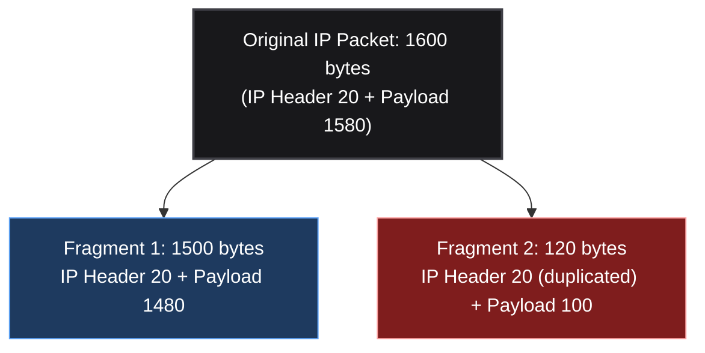
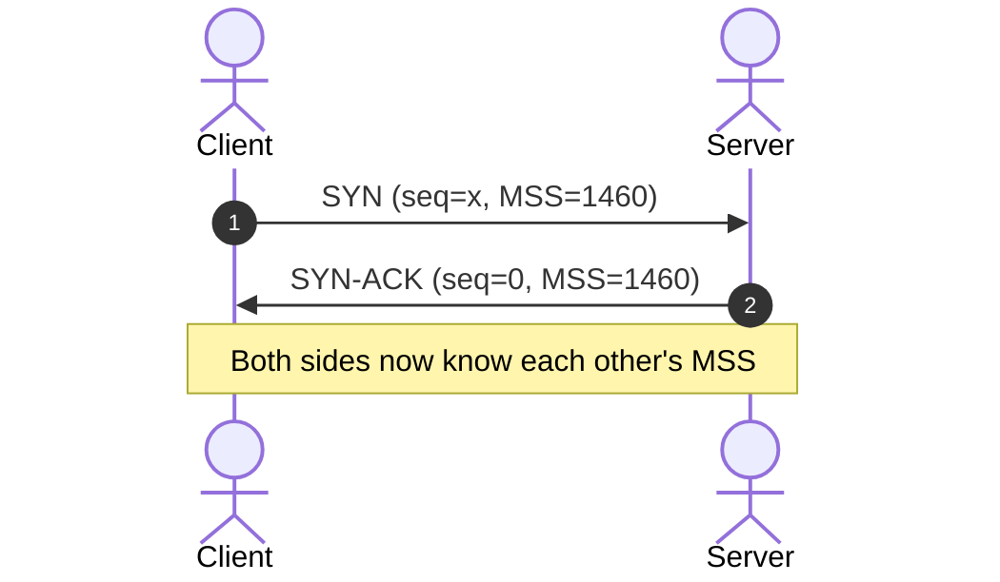
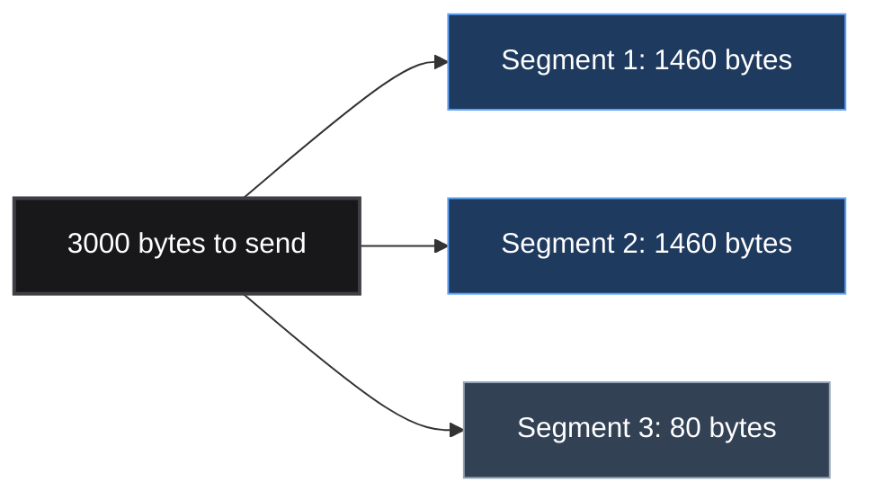
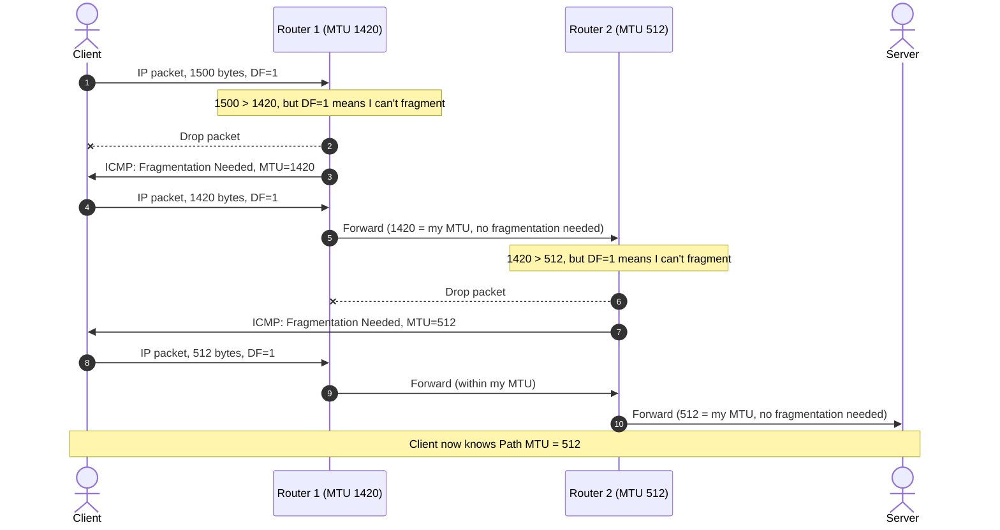

*Video Reference:* [YouTube](https://www.youtube.com/watch?v=18-nbrEEU9o)

In the [previous post](/networking/ch19-anatomy-of-a-tcp-segment), we saw that the TCP Options field can carry an MSS value negotiated during the handshake, but we deferred explaining what MSS actually is. In this post we cover three tightly related ideas: **MTU** (how big a single IP packet can be), **MSS** (how much TCP payload can fit inside that limit), and **Path MTU Discovery** (how a sender figures out the smallest MTU across every hop on the way to its destination).

---

## MTU: Maximum Transmission Unit

The MTU is the **largest IP packet a given link can carry without fragmentation**. Every IP packet we've seen while covering routing consists of an IP header (source IP, destination IP, and other fields) wrapping a payload, which for our purposes is a TCP segment.

<MtuMssDiagram />

The diagram above shows how everything fits together: the **Ethernet frame** (14 bytes) sits outside the picture entirely, the **IP header** (20 bytes) and **TCP header** (20 bytes) come next, and finally the **Data/Payload**. The **MTU spans the IP header, TCP header, and data combined**, while the **MSS covers only the data portion**, which is exactly what the next two sections walk through.

A few things worth nailing down:

* **MTU includes the IP header, the TCP/UDP header, and the data payload combined.** In simple terms: how large can a single IP packet be for a given link?
* You can check your own network's MTU under your Wi-Fi or Ethernet adapter's hardware settings. Most home networks show a **standard MTU of 1500 bytes**.
* **The Ethernet frame header is not part of the MTU.** The 14-byte Ethernet header (source MAC, destination MAC) that gets attached at the [data link layer](/networking/ch10-osi-vs-tcp-ip-model) sits outside this calculation entirely. The 1500 bytes you see refers strictly to the IP packet's size.
* **Different links can have different MTUs.** 1500 is common but not universal. Datacenter interfaces (AWS, Azure) frequently use **jumbo frames** with an MTU of around 9000 bytes, roughly six times larger than a typical home router.

Exceeding the MTU forces the network stack to fragment the packet, and fragmentation, as we'll see next, always costs you extra bytes.

---

## IP Fragmentation

Say your network's MTU is 1500 bytes, but the original IP packet you need to send is **1600 bytes**: a 20-byte IP header plus a 1580-byte TCP segment. Note that the 20-byte IP header only ever carries the **source and destination IP addresses**, ports are a transport-layer concept and never appear there. The 1580-byte "payload" is really the **entire TCP segment**: its own header (which is where the source/destination ports actually live) plus the real application data. From IP's point of view, that whole TCP segment is just an opaque blob it's carrying, it doesn't look inside it at all. Since 1600 exceeds the 1500 MTU, the TCP/IP stack **fragments** the packet into two independent IP packets.

* **Fragment 1** is built to exactly match the MTU: 1500 bytes total, made up of the 20-byte IP header plus 1480 bytes of the original payload (1500 minus the 20-byte header).
* **Fragment 2** carries the remaining 100 bytes of payload (1580 minus the 1480 already used). But since this is now a **standalone IP packet traveling independently**, it needs its own copy of the IP header too, bringing it to 120 bytes.
* Each fragment gets wrapped in its own Ethernet frame with source/destination MAC addresses, so what started as one IP packet arrives as two separate Ethernet frames.

Add up the two fragments: `1500 + 120 = 1620 bytes`, sent over the wire to deliver data that was originally only 1600 bytes. That extra **20 bytes is the duplicated IP header**, required because each fragment must be independently routable and therefore needs its own complete header.

This is exactly why **fragmentation should be avoided wherever possible**: it inflates the amount of data transferred over the network for no benefit. It also has downsides beyond overhead: fragmented traffic is more complex to reassemble correctly and is generally considered less secure. (How a receiver actually detects and reassembles fragments is a detail encoded in the IP header itself, which we'll cover when we dissect IP packet anatomy.)

> **Teardrop attack:** a classic real-world example of fragmentation's security risk, first seen in the wild around 1997.
>
> * Every IP fragment carries a **Fragment Offset** field in its header, telling the receiver exactly where that fragment's data belongs within the original, unfragmented datagram (this is part of the IP header anatomy we'll cover in a future post). Under normal conditions, fragments lay out back-to-back with no gaps and no overlap, Fragment 1 might cover bytes `0-1479`, and Fragment 2 continues cleanly from byte `1480` onward.
> * A Teardrop attacker crafts a **second fragment whose offset lands inside the first fragment's range** instead of continuing after it. For example, Fragment A covers bytes `0-35`, but the malicious Fragment B claims an offset of `24` with only `4` bytes of data (bytes `24-27`), well before Fragment A has even finished.
> * Vulnerable reassembly code (Windows 3.1/95/NT, and Linux kernels prior to `2.0.32`/`2.1.63`) computed how many bytes of the new fragment to copy as roughly `new_offset − (previous_offset + previous_length)`. With overlapping fragments like the example above, that subtraction goes **negative**. When that negative result got cast to an unsigned integer for the actual memory copy, it wrapped around into an enormous positive value, and the reassembly routine tried to copy a huge, out-of-bounds chunk of memory.
> * The result was a **kernel-level crash**: a Blue Screen of Death on Windows, or a kernel panic/hang on affected Linux boxes, triggered by sending just a couple of tiny, malformed UDP fragments. It's a pure **denial-of-service** exploit, no code execution and no data theft, just a crafted offset value that broke an assumption the reassembly code never validated.
> * The fix was conceptually simple once the bug was understood: **validate fragment offsets and lengths before trusting them**, and reject or discard fragments that overlap instead of blindly subtracting. Modern OS kernels and firewalls now detect and drop overlapping/invalid fragments outright, which is why Teardrop itself no longer works against current systems, but the underlying lesson (never trust attacker-controlled offset math in reassembly logic) still shapes how fragment handling is written today.

---

## MSS: Maximum Segment Size

MSS solves the fragmentation problem from the TCP side, by making sure segments are built to fit inside the MTU in the first place.

* **MSS is a TCP-only concept.** A "segment" is specifically TCP's data unit, so MSS has no equivalent for UDP or ICMP.
* **Definition:** the maximum amount of TCP payload data that fits inside a single segment, excluding the segment's own header.

Going back to the MTU/MSS diagram above: with a 1500-byte MTU, a 20-byte IP header, and a 20-byte TCP header, the Data/Payload block, the MSS, works out to:

**MSS = MTU − IP Header − TCP Header**

With the standard values (1500 MTU, 20-byte IP header, 20-byte TCP header at minimum): `1500 − 20 − 20 = 1460 bytes`. This is why **1460 is the standard Ethernet MSS** you'll see quoted almost everywhere.

### How MSS is exchanged

MSS is **advertised during the TCP 3-way handshake**, carried inside the segment's Options field (the same field we saw in the [TCP segment anatomy post](/networking/ch19-anatomy-of-a-tcp-segment)). There's no dedicated fixed header slot for it; it rides along in Options alongside the initial sequence number and window size.

### Why MSS prevents fragmentation

Once each side knows the other's MSS, TCP chunks outgoing data into segments that respect it. Say a client needs to send **3000 bytes** of data and it knows the server's MSS is 1460:

TCP builds two full 1460-byte segments (1460 + 1460 = 2920 bytes) and a final 80-byte segment for the remainder. Once the TCP header (20 bytes) and IP header (20 bytes) are added to a 1460-byte data segment, the resulting IP packet is exactly `1460 + 20 + 20 = 1500 bytes`, which matches the server's MTU precisely. **No fragmentation needed.**

If the client instead ignored MSS and built a 1500-byte data segment, the final IP packet would come out to `1500 + 20 + 20 = 1540 bytes`, exceeding the 1500 MTU and forcing fragmentation into two packets, exactly the wasteful scenario from the previous section. This is the entire point of MSS: it lets TCP construct segments that, once wrapped in IP and TCP headers, land exactly at the MTU instead of spilling over it.

---

## PMTUD: Path MTU Discovery

MSS solves the problem between a client and a server directly, but data doesn't travel from client to server in a single hop. It passes through **multiple routers**, and each router along the path can have its **own MTU**. If any router in the middle has a smaller MTU than what the client assumed, fragmentation still happens, just further down the path.

### The problem

If the client sends a 1500-byte IP packet, Router 1 (MTU 1420) fragments it into a 1420-byte piece and a smaller remainder. Router 2 (MTU 512) then finds that even the 1420-byte fragment exceeds *its* MTU, and fragments it again. A single packet the client sent ends up arriving at the server broken into **three separate fragments**, having crossed only two intermediate routers.

The fix isn't to guess: it's to **discover the smallest MTU along the entire path** (the "Path MTU") up front, and size every packet to fit it from the start.

### The mechanism: the Don't Fragment (DF) flag

The IP header contains a single-bit flag called **DF (Don't Fragment)**. When a sender sets `DF = 1` on a packet, it's telling every router along the path: "you are not allowed to fragment this packet." If a router's MTU is smaller than the packet and DF is set, the router **cannot fragment it, so it drops the packet instead** and notifies the sender via an **ICMP "Fragmentation Needed" message** containing its own MTU.

Walking through it:

1. The client starts with its own standard MTU (1500 bytes) and sets `DF = 1`.
2. Router 1's MTU (1420) is smaller than the packet, so it drops the packet and sends back an ICMP message reporting its MTU of 1420.
3. The client rebuilds the packet at exactly 1420 bytes and resends. Router 1 now forwards it without issue, but Router 2's MTU (512) is smaller still, so Router 2 drops it and reports its MTU of 512.
4. The client rebuilds the packet at 512 bytes. This time it passes through both routers cleanly and reaches the server without a single fragmentation along the way.

From this point on, the client knows the **Path MTU is 512 bytes** and sizes all further packets to that value, avoiding fragmentation for the rest of the connection.

This is also why fragmentation is treated as something to actively avoid: it's not just wasted bytes, IP fragmentation is also considered a weaker point from a security standpoint, since reassembly logic has historically been a source of vulnerabilities. Knowing the Path MTU up front sidesteps all of that.

---

## Summary

* **MTU (Maximum Transmission Unit)**: the largest IP packet a link can carry without fragmentation. Includes the IP header, TCP/UDP header, and data combined, but excludes the Ethernet frame header. Commonly 1500 bytes on home networks, though datacenter jumbo frames can reach ~9000 bytes.
* **IP Fragmentation** happens when a packet exceeds a link's MTU. The stack splits it into multiple independent IP packets, each needing its own copy of the IP header, which increases total bytes transferred over the wire. Should be avoided whenever possible.
* **MSS (Maximum Segment Size)**: a TCP-only concept, the maximum TCP payload that fits in a single segment. Calculated as `MTU − IP Header (20) − TCP Header (20)`, giving the standard value of **1460 bytes**. Exchanged in the Options field during the 3-way handshake, and used by TCP to build segments that land exactly at the MTU once headers are added, preventing fragmentation.
* **Path MTU Discovery (PMTUD)**: since every router along a path can have a different MTU, PMTUD finds the **smallest MTU across the entire path** by sending packets with the **DF (Don't Fragment)** flag set. Routers that can't forward an oversized packet drop it and reply with an ICMP "Fragmentation Needed" message containing their MTU. The sender keeps shrinking the packet and retrying until it reaches the destination without any fragmentation.
