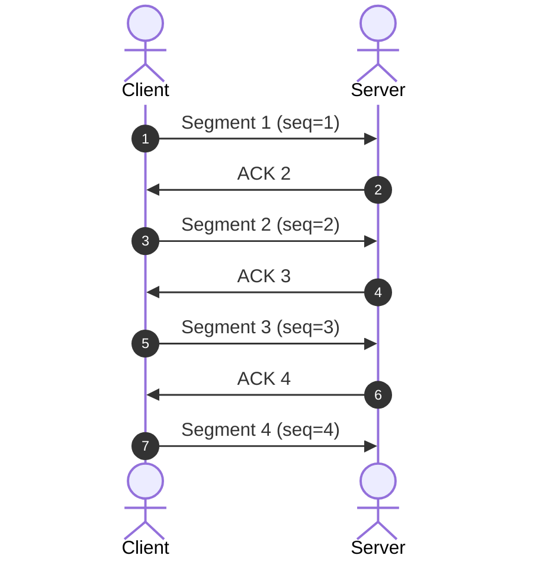
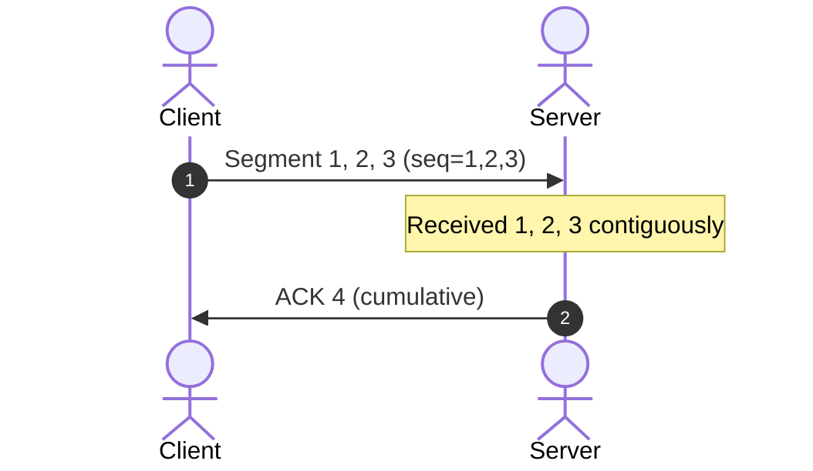
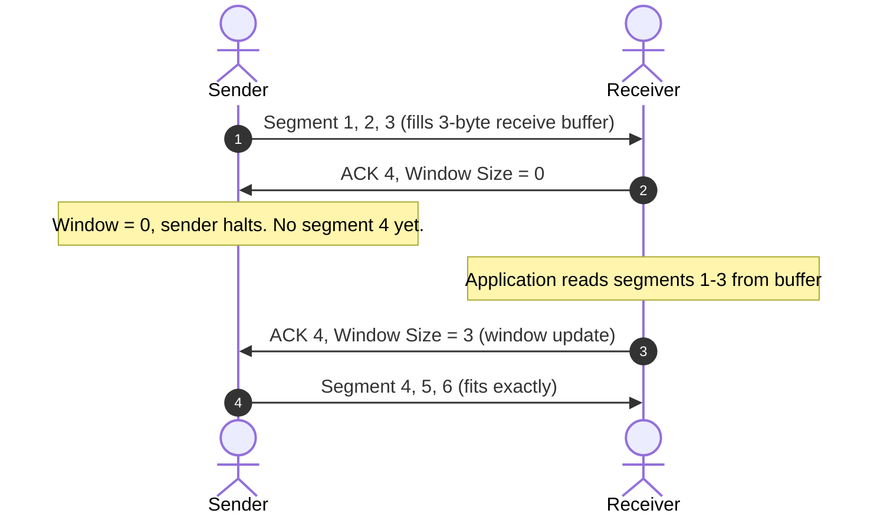
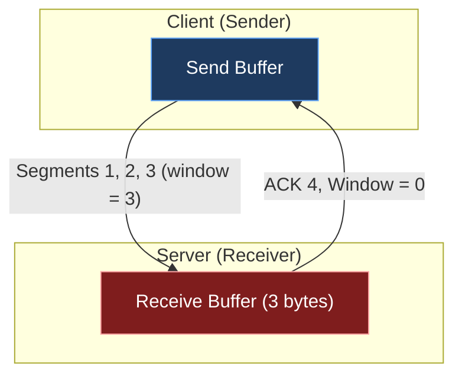

*Video Reference:* [YouTube](https://www.youtube.com/watch?v=PL_6aNL_KqY)

When we dissected the [TCP segment header](/networking/ch19-anatomy-of-a-tcp-segment), we ran into the 2-byte **Window Size** field and deferred explaining it until we covered **Flow Control**. This post is that deferred explanation: what flow control actually does, how the receive buffer and Window Size work together to enforce it, how the sliding window keeps data moving, and why a 16-bit field eventually needed **Window Scaling** to stay useful on modern networks.

---

## Stop-and-Wait: the naive approach

Before flow control, it's worth understanding the simplest possible way to send data reliably, since flow control is built to fix its biggest weakness.

Say a client wants to send 4 segments to a server, each carrying exactly 1 byte, numbered by their [sequence number](/networking/ch18-tcp-sequence-and-acknowledgment-numbers): segment 1, 2, 3, 4.

**Stop-and-Wait** does exactly what it says: send one segment, wait for its acknowledgment, only then send the next one. Segment 2 doesn't leave the client until ACK 2 (acknowledging segment 1) arrives; segment 3 waits for ACK 3, and so on.

> **Note:** For simplicity, this example assumes Stop-and-Wait-style behavior purely to illustrate the problem it creates. In reality, TCP does not use the Stop-and-Wait protocol, not even for the very first segment; it always uses a **Sliding Window**, which we'll cover later in this post.

This is simple to reason about and still shows up in small embedded systems, but it's unusable at any real scale. Say you need to send a 2 GB file in 1 KB segments: waiting for an acknowledgment after every single segment before sending the next means the total transfer time balloons, since each segment costs a full round trip on its own. Stop-and-Wait sends exactly one segment "in flight" at a time, and that's the problem flow control needs to solve differently.

---

## Cumulative acknowledgments

The first improvement: instead of sending one segment at a time, why not send several at once and acknowledge them together?

TCP supports this through **cumulative ACKs**. If the client sends segments 1, 2, and 3 together, the server, once it has received all three, can reply with a single ACK that acknowledges the highest sequence number it has seen contiguously, telling the sender "I have everything up through segment 3, send me segment 4 next."

Compare the round trips: Stop-and-Wait took **3 round trips** to move 3 segments (send, wait, send, wait, send, wait). Sending them together and getting one cumulative ACK back moves the same 3 segments in **a single round trip**. That's an immediate improvement, but it raises a new question: how did the client decide to send exactly 3 segments, and not 2, or 10? That decision is exactly what flow control governs.

---

## What flow control actually solves

Flow control answers two closely related questions:

1. **How much data can the receiver handle** at a time?
2. **How much data should the sender send** at a time?

If the sender knows the answer to the first question, the second follows automatically. Flow control is the mechanism that **prevents a sender from sending more data than a receiver can handle**, so that whatever segments arrive don't overwhelm the receiver and get silently dropped.

To see why this matters, picture a receiver that can only handle 3 bytes at a time. If the sender pushes a 4th byte alongside the first 3 without knowing that limit, that 4th byte simply gets dropped: not because anything went wrong on the wire, but because the sender never had visibility into the receiver's capacity. That mechanism, the piece that keeps a sender aware of the receiver's limits, is TCP's flow control.

---

## The receive buffer and Window Size

Every TCP segment that arrives over the network has to land somewhere before the application actually consumes it. That landing spot is the **receive buffer**: a fixed, finite chunk of memory assigned to catch incoming segments before, say, an Express server running on port 8000 reads them out.

The **Window Size** is nothing but the *available free space* in that receive buffer at any given moment.

Walking through a worked example, assume the receive buffer is exactly 3 bytes and each segment carries 1 byte of data:

1. **Sender transmits segments 1, 2, 3** (3 bytes total). They land in the receive buffer, filling it exactly.
2. **Without flow control**, if the sender also sends segment 4 before the buffer is read by the application, segment 4 has nowhere to land and is **dropped**, since the buffer is already full.
3. **With flow control**, the receiver's ACK for segments 1–3 carries its current Window Size alongside the acknowledgment number:

The `Window Size = 0` in that first ACK is the critical part: it tells the sender "you're acknowledged up through segment 3, but I have zero free space right now, do not send segment 4." The sender holds off entirely. Only once the application reads segments 1–3 out of the buffer does the receiver send a **window update**, an ACK carrying the same acknowledgment number but a refreshed, non-zero Window Size, at which point the sender resumes.

This is also why the Window Size is a moving target rather than a fixed number. Continuing the example: after the sender transmits segments 4, 5, and 6 (filling the buffer again), suppose the application only consumes segments 4 and 5, leaving segment 6 still sitting in the buffer. The next ACK reflects exactly that:

* Acknowledgment number: **7** (segments 4, 5, 6 were all received)
* Window Size: **2** (only 2 bytes of free space, since segment 6 hasn't been read yet)

The sender, now knowing the window shrank to 2 bytes, sends only 2 segments (say, 7 and 8) instead of 3, and they land exactly within the receiver's available space. **Window Size dictates precisely how much the sender is allowed to send**, and it changes on every ACK based on how fast the application is actually draining the buffer, not on how much room existed when the connection started.

---

## Where the initial Window Size comes from

The very first Window Size either side sees is exchanged during the **[TCP 3-way handshake](/networking/ch16-tcp-three-way-handshake)**, in the same segments that carry the initial sequence number and MSS. Since TCP is **bidirectional**, both the client and the server maintain their own receive buffer and advertise their own Window Size: a client sending a request to a server can just as easily become a receiver once the server starts sending data back. That's why both sides share their Window Size during the handshake, alongside MSS and the initial sequence number, all inside the segment's Options field.

---

## Sliding window: growing and shrinking

Put together, the receiver's Window Size defines a **sliding window** on the sender's side: a span of sequence numbers the sender is currently allowed to transmit. Each side maintains a **send buffer**, holding data that's prepared and ready to go out, mirroring the receiver's buffer on the other end.

The pattern from the worked example above repeats continuously for the life of the connection:

* The server starts with an initial Window Size of 3 bytes (its receive buffer is empty), so the sliding window spans segments 1–3.
* The sender transmits everything inside the current window, then waits.
* As the receiver's application consumes data and the window updates, either **growing back** (more space freed up) or **shrinking** (partially consumed), the sender's window slides forward to cover the next unsent segments and resizes to match.
* If the window ever drops to 0, the sender halts entirely until a window update arrives.

TCP itself doesn't need to reason about *why* the window grows or shrinks: it just keeps sliding and resizing the window based on whatever the latest ACK reports, and that alone is enough to keep the sender from ever overwhelming the receiver. This continuous grow-and-shrink cycle, driven entirely by ACKs carrying updated Window Size values, **is** the sliding window mechanism, and it's what makes flow control practical rather than theoretical.

---

## The 16-bit Window Size limitation

The Window Size field in the TCP header is only **16 bits** wide. The largest number representable in 16 bits is:

**2¹⁶ − 1 = 65,535 bytes**, roughly **64 KB**.

That's a hard ceiling: no matter how large a receiver's actual receive buffer is, the Window Size field can never advertise more than about 64 KB to the other side.

This was a reasonable limit decades ago, but modern machines routinely have 16 GB, 32 GB, or 64 GB of RAM, easily enough to assign a receive buffer of 16 MB or more. A 16-bit field simply can't express that.

To see the real cost of this ceiling, consider sending a 2 GB file with a round-trip time (RTT) of 1 second, assuming the sender ships one full window's worth of data, then waits a full RTT for the acknowledgment before sending the next window:

* Effective throughput, capped at the 64 KB window: **65,535 bytes/second**
* Time to send 2,000,000,000 bytes: `2,000,000,000 ÷ 65,535 ≈ 30,517 seconds`, or roughly **8.5 hours**

That's clearly not how fast modern networks actually transfer multi-gigabyte files, and the 16-bit Window Size field is exactly why the naive number looks that bad.

---

## Window Scaling

**Window Scaling** exists specifically to work around the 16-bit ceiling on the Window Size field, without changing the field itself.

Alongside the regular Window Size, a host can send one additional value during the handshake: the **Window Scaling factor**, a number between **0 and 14**. The receiving side then computes the *actual* window using:

**Actual Window Size = Window Size × 2^(Window Scaling factor)**

So if a receiver's real receive buffer is 16 MB, it still advertises the maximum it can fit in the 16-bit field, 65,535 bytes, but pairs it with a scaling factor of, say, 8. The sender then computes the real value instead of taking the raw field at face value:

`65,535 × 2⁸ = 65,535 × 256 ≈ 16,776,960 bytes ≈ 16 MB`

Redoing the earlier transfer-time calculation with this actual window instead of the raw 64 KB:

* Effective throughput: **≈ 16,776,960 bytes/second**
* Time to send 2,000,000,000 bytes: `2,000,000,000 ÷ 16,776,960 ≈ 119 seconds`, close to **2 minutes**

The same 2 GB file that would have taken 8.5 hours at the raw 64 KB window size transfers in about 2 minutes once Window Scaling is accounted for. The scaling factor doesn't change what fits in the 16-bit field on the wire; it just tells the other side to treat that number as a multiplier's base rather than the literal byte count.

A few details worth keeping straight:

* **Window Scaling is negotiated during the 3-way handshake**, carried in the segment's **Options field**, the same place MSS and other extensions live, since there's no dedicated fixed slot for it in the base header.
* It's just a multiplier: a value from 0 to 14 that both sides agree on once, at connection setup.
* Tools like Wireshark show you the *calculated* actual window size directly, based on this factor, when inspecting a TCP stream.

---

## Summary

* **Stop-and-Wait** sends one segment, waits for its acknowledgment, then sends the next. It's simple but far too slow for any real transfer, since every segment costs a full round trip.
* **Cumulative ACKs** let a receiver acknowledge several contiguously received segments with a single ACK, cutting round trips dramatically compared to Stop-and-Wait.
* **Flow control** prevents a sender from transmitting more data than a receiver can handle, avoiding dropped segments from an overwhelmed receiver.
* The **receive buffer** is where incoming segments land before the application reads them; **Window Size** is the free space currently available in that buffer, and it's carried in every ACK.
* The **sliding window** is the practical mechanism built on top of Window Size: the sender's allowed span of unsent data grows and shrinks with every ACK, based purely on how fast the receiver's application drains its buffer.
* Initial Window Size (like MSS and the initial sequence number) is exchanged during the **3-way handshake**, and since TCP is bidirectional, both sides advertise their own.
* The **Window Size field is only 16 bits**, capping it at 65,535 bytes (~64 KB), a serious bottleneck against modern multi-megabyte receive buffers.
* **Window Scaling** solves this by negotiating a multiplier (0–14) during the handshake: `Actual Window Size = Window Size × 2^(scaling factor)`, letting a 64 KB field represent windows in the tens of megabytes without changing the header format itself.
