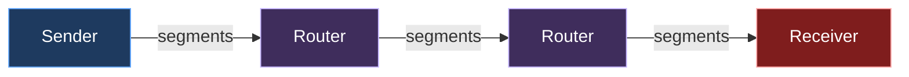
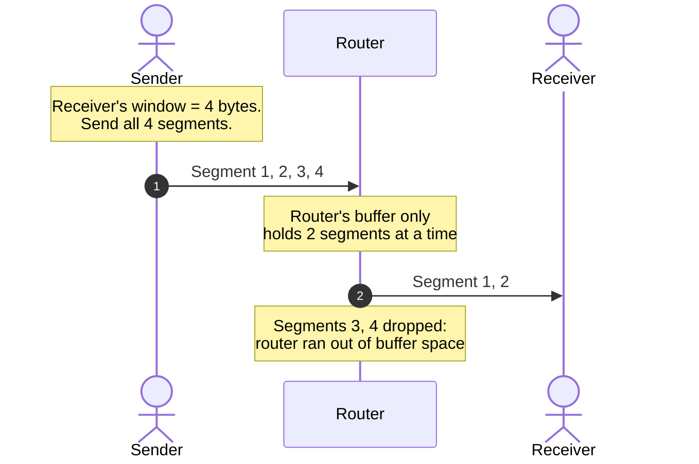
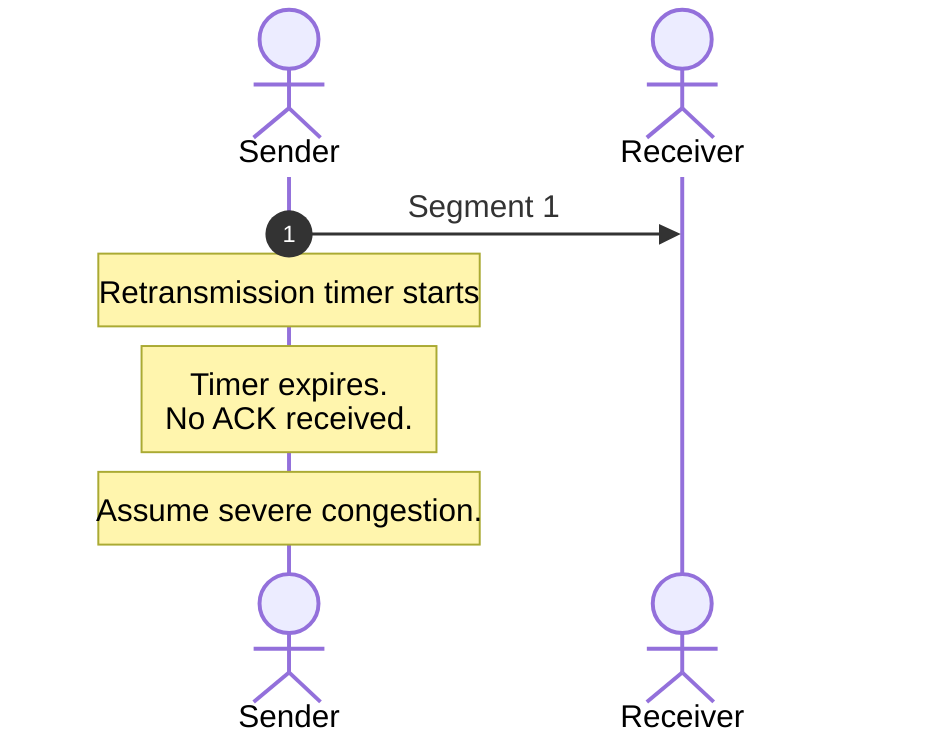
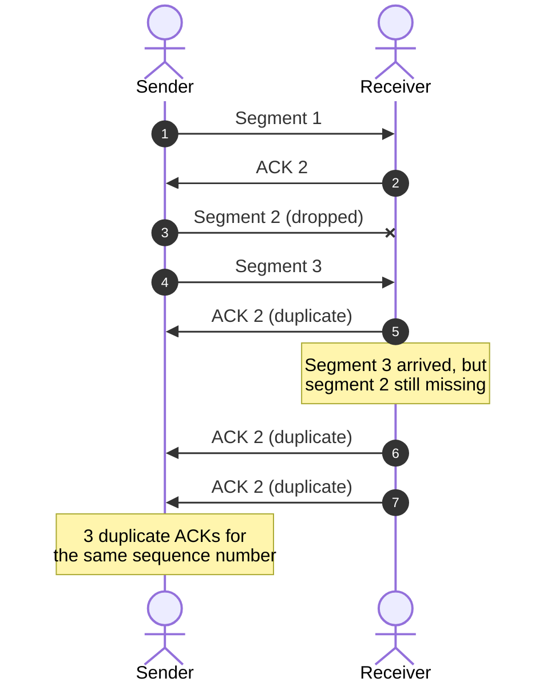
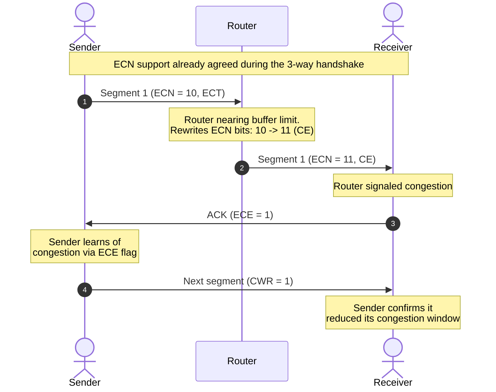

*Video Reference:* [YouTube](https://www.youtube.com/watch?v=B3JwzcPTZDw)

When we [dissected the TCP segment header](/networking/ch19-anatomy-of-a-tcp-segment), we ran into the **CWR** and **ECE** flags and deferred a proper explanation to a dedicated post. This is that post. It's also the natural follow-up to [TCP Flow Control](/networking/ch21-tcp-flow-control-window-size-and-window-scaling): flow control and congestion control are frequently confused for the same mechanism, but they protect two entirely different things.

---

## Flow control vs. congestion control

**Flow control** makes sure a sender never overwhelms the *receiver*. It's governed by the receiver's advertised Window Size, which reflects how much free space is left in the receiver's receive buffer.

**Congestion control** makes sure a sender never overwhelms the *network* sitting between sender and receiver, the routers and links a segment has to hop across to get there.

The sender and receiver are usually different machines, possibly a laptop talking to a server on AWS, connected only by the internet in between: a chain of routers, each with its own limited memory. Flow control has no visibility into any of that. It only knows about the receive buffer at the far end. Congestion control exists specifically to protect that in-between path, the routers, from being overloaded, independently of whether the receiver itself has plenty of room.

---

## Why the receiver being fine isn't enough

For the examples in this post, assume the same simplifications used in the [flow control post](/networking/ch21-tcp-flow-control-window-size-and-window-scaling): one segment carries exactly 1 byte (1 MSS = 1 byte, instead of the usual 1460 bytes covered in [MTU, MSS, and Path MTU Discovery](/networking/ch20-mtu-mss-and-path-mtu-discovery)), the round-trip time (RTT) is 1 second, and for simplicity, every segment gets its own individual ACK rather than a cumulative one.

Say the receiver has advertised a Window Size of 4 bytes, meaning it can accept 4 segments at once. Based purely on flow control, the sender ships all 4 segments in one shot:

The receiver never even sees segments 3 and 4. Nothing is wrong with the receiver, it has plenty of room, but a router in the middle only had buffer space for 2 segments at that instant and silently dropped the rest. This is exactly the gap flow control can't see and congestion control exists to close: the sender's window can't depend on the receiver's capacity alone, it also has to account for how much the network in between can carry.

---

## The congestion window

To account for the network's capacity, TCP maintains a second value alongside the receiver's advertised window: the **congestion window (cwnd)**. It represents, as best TCP can estimate, how much data the network path can currently carry without overloading a router along the way.

The sender's actual window is never based on the receiver's window alone:

**Sender's Window = min(Receiver's Window, Congestion Window)**

In the example above, the receiver's window was 4 bytes but the network could only handle 2. Sending `min(4, 2) = 2` bytes at a time would have avoided the drop entirely.

The receiver's window is easy to know: the receiver states it explicitly, during the [3-way handshake](/networking/ch16-tcp-three-way-handshake) and in every subsequent ACK. The congestion window is not so simple. Nobody tells the sender how much a router's buffer can hold, and with potentially hundreds of routers between sender and receiver, there's no one to ask. TCP has to *estimate* the congestion window through trial and error: send some data, watch what happens, and adjust. That estimation is exactly what **Slow Start** and **Congestion Avoidance** do.

---

## TCP Slow Start

Slow Start is the first of the two algorithms TCP uses to grow the congestion window. Despite the name, it isn't slow for long: it starts from a small, conservative value and then grows the congestion window **exponentially**, roughly doubling it every round trip, for as long as segments keep getting acknowledged successfully.

The rule: **on every ACK received, cwnd += 1 MSS.**

Walking through it with the same 1-byte-segment, 1-second-RTT assumptions:

| Round trip | cwnd at start | ACKs received | cwnd after (+1 MSS per ACK) |
|---|---|---|---|
| 1 | 1 | 1 | 1 + 1 = 2 |
| 2 | 2 | 2 | 2 + 2 = 4 |
| 3 | 4 | 4 | 4 + 4 = 8 |
| 4 | 8 | 8 | 8 + 8 = 16 |
| 5 | 16 | 16 | 16 + 16 = 32 |
| 6 | 32 | 32 | 32 + 32 = 64 |
| 7 | 64 | 64 | 64 + 64 = 128 |

TCP starts by *assuming* cwnd = 1 MSS and sends a single segment. Its ACK arrives, so cwnd is incremented by 1, becoming 2. The sender now sends 2 segments; both get acknowledged, so cwnd gets +1 for each ACK, becoming 4. Send 4, get 4 ACKs, cwnd becomes 8. The pattern keeps doubling every round trip, exactly because each of the N segments sent in a round trip earns its own +1 MSS on cwnd, adding up to +N, which doubles the previous value.

This exponential climb can't continue forever, or the network would eventually get flooded. TCP needs to know where to back off, and that's the job of the **slow start threshold**.

---

## Slow start threshold (ssthresh)

`ssthresh` (also written `SS Thresh`) is a variable, measured in the same units as cwnd (bytes, or MSS-equivalent), that tells TCP when to stop being aggressive. Once cwnd reaches `ssthresh`, **TCP switches algorithms** from Slow Start to Congestion Avoidance.

Continuing the example with `ssthresh = 128 bytes`: cwnd climbs 1 → 2 → 4 → 8 → 16 → 32 → 64 → 128, and the moment it hits 128, TCP stops using Slow Start's exponential growth and switches to Congestion Avoidance's much gentler growth instead.

---

## TCP Congestion Avoidance

Where Slow Start doubles cwnd every round trip, Congestion Avoidance grows it **linearly**, by a much smaller amount per ACK:

**On every ACK received: cwnd += 1 / cwnd**

With cwnd starting at 128 (having just switched over from Slow Start), and 128 total segments in flight, each getting its own ACK:

| ACK # | cwnd before | cwnd += 1/cwnd | cwnd after |
|---|---|---|---|
| 1st | 128 | + 1/128 | 128.0078 |
| 2nd | 128.0078 | + 1/128 | 128.015 |
| 32nd | ~128.23 | + 1/128 | 128.25 |
| 64th | ~128.48 | + 1/128 | 128.5 |
| 128th | ~128.99 | + 1/128 | **129** |

> **Note:** TCP can only ever send whole bytes/segments, never a fractional one, so `cwnd` values like `128.015` aren't literally usable as-is. In real implementations, cwnd is tracked internally as a byte count plus an accumulating fraction; the sender only gains one additional MSS of sending capacity once that internal fraction has accumulated enough to round up to a full segment. The fractional values above are the conceptual math behind that gradual growth, not bytes TCP actually puts on the wire.

It takes all 128 ACKs, a full round trip's worth of acknowledgments, for cwnd to climb by just 1 MSS, from 128 to 129. Compare that to what Slow Start would have done with the same 128 ACKs in one round trip: `cwnd + 128 = 256`, almost double. That contrast is the entire point of Congestion Avoidance: it deliberately trades speed for caution once the network is already carrying a substantial load, growing the window "just enough" to probe for more capacity without aggressively flooding the path.

TCP uses both algorithms, just at different times: Slow Start to ramp up quickly from a cold start, then Congestion Avoidance to creep upward more carefully once there's real traffic to be careful about. Plotting cwnd against round trips makes the handoff obvious: a sharp exponential curve up to `ssthresh`, followed by a near-flat linear climb after it.

Everything up to `RTT 7`, where the blue cwnd curve meets the dotted `ssthresh` line, is Slow Start's exponential doubling; the crawl from 128 to 129 that takes an entire additional round trip is Congestion Avoidance already taking over.

---

## Detecting congestion

Congestion window keeps growing, via Slow Start then Congestion Avoidance, until the sender actually experiences congestion. TCP has three ways to detect that:

### 1. Retransmission timeout (RTO)

Every time the sender transmits a segment, it starts a timer. If the ACK for that segment doesn't arrive before the timer expires, TCP assumes the segment was dropped somewhere along the network path due to congestion.

TCP treats a timeout as a **strong** indication of congestion: a serious problem, not a minor blip.

### 2. Triple duplicate ACKs

Say the sender transmits segments 1, 2, and 3, but segment 2 is dropped in transit while 1 and 3 arrive fine. The receiver has segment 1, is missing segment 2, and now has segment 3 sitting out of order. Every time it gets another out-of-order segment, it re-sends the same ACK, requesting segment 2 again.

Three duplicate ACKs for the same sequence number tells the sender that one specific segment likely got lost due to congestion, but everything else is still getting through fine. TCP treats this as a **milder** signal than a timeout: annoying, but not catastrophic.

### 3. Explicit Congestion Notification (ECN)

Both of the above only fire *after* a packet is already lost. ECN lets a router warn about congestion **before** it starts dropping anything, by marking a packet instead of dropping it.

Every IP packet header carries a 2-bit ECN field (part of the same byte that used to be called Type of Service), and those 2 bits hold one of four values:

| Bits | Name | Meaning |
|---|---|---|
| `00` | Not-ECT | Sender doesn't support ECN; a congested router has no option but to drop |
| `10` | ECT(0) | Sender supports ECN: "mark me instead of dropping me if you need to" |
| `01` | ECT(1) | Same as ECT(0), a second codepoint reserved for experimental use |
| `11` | CE (Congestion Experienced) | A router along the path marked this packet because it's nearing its buffer limit |

A packet doesn't start out life at `11`. It starts as `00`, unless the sender and receiver both support ECN, in which case the sender marks its outgoing packets `ECT(0)` (`10`) instead. That support isn't assumed, it's **negotiated during the [3-way handshake](/networking/ch16-tcp-three-way-handshake)**, where the SYN and SYN-ACK segments carry the ECE and CWR flags with special handshake-only meanings, each side essentially declaring "I support ECN" before any data flows. Only an ECT-marked packet is eligible to be marked instead of dropped; a router facing congestion from Not-ECT traffic still has to drop it the old-fashioned way.

The router can only talk to whichever host it's forwarding toward, so it rewrites the packet heading to the receiver, not the sender. But congestion control is entirely the sender's responsibility, so the receiver needs a way to relay that warning back. That's what the **ECE** (ECN-Echo) flag does, this time in its data-transfer meaning rather than its handshake one: the receiver sets `ECE = 1` on its next ACK back to the sender. Once the sender sees `ECE = 1`, it reduces its congestion window as a precaution and replies with **CWR** (Congestion Window Reduced) set to 1, confirming to the receiver, "acknowledged, I've already reduced my window." Since the network never actually dropped anything, no retransmission is needed at all, TCP simply reacts to the warning as if it had detected mild congestion on its own.

---

## How cwnd and ssthresh react to each detection method

All three detection methods reduce `cwnd` and update `ssthresh`, but by different amounts, because they represent different severities of congestion.

### Triple duplicate ACK / ECN: back off, don't restart

Say cwnd had grown to 800 bytes (still using the 1-byte-segment simplification, so this means 800 MSS-equivalents) when a triple duplicate ACK or an ECN warning arrives:

* **New ssthresh = current cwnd / 2** → `800 / 2 = 400`
* **New cwnd = current cwnd / 2** → `800 / 2 = 400`

Because this isn't a severe problem, just one lost segment or an early warning, TCP doesn't restart from scratch. It halves cwnd, sets the new ssthresh to that same halved value, and **skips Slow Start entirely**, continuing directly with Congestion Avoidance from 400. For the ECN case specifically, the sender also sends `CWR = 1` on its next outgoing segment to confirm the reduction back to the receiver.

The dotted `ssthresh` line steps from its original 128 up to the recalculated 400 the moment congestion hits. Notice the shape: cwnd only drops halfway, to 400, and immediately resumes climbing from there with Congestion Avoidance's gentle linear growth. It never touches Slow Start again.

### Retransmission timeout: start over

If instead that same 800-byte congestion window experiences a **timeout**:

* **New ssthresh = current cwnd / 2** → `800 / 2 = 400` (identical to the duplicate-ACK case)
* **New cwnd = 1 MSS** → dropped all the way back down, not just halved

A timeout is treated as a serious problem, so TCP doesn't just back off, it restarts from the very beginning with **Slow Start**, climbing exponentially again from cwnd = 1. The difference from a fresh connection is that `ssthresh` is no longer at its original value, it's now 400, so this time Slow Start only runs until cwnd reaches 400 (instead of the original 128) before switching over to Congestion Avoidance.

> **Note:** The new `ssthresh` isn't always lower than the old one, it's simply `cwnd / 2` at the moment congestion is detected, so whether it ends up higher or lower than the previous `ssthresh` depends entirely on how large `cwnd` had grown by that point. In this walkthrough, the original `ssthresh` was deliberately set low (128 MSS) for the sake of demonstrating the Slow Start -> Congestion Avoidance switch early. Congestion didn't actually hit until `cwnd` had climbed to 800 MSS, well past that original threshold, so the recalculated `ssthresh` (400) ends up *higher* than the original 128, not lower.

The dotted `ssthresh` line steps from 128 to 400 the instant the timeout crashes cwnd back to 1. Compare the shape to the triple-duplicate-ACK/ECN case above: cwnd climbs to the same 800 before congestion is detected, but instead of a shallow dip to half, it crashes all the way down to 1 MSS and has to climb the entire exponential Slow Start curve over again, this time stopping at the new ssthresh of 400 (instead of the original 128) before handing off to Congestion Avoidance.

| Detection method | Severity | New ssthresh | New cwnd | Algorithm after |
|---|---|---|---|---|
| Triple duplicate ACK | Mild | cwnd / 2 | cwnd / 2 | Congestion Avoidance (continues) |
| ECN | Mild (proactive) | cwnd / 2 | cwnd / 2 | Congestion Avoidance (continues) |
| Retransmission timeout | Severe | cwnd / 2 | 1 MSS | Slow Start (restarts) |

---

## The sender's window still can't exceed the receiver's

One last detail worth nailing down: since cwnd keeps growing with every successful round of ACKs, could it ever grow *past* the receiver's advertised window? Say the receiver's window is 1000 bytes and, absent any congestion, cwnd climbs all the way to 1001.

**Sender's Window = min(Receiver's Window, Congestion Window) = min(1000, 1001) = 1000**

The sender's window is always the *minimum* of the two, never either one alone. Letting cwnd override the receiver's window would defeat the entire purpose of flow control: the network might well be able to carry 1001 bytes, but the receiver explicitly said it can only handle 1000, and sending past that overwhelms the receiver regardless of what the network could technically deliver.

---

## Summary

* **Flow control** protects the *receiver* from being overwhelmed; **congestion control** protects the *network*, the routers and links between sender and receiver, from being overwhelmed. They're related but solve different problems.
* The **congestion window (cwnd)** represents how much data TCP estimates the network path can currently carry. Unlike the receiver's window, nobody tells the sender this value directly, it has to be estimated through trial and error.
* The **sender's window is always `min(receiver's window, congestion window)`**, never either value alone.
* **TCP Slow Start** grows cwnd exponentially, `cwnd += 1 MSS` per ACK, roughly doubling every round trip, until cwnd reaches the **slow start threshold (ssthresh)**.
* **TCP Congestion Avoidance** takes over once cwnd hits ssthresh, growing cwnd linearly instead, `cwnd += 1/cwnd` per ACK, taking a full round trip's worth of ACKs to add just 1 MSS.
* TCP detects congestion three ways: a **retransmission timeout (RTO)** (severe: an unacknowledged segment likely dropped), **triple duplicate ACKs** (mild: one segment lost, everything else fine), and **ECN** (proactive: a router warns of impending congestion via the IP header's ECN bits, before anything is actually dropped).
* On a **timeout**, TCP halves ssthresh but crashes cwnd all the way down to **1 MSS**, restarting with Slow Start. On a **triple duplicate ACK or ECN signal**, TCP halves both ssthresh and cwnd and continues directly with **Congestion Avoidance**, skipping Slow Start.
* **ECN** uses the IP header's 2-bit ECN field (router → receiver), the TCP **ECE** flag (receiver → sender, "congestion was signaled"), and the TCP **CWR** flag (sender → receiver, "I've reduced my window"), letting TCP react to congestion before any packet loss actually occurs.
