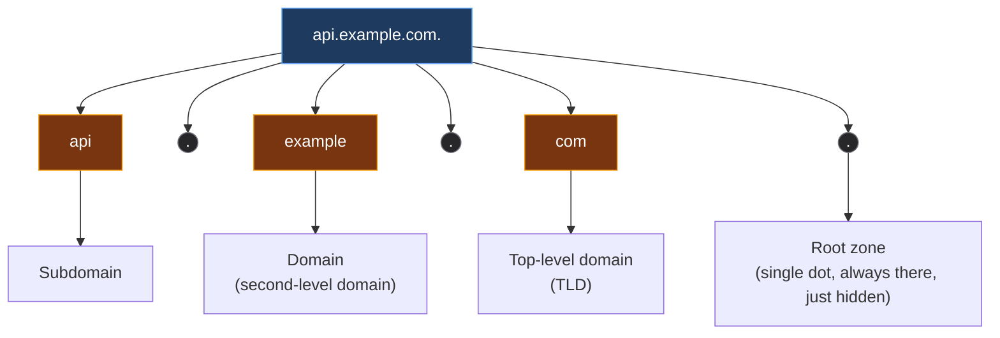
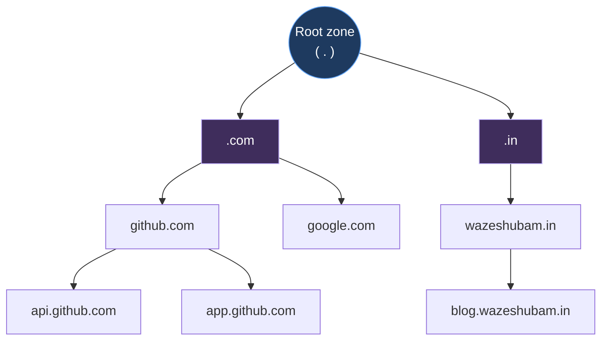
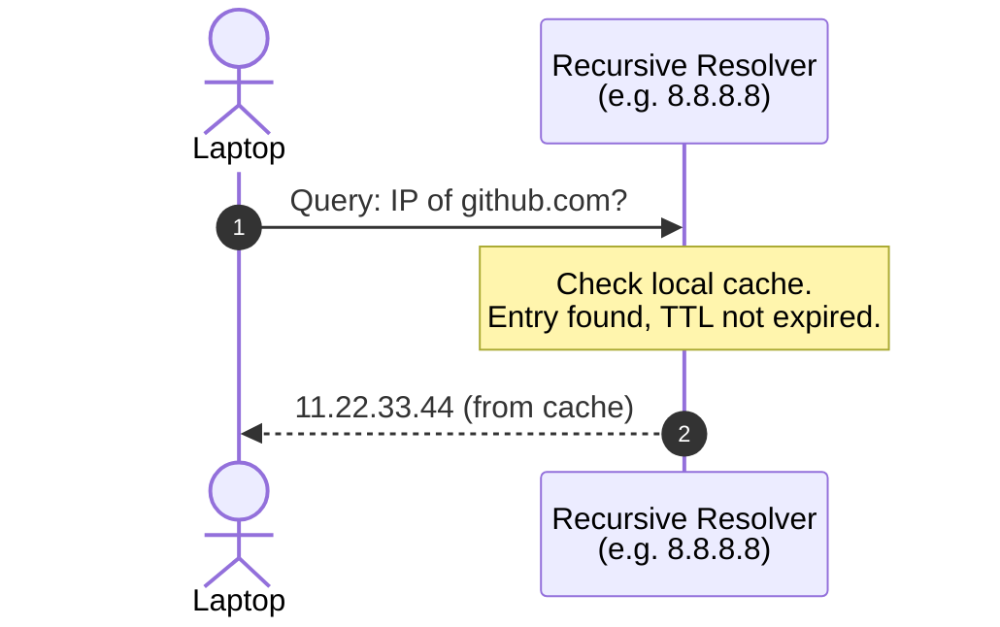
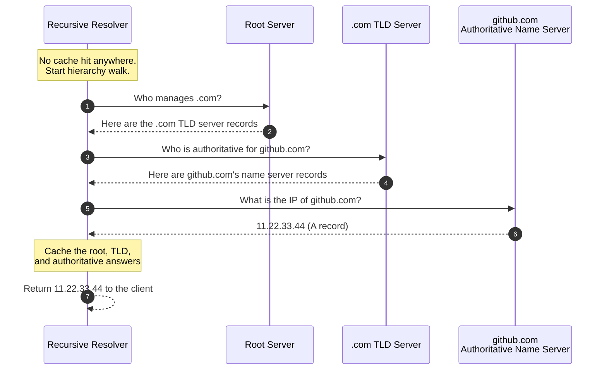

*Video Reference:* [YouTube](https://www.youtube.com/watch?v=pNfNTgEVvQg)

Back in the [UDP post](/networking/ch13-user-datagram-protocol-udp), we used DNS as a worked example to understand UDP itself, why a query-response protocol with no handshake is such a good fit for something that needs to run fast and run often. That post focused on the UDP side of things: two network trips instead of eleven, transaction IDs standing in for reliability. It deliberately left the DNS side alone. This post picks that up: what DNS actually is, what problems it solves, and exactly what happens between typing a domain name and getting an IP address back.

---

## What DNS is and why it exists

Computers only understand IP addresses. They don't understand domain names at all, `github.com` is just an arbitrary string to a computer unless something first turns it into an IP address it can route packets to.

Humans have the opposite problem. You could memorize an IP address or two, but nobody's memorizing the IP addresses of the thousand-odd sites they visit in a given month, and even if you did, there's no guarantee that address doesn't change tomorrow. What you *can* remember is `google.com`, `github.com`, `netflix.com`, names that carry an identity a string of numbers never will.

**DNS (Domain Name System)** is the layer that bridges these two: a mapping from domain names to IP addresses, so humans get to use names and computers still get the IP addresses they actually need. It's one of the oldest and most heavily relied-upon protocols on the internet, and as covered in the UDP post, it runs on **UDP, port 53**.

---

## The problems DNS actually solves

It's tempting to think DNS is just "a phonebook for IPs," but that undersells it. Three separate problems fall out of that one mapping.

### 1. The IP can change while the domain stays the same

Say a server is reachable at some IP, and a **DNS A record** (a record that maps a domain name to an IPv4 address, created manually wherever the domain's DNS is managed, GoDaddy, Netlify, Cloudflare, and so on) points `example.com` at that IP. Every visitor resolves the domain and lands on that server.

Now the server's IP changes. Without DNS, every one of those visitors, all of them, would need to somehow be told the new IP directly. With DNS, none of that is necessary: only the A record itself needs to be updated. The next time anyone resolves `example.com`, they get the new IP automatically. Nobody needs to be individually informed, they just need to ask DNS again (subject to the record's TTL, covered below).

### 2. Directing users to the nearest server (GeoDNS)

A single website is frequently served from multiple locations at once, say Mumbai, London, Australia, and New York. If a user in Mumbai resolves the domain and gets back the IP of the New York server, every request now crosses that entire distance, adding tens of milliseconds of latency it didn't need to.

**GeoDNS** solves this at the resolution step itself: based on where the querying DNS resolver is located, DNS returns the IP of the *nearest* server, Mumbai's server for a Mumbai-based resolver, instead of a distant one. The user never notices any of this happened; they just get a faster response.

### 3. Load balancing

The same mechanism that picks the nearest server can just as easily pick *a* server out of several based on other criteria. That's a basic form of load balancing: DNS won't be as fine-grained as a dedicated load balancer like NGINX, but the capability is there, spreading traffic across multiple IPs behind a single domain.

---

## The structure of a URL

Before getting into how a domain actually gets resolved, it's worth being precise about what a URL is made of, because DNS resolution mirrors this structure exactly.

Take `api.example.com`. Most people read this as three parts, but there's a fourth, hiding as an invisible trailing dot that browsers omit from display:



* **Root zone**: the starting point of the entire hierarchy, represented by a single, usually invisible, trailing dot.
* **Top-level domain (TLD)**: `.com`, `.in`, `.dev`, `.xyz`, and so on, the part right before the (hidden) root dot.
* **Domain (second-level domain)**: `example` in `example.com`, this is effectively the identity, `google`, `netflix`, `github`.
* **Subdomain**: `api` in `api.example.com`, an optional prefix for organizing services under one domain, `app.`, `api.`, `blog.`.

This isn't just notation, it's a real hierarchy: the root zone sits above every TLD, each TLD sits above every domain registered under it, and each domain sits above its own subdomains. DNS resolves a name by walking down exactly this hierarchy, one level at a time, and a separate tier of servers is responsible for each level.



Why split the work up like this at all? Because there are billions of domains on the internet and millions of DNS queries happening every second. Storing every domain's records in one place, one server, one database, simply doesn't scale. Spreading the hierarchy across tiers of servers is what makes DNS resolution fast despite the internet's size: each tier only needs to know about the tier directly below it, never the full picture.

---

## Where a lookup starts: the local cache

The full server-hierarchy walk described below is the *expensive* path, and DNS goes out of its way to avoid it whenever possible. Both your browser and your OS keep their own cache of domain-to-IP mappings. Visit `github.com` a thousand times in a week, and only the very first lookup does any real work: the resulting IP gets cached locally for as long as its **TTL (Time To Live)** says it's valid.

TTL is just a duration, in seconds, attached to a DNS record (A records, AAAA records, and others all carry one) that says how long a resolved value can be trusted before it needs to be looked up again. Once the TTL expires, the cached IP is discarded and the next request has to re-resolve it from scratch.

If the browser or OS cache already has a valid, non-expired entry for the domain, resolution stops right there. No query goes out onto the network at all.

---

## The recursive DNS resolver

If there's no local cache hit, the laptop doesn't talk to the root, TLD, or authoritative servers directly. It sends the query to a **recursive DNS resolver** first, a dedicated server whose whole job is "given a domain name, go find its IP and hand it back to me." This is commonly your router (which is itself usually just forwarding to your ISP's resolver), or a public option like Google's `8.8.8.8` or Cloudflare's `1.1.1.1`.

The resolver keeps its own cache, separate from the browser's and OS's, mapping domains it's already resolved recently to their IPs and TTLs. If `github.com` is sitting in that cache with a TTL that hasn't expired, the resolver just returns it immediately, no further steps needed.



Only when *neither* the local cache nor the resolver's cache has a usable answer does the resolver actually go out and walk the DNS hierarchy.

---

## Walking the hierarchy: root, TLD, and authoritative servers

When the resolver has nothing cached, it works its way down the domain hierarchy one tier at a time, starting from the top.

### Root servers

The resolver already knows the IP addresses of the root servers, they're **pre-configured**. Whoever operates a recursive resolver typically ships it with a "root hints" file containing the names and IPs of the root servers, exactly so the resolution process has somewhere to bootstrap from.

There are **13 root server addresses** (labeled A through M), operated by large organizations like ICANN, NASA, and the US Army, and listed publicly at IANA's [root servers page](https://www.iana.org/domains/root/servers). A root server doesn't know anything about `github.com` specifically. Its only job is knowing which servers are responsible for managing each **TLD**: who runs `.com`, who runs `.in`, who runs `.dev`. Nothing more.

### TLD servers

Armed with the address of the `.com` TLD server (returned by the root server), the resolver asks it directly: "who are the authoritative name servers for `github.com`?" The TLD server doesn't know `github.com`'s IP either, but it does know which name servers are authoritative for it, because whoever registered `github.com` told the TLD registry which name servers to point to.

Different TLDs are managed by entirely different servers: `.com` domains route through different TLD servers than `.in` or `.dev` domains do.

### Authoritative name servers

This is the tier that actually knows the answer. The **authoritative name server** is wherever a domain's DNS records are actually managed, GoDaddy, Netlify, Cloudflare, or any other DNS provider. This is where the A record, AAAA record, MX record, TXT record, and CNAME record for a domain actually live. Once the resolver reaches this tier and asks for `github.com`'s A record, it gets back the real IP address.



Once the resolver has the answer, it caches every step along the way, the root server's referral, the TLD server's referral, and the final authoritative answer, each respecting its own TTL, so the next query for `github.com`, or even just the next query for anything under `.com`, doesn't have to repeat steps it's already done.

---

## Trying it with `nslookup`

`nslookup` is a command-line utility for issuing DNS queries directly, and it makes this whole hierarchy walk visible instead of hidden behind an automatic resolver.

Asking a root server which name servers handle the `.com` TLD:

```bash
nslookup -type=ns com. <root-server-ip>
```

Taking one of the returned `.com` TLD servers and asking it for `github.com`'s authoritative name servers:

```bash
nslookup -type=ns github.com <tld-server-ip>
```

Taking one of *those* authoritative name servers and finally asking for the actual IP:

```bash
nslookup github.com <authoritative-name-server-ip>
```

Each step returns exactly what the hierarchy walk above describes: the root hands back TLD servers, the TLD hands back authoritative servers, and only the authoritative server hands back an actual A record.

Running `nslookup github.com 8.8.8.8` directly against a public resolver skips straight to the final answer and labels it a **non-authoritative answer**, because `8.8.8.8` is a recursive resolver relaying what it learned from `github.com`'s real authoritative servers, not one of those authoritative servers itself. Querying an authoritative server directly returns the same IP with no such label, since that server's answer *is* the source of truth.

---

## Summary

* **DNS** maps human-readable domain names to the IP addresses computers actually need, since computers can't interpret domain names and humans can't reliably memorize IPs.
* Beyond just naming, DNS solves three concrete problems: **IPs can change without visitors needing to be told** (just update the record), **directing users to the nearest server** via GeoDNS, and basic **load balancing** across multiple IPs behind one domain.
* A URL is a hierarchy: **root zone** (the often-invisible trailing dot) → **TLD** (`.com`, `.in`) → **domain** → **subdomain**. DNS resolution walks down this same hierarchy.
* Resolution first checks the **browser cache**, then the **OS cache**, before ever reaching the network, each cached entry valid only until its **TTL** expires.
* If nothing is cached locally, the query goes to a **recursive DNS resolver** (often your router, or a public resolver like `8.8.8.8` / `1.1.1.1`), which checks its own cache before doing any further work.
* If the resolver has nothing cached either, it walks the hierarchy itself: a **root server** (pre-configured, one of 13 known addresses) points it to the right **TLD server**, the TLD server points it to the domain's **authoritative name server**, and the authoritative name server returns the actual IP.
* Every answer along that walk, root, TLD, and authoritative, gets cached by the resolver so future queries can skip straight to whichever step still has a valid, non-expired entry.
