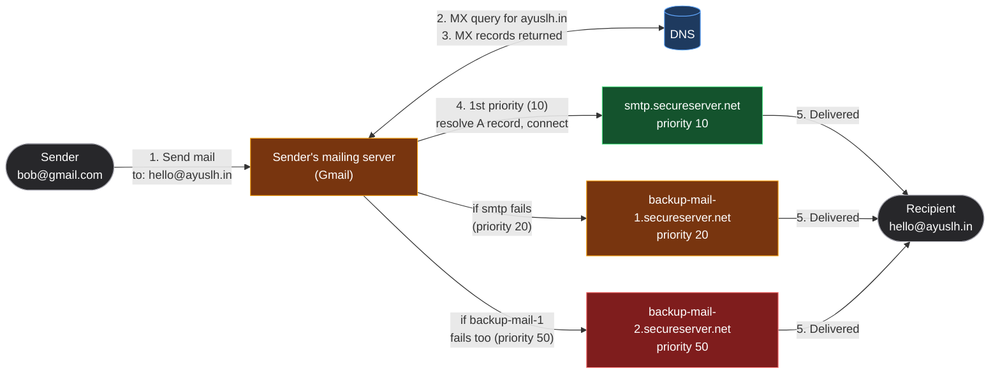
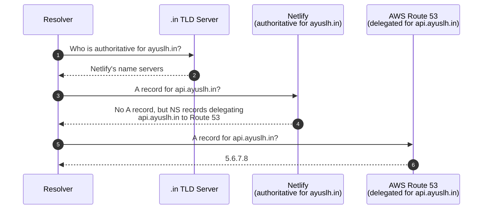
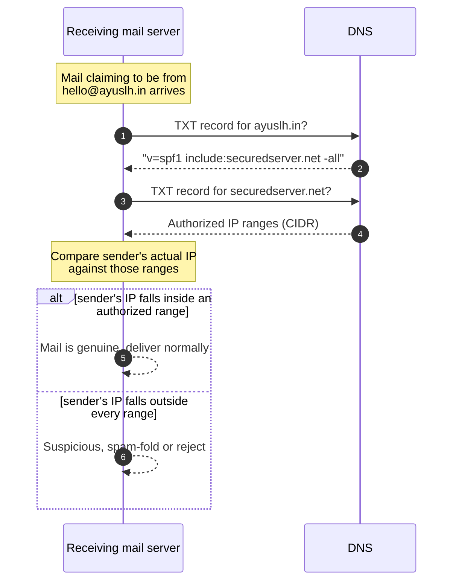
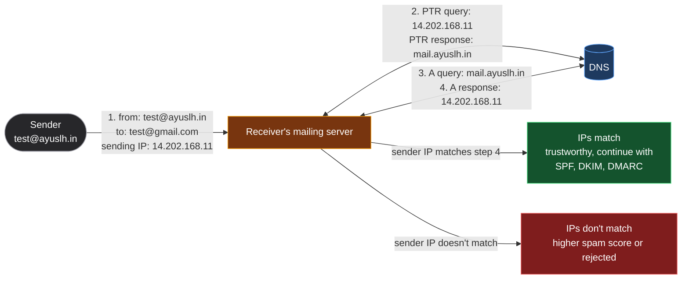

*Video Reference:* [YouTube](https://www.youtube.com/watch?v=_PugVKzp3ig)

The [previous post](/networking/ch23-dns-domain-name-system) walked through *how* a resolver finds an answer, root server, TLD server, authoritative name server, but treated the answer itself as a black box: "the authoritative server returns the IP." That's only true for one record type. A domain's authoritative name server actually holds several different kinds of records, each answering a different question, an IPv4 address, an IPv6 address, where to deliver mail, an alias to another hostname, who's authoritative for a zone, arbitrary text used for security checks. This post opens that box.

---

## The A record: mapping a hostname to an IPv4 address

An **A record** is the one most people mean when they say "DNS record": it maps a hostname to an **IPv4 address**. When someone types `ayuslh.in` into a browser, the browser asks the authoritative name server for its A record and gets back something like `11.22.33.44`.

An A record can be created against the apex domain (`ayuslh.in` itself) or any subdomain (`api.ayuslh.in`), each with its own independent A record. A single hostname can also have **multiple A records** at once, this is a common way to get basic failover or load balancing: if a resolver gets back both `11.22.33.44` and `11.22.33.45` for the same hostname, a client can fall back to the second if the first doesn't respond.

DNS management UIs and zone files have a shorthand for that apex-domain case: `@`. A record named `@` means the apex domain itself, nothing in front of it, so `@` for `ayuslh.in` is exactly equivalent to writing out `ayuslh.in.` in full. It exists purely to save retyping the domain name in every record; `blog`, by contrast, is shorthand for `blog.ayuslh.in`, treated as a prefix to the zone's own domain.

```bash
nslookup api.ayuslh.in
```

```
Name:    api.ayuslh.in
Address: 11.22.33.44
Address: 11.22.33.45
```

Each A record carries its own **TTL**, covered in the [previous post](/networking/ch23-dns-domain-name-system#where-a-lookup-starts-the-local-cache), which is why deleting a record doesn't take effect instantly everywhere: any resolver that already cached the old value keeps serving it until that TTL expires, regardless of what the authoritative server says now.

---

## The AAAA record: the IPv6 equivalent

A **AAAA record** does exactly what an A record does, maps a hostname to an address, except the address it returns is **IPv6** instead of IPv4. Querying it looks identical, just with a different record type:

```bash
nslookup -type=AAAA google.com
```

The name is a size joke, not an arbitrary label. IPv4 addresses are 32 bits; IPv6 addresses are 128 bits, exactly four times the size. Since "A" was already taken, the record for an address four times as large became four A's: **AAAA**.

---

## The MX record: routing mail to the right server

An **MX (Mail Exchange) record** tells the internet which servers handle mail for a domain. Buy a domain and want `hello@ayuslh.in` to work, and your registrar or email provider will ask you to add MX records pointing at their mail servers.

To see why that matters, it helps to start with the simple case: two Gmail users mailing each other. `alice@gmail.com` sending to `bob@gmail.com` never leaves Google's own infrastructure, both mailboxes live on servers Google runs, so once Gmail's system has the message, it's an internal handoff, not a lookup across the open internet. There's still an MX record for `gmail.com` pointing at Google's mail servers, but the sending and receiving side are the same company, so there's no real discovery problem to solve.

The interesting case, and the one MX records actually exist for, is two *different* mail providers talking to each other, `bob@gmail.com` mailing `hello@ayuslh.in`. Google's mail servers have no idea which machines handle mail for `ayuslh.in`, Gmail and GoDaddy (or Netlify, or whoever manages `ayuslh.in`'s mail) are entirely separate companies running entirely separate infrastructure, with no built-in way to know about each other. MX records are exactly what closes that gap: a public, DNS-published answer to "who handles mail for this domain?", so any sender anywhere can find the right destination without needing a special relationship with the recipient's provider.

Two details make MX records behave differently from an A record:

* **It stores a hostname, not an IP.** `smtp.securedserver.net`, not an address. This matters because the company running the mail servers, GoDaddy in this case, owns and manages that hostname's actual IP separately. If they ever move the mail server to a new IP, they update the A record for `smtp.securedserver.net` once, and every one of their customers' MX records keeps working without anyone touching their own DNS.
* **Each MX record carries a priority (also called "preference"), and lower means higher priority.** A domain typically has two or three MX records so mail has somewhere to fall back to if the primary server is down.

```
ayuslh.in    MX    10    smtp.secureserver.net.
ayuslh.in    MX    20    backup-mail-1.secureserver.net.
ayuslh.in    MX    50    backup-mail-2.secureserver.net.
```

Here's the full flow when `bob@gmail.com` sends mail to `hello@ayuslh.in`, from the initial MX lookup down to the fallback chain:



`ayuslh.in` itself never appears as a mail server anywhere in that flow, it's purely an identity. The actual delivery happens between Gmail's mail server and whichever of `ayuslh.in`'s three SMTP servers it ends up connecting to, entirely found through the MX lookup and the A-record lookup that follows it. Gmail always tries the lowest priority number first (`smtp.secureserver.net`, 10); only if that connection fails does it fall back to 20, then 50. Two MX records at the *same* priority is also valid, and gets used for load balancing, senders pick between them effectively at random. Once the mail lands on `ayuslh.in`'s server, it's synced into the actual inbox separately, via IMAP or POP3, a step MX records have no part in.

The reverse direction, `hello@ayuslh.in` replying back to `bob@gmail.com`, is the identical process with the roles swapped. `ayuslh.in`'s mail server doesn't know which machines handle mail for `gmail.com` either, so it queries `gmail.com`'s MX records, gets back Google's mail servers, resolves the winning one's A record, and connects. Neither side ever has to be told anything about the other's infrastructure in advance; MX records are what make that possible in both directions, for any two mail providers on the internet, not just this one pair.

---

## The CNAME record: aliasing one hostname to another

A **CNAME (Canonical Name) record** maps one hostname to another hostname, not to an IP. It's an alias: "this name isn't the real thing, go look here instead."

Say `blog.ayuslh.in` is actually served by a third-party platform at `some-host.network`. Instead of an A record, `blog.ayuslh.in` gets a CNAME pointing at `some-host.network`. Resolution then takes two hops:


Nothing stops a CNAME from pointing at another CNAME instead of straight at an A record, DNS doesn't enforce a limit on chain length when the records are created. `blog.ayuslh.in` could point to `some-host.network`, which itself is a CNAME to `edge.some-cdn.com`, which finally has the A record. The resolver just keeps following the chain, one more hop, one more round trip, until it either reaches something with an A record or runs out of chain to follow. In practice, this is discouraged: every extra hop is extra latency before the browser gets an IP, and some DNS providers cap how many CNAME hops they'll follow or refuse to create long chains at all.

What actually happens at a **dead end**, the last name in the chain having no A record and no further CNAME, isn't DNS stopping you from creating that setup in the first place; DNS doesn't validate any of this at configuration time. It's simply that resolution fails *at query time*: the resolver runs out of chain, finds no address to return, and the lookup comes back empty, typically surfacing to the browser as an NXDOMAIN-style failure. Nothing dramatic happens to the DNS record itself, the CNAME sits there validly configured, it's just that following it leads nowhere, so every connection attempt through it fails until whatever it points to actually resolves.

---

## The NS record: who's authoritative for this zone

An **NS (Name Server) record** is what makes the hierarchy walk from the [previous post](/networking/ch23-dns-domain-name-system#walking-the-hierarchy-root-tld-and-authoritative-servers) actually work. It's how a TLD server answers "who is authoritative for `ayuslh.in`?", the TLD server doesn't hand back an IP, it hands back a set of NS records naming the authoritative name servers. Without NS records, a resolver walking the hierarchy would have nowhere to go after the TLD tier; there'd be no way to find where a domain's actual records live.

A domain usually has more than one NS record, for the same redundancy reason MX records do: if a domain had exactly one authoritative name server and it went down, every DNS query for that domain would fail.

### DNS delegation

NS records aren't limited to a domain's top level. The same mechanism that lets a TLD server hand authority for `ayuslh.in` off to Netlify's name servers also works one level down: a zone can carve out authority over one of its own *subdomains* and hand that piece off to an entirely different DNS provider. That's **delegation**, and it's the same idea applied recursively, a zone saying "I'm not authoritative for this part of my own namespace, go ask this other set of name servers instead."

This shows up often on teams split across infrastructure providers: say a frontend team manages `ayuslh.in`'s main site through Netlify, tied into their deploy pipeline, while a separate backend team runs everything on AWS and wants `api.ayuslh.in`'s records living in Route 53 alongside the rest of their AWS infrastructure, without needing access to Netlify's DNS panel at all. Delegation is what lets both teams manage their own piece independently, under the same parent domain.

Concretely: Netlify's zone file for `ayuslh.in` has all the normal records for the apex domain and any other subdomains, but for `api.ayuslh.in` specifically, there's no A record at all. Instead, there's an **NS record** naming Route 53's name servers. That NS record *is* the delegation, it tells any resolver "I don't answer for this subdomain, they do":



Once the resolver follows that NS record to Route 53, Netlify is out of the picture entirely, every record under `api.ayuslh.in`, A, CNAME, whatever the backend team needs, now lives in Route 53's zone and is managed there, completely independently of Netlify's zone for the rest of the domain.

---

## The TXT record: freeform text, now doing security's heavy lifting

A **TXT record** stores arbitrary text against a domain, nothing more. DNS itself attaches no meaning to it, there's no calculation or routing decision based on a TXT value the way there is with an A or CNAME record. A domain can carry any number of them.

Originally this was just for human-readable notes. Today, TXT records are the backbone of several email security mechanisms, **SPF**, **DKIM**, and **DMARC** all work by publishing specially formatted values inside TXT records. This post covers SPF; DKIM and DMARC are worth their own dedicated coverage later.

### SPF (Sender Policy Framework)

SPF answers one question: *is this mail server actually allowed to send mail on behalf of this domain?* It works by publishing a TXT record listing the IP ranges authorized to send mail for that domain, in CIDR notation.

```bash
nslookup -type=TXT ayuslh.in
```

```
ayuslh.in    TXT    "v=spf1 include:securedserver.net -all"
```

That trailing `-all` is what makes the policy strict, it's SPF's **hard fail** mechanism. It means only the servers explicitly listed in the policy (here, whatever `include:securedserver.net` resolves to) are authorized to send mail for this domain. Mail from any other server fails the SPF check outright, there's no ambiguity for the receiving server to weigh. A softer `~all` (soft fail) exists too, telling receivers to mark unlisted senders as suspicious rather than reject them outright, but `-all` is the setting that actually closes the door.

A receiving mail server checks this before trusting a message:



This is exactly what stops a basic spoofing attempt. An attacker who spins up their own SMTP server and sets the `From` header to `hello@ayuslh.in` doesn't control `ayuslh.in`'s DNS, so they can't add their own IP to its SPF record. When the receiving server checks the sender's actual IP against the published ranges, it simply isn't there, and the mail gets flagged.

Why doesn't the attacker just spoof the IP itself, forge the source address in the packet, instead of running a server on their own real IP? Two reasons that rule it out. SMTP runs over TCP, and TCP opens with a [three-way handshake](/networking/ch16-tcp-three-way-handshake): SYN, SYN-ACK, ACK. A spoofed SYN gets its SYN-ACK sent back to the *spoofed* address, not to the attacker, so without seeing that reply (and correctly guessing a randomized sequence number) the attacker can never complete the handshake, and no SMTP session, no delivered mail, ever happens. Even before that, most networks won't let a spoofed packet leave in the first place: ISPs and cloud providers widely implement egress filtering (BCP 38), dropping any outbound packet whose source IP doesn't actually belong to that network. So the only workable attack is the one SPF is actually built to catch, a real server, with a real IP, lying only in the mail headers.

---

## The PTR record: reverse DNS, and why mail servers care

Every record so far starts from a hostname and resolves to something else. A **PTR (Pointer) record** runs the other direction: it's a **reverse DNS lookup**, given an IP, it returns a hostname. It's the mirror image of an A record.

PTR records tend to be the most confusing entry on this list precisely because of that reversal, everything else in DNS points a name at something, this points an IP at a name. Rather than trying to cover every angle of them in the abstract, the rest of this section sticks to one concrete, practical case: how a PTR record gets used during email delivery.

"**Owning an IP address block**" means an organization, an ISP, a cloud provider like AWS, a hosting company, has been allocated a specific range of IP addresses by a regional internet registry, and is the one responsible for how that range gets used. AWS, for instance, owns enormous ranges of IPs that it then hands out to individual EC2 instances, load balancers, and so on. Renting a server from AWS gets you *use* of one of those IPs, but AWS still owns the block it came from.

That distinction matters here specifically because of where a PTR record actually lives. An A record lives in the forward zone for a domain name, `ayuslh.in`'s zone, which whoever registered `ayuslh.in` controls directly. A PTR record lives in the **reverse zone** for an IP address, a completely separate namespace (under `in-addr.arpa` for IPv4) whose authority is delegated based on *IP allocation*, not domain registration. So even though `mail.ayuslh.in` is this domain's own hostname, the PTR record that maps its IP back to that hostname isn't something this domain's owner can just add to their own DNS. It has to be set by whoever controls the reverse zone for that IP, the cloud provider or ISP the server actually runs on.

This is exactly what makes PTR records an **email deliverability** problem in practice, not a website problem. A missing PTR record doesn't break a website at all; ordinary A-record resolution never touches PTR records. But mail servers use PTR records as a trust signal through a check called **Forward-Confirmed reverse DNS (FCrDNS)**, and plenty of cloud providers don't configure a proper one by default. Spin up a generic VM to send mail from, and its IP might come with no PTR record at all, or a generic one like `ec2-x-x-x-x.compute-1.amazonaws.com` that has nothing to do with your actual mail domain. Even with perfectly correct A, MX, and SPF records on your own domain, mail sent from that server can still land in spam, or get rejected outright, because the FCrDNS check below fails before your domain's own records are ever checked. This is precisely why providers like AWS let customers explicitly request a custom PTR record for their sending IPs, it's not optional polish, it's often required for mail to be trusted at all.

Notice the check doesn't stop at the PTR lookup, it does a *second* DNS query right after. That's not redundant: a PTR record alone would be too easy to fake, since it's set by whoever owns the sending IP, which could just as easily be an attacker who legitimately owns their own IP block. So a receiving mail server never trusts the PTR's claim on its own. It takes the hostname the PTR handed back and does a completely separate **forward** lookup, an ordinary A-record query, on that hostname, then checks whether *that* record points back to the same IP the connection actually came from. Only if both directions agree, reverse *and* forward, does the check pass, which is exactly why it's called Forward-**Confirmed** reverse DNS, the forward query is what turns an unverified claim into a confirmed one:



Concretely: an attacker who owns their own IP can freely set its PTR to claim `mail.ayuslh.in`, that part costs them nothing. But they don't control `ayuslh.in`'s actual DNS, so the forward A-record lookup on `mail.ayuslh.in` still resolves through the real domain owner's zone, and comes back with the real mail server's IP, not the attacker's. That mismatch is what gives the spoof away: claiming a hostname via PTR is cheap, making that hostname's own forward record point back to you isn't.

---

## What this looks like on a real domain

Here's the actual exported zone file for this blog's own domain, `ayuslh.in`:

```
;; NS Records
ayuslh.in.    86400    IN    NS    chloe.ns.cloudflare.com.
ayuslh.in.    86400    IN    NS    etienne.ns.cloudflare.com.

;; A Records
ayuslh.in.    1    IN    A    216.198.79.1

;; CNAME Records
*.ayuslh.in.    1    IN    CNAME    cname.vercel-dns.com.
blog.ayuslh.in.    1    IN    CNAME    8b6aeb274124a033.vercel-dns-017.com.
resume.ayuslh.in.    600    IN    CNAME    68630013e7455ef1.vercel-dns-017.com.
www.ayuslh.in.    1    IN    CNAME    cname.vercel-dns.com.

;; TXT Records
ayuslh.in.    3600    IN    TXT    "google-site-verification=8cpoeo730RY5JUHJmJkHusET7ElScWRz3yTA5vq5boQ"
_dmarc.ayuslh.in.    1    IN    TXT    "v=DMARC1; p=quarantine; adkim=r; aspf=r; rua=mailto:dmarc_rua@onsecureserver.net;"
_vercel.ayuslh.in.    600    IN    TXT    "vc-domain-verify=resume.ayuslh.in,2a0ede15add6639db876,dc"
```

Every record type above maps onto something already covered:

* The **NS records** point at Cloudflare, `chloe.ns.cloudflare.com` and `etienne.ns.cloudflare.com`, that's who's authoritative for this zone, entirely separate from wherever the site is actually hosted.
* The apex **A record** points `ayuslh.in` straight at an IP. No CNAME here, an apex domain can't have one anyway, DNS specs don't allow aliasing a zone's root to another name.
* The **CNAME records** show a wildcard and its overrides in the same zone: `*.ayuslh.in` catches any subdomain and aliases it to `cname.vercel-dns.com`, but `blog.ayuslh.in` and `resume.ayuslh.in` each carry their own more specific CNAME to a distinct Vercel deployment target. The specific record wins over the wildcard for those two subdomains; everything else falls through to it.
* The **TXT records** aren't doing mail routing at all here, they're ownership proofs and one security policy: `google-site-verification` proves domain ownership to Google Search Console, `vc-domain-verify` does the same for Vercel, and `_dmarc` is a live **DMARC** record, the third mail-authentication mechanism alongside SPF and DKIM, telling receiving servers to `quarantine` (spam-fold) any mail that fails authentication. DMARC builds directly on SPF and is worth a dedicated post of its own.
* Notably, there's no **MX record** here at all, this domain isn't configured to receive mail on any custom address, so mail-related records simply don't exist in its zone.

---

## Summary

* **A record**: maps a hostname to an **IPv4** address. Multiple A records on one hostname enable basic failover or load balancing.
* **AAAA record**: identical to an A record, but returns an **IPv6** address. Named for size, IPv6 addresses are four times the bits of IPv4, hence four A's.
* **MX record**: points a domain at the **hostname** (not IP) of its mail servers, with a **priority** value where lower wins. The actual IP is found through that hostname's own A record.
* **CNAME record**: aliases one hostname to another. Whatever it points to must itself resolve to an A record, aliases can't dead-end.
* **NS record**: names a zone's authoritative name servers, the piece that makes the root → TLD → authoritative hierarchy walk possible. Also enables **DNS delegation**, handing a subdomain's DNS off to an entirely different provider.
* **TXT record**: stores freeform text with no meaning to DNS itself, but widely used today for domain verification and email security, most notably **SPF**, which lists the IP ranges authorized to send mail for a domain so spoofed senders can be caught.
* **PTR record**: the reverse of an A record, IP to hostname, managed by whoever owns the IP block rather than the domain owner. Used in **FCrDNS** checks by mail servers to catch spoofed senders: a PTR claim only holds up if the claimed hostname's own forward A record points back to the same IP.
