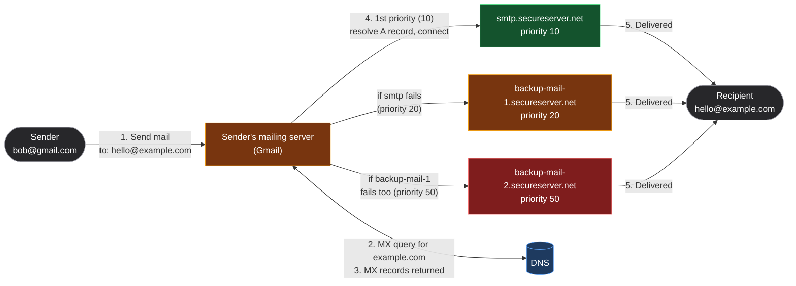
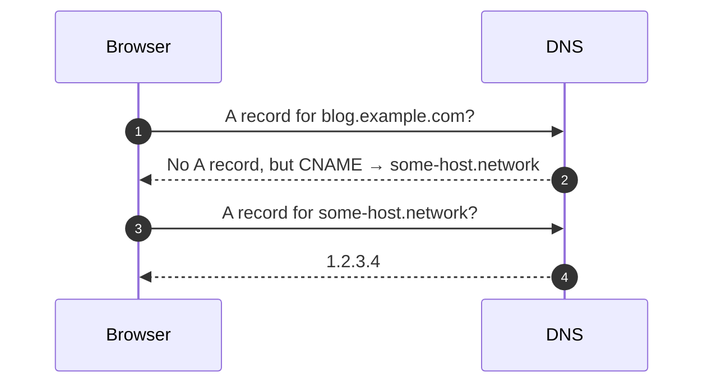
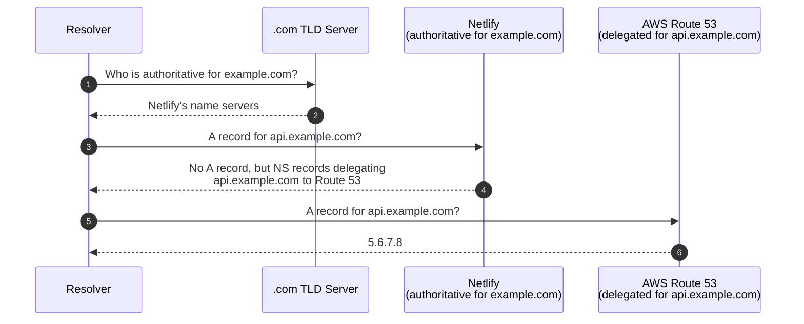
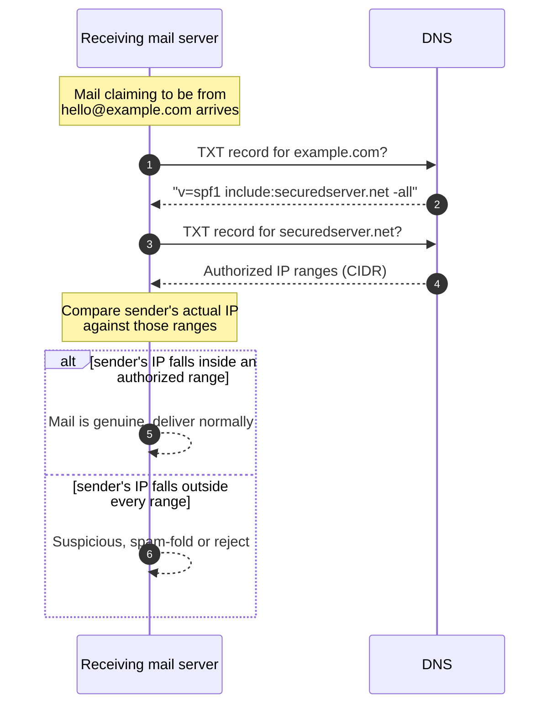
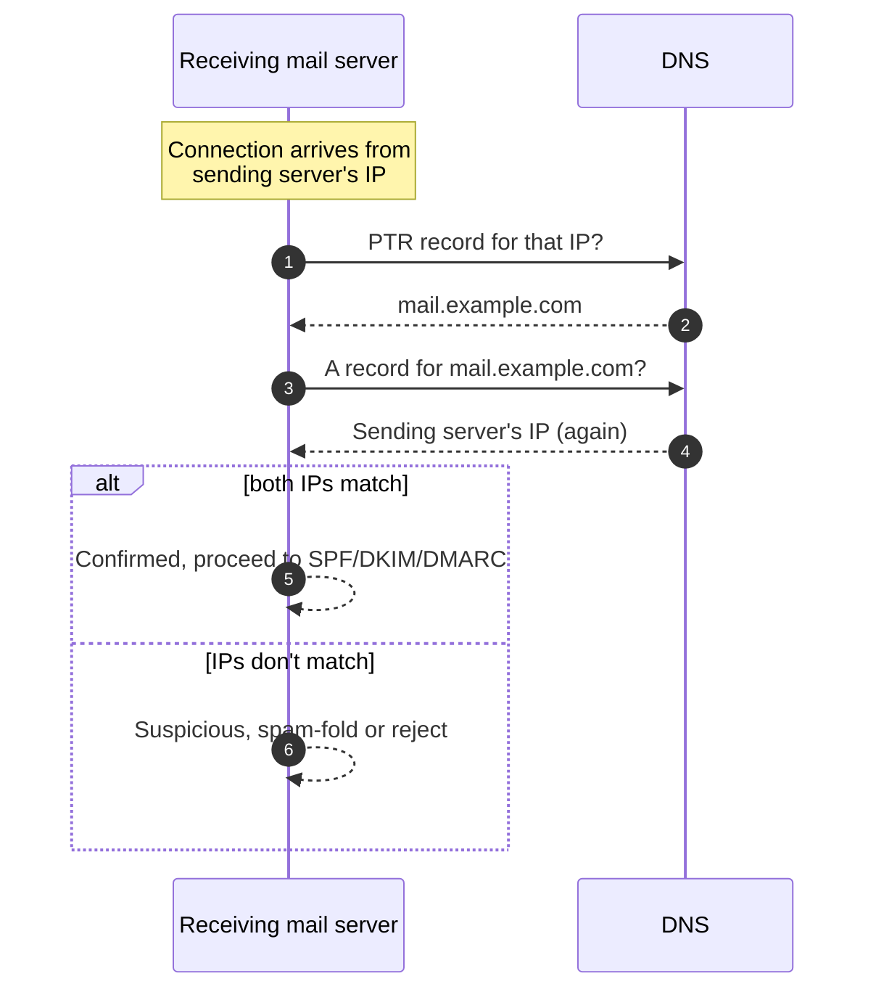

*Video Reference:* [YouTube](https://www.youtube.com/watch?v=_PugVKzp3ig)

The [previous post](/networking/ch23-dns-domain-name-system) walked through *how* a resolver finds an answer, root server, TLD server, authoritative name server, but treated the answer itself as a black box: "the authoritative server returns the IP." That's only true for one record type. A domain's authoritative name server actually holds several different kinds of records, each answering a different question, an IPv4 address, an IPv6 address, where to deliver mail, an alias to another hostname, who's authoritative for a zone, arbitrary text used for security checks. This post opens that box.

---

## The A record: mapping a hostname to an IPv4 address

An **A record** is the one most people mean when they say "DNS record": it maps a hostname to an **IPv4 address**. When someone types `example.com` into a browser, the browser asks the authoritative name server for its A record and gets back something like `11.22.33.44`.

An A record can be created against the apex domain (`example.com` itself) or any subdomain (`api.example.com`), each with its own independent A record. A single hostname can also have **multiple A records** at once, this is a common way to get basic failover or load balancing: if a resolver gets back both `11.22.33.44` and `11.22.33.45` for the same hostname, a client can fall back to the second if the first doesn't respond.

```bash
nslookup api.example.com
```

```
Name:    api.example.com
Address: 11.22.33.44
Address: 11.22.33.45
```

Each A record carries its own **TTL**, covered in the [previous post](/networking/ch23-dns-domain-name-system#where-a-lookup-starts-the-local-cache), which is why deleting a record doesn't take effect instantly everywhere: any resolver that already cached the old value keeps serving it until that TTL expires, regardless of what the authoritative server says now.

---

## The AAAA record: the IPv6 equivalent

A **AAAA record** does exactly what an A record does, maps a hostname to an address, except the address it returns is **IPv6** instead of IPv4. Querying it looks identical, just with a different record type:

```bash
nslookup -type=AAAA google.com
```

The name is a size joke, not an arbitrary label. IPv4 addresses are 32 bits; IPv6 addresses are 128 bits, exactly four times the size. Since "A" was already taken, the record for an address four times as large became four A's: **AAAA**.

---

## The MX record: routing mail to the right server

An **MX (Mail Exchange) record** tells the internet which servers handle mail for a domain. Buy a domain and want `hello@example.com` to work, and your registrar or email provider will ask you to add MX records pointing at their mail servers.

Two details make MX records behave differently from an A record:

* **It stores a hostname, not an IP.** `smtp.securedserver.net`, not an address. This matters because the company running the mail servers, GoDaddy in this case, owns and manages that hostname's actual IP separately. If they ever move the mail server to a new IP, they update the A record for `smtp.securedserver.net` once, and every one of their customers' MX records keeps working without anyone touching their own DNS.
* **Each MX record carries a priority (also called "preference"), and lower means higher priority.** A domain typically has two or three MX records so mail has somewhere to fall back to if the primary server is down.

```
example.com    MX    10    smtp.secureserver.net.
example.com    MX    20    backup-mail-1.secureserver.net.
example.com    MX    50    backup-mail-2.secureserver.net.
```

Here's the full flow when `bob@gmail.com` sends mail to `hello@example.com`, from the initial MX lookup down to the fallback chain:



`example.com` itself never appears as a mail server anywhere in that flow, it's purely an identity. The actual delivery happens between Gmail's mail server and whichever of `example.com`'s three SMTP servers it ends up connecting to, entirely found through the MX lookup and the A-record lookup that follows it. Gmail always tries the lowest priority number first (`smtp.secureserver.net`, 10); only if that connection fails does it fall back to 20, then 50. Two MX records at the *same* priority is also valid, and gets used for load balancing, senders pick between them effectively at random. Once the mail lands on `example.com`'s server, it's synced into the actual inbox separately, via IMAP or POP3, a step MX records have no part in.

---

## The CNAME record: aliasing one hostname to another

A **CNAME (Canonical Name) record** maps one hostname to another hostname, not to an IP. It's an alias: "this name isn't the real thing, go look here instead."

Say `blog.example.com` is actually served by a third-party platform at `some-host.network`. Instead of an A record, `blog.example.com` gets a CNAME pointing at `some-host.network`. Resolution then takes two hops:



This is why there's a hard rule: **whatever a CNAME points to must itself resolve to an A record.** If `some-host.network` had no A record of its own, the chain would dead-end, the browser would have an alias but nowhere to actually connect, and the lookup fails outright.

---

## The NS record: who's authoritative for this zone

An **NS (Name Server) record** is what makes the hierarchy walk from the [previous post](/networking/ch23-dns-domain-name-system#walking-the-hierarchy-root-tld-and-authoritative-servers) actually work. It's how a TLD server answers "who is authoritative for `example.com`?", the TLD server doesn't hand back an IP, it hands back a set of NS records naming the authoritative name servers. Without NS records, a resolver walking the hierarchy would have nowhere to go after the TLD tier; there'd be no way to find where a domain's actual records live.

A domain usually has more than one NS record, for the same redundancy reason MX records do: if a domain had exactly one authoritative name server and it went down, every DNS query for that domain would fail.

### DNS delegation

NS records aren't limited to a domain's top level, they can be set on a *subdomain*, and that subdomain's queries get delegated to a completely different DNS provider. This is common in larger teams: a frontend on Netlify, a backend infrastructure managed separately on AWS Route 53.

Say `example.com`'s DNS lives on Netlify, but `api.example.com`'s records live on Route 53 instead. Netlify's zone for `example.com` doesn't have an A record for `api.example.com`, it has an NS record delegating that subdomain to Route 53's name servers:



The subdomain's zone is now entirely Route 53's responsibility. Netlify only ever needed to know one thing: which name servers to hand this subdomain off to.

---

## The TXT record: freeform text, now doing security's heavy lifting

A **TXT record** stores arbitrary text against a domain, nothing more. DNS itself attaches no meaning to it, there's no calculation or routing decision based on a TXT value the way there is with an A or CNAME record. A domain can carry any number of them.

Originally this was just for human-readable notes. Today, TXT records are the backbone of several email security mechanisms, **SPF**, **DKIM**, and **DMARC** all work by publishing specially formatted values inside TXT records. This post covers SPF; DKIM and DMARC are worth their own dedicated coverage later.

### SPF (Sender Policy Framework)

SPF answers one question: *is this mail server actually allowed to send mail on behalf of this domain?* It works by publishing a TXT record listing the IP ranges authorized to send mail for that domain, in CIDR notation.

```bash
nslookup -type=TXT example.com
```

```
example.com    TXT    "v=spf1 include:securedserver.net -all"
```

A receiving mail server checks this before trusting a message:



This is exactly what stops a basic spoofing attempt. An attacker who spins up their own SMTP server and sets the `From` header to `hello@example.com` doesn't control `example.com`'s DNS, so they can't add their own IP to its SPF record. When the receiving server checks the sender's actual IP against the published ranges, it simply isn't there, and the mail gets flagged.

---

## The PTR record: reverse DNS, and why mail servers care

Every record so far starts from a hostname and resolves to something else. A **PTR (Pointer) record** runs the other direction: it's a **reverse DNS lookup**, given an IP, it returns a hostname. It's the mirror image of an A record.

Because a domain's `name` field can only ever be a name, never an IP, PTR records aren't something a domain owner can manage in their own DNS. They're configured by whoever **owns the IP address block**, typically a cloud provider like AWS, not by whoever registered the domain that IP happens to serve.

A missing PTR record doesn't break a website; ordinary A-record resolution doesn't touch PTR records at all. What it *does* affect is **email deliverability**. Mail servers use PTR records as one signal for whether a sender is trustworthy, through a check called **Forward-Confirmed reverse DNS (FCrDNS)**:



The check works even against an attacker who owns their own IP block, and can therefore legitimately set their own PTR record to claim any hostname they like, say, `mail.example.com`. What they *can't* do is control `example.com`'s actual DNS. So the second half of the check, the forward A-record lookup on the hostname the PTR claimed, resolves through the real domain owner's DNS and comes back with the real mail server's IP, not the attacker's. The mismatch is what gives the spoof away: claiming a hostname via PTR is cheap, but making that hostname's own forward record point back to you requires controlling DNS you don't control.

---

## What this looks like on a real domain

Here's the actual exported zone file for this blog's own domain, `ayuslh.in`:

```
;; NS Records
ayuslh.in.    86400    IN    NS    chloe.ns.cloudflare.com.
ayuslh.in.    86400    IN    NS    etienne.ns.cloudflare.com.

;; A Records
ayuslh.in.    1    IN    A    216.198.79.1

;; CNAME Records
*.ayuslh.in.    1    IN    CNAME    cname.vercel-dns.com.
blog.ayuslh.in.    1    IN    CNAME    8b6aeb274124a033.vercel-dns-017.com.
resume.ayuslh.in.    600    IN    CNAME    68630013e7455ef1.vercel-dns-017.com.
www.ayuslh.in.    1    IN    CNAME    cname.vercel-dns.com.

;; TXT Records
ayuslh.in.    3600    IN    TXT    "google-site-verification=8cpoeo730RY5JUHJmJkHusET7ElScWRz3yTA5vq5boQ"
_dmarc.ayuslh.in.    1    IN    TXT    "v=DMARC1; p=quarantine; adkim=r; aspf=r; rua=mailto:dmarc_rua@onsecureserver.net;"
_vercel.ayuslh.in.    600    IN    TXT    "vc-domain-verify=resume.ayuslh.in,2a0ede15add6639db876,dc"
```

Every record type above maps onto something already covered:

* The **NS records** point at Cloudflare, `chloe.ns.cloudflare.com` and `etienne.ns.cloudflare.com`, that's who's authoritative for this zone, entirely separate from wherever the site is actually hosted.
* The apex **A record** points `ayuslh.in` straight at an IP. No CNAME here, an apex domain can't have one anyway, DNS specs don't allow aliasing a zone's root to another name.
* The **CNAME records** show a wildcard and its overrides in the same zone: `*.ayuslh.in` catches any subdomain and aliases it to `cname.vercel-dns.com`, but `blog.ayuslh.in` and `resume.ayuslh.in` each carry their own more specific CNAME to a distinct Vercel deployment target. The specific record wins over the wildcard for those two subdomains; everything else falls through to it.
* The **TXT records** aren't doing mail routing at all here, they're ownership proofs and one security policy: `google-site-verification` proves domain ownership to Google Search Console, `vc-domain-verify` does the same for Vercel, and `_dmarc` is a live **DMARC** record, the third mail-authentication mechanism alongside SPF and DKIM, telling receiving servers to `quarantine` (spam-fold) any mail that fails authentication. DMARC builds directly on SPF and is worth a dedicated post of its own.
* Notably, there's no **MX record** here at all, this domain isn't configured to receive mail on any custom address, so mail-related records simply don't exist in its zone.

---

## Summary

* **A record**: maps a hostname to an **IPv4** address. Multiple A records on one hostname enable basic failover or load balancing.
* **AAAA record**: identical to an A record, but returns an **IPv6** address. Named for size, IPv6 addresses are four times the bits of IPv4, hence four A's.
* **MX record**: points a domain at the **hostname** (not IP) of its mail servers, with a **priority** value where lower wins. The actual IP is found through that hostname's own A record.
* **CNAME record**: aliases one hostname to another. Whatever it points to must itself resolve to an A record, aliases can't dead-end.
* **NS record**: names a zone's authoritative name servers, the piece that makes the root → TLD → authoritative hierarchy walk possible. Also enables **DNS delegation**, handing a subdomain's DNS off to an entirely different provider.
* **TXT record**: stores freeform text with no meaning to DNS itself, but widely used today for domain verification and email security, most notably **SPF**, which lists the IP ranges authorized to send mail for a domain so spoofed senders can be caught.
* **PTR record**: the reverse of an A record, IP to hostname, managed by whoever owns the IP block rather than the domain owner. Used in **FCrDNS** checks by mail servers to catch spoofed senders: a PTR claim only holds up if the claimed hostname's own forward A record points back to the same IP.
