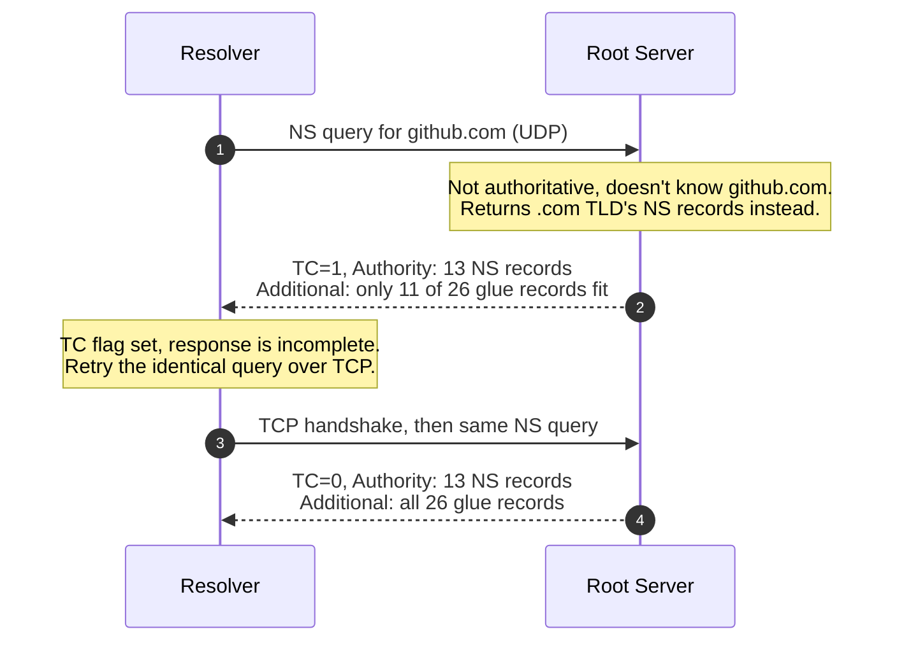

*Video Reference:* [YouTube](https://www.youtube.com/watch?v=P31T7461kfs)

[Ch.23](/networking/ch23-dns-domain-name-system) covered what DNS is and how a resolver walks the hierarchy to answer a query. [Ch.24](/networking/ch24-dns-record-types) covered what the records themselves store. Neither looked at the actual bytes that travel between resolver and server to make any of that happen, the DNS message itself, sitting inside the [UDP datagram](/networking/ch14-anatomy-of-a-udp-datagram-and-checksum)'s data field. This post opens that up, field by field, the same way earlier posts did for UDP and TCP, and ends with a real capture showing a query that outgrows UDP entirely.

---

## The DNS header (12 bytes, every message)

Every DNS message, query or response, starts with the same fixed 12-byte header, followed by a variable number of the sections it describes:

<DnsHeaderTable />

---

## Transaction ID: matching a response to its query

The first 16 bits are the **Transaction ID**. A resolver can have hundreds of DNS queries in flight at once, so when responses start arriving, out of order, from different servers, it needs a way to know which query each one answers. The response simply echoes back the same Transaction ID the query carried. Wireshark uses this directly: it's what lets it draw the little "this is a query" / "this is the response to that query" arrows between two packets. This is the same transaction ID concept introduced back in the [UDP post](/networking/ch13-user-datagram-protocol-udp) as one of the things standing in for the reliability UDP itself doesn't provide.

---

## The flags: ten sub-fields packed into 16 bits

Right after the Transaction ID comes a 16-bit block that's really ten separate flags packed together, each answering a narrow yes/no or small-enum question about the message.

* **QR (1 bit)**: `0` if this message is a query, `1` if it's a response. The simplest possible way to tell the two apart, and it's literally what Wireshark reads to draw its little query/response arrows next to each packet, a right-pointing arrow for `QR = 0` (a query going out), a left-pointing arrow for `QR = 1` (a response coming back).
* **Opcode (4 bits)**: what kind of operation this is. The defined values:
  * `0` (`0000`): **QUERY**, a standard query, the kind covered throughout this whole DNS module and by far the most common value in practice.
  * `1`: **IQUERY**, an inverse query, since deprecated.
  * `2`: **STATUS**, asking a server for its status rather than a record.
  * `4`: **NOTIFY**, used between a zone's primary and secondary servers to announce that the zone changed.
  * `5`: **UPDATE**, a dynamic write to a zone's records.

  All except standard `QUERY` are out of scope here; the rest of this post assumes an ordinary query.
* **AA, Authoritative Answer (1 bit)**: whether the server that answered is actually authoritative for the domain being queried, or just relaying/caching what it learned from someone else. This is the literal bit behind the **non-authoritative answer** label from Ch.23's `nslookup` section, querying `8.8.8.8` sets this to `0` because Google's public resolver isn't authoritative for the domain being asked about, while querying the domain's actual authoritative server directly sets it to `1`.
* **TC, Truncated (1 bit)**: whether this response got cut short because it didn't fit inside a single UDP datagram. `1` means the response is incomplete and the resolver needs to retry the same query over TCP to get the rest, the worked example at the end of this post shows this bit flip in a real capture.
* **RD, Recursion Desired (1 bit)**: set by the client, asking the resolver "if you don't already know the answer, please go do the full recursive walk (root, then TLD, then authoritative) on my behalf."
* **RA, Recursion Available (1 bit)**: set by the server in its response, confirming whether it's actually willing to do that recursive walk. A resolver like `8.8.8.8` sets this to `1`; an authoritative server that only answers for its own zone and refuses to recurse on a client's behalf would set it to `0`.
* **Z, AD, CD (1 bit each)**: `Z` is reserved and always `0`. `AD` (Authenticated Data) and `CD` (Checking Disabled) both relate to **DNSSEC**, DNS's cryptographic-signing extension, worth its own dedicated post later. All three are safe to ignore for a standard, non-DNSSEC query.
* **RCODE (4 bits)**: the reply code. `0000` means no error, the query resolved normally. Nonzero values signal specific failures, the most common being **NXDOMAIN**, returned when the queried domain simply doesn't exist at all.

---

## The four counts, and what each section actually holds

The next four 16-bit fields, **QDCOUNT**, **ANCOUNT**, **NSCOUNT**, and **ARCOUNT**, don't carry data themselves. They're a table of contents, telling the receiver exactly how many entries to expect in each of the four sections that follow the header:

* **Question section** (`QDCOUNT` entries): the actual question being asked, a name, a record type, and a class. A query for `github.com`'s A record has `QDCOUNT = 1`; this section gets echoed back unchanged in the response too, so there's never any ambiguity about what's being answered.
* **Answer section** (`ANCOUNT` entries): the records that directly answer the question, an IP address for an A record query, mail servers for an MX query, and so on. If a hostname has two A records, `ANCOUNT = 2` and both show up here.
* **Authority section** (`NSCOUNT` entries): this is what a server sends back when it *doesn't* have a direct answer but knows who might. It's exactly what happens during the root and TLD steps of the [hierarchy walk from Ch.23](/networking/ch23-dns-domain-name-system#walking-the-hierarchy-root-tld-and-authoritative-servers): a root server has no A record for `github.com`, so instead its response carries `NSCOUNT` NS records naming the `.com` TLD servers that might know more.
* **Additional section** (`ARCOUNT` entries): extra records the server includes without being asked, purely to save the resolver a round trip. The most common example is **glue records**: when a server hands back NS records in the Authority section, it also proactively includes the A (and AAAA) records for *those* name servers' own hostnames in Additional. Without that, the resolver would have to resolve each name server's hostname into an IP before it could even query it, an extra lookup per referral, and in some configurations, a circular dependency it couldn't resolve at all.

---

## Seeing it happen: a query that outgrows UDP

All of this becomes concrete in a real capture. Querying a root server directly for `github.com`'s NS records (the same technique from [Ch.23's `nslookup` walkthrough](/networking/ch23-dns-domain-name-system#trying-it-with-nslookup)) produces a response like this:

The root server doesn't know `github.com`'s name servers, only who manages `.com`, so it answers with `NSCOUNT = 13`, the `.com` TLD's own thirteen letter-named authoritative servers (`a.gtld-servers.net` through `m.gtld-servers.net`, mirroring the root's own A-through-M naming). Each of those 13 servers gets both an A and an AAAA glue record included automatically, `13 × 2 = 26` Additional records. That's more than fits in a single UDP datagram: the first response comes back with `TC = 1` and only 11 of those 26 glue records present, a visibly partial answer. Seeing that flag, DNS retries the exact same query over TCP, a full three-way handshake, the identical NS query sent again, and this time the complete response comes back: `TC = 0`, all 13 Authority records, all 26 Additional records, followed by TCP's own connection teardown.

This is the TC flag and the UDP-to-TCP fallback described above, no longer abstract: a real 512-byte-and-up UDP ceiling, a real truncated response, and DNS transparently retrying over TCP to get the complete answer.

---

## Summary

* Every DNS message shares a fixed **12-byte header**: a 16-bit **Transaction ID**, 16 bits of packed **flags**, and four 16-bit **count fields**.
* The **Transaction ID** is what lets a resolver match an incoming response to one of potentially hundreds of outstanding queries.
* Of the ten flag bits, **QR** marks query vs. response, **AA** marks whether the answer came from an authoritative source, **TC** marks a truncated response that needs a TCP retry, **RD**/**RA** negotiate recursive resolution, and **RCODE** reports success or a specific failure like NXDOMAIN.
* The four count fields, **QDCOUNT**, **ANCOUNT**, **NSCOUNT**, **ARCOUNT**, describe exactly how many entries follow in the **Question**, **Answer**, **Authority**, and **Additional** sections respectively.
* The **Authority** section is how a non-authoritative server hands back "ask them instead" referrals, and the **Additional** section carries **glue records**, IPs for those referred-to name servers, included proactively so the resolver doesn't need an extra lookup just to reach them.
* All of this is directly observable in a real capture: a large NS response overflowing UDP's size limit, setting **TC = 1**, and DNS transparently retrying the identical query over **TCP** to get the complete answer.
