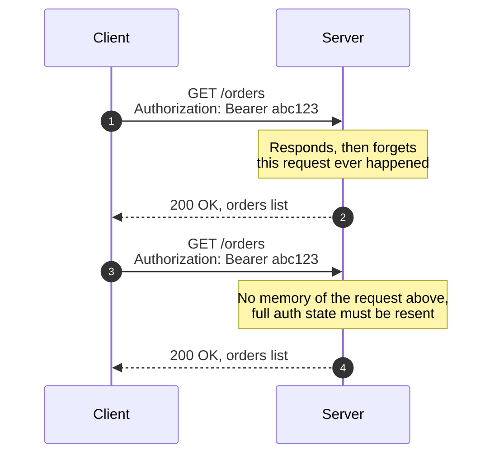

*Video Reference:* [YouTube](https://www.youtube.com/watch?v=5n5_IRlYr64)

Every request a browser makes, every API call a backend answers, runs on a protocol most engineers use daily without ever unpacking its name. This starts a new module: after DNS turned a domain into an IP, this is what actually travels once that IP is reachable. This post stays at the overview level, what HTTP is and what properties define it; later posts go into its versions (HTTP/1.1, 2, 3), TLS, and HTTPS specifically.

---

## Breaking down the name

**HTTP** stands for **HyperText Transfer Protocol**, and each of those three words is doing real work.

**Text** is just content, a sentence, a set of characters strung together. **Hypertext** is text that contains a *hyperlink*, something pointing at a different document entirely. "Click me to learn more" on a webpage, underlined and clickable, is hypertext: clicking it takes you to an entirely different document. This is exactly why HTML is called **HyperText Markup Language**, it's a language for writing text that can embed links to other documents, an `<a href="...">` tag being the obvious example.

**Transfer** is about correctly moving that document from one machine to another. Clicking a link happens in a browser on one computer; the page it loads back came from a server, a completely different machine. HTTP is what governs how that content correctly makes the trip from server to browser.

**Protocol** just means a set of rules. Specifically, rules for what a request and a response are supposed to look like, so both sides agree on the exact shape of what's being exchanged instead of guessing.

Put together: HTTP is the rulebook for how hypertext (and today, far more than just hypertext) correctly moves from one machine to another.

---

## HTTP is an application-layer protocol

In the [OSI vs. TCP/IP model post](/networking/ch10-osi-vs-tcp-ip-model), the **application layer** sits at the very top of the TCP/IP model, the layer actual programs talk to directly. That's where HTTP lives. Everything below it, getting bytes reliably across a network, is somebody else's problem.

Specifically, HTTP is built directly on top of **TCP**, the [transport-layer protocol](/networking/ch15-transmission-control-protocol-tcp) covered earlier in this series. That division of labor is why HTTP itself doesn't have to think about retransmission, ordering, or connection state at the packet level, TCP already handles all of that underneath it. HTTP only has to worry about one thing: that the request and response it exchanges follow HTTP's own rules. Getting the bytes there reliably is TCP's job entirely.

---

## A shared language between client and server

HTTP is a communication protocol between a client and a server, and critically, it doesn't care what language either side is written in. A browser client running JavaScript can talk to a backend written in Python, or Go, or anything else; as long as both sides speak HTTP, the implementation language underneath is irrelevant.

That only works because HTTP defines exactly how a request and a response should look. If a client wants a user's profile, it can't just say "please give me the profile", the server has no way to parse that reliably. Instead, HTTP requires a specific shape: a **method** (`GET`), a **path** (`/profile`), an **HTTP version**, a set of **headers**, and the expected **content type**. Because that shape is standardized, a FastAPI server and a JavaScript browser client, sharing no programming language in common, can still communicate without ambiguity. HTTP is the one language both of them agree to speak.

---

## HTTP is stateless

Send a request, `GET` a user's profile, and the server responds. The moment it responds, it forgets the request ever happened. No state about it is kept anywhere. Want that same profile again a second later, that's an entirely new request, and the server has no memory of the one before it.

This is why every authenticated request carries a full `Authorization` header, and why cookies get resent with every single call, not just the first. The server never stores who's logged in between requests; the *entire* state has to travel with each one. Logged in and browsing five pages in a row means the same authorization header goes out five separate times, once per request, because as far as the server's concerned, each one is the first it's ever seen.

---

## HTTP is media-independent

HTTP can carry almost any type of data, but that wasn't always true. **HTTP/0.9**, the very first version, only ever served HTML. It didn't have a concept of headers at all, which meant no `Content-Type` header either. Without that header, there's no way to say "this is JSON" or "this is a PDF", so the protocol just didn't try: every response was assumed to be HTML, full stop. That default is also where the name comes from, HTTP originally existed specifically to transfer *hypertext*, nothing else.

As the web grew, HTTP grew with it. The `Content-Type` header became the mechanism for saying exactly what's being sent, JSON, XML, PDF, video, audio, images, anything, and modern HTTP treats none of these as a special case. Media independence isn't a late addition bolted on, it's what the `Content-Type` header exists to make possible: the protocol doesn't care what's inside the body, only that the header correctly says what it is.

---

## What HTTP deliberately leaves to other protocols

Two things HTTP is often assumed to do, but doesn't, itself:

* **Encryption.** Plain HTTP is not encrypted. Getting an encrypted connection means adding **TLS** underneath it, which is what turns HTTP into **HTTPS**. HTTP itself has no opinion on encryption one way or the other, that's an entirely separate layer, worth its own dedicated post.
* **Guaranteed delivery.** HTTP doesn't guarantee a request or response actually arrives, but that's fine, because it doesn't need to. It's built on TCP, and TCP already guarantees reliable, ordered delivery. HTTP inherits that guarantee for free simply by sitting on top of TCP, it never has to implement anything like it itself.

Both of these are examples of the same underlying design: HTTP stays narrowly focused on the shape of requests and responses, and leans on other protocols, TCP for delivery, TLS for encryption, for everything else.

---

## HTTP is independent of the programming language

Browsers, mobile apps, `curl`, Postman, Node.js, Python, whatever the client or server is written in, all of them can speak HTTP, because HTTP isn't tied to any language's runtime or implementation. Any of them just needs to produce and parse the request and response shapes HTTP defines, which is exactly why the client-and-server example earlier, a JavaScript browser talking to a Python server, works at all. Most languages support HTTP by default precisely because so much of the web depends on it.

---

## Summary

* **HTTP** is the **HyperText Transfer Protocol**: rules for how hypertext, and now virtually any content, correctly moves from one machine to another.
* It's an **application-layer protocol**, sitting at the top of the TCP/IP model, built directly on top of **TCP**, which handles the actual reliable delivery underneath it.
* It's a **language-independent communication protocol** between client and server, made possible because it precisely defines the shape of a request and response, method, path, version, headers, and content type.
* It's **stateless**: the server forgets every request the moment it responds, so the full state, authorization headers, cookies, has to travel with every single request, not just the first.
* It's **media-independent**: HTTP/0.9 only ever served HTML with no concept of headers at all, but the modern `Content-Type` header lets HTTP carry JSON, XML, PDF, video, audio, or anything else.
* HTTP deliberately **doesn't encrypt data itself** (that's TLS, making HTTPS) and **doesn't guarantee delivery itself** (that's inherited for free from TCP underneath it).
* It's **independent of programming language**, any client or server that can produce and parse HTTP's request/response shape can participate, regardless of what it's written in.
