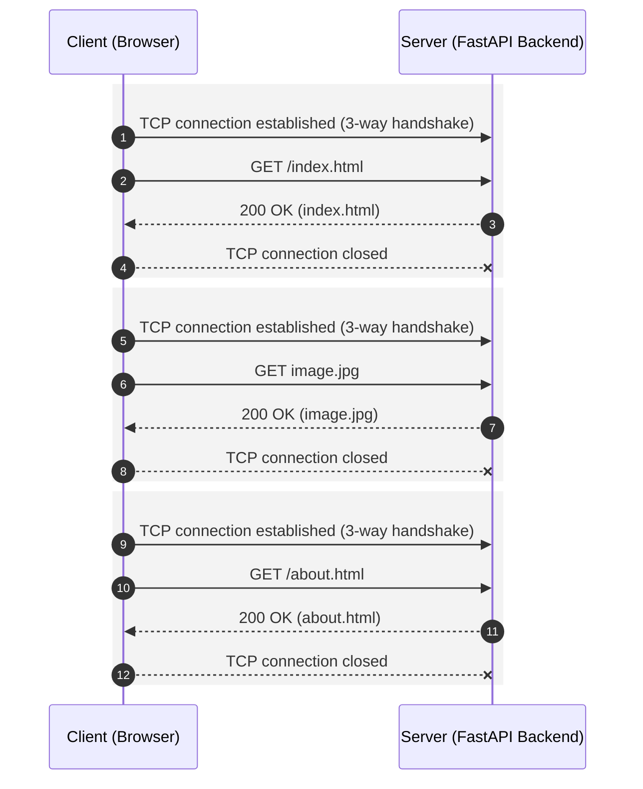
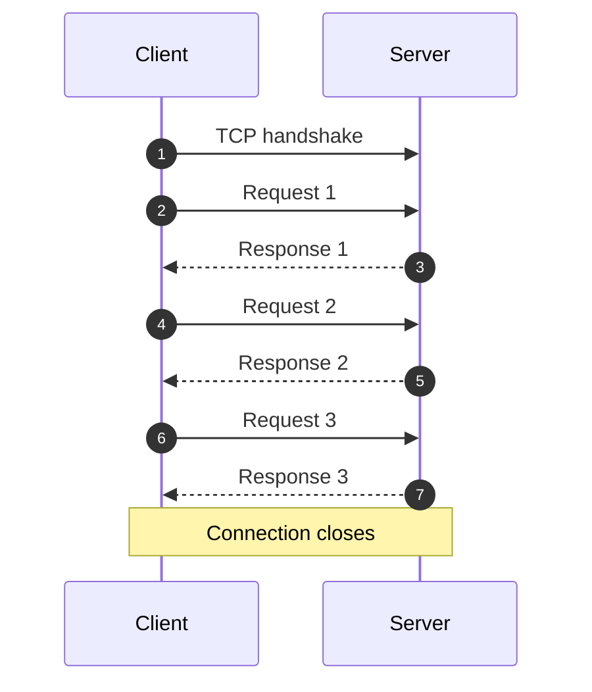
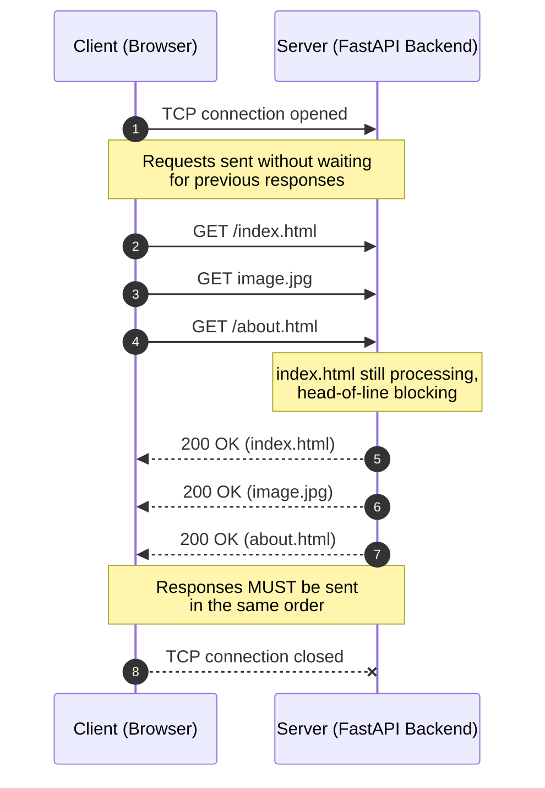

*Inspired by:* [YouTube](https://www.youtube.com/watch?v=tNulpc4RLWU)

The [previous post](/networking/ch26-http-hypertext-transfer-protocol) covered what HTTP is at an overview level: a client-server, request-response protocol built on TCP. This post goes into why HTTP has different versions at all, what each version's significance is, and how every next version fills in the gaps the previous one left behind. Specifically: HTTP/0.9, HTTP/1.0, and HTTP/1.1.

---

## HTTP/0.9: no headers, no content type

The very first version of HTTP, from the early 1990s, was about as basic as a protocol gets. It could only ever serve HTML, nothing else.

The reason was structural, not a limitation someone forgot to lift: HTTP/0.9 had no concept of **HTTP headers** at all. Headers are exactly what a response uses to say what type of content it's carrying, JSON, XML, PDF, audio, HTML. Without headers, there's no `Content-Type` to declare any of that, so the protocol never bothered trying to support anything beyond HTML.

---

## HTTP/1.0: headers arrive, but a new connection per request

HTTP/1.0 fixed exactly that gap. It introduced **HTTP headers**, which meant a response could now specify its content type, PDF, video, audio, zip file, whatever it needed to be, instead of defaulting to HTML by assumption.

But HTTP/1.0 introduced a different problem, this time about the underlying TCP connection.

HTTP runs on top of TCP, and TCP is connection-oriented: sending anything over TCP first requires a [three-way handshake](/networking/ch16-tcp-three-way-handshake) to establish a connection. In HTTP/1.0, every single request opened a fresh TCP connection, and the moment the response for that request came back, the connection closed immediately.

Three requests meant three completely separate TCP connections, each with its own handshake and its own teardown. Establishing and tearing down a TCP connection both consume resources, so this pattern was burning resources unnecessarily on every single request.

HTTP/1.0 did have a way around this: a `Connection: keep-alive` header. Sending it kept the underlying TCP connection persistent, meaning multiple requests and responses could reuse the same connection instead of opening a new one each time. The catch was that this header was entirely **optional**. Left unsent, the default behavior was still one fresh TCP connection per request.

> You can think of `Connection: keep-alive` in HTTP/1.0 as a practical extension (or a patchwork) to improve performance by reusing TCP connections. HTTP/1.1 later standardized persistent connections and made them the default.

---

## HTTP/1.1: persistent connections by default

HTTP/1.1 made that optional behavior the default. Given the same three requests, HTTP/1.1 establishes a single TCP connection via one handshake, sends all three requests over it, and only closes the connection once the response to the last one has come back.

What was an opt-in header in HTTP/1.0 is just how HTTP/1.1 behaves out of the box: a single connection, reused for multiple requests, by default. That's the core difference between the two versions.

HTTP/1.1 still has a constraint though: within that one connection, a request can't be sent until the response for the previous one has come back. Each request-response pair happens strictly one at a time. That's a real limitation, but it's also why HTTP/1.1 is still in wide use today, plenty of servers and websites run on it without issue.

---

## Pipelining, and why it stays off by default

HTTP/1.1 does have a feature meant to relax that one-at-a-time rule: **pipelining**. Instead of waiting for a response before sending the next request, a client can fire off multiple requests back to back, say `GET index.html`, `GET image.jpg`, and `GET about.html`, without waiting on any of their responses first.

There's a catch attached to it: responses **must** come back in the same order the requests were sent. Request `index.html`, then `image.jpg`, then `about.html`, and the responses have to arrive index, image, about, in that exact order, no matter which one actually finishes processing first.

That ordering requirement is where pipelining falls apart. Say `index.html` happens to be a large file that takes a long time to generate on the server. Even if `image.jpg` and `about.html` are fully ready to send, they're stuck waiting, because the response for `index.html` has to go out first. This is called **head-of-line blocking**: the request at the head of the line is still being processed, and every request behind it is blocked regardless of whether it's actually ready.

`image.jpg` and `about.html` are independent requests with no real relationship to `index.html`, but head-of-line blocking makes them suffer anyway, stuck behind a response that has nothing to do with them. That downside is exactly why pipelining is **disabled by default** in HTTP/1.1, despite being part of the spec. This also happens to be a common interview question.

What browsers do instead, and what's often confused for pipelining, is sending multiple requests in parallel over multiple connections, without waiting for each response, but without the strict in-order response requirement pipelining imposes either.

> The concurrency looks similar, requests go out without waiting on each other, but the mechanism isn't. Pipelining queues multiple requests onto **one** connection, so the response order is forced. Browsers instead open several **separate** TCP connections (historically around six per host) and spread requests across them. A slow response on one connection has no effect on the others, since ordering was only ever a constraint within a single connection, not across independent ones. That's what avoids head-of-line blocking without needing pipelining at all.

---

## Summary

* **HTTP/0.9** had no concept of headers, so it could only ever serve HTML, there was no `Content-Type` to declare anything else.
* **HTTP/1.0** introduced headers, enabling any content type, but defaulted to a **new TCP connection per request**, closed immediately after the response. A `Connection: keep-alive` header could make the connection persistent, but it was optional.
* **HTTP/1.1** made persistent connections the **default** behavior: one TCP connection, reused across multiple requests, closed only after the last response.
* HTTP/1.1 still processes requests **one at a time** per connection, a request can't be sent before the previous response arrives.
* **Pipelining** lets a client send multiple requests without waiting for prior responses, but responses must come back in the exact order requested, which causes **head-of-line blocking**: a slow response at the front blocks every ready response behind it. That's why pipelining is disabled by default.
