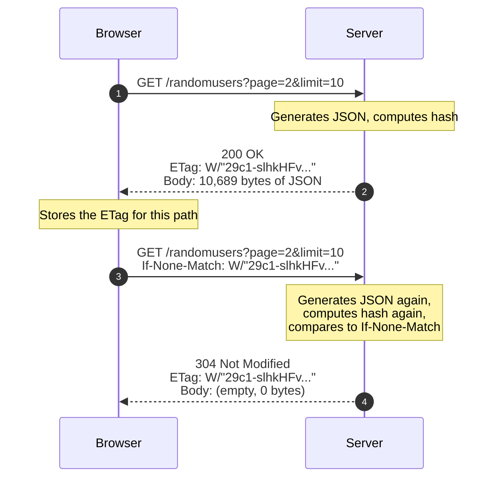

*Inspired by:* [YouTube](https://www.youtube.com/watch?v=rZNdo9UjF94)

[Ch.26](/networking/ch26-http-hypertext-transfer-protocol) covered what HTTP is, and [Ch.27](/networking/ch27-http-1.0-vs-http-1.1) covered how its versions differ in connection handling. Neither looked at what an actual request and response contain. This post does exactly that: calling a real endpoint and reading the request and response headers a browser and server actually exchange, field by field.

The exact request used throughout this post, reproducible with `curl` or a browser, is:

```
GET https://api.freeapi.app/api/v1/public/randomusers?page=2&limit=10
```

A public API that returns a page of random users as JSON, two query parameters and all, so every header and value below traces back to this one call.

---

## The request line: method, path, version

Every HTTP request opens with a single line made of exactly three pieces:

```
GET /api/v1/public/randomusers?page=2&limit=10 HTTP/1.1
```

* **Method**, `GET` here, says what kind of operation this request is.
* **Path**, `/api/v1/public/randomusers`, is the endpoint being called. Everything from the `?` onward, `page=2&limit=10`, is the **query string**: key-value pairs separated by `&`, here telling the API to return page 2 with 10 users per page.
* **Version**, `HTTP/1.1`, is the protocol version the client is speaking, the same versioning [Ch.27](/networking/ch27-http-1.0-vs-http-1.1) went into.

That's the entire request line. Everything else in the request is headers.

---

## Request headers

After the request line comes a set of headers, each one a `Name: value` pair. Opening Chrome DevTools, calling this endpoint from a browser, and copying the request headers gives something like this:

```
GET /api/v1/public/randomusers?page=2&limit=10 HTTP/1.1
Host: api.freeapi.app
Referer: https://freeapi.app/
User-Agent: Mozilla/5.0 (Macintosh; Intel Mac OS X 10_15_7) AppleWebKit/537.36 (KHTML, like Gecko) Chrome/128.0.0.0 Safari/537.36
Accept: application/json
Accept-Encoding: gzip, deflate, br, zstd
Accept-Language: en-US
Connection: keep-alive
Cookie: connect.sid=s%3ArO3ivwJkxXcDNqgvc-Mia19k7PHfKyD6.DNhk5l0bU5689GFPWOraVMrk%2BXxmtS8nqQju7ahgf2M
```

Request line on top, then one header per line, each one a `Name: value` pair:

| Header | Value | What it means |
| :--- | :--- | :--- |
| `Host` | `api.freeapi.app` | The domain being called. Needed because a single IP can point to multiple domains, so the server needs to know which one this request is actually for. |
| `Referer` | `https://freeapi.app/` | The page the request was fired *from*. Unlike `Host`, which is the fixed domain, `Referer` changes depending on which page on that domain triggered the call, calling this same API from a different page would carry that page's URL instead. |
| `User-Agent` | `Mozilla/5.0 ... Chrome/...` | The browser and OS making the request. It lists multiple browser names (`Mozilla`, `AppleWebKit`, `Chrome`) for historical reasons dating back to the early browser wars, even when only one browser, Chrome here, actually sent it. |
| `Accept` | `application/json` | The response format the client is willing to accept. A server returning XML or a PDF here would be rejected by the client. |
| `Accept-Encoding` | `gzip, deflate, br, zstd` | The compression algorithms the client can decompress. |
| `Accept-Language` | `en-US` | The language the client prefers the response in. |
| `Connection` | `keep-alive` | Asks for the underlying TCP connection to stay open. HTTP/1.1 connections are persistent by default, so this header is technically redundant for a pure 1.1 connection, but a request often crosses a proxy or load balancer that's still speaking HTTP/1.0, and 1.0 only keeps a connection alive if explicitly told to. Sending it costs nothing and covers that case. |
| `Cookie` | `connect.sid=s%3ArO3iv...` | Whatever cookies the browser has stored for this domain, the same values visible under the Application tab in DevTools, sent back with every request to that domain. |

`Host` and `Referer` are easy to conflate but answer different questions: `Host` is the fixed domain being called regardless of route, `Referer` is the exact page that made the call, and it changes as the client navigates to a different page on the calling site.

> Why does `User-Agent` list four browser names for one browser? Each new browser wanted pages built for its predecessor to keep working, so it copied that predecessor's name into its own string instead of just sending its own. Internet Explorer claimed to be `Mozilla` so it wouldn't get served the stripped-down pages sites built for older browsers. Safari's WebKit claimed to be `KHTML, like Gecko` for the same reason. Chrome then launched on WebKit, needed to pass as Safari, and so claimed to be both `AppleWebKit` and `Safari` while still keeping the inherited `Mozilla/5.0` at the front. The result, `Mozilla/5.0 ... AppleWebKit/... (KHTML, like Gecko) Chrome/... Safari/...`, is every browser's real identity buried behind a chain of names it's impersonating. Aaron Andersen's [History of the browser user-agent string](https://webaim.org/blog/user-agent-string-history/) walks through the full chain in detail.

---

## The response: status line first, then headers

The response mirrors the same shape, just with a status line instead of a request line:

```
HTTP/1.1 200 OK
```

Protocol version first, then a **status code**, `200` here, meaning the request succeeded. Status codes have their own taxonomy (`2xx` success, `4xx` client error, `5xx` server error) that's worth a dedicated post on its own; for now, `200 OK` is the one that matters.

Calling that exact request, `GET /api/v1/public/randomusers?page=2&limit=10`, returns these response headers:

| Header | Value | What it means |
| :--- | :--- | :--- |
| `Server` | `nginx/1.18.0 (Ubuntu)` | The web server software handling the request. FreeAPI sits behind nginx. |
| `Date` | `Mon, 10 Aug 2026 17:56:42 GMT` | When the response was generated. |
| `Content-Type` | `application/json; charset=utf-8` | What kind of data the body actually is, matching the `Accept: application/json` the request asked for. |
| `Content-Length` | `10689` | The exact byte size of the response body, so the client knows precisely where the response ends. |
| `Connection` | `keep-alive` | The server's side of the same persistent-connection negotiation covered above. |
| `X-Powered-By` | `Express` | An application-level header, not part of the HTTP spec itself, added by the framework (Express, running on Node.js here) rather than by HTTP. |
| `Access-Control-Allow-Origin` | `*` | A CORS header, controlling which origins are allowed to read this response from a browser. |
| `RateLimit-Limit` / `RateLimit-Remaining` / `RateLimit-Reset` | `5000` / `4996` / `218` | How many requests are allowed in the current window, how many are left, and seconds until the window resets. FreeAPI generates these itself; they're not part of the HTTP spec either. |
| `ETag` | `W/"29c1-slhkHFv/RRXUkUGVvWaUr0J8qZA"` | A hash of this exact response body, used for conditional requests, covered next. |

`Content-Length` is directly checkable: fetching this same URL and measuring the body comes out to exactly 10,689 bytes, matching the header precisely.

```
curl -s -D - "https://api.freeapi.app/api/v1/public/randomusers?page=2&limit=10"
```

Running that returns the same status line and headers listed above, so every value here is something you can reproduce yourself, not a hypothetical.

---

## ETag and the conditional request: getting a 304 instead of the body

`ETag` is the one response header worth walking through in detail, because it changes what the *next* request looks like.

The first time the endpoint is called, the server generates the JSON, computes a hash over it, and sends that hash back as the `ETag` header alongside the usual `200 OK`. On every request after that, the browser attaches its own header, `If-None-Match`, carrying that exact `ETag` value back to the server.



Sending that same request a second time, this time with `If-None-Match: W/"29c1-slhkHFv/RRXUkUGVvWaUr0J8qZA"` attached, gets back:

```
HTTP/1.1 304 Not Modified
ETag: W/"29c1-slhkHFv/RRXUkUGVvWaUr0J8qZA"
```

with a response body of exactly 0 bytes, checkable the same way as the `Content-Length` above.

On this second request, the server still processes the request and still generates the JSON, but it also computes a fresh hash and compares it against the `If-None-Match` value the client sent. If the two hashes match, the underlying data hasn't changed since the client last saw it, so the server sends back `304 Not Modified` with the same `ETag`, and **no body at all**. The browser already has an identical copy from the first request, so it just reuses that instead of receiving the same 10,689 bytes over again.

The server still did the work of building the response; what it skipped is *transmitting* it. That's the entire point of `ETag`: it saves bandwidth on responses that haven't actually changed, at the cost of the server still having to regenerate the data to check.

---

## Summary

* An HTTP **request** starts with a request line, **method**, **path** (including any query string), and **protocol version**, followed by headers.
* Common request headers: **`Host`** (the domain being called), **`Referer`** (the exact page the request came from), **`User-Agent`**, **`Accept`** (the response format expected), **`Accept-Encoding`**, **`Accept-Language`**, **`Connection: keep-alive`**, and **`Cookie`**.
* An HTTP **response** starts with a status line, **protocol version** and **status code** (`200 OK`), followed by headers.
* Common response headers: **`Server`**, **`Date`**, **`Content-Type`**, **`Content-Length`** (the exact byte size of the body), **`Connection`**, and application-added headers like **`X-Powered-By`**, CORS headers, and **`RateLimit-*`** headers.
* **`ETag`** is a hash of the response body. A client resends it via **`If-None-Match`** on the next request; if the server's freshly computed hash still matches, it replies **`304 Not Modified`** with no body, saving the bandwidth of resending unchanged data.
