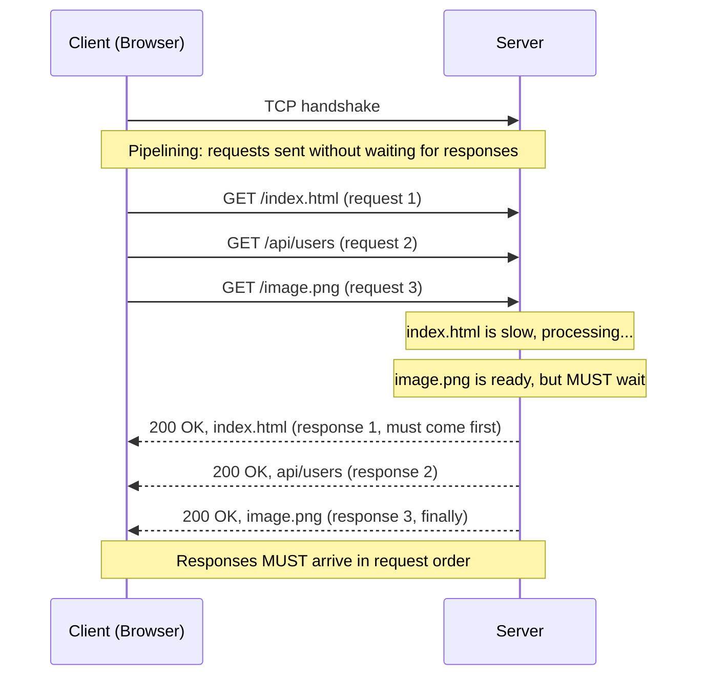
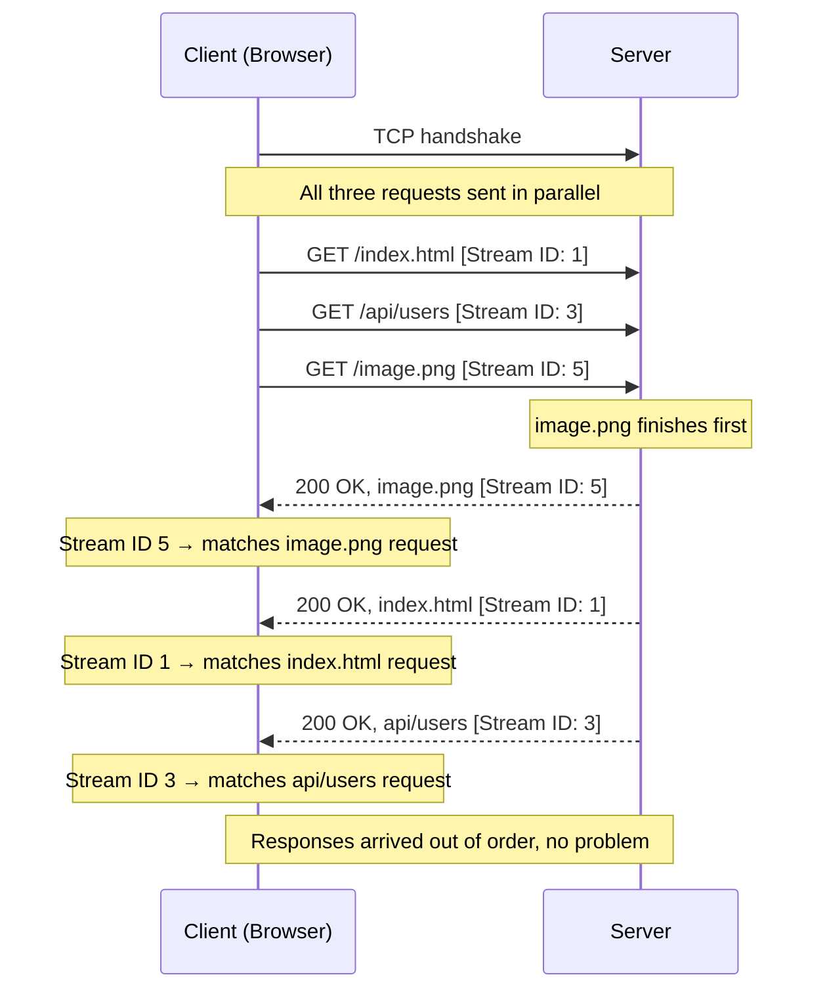
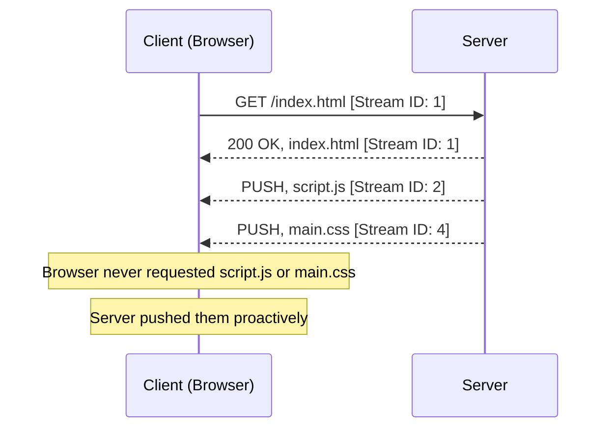

*Inspired by:* [YouTube](https://www.youtube.com/watch?v=yqVkmfAO1Dw&list=PLd1s-PEC5Pio&index=34)

[Ch.27](/networking/ch27-http-1.0-vs-http-1.1) traced HTTP's evolution from HTTP/0.9 through HTTP/1.1, and [Ch.28](/networking/ch28-structure-of-http-request-and-response) walked through the fields inside a real request and response. Both of those posts were about HTTP/1.1. This post starts a new thread: HTTP/2, what problem it set out to solve, and the core mechanism it introduced to solve it.

---

## Recap: what HTTP/1.1 still got wrong

HTTP/1.1 made persistent TCP connections the default: one handshake, then the connection stays open, requests and responses flowing across it until the conversation is done. That was a real improvement over HTTP/1.0's one-connection-per-request model.

But there was still a hard constraint. Within that single persistent connection, you could only have **one request in flight at a time**. You send `GET /index.html`, wait for the response, then send `GET /image.png`, wait again, and so on. The connection is alive the whole time, but it can only carry one request-response pair at once.

HTTP/1.1 did have an escape hatch: **pipelining**. With pipelining, a client could fire all three requests without waiting for any of their responses first. That sounds like the fix. But pipelining came with a strict rule: **responses had to come back in the exact same order the requests were sent**. Request `index.html` first, then `users` (an API call), then `image.png`, and the server was required to send back `index.html`'s response first, even if the image or the API data was ready long before.

This rule is the root cause of **head-of-line blocking**. If `index.html` is a slow, expensive request (a database lookup, a large file), `image.png` and `users` are stuck behind it, fully ready on the server, waiting in queue because the protocol enforces order. The "head of the line" blocks everything behind it. That is why pipelining is disabled by default in HTTP/1.1 despite being part of the spec.

The fundamental reason this ordering rule existed is worth understanding, because it also explains exactly what HTTP/2 changed.

HTTP/1.1 had no way for the client to tell which response belonged to which request, other than their position in line. There was no identifier attached to a response. The client's only way to match responses to requests was to count: "the first response I receive must be for my first request, the second for my second," and so on. If the server broke that order even once, the client would attribute the wrong body to the wrong request, and everything downstream (rendering the page, parsing JSON, displaying the image) would break in unpredictable ways. Enforcing strict response order was the only way to keep the pairing correct without any explicit identifier.

---

## HTTP/2 multiplexing: one pipe, many simultaneous streams

HTTP/2 also uses a **single TCP connection**, same as HTTP/1.1. It does not open multiple connections. What it changes is what you can do over that one connection.

HTTP/2 can send **multiple HTTP requests simultaneously over a single TCP connection**. Not one at a time, not with the ordering constraint pipelining imposed: truly parallel, with responses allowed to come back in **any order**. This is called **multiplexing**: multiple streams of data flowing through one pipe at the same time.

The question is obvious: if HTTP/1.1 needed strict ordering because responses had no identifier, how does HTTP/2 know which response belongs to which request when order is no longer enforced?

The answer is simple: it adds an identifier. Every request in HTTP/2 is assigned a **Stream ID**, a number attached to the request. The server includes that same Stream ID in the corresponding response. The client reads the Stream ID off the incoming response and immediately knows which request it is for, regardless of what order responses arrive in.

In the example above, `image.png` was the cheapest resource to generate, so the server sends it back first, even though `GET /index.html` was the first request. In HTTP/1.1 pipelining, this would have been illegal: the server would have had to hold the image response until `index.html` finished, or break the protocol. In HTTP/2, the server tags each response with the Stream ID of the matching request and sends it the moment it is ready. The client reassembles correctly regardless of arrival order.

This is how HTTP/2 solves head-of-line blocking at the HTTP layer. No request can block any other request, because each response is independently identified.

> To make the contrast concrete: HTTP/1.1 treated **request position** as the implicit identifier for a response ("the Nth response matches the Nth request"). HTTP/2 makes the identifier explicit: **Stream ID** travels on both the request and the response, so the client and server never need to agree on arrival order at all.

---

## Visualising the contrast

The two diagrams side by side make the difference clear. In HTTP/1.1 pipelining, the order of responses is locked to the order of requests. One slow response at the front of the queue stalls everything. In HTTP/2, each stream is independent: the server finishes requests in whatever order it can and ships each response immediately, tagged with its Stream ID.

| | HTTP/1.1 pipelining | HTTP/2 multiplexing |
|:---|:---|:---|
| **Connection** | Single TCP connection | Single TCP connection |
| **Request sending** | Multiple, without waiting | Multiple, without waiting |
| **Response ordering** | Must match request order | Any order |
| **How response is matched to request** | Position in queue | Stream ID on every frame |
| **Head-of-line blocking?** | Yes: one slow response blocks the rest | No: each stream is independent |
| **Enabled by default?** | No (disabled in all major browsers) | Yes |

---

## HTTP/2 Server Push: the server sends what you did not ask for

HTTP/2 introduced another feature alongside multiplexing: **Server Push**. It is disabled in modern browsers now, but understanding why it existed and why Stream IDs have an odd/even convention requires knowing what it was.

The idea: when a browser requests `index.html`, the server knows that the browser is going to need `script.js` and `main.css` next, because those files are referenced in the HTML. Without Server Push, the browser would have to receive and parse `index.html` first, discover the linked resources, and then make separate requests for each of them. Server Push let the server skip that round trip by sending `script.js` and `main.css` proactively, alongside the `index.html` response, before the browser ever asked for them.

Notice the Stream IDs: `index.html`, requested by the client, gets Stream ID 1. The two pushed resources get Stream IDs 2 and 4, both even numbers.

---

## The odd/even Stream ID convention

This is not arbitrary. The distinction between odd and even Stream IDs exists to prevent collisions between client-initiated requests and server-pushed resources, and it is built into the HTTP/2 spec.

In HTTP/2, **client-initiated requests always use odd Stream IDs**: 1, 3, 5, 7, and so on. **Server-pushed resources always use even Stream IDs**: 2, 4, 6, 8, and so on.

The reason this matters: HTTP/2 allows multiple streams to be in flight at once, all over the same connection. If the client and server were free to pick any Stream ID independently, there would be a real risk that a client sends a request with Stream ID 4 at the same moment the server is pushing a resource also tagged with Stream ID 4. The client would receive two streams labeled 4 and have no way to distinguish which one came from its own request and which was a server push.

By partitioning the number space (odd for client, even for server), the HTTP/2 designers eliminated that class of collision entirely, without any additional negotiation. A client looking at an incoming stream tagged with an even ID knows it must be a server push, because only the server assigns even IDs. A stream tagged with an odd ID is always a response to something the client asked for.

> The odd/even split is a coordination mechanism baked into the protocol itself. Instead of adding a separate field to distinguish "did this stream originate from the client's request or from the server proactively?", the designers carved the ID space in half. Odd numbers belong to the client; even numbers belong to the server.

Despite the elegance of the design, Server Push was disabled by major browsers because the server's predictions about what to push were often wrong or harmful: pushing resources the browser already had cached, or making prioritisation decisions that conflicted with the browser's own rendering strategy. For understanding the Stream ID convention though, Server Push is the historical motivation behind why it works the way it does.

---

## What comes next: frames and header compression

This post covers HTTP/2 at a high level: multiplexing over a single TCP connection, Stream IDs as the mechanism for matching responses to requests, and Server Push with its odd/even ID convention. The next posts will go deeper into how this actually works in the wire format.

HTTP/2's actual data unit is a **frame**, not a request or a response as a whole. A large response might be split into multiple frames, each carrying a piece of the body plus the Stream ID to tie it back to the right stream. Understanding frames explains how HTTP/2 can interleave data from multiple streams on one TCP connection without mixing them up.

The other major HTTP/2 addition is **HPACK header compression**: HTTP/1.1 sent headers as plain text on every request, including large and repetitive headers like `User-Agent` and `Cookie` that almost never change. HPACK compresses those headers significantly, reducing overhead on requests that go to the same server repeatedly.

And finally: even with multiplexing at the HTTP layer, HTTP/2 still runs over TCP, and TCP itself has its own form of head-of-line blocking. A future post will cover HTTP/3, which replaces TCP with QUIC to address exactly that remaining limitation.

---

## Summary

* **HTTP/1.1 pipelining** let a client send multiple requests without waiting for previous responses, but required responses to come back in the **exact same order** as requests. This caused **head-of-line blocking**: one slow response at the front of the queue held up every ready response behind it.
* The root cause was that HTTP/1.1 had no identifier on responses. It used **position in queue** to match a response to its request, which forced strict ordering.
* **HTTP/2 multiplexing** sends multiple requests simultaneously over a **single TCP connection**, and responses can arrive in **any order**. Each request gets a **Stream ID** (an integer), which the server echoes back on the corresponding response. The client uses the Stream ID to match each response to its request, with no reliance on arrival order.
* This eliminates head-of-line blocking at the HTTP layer: a slow request on one stream has no effect on other streams.
* **HTTP/2 Server Push** (now disabled in modern browsers) let the server proactively send resources like `script.js` and `main.css` alongside an `index.html` response, before the browser asked for them.
* To prevent ID collisions between client-initiated requests and server-pushed streams, HTTP/2 partitions the Stream ID space: **client-initiated streams use odd IDs** (1, 3, 5, ...) and **server-pushed streams use even IDs** (2, 4, 6, ...).
