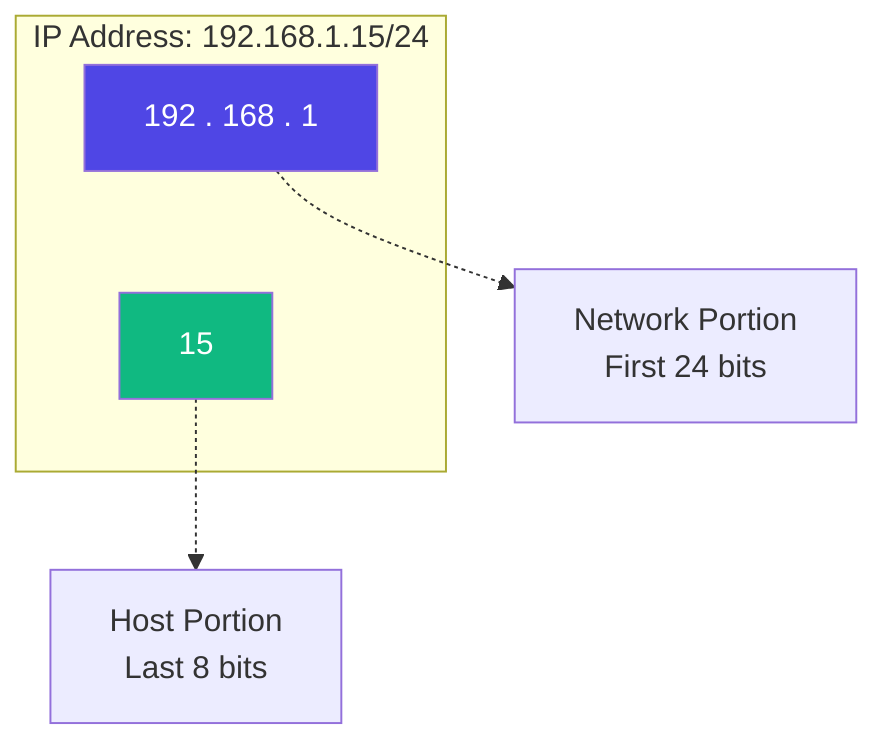

*Video Reference:* [YouTube](https://www.youtube.com/watch?v=8QJ8k7jd-K0)

When you connect a new smart TV, laptop, or phone to your Wi-Fi, it instantly gets an IP address, allowing it to communicate with the digital world. But an IP address isn't just a random string of numbers. It’s actually a highly structured coordinate system that tells your router exactly where a device lives. 

To understand how routing and the internet fundamentally work, you first need to understand three core concepts: the **Network**, the **Host**, and **CIDR Notation**.

## Network vs. Host: What's the Difference? (The Street and the Houses)

The easiest way to understand how IP addresses are structured is to think of a residential neighborhood. 

Imagine you live on **Maple Street**. Every house on that street shares the same street name, but each house has a unique house number (e.g., 101 Maple St, 102 Maple St).

*   **The Network (The Street Name):** In networking, a "Network" is a bounded environment where devices can directly communicate with each other. All the devices connected to your home Wi-Fi router share the same "Network" portion of their IP address. Because they are on the same local network (LAN), your laptop can send files directly to your phone without ever needing the public internet.
*   **The Host (The House Number):** A "Host" is simply any individual device (laptop, server, printer) that lives on that network. To prevent chaos, every host must have a unique identifier - its own unique house number.

When a device joins your network, you don't have to manually assign it an IP address. A service running on your router called **DHCP** *(Dynamic Host Configuration Protocol)* acts like the neighborhood postmaster. It checks which "house numbers" are currently available and automatically hands one out to the new device.

## What Is CIDR Notation? (Drawing the Boundary)

If you look at an IP address like `192.168.1.15`, it’s not immediately obvious which part is the "Street Name" (Network) and which part is the "House Number" (Host). 

Is the network just `192.168`? Or is it `192.168.1`?

To define that boundary, network engineers use **CIDR (Classless Inter-Domain Routing) Notation**. CIDR notation takes an IP address and appends a slash followed by a number - for example, `192.168.1.0/24`.

Here is how to read it:
An IPv4 address is exactly 32 bits long, divided into 4 chunks of 8 bits (octets). The number after the slash tells you **exactly how many bits are reserved for the Network**.

In a **`/24`** network:
*   The first **24 bits** (the first three chunks: `192.168.1`) are locked in. This is the network identifier. Every device on this network *must* start with these exact numbers.
*   The remaining **8 bits** (the final chunk) are left open for the **hosts**.

> **💡 Try it yourself:** Plug an IP into the [IP to Binary Converter](/tools/ip-converter) and you'll see this Network/Host split as actual bits, not just theory.

## How Many Usable IPs Are in a /24? (The Reserved Address Gotcha)

If we have 8 bits left for our hosts in a `/24` network, simple binary math tells us that 2^8 = 256. 

Does that mean your router can handle exactly 256 devices? **Actually, no. You can only connect 254 devices.**

> **⚠️ The Reserved IP Rule**  
> It is a common misconception that a `/24` subnet gives you 256 usable IP addresses. In reality, two IP addresses in *every* network are strictly reserved for administrative purposes:
> 
> 1. **The Network Address (The first IP):** For example, `192.168.1.0`. This address is used by routers to represent the entire network block. It cannot be assigned to a device.
> 2. **The Broadcast Address (The last IP):** For example, `192.168.1.255`. If a device needs to send a single packet to *every* other device on the network simultaneously, it sends it to this address.
> 
> **Total Usable Hosts:** 256 - 2 = **254**.

## CIDR Notation Examples: Scaling Networks Up and Down

CIDR notation is incredibly flexible, allowing us to size networks perfectly for their intended use. You will frequently encounter these two extremes in cloud computing (like AWS) and DevOps:

### The Enterprise Network: `/16`
If a massive corporate campus needs thousands of devices on the same network, a `/24` won't cut it. Instead, they might use a `/16` network (e.g., `10.0.0.0/16`). 
Here, only the first 16 bits are locked for the network, leaving a massive 16 bits for hosts. 
* 2^16 = 65,536. 
* Subtract our 2 reserved IPs, and you get **65,534 usable hosts**.

### The Ultimate Wildcard: `0.0.0.0/0`
This is arguably the most famous CIDR block in the world. The `/0` means that **zero bits** are locked to a specific network. Because nothing is required to match, this notation literally translates to "absolutely any IP address on the internet." If you are configuring a cloud firewall and want to allow web traffic from the general public, you will open port 80/443 to `0.0.0.0/0`.

