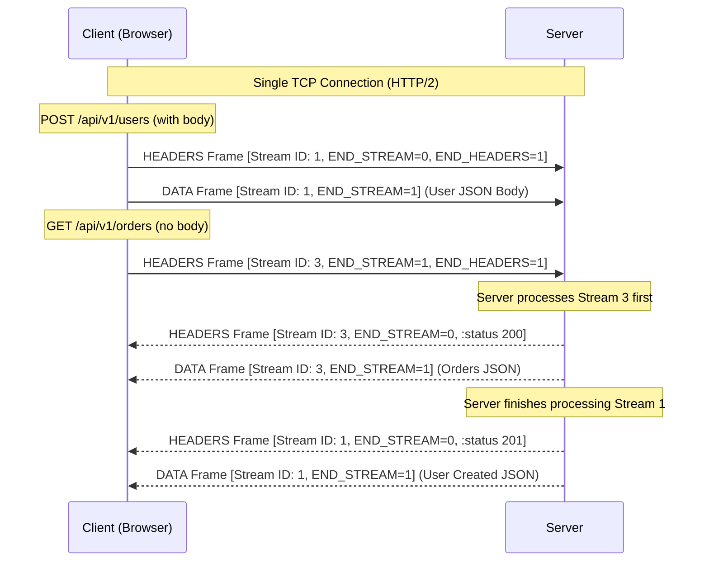

*Inspired by:* [YouTube](https://www.youtube.com/watch?v=dX0DK0zt6WU&list=PLd1s-PEC5Pio&index=35)

[Ch.29](/networking/ch29-http-2-multiplexing) introduced HTTP/2 multiplexing and explained how Stream IDs allow multiple requests and responses to overlap on a single TCP connection without head-of-line blocking. While Ch.29 viewed requests and responses as high-level streams, this post zooms into the actual binary unit of exchange on the wire: the HTTP/2 frame.

---

## The frame: HTTP/2's atomic unit of exchange

In HTTP/1.1, a request or response was transmitted as a single, contiguous text block formatted with headers separated by `\r\n` CRLF delimiters and an optional body at the end. HTTP/2 fundamentally changes this model by breaking protocol communication down into discrete binary messages called **frames**.

Every layer of the networking stack operates with its own specific data unit:
* **Data Link Layer**: Ethernet frames
* **Network Layer**: IP packets
* **Transport Layer (UDP)**: Datagrams
* **Transport Layer (TCP)**: Segments
* **Application Layer (HTTP/2)**: Frames

Instead of treating an HTTP request as one giant text stream, HTTP/2 breaks the request into specialized frames. The HTTP headers travel in one frame type, while the request or response body payload travels in another frame type.

RFC 9113 specifies several frame types (such as PRIORITY, RST_STREAM, SETTINGS, PING, and GOAWAY), but the two primary frames responsible for carrying application data are:
* **HEADERS Frame** (Type `0x1`): Carries request or response HTTP headers, compressed using HPACK.
* **DATA Frame** (Type `0x0`): Carries the raw application payload, such as a JSON body, HTML content, or binary image data.

---

## Frame header format: RFC 9113 section 4.1

According to **RFC 9113 section 4.1 ("Frame Format")**, every HTTP/2 frame begins with a mandatory 9-byte (72-bit) header, followed by a variable-length payload.

<Http2FrameHeaderTable />

The fields inside the 9-byte frame header perform specific control functions:

* **Length (24 bits / 3 bytes)**: Represents the length of the frame payload in bytes as an unsigned integer. The 9-byte frame header itself is not included in this count. Because Length is explicitly specified upfront, the receiving parser knows exactly how many payload bytes to read from the socket without scanning for delimiter characters.
* **Type (8 bits / 1 byte)**: Identifies the frame type and determines how the payload should be interpreted. For example, Type `0x0` designates a DATA frame, while Type `0x1` designates a HEADERS frame.
* **Flags (8 bits / 1 byte)**: Contains boolean flags reserved for frame-specific boolean states. Two essential flags for request and response processing are:
  * `END_HEADERS`: Indicates that this frame contains the entire header block fragment and no CONTINUATION frames follow.
  * `END_STREAM`: Indicates that this frame is the final frame transmitted by the sender for the given stream ID, effectively closing the stream in that direction.
* **Reserved bit R (1 bit)**: A single reserved bit that must remain set to `0`.
* **Stream Identifier / Stream ID (31 bits)**: An unsigned 31-bit integer identifying the logical stream associated with this frame. This Stream ID allows the receiver to attribute incoming frames to their corresponding HTTP request or response on the shared TCP connection.
* **Frame Payload**: The payload content (such as compressed headers or body data) whose byte length matches the value specified in the 24-bit Length field.

> RFC 9113 section 4.1 dictates that frames are transmitted as a continuous sequence of octets on the wire. The diagram representation above arranges the bits into 32-bit words for readability, but on the network wire, the 9-byte header and payload flow sequentially.

---

## How GET and POST requests map to frames

Because HTTP/2 splits messages into frames, requests with a body (like POST) behave differently from requests without a body (like GET).

### POST Request (with body payload)

A POST request carries both metadata headers (`:method: POST`, `:path: /api/v1/users`, `:authority`, `content-type`, `content-length`) and a payload body (such as JSON data). HTTP/2 splits this request into two distinct frames:

1. **HEADERS Frame**: Contains the compressed request headers. The flag `END_HEADERS` is set to true (`1`), but `END_STREAM` is set to false (`0`) because the request body has yet to arrive.
2. **DATA Frame**: Contains the actual payload body bytes. The flag `END_STREAM` is set to true (`1`), signaling to the server that no further frames will be sent for this stream ID.

### GET Request (without body payload)

A GET request carries metadata headers (`:method: GET`, `:path: /api/v1/orders`, `:authority`) but has no request body payload. HTTP/2 converts this request into a single frame:

1. **HEADERS Frame**: Contains the compressed request headers. Both `END_HEADERS` and `END_STREAM` are set to true (`1`). Because there is no body data, setting `END_STREAM=1` on the HEADERS frame immediately informs the server that the request is complete upon receiving this single frame.

### Response frames

HTTP responses follow the exact same structural pattern. A server returning data sends a HEADERS frame containing status codes (`:status: 200`) and response headers (`END_STREAM=0`), followed by one or more DATA frames containing the response body payload (`END_STREAM=1` on the final DATA frame).

In the sequence diagram above, the client sends a POST request on Stream 1 (split into a HEADERS frame and a DATA frame) and a GET request on Stream 3 (a single HEADERS frame). Because each frame embeds its Stream ID in its 9-byte header, the server processes Stream 3 faster and returns its response frames first. The client uses the Stream ID on each incoming frame to correctly reassemble the responses out of order without confusion.

> Frames from different streams can be sent in any order: for example, Stream ID 3's frames can travel before Stream ID 1's frames. What HTTP/2 does not allow is reordering frames within the same stream. A DATA frame for Stream ID 1 can never arrive before the HEADERS frame for Stream ID 1; each stream's own frame sequence stays in order, only the interleaving across streams is free.

---

## Inspecting HTTP/2 frames on the wire: a Wireshark walkthrough

Because HTTP/2 is almost always deployed over TLS (HTTPS), inspecting HTTP/2 frames in Wireshark requires providing TLS master secrets to decrypt the encrypted TCP payload. Once decrypted, Wireshark dissects the packet payload into the `HTTP/2` protocol layer and displays the underlying frame fields.

### Wireshark trace: POST request and response

When inspecting a POST request on Stream ID 1, Wireshark exposes the binary frame details:

* **Request HEADERS Frame**:
  * **Length**: `242` bytes
  * **Type**: `HEADERS` (`1`)
  * **Stream ID**: `1`
  * **Flags**: `END_HEADERS` = true, `END_STREAM` = false (`0`)
  * **Header Block Fragment**: Contains HPACK-compressed key-value pairs (`:method: POST`, `:path: /`, `:authority`, `content-type`, `content-length`).
* **Request DATA Frame**:
  * **Length**: `250` bytes
  * **Type**: `DATA` (`0`)
  * **Stream ID**: `1`
  * **Flags**: `END_STREAM` = true (`1`)
  * **Payload**: Contains the `250` bytes of request body payload.

When the server replies to Stream ID 1, Wireshark reveals the corresponding response frames:
* **Response HEADERS Frame**: Type `HEADERS` (`1`), Stream ID `1`, `END_STREAM` = false (`0`), carrying response headers such as `:status: 200`.
* **Response DATA Frame**: Type `DATA` (`0`), Stream ID `1`, `END_STREAM` = true (`1`), carrying the response body payload.

### Wireshark trace: GET request

Inspecting a GET request on Stream ID 1 (sent over a separate TCP connection to a distinct destination host) shows a different flag configuration:

* **Request HEADERS Frame**:
  * **Length**: `469` bytes
  * **Type**: `HEADERS` (`1`)
  * **Stream ID**: `1`
  * **Flags**: `END_HEADERS` = true, `END_STREAM` = true (`1`)
  * **Header Block Fragment**: Contains HPACK-compressed GET headers.

Because `END_STREAM` is set to true on the HEADERS frame itself, Wireshark confirms that no DATA frame is transmitted following this HEADERS frame. The server reads `END_STREAM=1` and knows immediately that the client has finished sending the request.

---

## Summary

* **HTTP/2 frames** are the atomic binary units of exchange in HTTP/2, serving as the application-layer equivalent of TCP segments or IP packets.
* **RFC 9113 section 4.1** defines the mandatory 9-byte frame header containing Length (24 bits), Type (8 bits), Flags (8 bits), Reserved bit (1 bit), and Stream Identifier (31 bits), followed by the frame payload.
* **HEADERS frames (Type `0x1`)** carry HTTP header metadata compressed via HPACK, while **DATA frames (Type `0x0`)** carry request or response body content.
* **Flags signal stream state**: `END_HEADERS` marks the end of header fragments, while `END_STREAM` signals that the sender has finished transmitting data on that stream ID.
* **GET requests** (having no body) produce only a HEADERS frame with `END_STREAM=1`. **POST requests** (having a body) produce a HEADERS frame with `END_STREAM=0` followed by a DATA frame with `END_STREAM=1`.
* **Wireshark inspection** of decrypted TLS traffic confirms how frames travel on the wire, displaying precise payload byte counts (such as a 242-byte HEADERS payload, a 250-byte DATA payload, or a 469-byte GET HEADERS payload) and matching Stream IDs on every frame.
