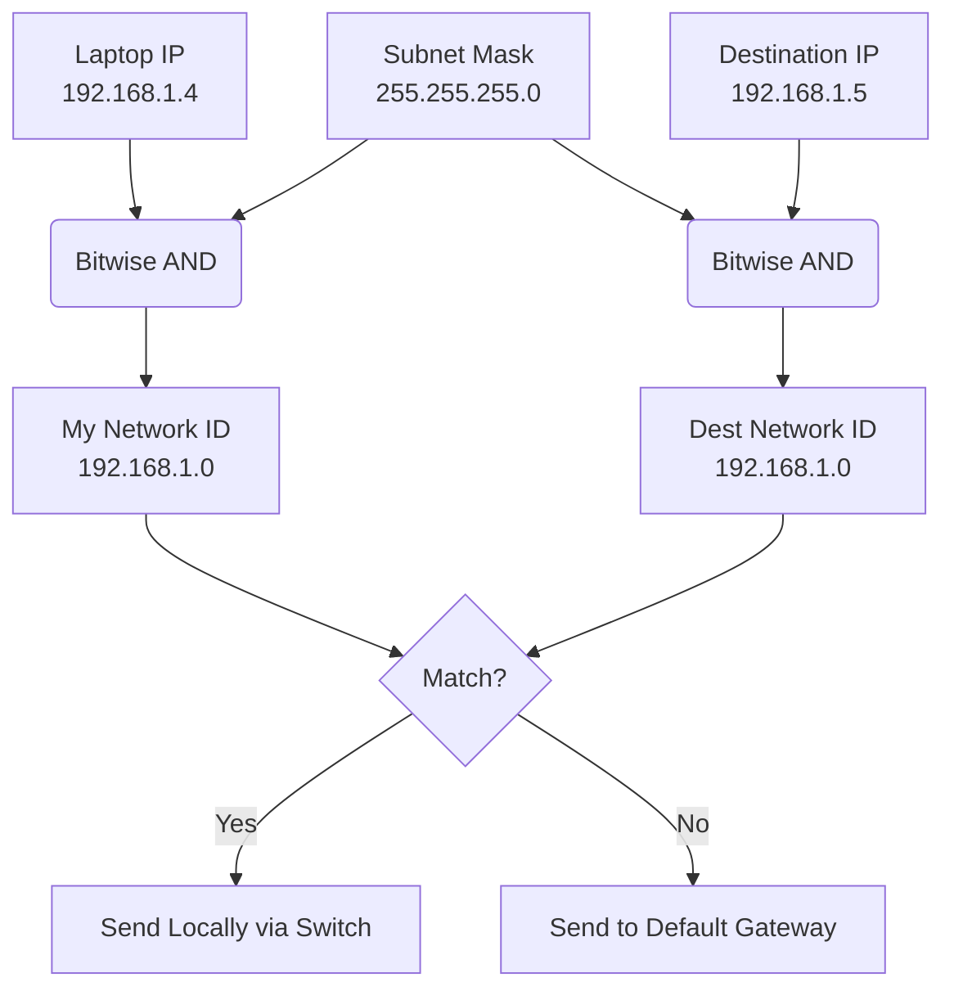

*Inspired by:* [YouTube](https://www.youtube.com/watch?v=KVujI1fsQQo)

In the last chapter, we talked about CIDR notation and how it acts as a boundary line, splitting an IP address into a **Network** portion and a **Host** portion. 

But here is a practical problem: Let's say your laptop wants to send a message to a mobile phone. How does your laptop *actually know* if the mobile phone is sitting right next to it on the same local Wi-Fi, or if that phone is on a completely different network halfway across the world?

This distinction is critical. If the device is on the **same network**, your laptop can talk to it directly. If it is on a **different network**, your laptop has to hand the data over to your router so it can navigate the public internet.

To solve this problem, your computer relies on a clever mathematical trick using a **Subnet Mask**.

---

## What is a Subnet Mask?

If you open your computer's Wi-Fi settings, right next to your IP Address, you will almost always see a Subnet Mask. It looks exactly like an IP address - most commonly `255.255.255.0`.

While CIDR (like `/24`) is the human-readable shorthand for defining a network, the **Subnet Mask** is what the computer actually uses under the hood to perform calculations.

A Subnet Mask has one singular job: **To act as a filter that helps a device figure out its own Network ID, and compare it against the Network ID of its destination.**

## How Subnet Masks Use the Bitwise AND Operation

Computers don't read dotted numbers; they read binary (1s and 0s). 
The number `255` in binary is literally eight `1`s: `11111111`. 
The number `0` in binary is eight `0`s: `00000000`.

So, `255.255.255.0` in binary is a wall of twenty-four `1`s, followed by eight `0`s.

Don't want to do this math by hand? The [IP to Binary Converter](/tools/ip-converter) will show you any address's binary form instantly, useful for following along with the AND operation below.

When your laptop wants to send data, it performs a **Bitwise AND operation**. 
*(In a bitwise AND, `1 AND 1 = 1`. Anything else results in a `0`)*.

Here is the exact step-by-step process your computer goes through in a fraction of a millisecond:

### Step 1: Discovering its own Network ID
Your laptop takes its own IP address (let's say `192.168.1.4`) and stacks it on top of the Subnet Mask (`255.255.255.0`). It performs the AND operation down the line. 
Because the first three blocks of the subnet mask are purely `1`s, the first three blocks of the IP address drop straight down. Because the last block of the subnet mask is purely `0`s, the last block becomes `0`.

**The Result:** `192.168.1.0`. This is the laptop's **Network ID**.

### Step 2: Testing the Destination
Now, the laptop takes the *destination's* IP address (let's say it wants to reach a mobile phone at `192.168.1.5`). It takes that destination IP, and applies its *own* Subnet Mask to it.

**The Result:** `192.168.1.0`. 

### Step 3: The Comparison
The laptop compares the two results. 
* My Network ID: `192.168.1.0`
* Destination's Network ID: `192.168.1.0`

**They match!** The laptop instantly knows the mobile phone is on the exact same local network. It can send the data locally.

But what if the destination IP was `10.0.0.1`?
Applying the `255.255.255.0` subnet mask to `10.0.0.1` results in `10.0.0.0`. 
`10.0.0.0` does **not** match `192.168.1.0`. The laptop knows this destination is outside its network, and it forwards the data to the router (the Default Gateway) to be sent out to the internet.

> **Fact Check:**
> 
> "I don't need a router for local data"
> In networking theory, it is true that you don't need a "router" to communicate within a LAN - you only need a Layer 2 Switch. However, in a standard home setup, the physical plastic box you call a "Wi-Fi Router" is actually a Router, a Switch, and an Access Point combined into one. So while local traffic doesn't get *routed* to the internet, it still physically travels through the internal switch of your Wi-Fi box!
> 
> Furthermore, when your computer realizes the destination is local, it uses **ARP (Address Resolution Protocol)** to broadcast a message to the local network asking, *"Who has this IP address?"* Once the target device replies with its physical **MAC Address**, your computer uses that MAC address to send the data directly to it through the switch.

## Why Subnet Masks Matter for Application Performance

You might be thinking, *"I write code, I don't configure enterprise routers. Why does this matter to me?"*

It matters immensely for **Application Performance and Architecture**.

Imagine you have a Node.js backend server and a PostgreSQL database hosted in the cloud (like AWS). 
* If you place your Node.js server and your Database in the **same subnet** (they share the same Network ID), they can talk to each other directly. This means massive throughput, lower costs, and incredibly low latency because the data doesn't have to jump through multiple networking hoops.
* If you place them in **different subnets** (or entirely different networks), every single database query has to be routed through gateways. This adds physical distance, networking overhead, and milliseconds of latency to every single database call.

By understanding subnet masks, you understand exactly how data flows - and when you know how data flows, you can design vastly faster and more secure applications.

## Next Up: The Default Gateway
Now that we know how a computer realizes it needs to send data out to the internet, how does it actually know *where* the exit door is? In the next chapter, we will tackle the **Default Gateway**.
